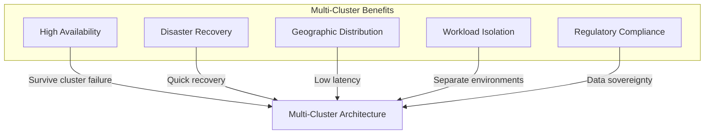

# How to Configure Multi-Cluster Kubernetes Deployments

Author: [nawazdhandala](https://www.github.com/nawazdhandala)

Tags: Kubernetes, Multi-Cluster, High Availability, Federation, DevOps

Description: Learn how to set up and manage multi-cluster Kubernetes deployments for high availability, disaster recovery, and geographic distribution using federation tools and GitOps approaches.

---

Running Kubernetes across multiple clusters provides high availability, disaster recovery, and the ability to serve users from geographically distributed locations. This guide covers strategies and tools for managing multi-cluster deployments effectively.

## Why Multi-Cluster?

Organizations adopt multi-cluster architectures for several reasons:



## Multi-Cluster Patterns

### Pattern 1: Active-Active

Both clusters serve traffic simultaneously:

```yaml
# Global load balancer distributes traffic
# to healthy clusters based on latency or geography

# Cluster 1: us-west
# Cluster 2: us-east
# Both clusters run identical workloads
# DNS or global load balancer routes users to nearest healthy cluster
```

### Pattern 2: Active-Passive

One cluster handles traffic, the other is standby:

```yaml
# Primary cluster: us-west (active)
# Secondary cluster: us-east (standby)
# Traffic fails over to secondary if primary becomes unhealthy
# Requires data replication between clusters
```

### Pattern 3: Partitioned

Different clusters handle different workloads:

```yaml
# Cluster 1: Production workloads
# Cluster 2: Development and staging
# Cluster 3: Data processing and batch jobs
# Each cluster is independent
```

## Setting Up kubeconfig for Multiple Clusters

Manage access to multiple clusters:

```bash
# View current contexts
kubectl config get-contexts

# Add a new cluster
kubectl config set-cluster production-west \
  --server=https://k8s-west.example.com \
  --certificate-authority=/path/to/ca.crt

# Add credentials
kubectl config set-credentials admin-west \
  --client-certificate=/path/to/client.crt \
  --client-key=/path/to/client.key

# Create context
kubectl config set-context production-west \
  --cluster=production-west \
  --user=admin-west \
  --namespace=default

# Switch between clusters
kubectl config use-context production-west
kubectl config use-context production-east

# Run command against specific context
kubectl --context=production-west get pods
kubectl --context=production-east get pods
```

## Using Kubefed for Federation

Kubernetes Federation (KubeFed) manages resources across clusters:

```bash
# Install kubefedctl
curl -LO https://github.com/kubernetes-sigs/kubefed/releases/download/v0.9.2/kubefedctl-0.9.2-linux-amd64.tgz
tar xzf kubefedctl-0.9.2-linux-amd64.tgz
sudo mv kubefedctl /usr/local/bin/

# Install KubeFed on the host cluster
helm repo add kubefed-charts https://raw.githubusercontent.com/kubernetes-sigs/kubefed/master/charts
helm install kubefed kubefed-charts/kubefed --namespace kube-federation-system --create-namespace

# Join member clusters
kubefedctl join cluster-west \
  --cluster-context=production-west \
  --host-cluster-context=federation-host \
  --v=2

kubefedctl join cluster-east \
  --cluster-context=production-east \
  --host-cluster-context=federation-host \
  --v=2
```

Create federated resources:

```yaml
# federated-deployment.yaml
apiVersion: types.kubefed.io/v1beta1
kind: FederatedDeployment
metadata:
  name: web-app
  namespace: production
spec:
  template:
    metadata:
      labels:
        app: web-app
    spec:
      replicas: 3
      selector:
        matchLabels:
          app: web-app
      template:
        metadata:
          labels:
            app: web-app
        spec:
          containers:
            - name: web
              image: myapp/web:1.5.0
              ports:
                - containerPort: 8080

  placement:
    clusters:
      - name: cluster-west
      - name: cluster-east

  overrides:
    # Customize per cluster
    - clusterName: cluster-west
      clusterOverrides:
        - path: "/spec/replicas"
          value: 5
    - clusterName: cluster-east
      clusterOverrides:
        - path: "/spec/replicas"
          value: 3
```

## GitOps Multi-Cluster with ArgoCD

ArgoCD is excellent for managing multiple clusters:

```yaml
# argocd-cluster-secret.yaml
# Register clusters with ArgoCD
apiVersion: v1
kind: Secret
metadata:
  name: cluster-west
  namespace: argocd
  labels:
    argocd.argoproj.io/secret-type: cluster
type: Opaque
stringData:
  name: production-west
  server: https://k8s-west.example.com
  config: |
    {
      "bearerToken": "<token>",
      "tlsClientConfig": {
        "insecure": false,
        "caData": "<base64-encoded-ca>"
      }
    }
---
apiVersion: v1
kind: Secret
metadata:
  name: cluster-east
  namespace: argocd
  labels:
    argocd.argoproj.io/secret-type: cluster
type: Opaque
stringData:
  name: production-east
  server: https://k8s-east.example.com
  config: |
    {
      "bearerToken": "<token>",
      "tlsClientConfig": {
        "insecure": false,
        "caData": "<base64-encoded-ca>"
      }
    }
```

Create ApplicationSet for multi-cluster deployment:

```yaml
# applicationset-multi-cluster.yaml
apiVersion: argoproj.io/v1alpha1
kind: ApplicationSet
metadata:
  name: web-app
  namespace: argocd
spec:
  generators:
    - list:
        elements:
          - cluster: production-west
            url: https://k8s-west.example.com
            replicas: "5"
          - cluster: production-east
            url: https://k8s-east.example.com
            replicas: "3"

  template:
    metadata:
      name: 'web-app-{{cluster}}'
    spec:
      project: default
      source:
        repoURL: https://github.com/org/k8s-manifests
        targetRevision: main
        path: apps/web-app
        helm:
          parameters:
            - name: replicaCount
              value: '{{replicas}}'
      destination:
        server: '{{url}}'
        namespace: production
      syncPolicy:
        automated:
          prune: true
          selfHeal: true
```

## Service Mesh for Multi-Cluster

Istio can connect services across clusters:

```bash
# Install Istio on both clusters with multi-cluster configuration
istioctl install --set profile=default \
  --set values.global.meshID=mesh1 \
  --set values.global.multiCluster.clusterName=cluster-west \
  --set values.global.network=network-west

# Create remote secrets for cross-cluster communication
istioctl x create-remote-secret \
  --context=production-east \
  --name=cluster-east | kubectl apply -f - --context=production-west

istioctl x create-remote-secret \
  --context=production-west \
  --name=cluster-west | kubectl apply -f - --context=production-east
```

## Cross-Cluster Service Discovery

Use external DNS and global load balancing:

```yaml
# external-dns-deployment.yaml
apiVersion: apps/v1
kind: Deployment
metadata:
  name: external-dns
spec:
  replicas: 1
  selector:
    matchLabels:
      app: external-dns
  template:
    metadata:
      labels:
        app: external-dns
    spec:
      containers:
        - name: external-dns
          image: registry.k8s.io/external-dns/external-dns:v0.13.6
          args:
            - --source=service
            - --source=ingress
            - --domain-filter=example.com
            - --provider=aws
            - --policy=sync
            - --txt-owner-id=cluster-west
---
# Service with external DNS annotation
apiVersion: v1
kind: Service
metadata:
  name: web-app
  annotations:
    external-dns.alpha.kubernetes.io/hostname: web-app.example.com
    external-dns.alpha.kubernetes.io/ttl: "60"
spec:
  type: LoadBalancer
  ports:
    - port: 80
      targetPort: 8080
  selector:
    app: web-app
```

## Data Replication Strategies

For stateful applications across clusters:

```yaml
# CockroachDB multi-region deployment example
# Cluster configuration for geo-distributed database
apiVersion: crdb.cockroachlabs.com/v1alpha1
kind: CrdbCluster
metadata:
  name: cockroachdb
spec:
  dataStore:
    pvc:
      spec:
        storageClassName: fast-ssd
        resources:
          requests:
            storage: 100Gi
  resources:
    requests:
      cpu: "2"
      memory: "8Gi"
  nodes: 3
  additionalLabels:
    region: us-west
  cockroachDBVersion: v23.1.0
```

## Deployment Workflow

Implement a multi-cluster deployment pipeline:

```yaml
# .github/workflows/multi-cluster-deploy.yaml
name: Multi-Cluster Deploy

on:
  push:
    branches: [main]

jobs:
  deploy:
    runs-on: ubuntu-latest
    strategy:
      matrix:
        cluster: [production-west, production-east]
    steps:
      - uses: actions/checkout@v4

      - name: Configure kubectl
        run: |
          echo "${{ secrets[format('{0}_KUBECONFIG', matrix.cluster)] }}" > kubeconfig
          export KUBECONFIG=kubeconfig

      - name: Deploy to ${{ matrix.cluster }}
        run: |
          kubectl apply -f manifests/
          kubectl rollout status deployment/web-app -n production --timeout=5m

      - name: Verify deployment
        run: |
          kubectl get pods -n production -l app=web-app
```

## Monitoring Multi-Cluster

Aggregate monitoring across clusters:

```yaml
# Thanos for multi-cluster Prometheus
# thanos-sidecar.yaml (deployed with each cluster's Prometheus)
apiVersion: v1
kind: ConfigMap
metadata:
  name: thanos-config
data:
  bucket.yaml: |
    type: S3
    config:
      bucket: thanos-metrics
      endpoint: s3.amazonaws.com
      region: us-west-2
---
# Thanos Query (central query point)
apiVersion: apps/v1
kind: Deployment
metadata:
  name: thanos-query
spec:
  replicas: 2
  selector:
    matchLabels:
      app: thanos-query
  template:
    spec:
      containers:
        - name: thanos-query
          image: quay.io/thanos/thanos:v0.32.0
          args:
            - query
            - --store=thanos-store-gateway:10901
            - --store=prometheus-west.monitoring:10901
            - --store=prometheus-east.monitoring:10901
```

## Failover Testing

Regularly test failover procedures:

```bash
#!/bin/bash
# failover-test.sh

# Simulate cluster-west failure
echo "Simulating cluster-west failure..."
kubectl --context=production-west scale deployment web-app --replicas=0 -n production

# Wait and verify traffic shifts to cluster-east
sleep 30
echo "Checking cluster-east handles all traffic..."
kubectl --context=production-east get pods -n production

# Verify health checks
curl -s https://web-app.example.com/health

# Restore cluster-west
echo "Restoring cluster-west..."
kubectl --context=production-west scale deployment web-app --replicas=5 -n production

echo "Failover test complete"
```

## Best Practices

1. **Keep clusters loosely coupled**: Minimize cross-cluster dependencies.

2. **Automate everything**: Use GitOps for consistent deployments.

3. **Plan for network partitions**: Design for clusters to operate independently.

4. **Test failover regularly**: Verify disaster recovery works before you need it.

5. **Centralize observability**: Aggregate logs and metrics from all clusters.

6. **Use infrastructure as code**: Manage cluster configurations in version control.

---

Multi-cluster Kubernetes deployments provide resilience and flexibility that single clusters cannot match. Choose the right pattern for your needs, whether active-active for high availability, active-passive for disaster recovery, or partitioned for workload isolation. Tools like ArgoCD, KubeFed, and service meshes make managing multiple clusters practical. With proper automation and monitoring, multi-cluster architectures become a powerful foundation for global-scale applications.
