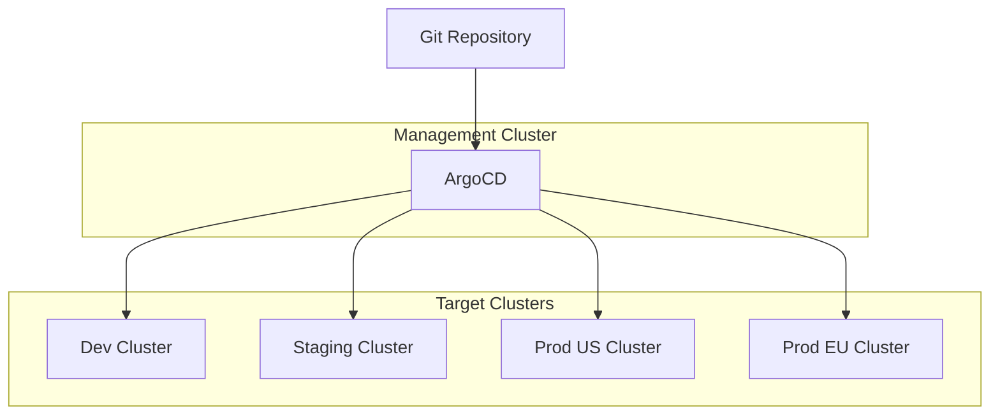

# How to Configure Multi-Cluster Management in ArgoCD

Author: [nawazdhandala](https://www.github.com/nawazdhandala)

Tags: ArgoCD, Kubernetes, Multi-Cluster, GitOps, DevOps, High Availability

Description: Learn how to manage multiple Kubernetes clusters from a single ArgoCD instance, including cluster registration, authentication methods, and deployment strategies for enterprise environments.

---

Running workloads across multiple Kubernetes clusters is common in production environments. You might have clusters for different regions, environments, or teams. ArgoCD can manage all of them from a single control plane, giving you a unified view of deployments everywhere.

## Multi-Cluster Architecture

A typical multi-cluster setup has ArgoCD running in a management cluster while deploying to multiple target clusters.



## Adding Clusters Using the CLI

The simplest way to add a cluster is using the ArgoCD CLI:

```bash
# First, ensure your kubeconfig has the target cluster context
kubectl config get-contexts

# Add a cluster using its kubeconfig context
argocd cluster add prod-us-east --name production-us-east

# The CLI creates a service account in the target cluster
# and registers it with ArgoCD
```

This command does several things:
1. Creates a service account `argocd-manager` in `kube-system`
2. Creates a ClusterRoleBinding with cluster-admin permissions
3. Stores the credentials as a Secret in the ArgoCD namespace

Verify the cluster was added:

```bash
argocd cluster list
```

## Adding Clusters Declaratively

For GitOps workflows, define clusters as Kubernetes secrets:

```yaml
# cluster-secret.yaml
apiVersion: v1
kind: Secret
metadata:
  name: prod-us-east-cluster
  namespace: argocd
  labels:
    # This label tells ArgoCD this is a cluster secret
    argocd.argoproj.io/secret-type: cluster
stringData:
  # Human-readable name shown in ArgoCD UI
  name: production-us-east
  # Kubernetes API server URL
  server: https://prod-us-east.example.com:6443
  # Connection configuration
  config: |
    {
      "bearerToken": "<service-account-token>",
      "tlsClientConfig": {
        "insecure": false,
        "caData": "<base64-encoded-ca-cert>"
      }
    }
```

Apply the secret:

```bash
kubectl apply -f cluster-secret.yaml
```

## Authentication Methods

### Service Account Token

Create a service account in the target cluster:

```yaml
# target-cluster/argocd-manager.yaml
apiVersion: v1
kind: ServiceAccount
metadata:
  name: argocd-manager
  namespace: kube-system
---
apiVersion: rbac.authorization.k8s.io/v1
kind: ClusterRoleBinding
metadata:
  name: argocd-manager-role
roleRef:
  apiGroup: rbac.authorization.k8s.io
  kind: ClusterRole
  name: cluster-admin
subjects:
  - kind: ServiceAccount
    name: argocd-manager
    namespace: kube-system
---
# For Kubernetes 1.24+, create a token secret
apiVersion: v1
kind: Secret
metadata:
  name: argocd-manager-token
  namespace: kube-system
  annotations:
    kubernetes.io/service-account.name: argocd-manager
type: kubernetes.io/service-account-token
```

Get the token:

```bash
kubectl get secret argocd-manager-token -n kube-system \
  -o jsonpath='{.data.token}' | base64 -d
```

### Client Certificate Authentication

For clusters using client certificates:

```yaml
apiVersion: v1
kind: Secret
metadata:
  name: prod-cluster
  namespace: argocd
  labels:
    argocd.argoproj.io/secret-type: cluster
stringData:
  name: production
  server: https://prod.example.com:6443
  config: |
    {
      "tlsClientConfig": {
        "insecure": false,
        "caData": "<base64-ca-cert>",
        "certData": "<base64-client-cert>",
        "keyData": "<base64-client-key>"
      }
    }
```

### AWS EKS Authentication

For EKS clusters, use IAM authentication:

```yaml
apiVersion: v1
kind: Secret
metadata:
  name: eks-cluster
  namespace: argocd
  labels:
    argocd.argoproj.io/secret-type: cluster
stringData:
  name: eks-production
  server: https://xxx.gr7.us-east-1.eks.amazonaws.com
  config: |
    {
      "awsAuthConfig": {
        "clusterName": "my-eks-cluster",
        "roleARN": "arn:aws:iam::123456789012:role/ArgoCD-EKS-Role"
      },
      "tlsClientConfig": {
        "insecure": false,
        "caData": "<base64-ca-cert>"
      }
    }
```

The ArgoCD pods need AWS credentials. Add environment variables or use IRSA:

```yaml
# argocd-repo-server deployment patch
env:
  - name: AWS_REGION
    value: us-east-1
  - name: AWS_ROLE_ARN
    value: arn:aws:iam::123456789012:role/ArgoCD-Role
```

### GKE Authentication

For Google Kubernetes Engine:

```yaml
apiVersion: v1
kind: Secret
metadata:
  name: gke-cluster
  namespace: argocd
  labels:
    argocd.argoproj.io/secret-type: cluster
stringData:
  name: gke-production
  server: https://xxx.xxx.xxx.xxx
  config: |
    {
      "execProviderConfig": {
        "command": "argocd-k8s-auth",
        "args": ["gcp"],
        "apiVersion": "client.authentication.k8s.io/v1beta1"
      },
      "tlsClientConfig": {
        "insecure": false,
        "caData": "<base64-ca-cert>"
      }
    }
```

## Cluster Labels and Annotations

Add metadata to clusters for filtering and organization:

```yaml
apiVersion: v1
kind: Secret
metadata:
  name: prod-cluster
  namespace: argocd
  labels:
    argocd.argoproj.io/secret-type: cluster
  annotations:
    # Custom annotations for filtering
    region: us-east-1
    environment: production
    team: platform
stringData:
  name: production
  server: https://prod.example.com:6443
  # Add labels to the cluster definition
  clusterLabels: |
    {
      "environment": "production",
      "region": "us-east-1"
    }
  config: |
    {
      "bearerToken": "<token>",
      "tlsClientConfig": {
        "insecure": false
      }
    }
```

Use labels with ApplicationSets:

```yaml
apiVersion: argoproj.io/v1alpha1
kind: ApplicationSet
metadata:
  name: monitoring
  namespace: argocd
spec:
  generators:
    - clusters:
        selector:
          matchLabels:
            environment: production
  template:
    metadata:
      name: 'monitoring-{{name}}'
    spec:
      source:
        repoURL: https://github.com/myorg/monitoring.git
        path: base
      destination:
        server: '{{server}}'
        namespace: monitoring
```

## Deploying to Multiple Clusters

### Single Application to Specific Cluster

```yaml
apiVersion: argoproj.io/v1alpha1
kind: Application
metadata:
  name: myapp-production
  namespace: argocd
spec:
  project: default
  source:
    repoURL: https://github.com/myorg/myapp.git
    targetRevision: HEAD
    path: k8s/production
  destination:
    # Use the cluster name or server URL
    server: https://prod.example.com:6443
    namespace: myapp
  syncPolicy:
    automated:
      prune: true
```

### Same Application Across All Clusters

```yaml
apiVersion: argoproj.io/v1alpha1
kind: ApplicationSet
metadata:
  name: platform-tools
  namespace: argocd
spec:
  generators:
    # Empty selector matches all clusters
    - clusters: {}
  template:
    metadata:
      name: 'platform-tools-{{name}}'
    spec:
      project: platform
      source:
        repoURL: https://github.com/myorg/platform.git
        path: tools
      destination:
        server: '{{server}}'
        namespace: platform-tools
```

## Restricting Access with Projects

Control which clusters each project can deploy to:

```yaml
apiVersion: argoproj.io/v1alpha1
kind: AppProject
metadata:
  name: team-frontend
  namespace: argocd
spec:
  description: Frontend team project

  # Allowed source repositories
  sourceRepos:
    - 'https://github.com/myorg/frontend-*'

  # Allowed destination clusters and namespaces
  destinations:
    # Allow dev cluster, any namespace starting with frontend-
    - server: https://dev.example.com:6443
      namespace: 'frontend-*'
    # Allow staging cluster, specific namespace
    - server: https://staging.example.com:6443
      namespace: frontend
    # Deny production (not listed)

  # What resources the project can create
  clusterResourceWhitelist:
    - group: ''
      kind: Namespace

  namespaceResourceWhitelist:
    - group: '*'
      kind: '*'
```

## Network Connectivity

ArgoCD needs network access to target cluster API servers. Options include:

### VPN/Direct Connection

The simplest option if clusters are in the same network or connected via VPN.

### Cluster Gateway Pattern

For clusters behind firewalls, use a reverse proxy or gateway:

```yaml
# Gateway deployment in target cluster
apiVersion: apps/v1
kind: Deployment
metadata:
  name: argocd-agent
  namespace: argocd
spec:
  replicas: 1
  selector:
    matchLabels:
      app: argocd-agent
  template:
    metadata:
      labels:
        app: argocd-agent
    spec:
      containers:
        - name: agent
          image: argoproj/argocd-agent:latest
          args:
            - --server=argocd.management.example.com
            - --token=$(ARGOCD_TOKEN)
          env:
            - name: ARGOCD_TOKEN
              valueFrom:
                secretKeyRef:
                  name: argocd-credentials
                  key: token
```

## Monitoring Multi-Cluster Deployments

Track the health of all clusters:

```bash
# List all clusters with status
argocd cluster list

# Get detailed cluster info
argocd cluster get production-us-east

# Check applications across clusters
argocd app list --dest-server https://prod.example.com:6443
```

Set up alerts for cluster connectivity issues:

```yaml
# Prometheus alert rule
groups:
  - name: argocd-clusters
    rules:
      - alert: ArgoCDClusterUnreachable
        expr: |
          argocd_cluster_connection_status == 0
        for: 5m
        labels:
          severity: critical
        annotations:
          summary: "ArgoCD cannot reach cluster {{ $labels.server }}"
```

## Best Practices

### Separate Management Cluster

Run ArgoCD in a dedicated management cluster, not in any workload cluster. This provides:
- Isolation from application failures
- Centralized access control
- Simpler backup and recovery

### Use Least Privilege

Instead of cluster-admin, create a custom role:

```yaml
apiVersion: rbac.authorization.k8s.io/v1
kind: ClusterRole
metadata:
  name: argocd-manager
rules:
  - apiGroups: ["*"]
    resources: ["*"]
    verbs: ["get", "list", "watch"]
  - apiGroups: [""]
    resources: ["namespaces", "configmaps", "secrets", "services", "pods"]
    verbs: ["*"]
  - apiGroups: ["apps"]
    resources: ["deployments", "statefulsets", "daemonsets", "replicasets"]
    verbs: ["*"]
```

### Regular Credential Rotation

Automate token rotation:

```bash
#!/bin/bash
# rotate-cluster-tokens.sh

for cluster in $(argocd cluster list -o name); do
  echo "Rotating token for $cluster"
  argocd cluster rm "$cluster"
  argocd cluster add "$cluster" --name "$cluster"
done
```

---

Multi-cluster management with ArgoCD scales from two clusters to hundreds. Start by adding your first external cluster, then use ApplicationSets to deploy uniformly. The key is consistent authentication patterns and clear project boundaries to maintain control as your cluster count grows.
