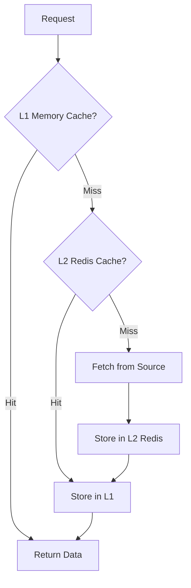

# How to Build Multi-Layer Caching with Redis in Node.js

Author: [nawazdhandala](https://www.github.com/nawazdhandala)

Tags: Node.js, Redis, Caching, TypeScript, Performance, Backend

Description: Learn how to build a multi-layer caching system with Redis in Node.js. This guide covers in-memory caching, Redis integration, cache invalidation strategies, and cache-aside patterns.

---

Caching is one of the most effective ways to improve application performance. A multi-layer caching strategy combines the speed of in-memory caches with the persistence and sharing capabilities of Redis. In this guide, we will build a production-ready caching system that handles the complexity of multiple cache layers.

## Understanding Multi-Layer Caching

A multi-layer cache works like a hierarchy. The fastest cache (in-memory) is checked first. If the data is not there, we check the next layer (Redis). Only if both miss do we fetch from the source (database or API).



## Setting Up the Project

First, install the required dependencies:

```bash
npm install ioredis lru-cache zod
npm install -D typescript @types/node
```

## Building the In-Memory Cache Layer

The first layer uses an LRU (Least Recently Used) cache for maximum speed.

```typescript
// src/cache/MemoryCache.ts

import { LRUCache } from 'lru-cache';

interface CacheEntry<T> {
  value: T;
  expiresAt: number;
}

interface MemoryCacheOptions {
  maxSize: number;       // Maximum number of items
  maxMemoryMB: number;   // Maximum memory in MB
  defaultTTL: number;    // Default TTL in seconds
}

export class MemoryCache {
  private cache: LRUCache<string, CacheEntry<unknown>>;
  private defaultTTL: number;

  constructor(options: MemoryCacheOptions) {
    this.defaultTTL = options.defaultTTL;

    this.cache = new LRUCache({
      max: options.maxSize,
      maxSize: options.maxMemoryMB * 1024 * 1024,
      sizeCalculation: (entry) => {
        // Estimate size of the cached value
        return JSON.stringify(entry).length;
      },
      ttl: options.defaultTTL * 1000,
      ttlAutopurge: true,
    });
  }

  async get<T>(key: string): Promise<T | null> {
    const entry = this.cache.get(key) as CacheEntry<T> | undefined;

    if (!entry) {
      return null;
    }

    // Check if entry has expired
    if (entry.expiresAt < Date.now()) {
      this.cache.delete(key);
      return null;
    }

    return entry.value;
  }

  async set<T>(key: string, value: T, ttlSeconds?: number): Promise<void> {
    const ttl = ttlSeconds || this.defaultTTL;
    const entry: CacheEntry<T> = {
      value,
      expiresAt: Date.now() + ttl * 1000,
    };

    this.cache.set(key, entry, { ttl: ttl * 1000 });
  }

  async delete(key: string): Promise<void> {
    this.cache.delete(key);
  }

  async deletePattern(pattern: string): Promise<void> {
    // Convert glob pattern to regex
    const regex = new RegExp(
      '^' + pattern.replace(/\*/g, '.*').replace(/\?/g, '.') + '$'
    );

    for (const key of this.cache.keys()) {
      if (regex.test(key)) {
        this.cache.delete(key);
      }
    }
  }

  async clear(): Promise<void> {
    this.cache.clear();
  }

  getStats(): { size: number; maxSize: number; hitRate: number } {
    return {
      size: this.cache.size,
      maxSize: this.cache.max || 0,
      hitRate: 0, // LRU cache does not track this by default
    };
  }
}
```

## Building the Redis Cache Layer

The second layer uses Redis for persistent, shared caching across multiple application instances.

```typescript
// src/cache/RedisCache.ts

import Redis from 'ioredis';

interface RedisCacheOptions {
  host: string;
  port: number;
  password?: string;
  keyPrefix: string;
  defaultTTL: number;
  enableCompression?: boolean;
}

export class RedisCache {
  private client: Redis;
  private keyPrefix: string;
  private defaultTTL: number;
  private enableCompression: boolean;

  constructor(options: RedisCacheOptions) {
    this.client = new Redis({
      host: options.host,
      port: options.port,
      password: options.password,
      keyPrefix: options.keyPrefix,
      retryStrategy: (times) => {
        // Exponential backoff with max 30 seconds
        return Math.min(times * 100, 30000);
      },
      maxRetriesPerRequest: 3,
    });

    this.keyPrefix = options.keyPrefix;
    this.defaultTTL = options.defaultTTL;
    this.enableCompression = options.enableCompression || false;

    // Handle connection errors
    this.client.on('error', (error) => {
      console.error('Redis connection error:', error);
    });
  }

  async get<T>(key: string): Promise<T | null> {
    try {
      const data = await this.client.get(key);

      if (!data) {
        return null;
      }

      return this.deserialize<T>(data);
    } catch (error) {
      console.error(`Redis get error for key ${key}:`, error);
      return null;
    }
  }

  async set<T>(key: string, value: T, ttlSeconds?: number): Promise<void> {
    try {
      const ttl = ttlSeconds || this.defaultTTL;
      const serialized = this.serialize(value);

      await this.client.setex(key, ttl, serialized);
    } catch (error) {
      console.error(`Redis set error for key ${key}:`, error);
    }
  }

  async delete(key: string): Promise<void> {
    try {
      await this.client.del(key);
    } catch (error) {
      console.error(`Redis delete error for key ${key}:`, error);
    }
  }

  async deletePattern(pattern: string): Promise<void> {
    try {
      // Use SCAN to find keys matching pattern (safe for production)
      let cursor = '0';
      const keysToDelete: string[] = [];

      do {
        const [newCursor, keys] = await this.client.scan(
          cursor,
          'MATCH',
          this.keyPrefix + pattern,
          'COUNT',
          100
        );
        cursor = newCursor;
        keysToDelete.push(...keys);
      } while (cursor !== '0');

      // Delete in batches
      if (keysToDelete.length > 0) {
        const pipeline = this.client.pipeline();
        keysToDelete.forEach((key) => {
          // Remove prefix since client adds it automatically
          const keyWithoutPrefix = key.replace(this.keyPrefix, '');
          pipeline.del(keyWithoutPrefix);
        });
        await pipeline.exec();
      }
    } catch (error) {
      console.error(`Redis deletePattern error for ${pattern}:`, error);
    }
  }

  async getMultiple<T>(keys: string[]): Promise<Map<string, T | null>> {
    const result = new Map<string, T | null>();

    if (keys.length === 0) {
      return result;
    }

    try {
      const values = await this.client.mget(...keys);

      keys.forEach((key, index) => {
        const value = values[index];
        result.set(key, value ? this.deserialize<T>(value) : null);
      });
    } catch (error) {
      console.error('Redis mget error:', error);
      // Return empty results on error
      keys.forEach((key) => result.set(key, null));
    }

    return result;
  }

  async setMultiple<T>(
    entries: Array<{ key: string; value: T; ttl?: number }>
  ): Promise<void> {
    if (entries.length === 0) {
      return;
    }

    try {
      const pipeline = this.client.pipeline();

      entries.forEach(({ key, value, ttl }) => {
        const serialized = this.serialize(value);
        pipeline.setex(key, ttl || this.defaultTTL, serialized);
      });

      await pipeline.exec();
    } catch (error) {
      console.error('Redis mset error:', error);
    }
  }

  private serialize<T>(value: T): string {
    const json = JSON.stringify(value);

    if (this.enableCompression && json.length > 1024) {
      // For larger values, you could add compression here
      // using zlib or similar
    }

    return json;
  }

  private deserialize<T>(data: string): T {
    return JSON.parse(data) as T;
  }

  async close(): Promise<void> {
    await this.client.quit();
  }
}
```

## Building the Multi-Layer Cache Manager

Now let us combine both layers into a unified caching interface.

```typescript
// src/cache/CacheManager.ts

import { MemoryCache } from './MemoryCache';
import { RedisCache } from './RedisCache';

interface CacheManagerOptions {
  memory: {
    maxSize: number;
    maxMemoryMB: number;
    defaultTTL: number;
  };
  redis: {
    host: string;
    port: number;
    password?: string;
    keyPrefix: string;
    defaultTTL: number;
  };
}

// Cache configuration per key pattern
interface CacheConfig {
  memoryTTL: number;  // TTL for L1 cache
  redisTTL: number;   // TTL for L2 cache
  skipMemory?: boolean;
  skipRedis?: boolean;
}

type DataFetcher<T> = () => Promise<T>;

export class CacheManager {
  private memory: MemoryCache;
  private redis: RedisCache;
  private configMap: Map<string, CacheConfig> = new Map();

  constructor(options: CacheManagerOptions) {
    this.memory = new MemoryCache(options.memory);
    this.redis = new RedisCache(options.redis);
  }

  // Register cache configuration for a key pattern
  registerConfig(pattern: string, config: CacheConfig): void {
    this.configMap.set(pattern, config);
  }

  // Get configuration for a key
  private getConfig(key: string): CacheConfig {
    // Check for exact match first
    if (this.configMap.has(key)) {
      return this.configMap.get(key)!;
    }

    // Check patterns
    for (const [pattern, config] of this.configMap) {
      const regex = new RegExp(
        '^' + pattern.replace(/\*/g, '.*').replace(/\?/g, '.') + '$'
      );
      if (regex.test(key)) {
        return config;
      }
    }

    // Default configuration
    return {
      memoryTTL: 60,
      redisTTL: 300,
    };
  }

  // Get or fetch with caching
  async getOrFetch<T>(
    key: string,
    fetcher: DataFetcher<T>,
    config?: Partial<CacheConfig>
  ): Promise<T> {
    const cacheConfig = { ...this.getConfig(key), ...config };

    // Try L1 (memory) cache first
    if (!cacheConfig.skipMemory) {
      const memoryResult = await this.memory.get<T>(key);
      if (memoryResult !== null) {
        return memoryResult;
      }
    }

    // Try L2 (Redis) cache
    if (!cacheConfig.skipRedis) {
      const redisResult = await this.redis.get<T>(key);
      if (redisResult !== null) {
        // Populate L1 cache for next access
        if (!cacheConfig.skipMemory) {
          await this.memory.set(key, redisResult, cacheConfig.memoryTTL);
        }
        return redisResult;
      }
    }

    // Fetch from source
    const data = await fetcher();

    // Populate caches
    await this.set(key, data, cacheConfig);

    return data;
  }

  // Set value in both cache layers
  async set<T>(
    key: string,
    value: T,
    config?: Partial<CacheConfig>
  ): Promise<void> {
    const cacheConfig = { ...this.getConfig(key), ...config };

    const promises: Promise<void>[] = [];

    if (!cacheConfig.skipMemory) {
      promises.push(this.memory.set(key, value, cacheConfig.memoryTTL));
    }

    if (!cacheConfig.skipRedis) {
      promises.push(this.redis.set(key, value, cacheConfig.redisTTL));
    }

    await Promise.all(promises);
  }

  // Get value from cache (without fetching)
  async get<T>(key: string): Promise<T | null> {
    const config = this.getConfig(key);

    // Try L1 first
    if (!config.skipMemory) {
      const memoryResult = await this.memory.get<T>(key);
      if (memoryResult !== null) {
        return memoryResult;
      }
    }

    // Try L2
    if (!config.skipRedis) {
      const redisResult = await this.redis.get<T>(key);
      if (redisResult !== null) {
        // Populate L1 for next access
        if (!config.skipMemory) {
          await this.memory.set(key, redisResult, config.memoryTTL);
        }
        return redisResult;
      }
    }

    return null;
  }

  // Invalidate cache entry
  async invalidate(key: string): Promise<void> {
    await Promise.all([
      this.memory.delete(key),
      this.redis.delete(key),
    ]);
  }

  // Invalidate cache entries by pattern
  async invalidatePattern(pattern: string): Promise<void> {
    await Promise.all([
      this.memory.deletePattern(pattern),
      this.redis.deletePattern(pattern),
    ]);
  }

  // Get multiple values with batch optimization
  async getMultiple<T>(keys: string[]): Promise<Map<string, T | null>> {
    const result = new Map<string, T | null>();
    const missingFromMemory: string[] = [];

    // Check L1 cache for all keys
    for (const key of keys) {
      const memoryResult = await this.memory.get<T>(key);
      if (memoryResult !== null) {
        result.set(key, memoryResult);
      } else {
        missingFromMemory.push(key);
      }
    }

    // Fetch missing keys from Redis in batch
    if (missingFromMemory.length > 0) {
      const redisResults = await this.redis.getMultiple<T>(missingFromMemory);

      for (const [key, value] of redisResults) {
        result.set(key, value);

        // Populate L1 cache for future access
        if (value !== null) {
          const config = this.getConfig(key);
          await this.memory.set(key, value, config.memoryTTL);
        }
      }
    }

    return result;
  }

  async close(): Promise<void> {
    await this.redis.close();
  }
}
```

## Implementing Cache-Aside Pattern

Here is a practical example using the cache manager with a repository pattern.

```typescript
// src/repositories/UserRepository.ts

import { CacheManager } from '../cache/CacheManager';

interface User {
  id: string;
  email: string;
  name: string;
  createdAt: Date;
}

interface DatabaseClient {
  query<T>(sql: string, params: unknown[]): Promise<T[]>;
}

export class UserRepository {
  private cacheKeyPrefix = 'user';

  constructor(
    private db: DatabaseClient,
    private cache: CacheManager
  ) {
    // Register cache configuration for user data
    this.cache.registerConfig('user:*', {
      memoryTTL: 60,      // 1 minute in memory
      redisTTL: 600,      // 10 minutes in Redis
    });

    this.cache.registerConfig('users:list:*', {
      memoryTTL: 30,      // 30 seconds in memory
      redisTTL: 120,      // 2 minutes in Redis
    });
  }

  // Get a single user by ID
  async findById(id: string): Promise<User | null> {
    const key = `${this.cacheKeyPrefix}:${id}`;

    return this.cache.getOrFetch(key, async () => {
      const results = await this.db.query<User>(
        'SELECT * FROM users WHERE id = $1',
        [id]
      );
      return results[0] || null;
    });
  }

  // Get multiple users by IDs (with batch optimization)
  async findByIds(ids: string[]): Promise<Map<string, User | null>> {
    const keys = ids.map((id) => `${this.cacheKeyPrefix}:${id}`);

    // Get cached values
    const cached = await this.cache.getMultiple<User>(keys);

    // Find which IDs are missing from cache
    const missingIds: string[] = [];
    const result = new Map<string, User | null>();

    ids.forEach((id, index) => {
      const key = keys[index];
      const cachedValue = cached.get(key);

      if (cachedValue !== null) {
        result.set(id, cachedValue);
      } else {
        missingIds.push(id);
      }
    });

    // Fetch missing from database
    if (missingIds.length > 0) {
      const placeholders = missingIds.map((_, i) => `$${i + 1}`).join(', ');
      const users = await this.db.query<User>(
        `SELECT * FROM users WHERE id IN (${placeholders})`,
        missingIds
      );

      // Cache and add to result
      for (const user of users) {
        const key = `${this.cacheKeyPrefix}:${user.id}`;
        await this.cache.set(key, user);
        result.set(user.id, user);
      }

      // Mark remaining IDs as not found
      for (const id of missingIds) {
        if (!result.has(id)) {
          result.set(id, null);
        }
      }
    }

    return result;
  }

  // Update user and invalidate cache
  async update(id: string, data: Partial<User>): Promise<User> {
    // Update in database
    const setClauses = Object.keys(data)
      .map((key, i) => `${key} = $${i + 2}`)
      .join(', ');

    const results = await this.db.query<User>(
      `UPDATE users SET ${setClauses} WHERE id = $1 RETURNING *`,
      [id, ...Object.values(data)]
    );

    const user = results[0];

    // Invalidate cache
    await this.cache.invalidate(`${this.cacheKeyPrefix}:${id}`);

    // Optionally, set the new value in cache
    await this.cache.set(`${this.cacheKeyPrefix}:${id}`, user);

    // Invalidate list caches that might include this user
    await this.cache.invalidatePattern('users:list:*');

    return user;
  }

  // Delete user and invalidate cache
  async delete(id: string): Promise<void> {
    await this.db.query('DELETE FROM users WHERE id = $1', [id]);

    // Invalidate all related caches
    await Promise.all([
      this.cache.invalidate(`${this.cacheKeyPrefix}:${id}`),
      this.cache.invalidatePattern('users:list:*'),
    ]);
  }
}
```

## Cache Warming and Preloading

For frequently accessed data, you can warm the cache on application startup.

```typescript
// src/cache/CacheWarmer.ts

import { CacheManager } from './CacheManager';

interface WarmupConfig {
  key: string;
  fetcher: () => Promise<unknown>;
  refreshInterval?: number;  // Auto-refresh interval in seconds
}

export class CacheWarmer {
  private refreshTimers: Map<string, NodeJS.Timeout> = new Map();

  constructor(private cache: CacheManager) {}

  // Warm up cache with initial data
  async warmup(configs: WarmupConfig[]): Promise<void> {
    console.log(`Warming cache with ${configs.length} entries...`);

    const results = await Promise.allSettled(
      configs.map(async (config) => {
        const data = await config.fetcher();
        await this.cache.set(config.key, data);

        // Set up auto-refresh if configured
        if (config.refreshInterval) {
          this.setupAutoRefresh(config);
        }

        return config.key;
      })
    );

    const succeeded = results.filter((r) => r.status === 'fulfilled').length;
    const failed = results.filter((r) => r.status === 'rejected').length;

    console.log(`Cache warmup complete: ${succeeded} succeeded, ${failed} failed`);
  }

  // Set up automatic refresh for a cache entry
  private setupAutoRefresh(config: WarmupConfig): void {
    // Clear existing timer if any
    const existingTimer = this.refreshTimers.get(config.key);
    if (existingTimer) {
      clearInterval(existingTimer);
    }

    const timer = setInterval(async () => {
      try {
        const data = await config.fetcher();
        await this.cache.set(config.key, data);
        console.log(`Auto-refreshed cache: ${config.key}`);
      } catch (error) {
        console.error(`Failed to auto-refresh cache ${config.key}:`, error);
      }
    }, config.refreshInterval! * 1000);

    this.refreshTimers.set(config.key, timer);
  }

  // Stop all auto-refresh timers
  stopAllRefresh(): void {
    for (const timer of this.refreshTimers.values()) {
      clearInterval(timer);
    }
    this.refreshTimers.clear();
  }
}

// Usage example
async function initializeCache(cache: CacheManager, db: DatabaseClient) {
  const warmer = new CacheWarmer(cache);

  await warmer.warmup([
    {
      key: 'config:app-settings',
      fetcher: async () => {
        const results = await db.query('SELECT * FROM app_settings', []);
        return results[0];
      },
      refreshInterval: 300, // Refresh every 5 minutes
    },
    {
      key: 'config:feature-flags',
      fetcher: async () => {
        const results = await db.query('SELECT * FROM feature_flags WHERE active = true', []);
        return results;
      },
      refreshInterval: 60, // Refresh every minute
    },
  ]);
}
```

## Monitoring and Metrics

Track cache performance to optimize your configuration.

```typescript
// src/cache/CacheMetrics.ts

interface CacheStats {
  l1Hits: number;
  l1Misses: number;
  l2Hits: number;
  l2Misses: number;
  sourceFetches: number;
  errors: number;
}

export class CacheMetrics {
  private stats: CacheStats = {
    l1Hits: 0,
    l1Misses: 0,
    l2Hits: 0,
    l2Misses: 0,
    sourceFetches: 0,
    errors: 0,
  };

  recordL1Hit(): void {
    this.stats.l1Hits++;
  }

  recordL1Miss(): void {
    this.stats.l1Misses++;
  }

  recordL2Hit(): void {
    this.stats.l2Hits++;
  }

  recordL2Miss(): void {
    this.stats.l2Misses++;
  }

  recordSourceFetch(): void {
    this.stats.sourceFetches++;
  }

  recordError(): void {
    this.stats.errors++;
  }

  getStats(): CacheStats & { l1HitRate: number; l2HitRate: number; overallHitRate: number } {
    const l1Total = this.stats.l1Hits + this.stats.l1Misses;
    const l2Total = this.stats.l2Hits + this.stats.l2Misses;
    const overallTotal = l1Total + this.stats.sourceFetches;

    return {
      ...this.stats,
      l1HitRate: l1Total > 0 ? this.stats.l1Hits / l1Total : 0,
      l2HitRate: l2Total > 0 ? this.stats.l2Hits / l2Total : 0,
      overallHitRate: overallTotal > 0
        ? (this.stats.l1Hits + this.stats.l2Hits) / overallTotal
        : 0,
    };
  }

  reset(): void {
    this.stats = {
      l1Hits: 0,
      l1Misses: 0,
      l2Hits: 0,
      l2Misses: 0,
      sourceFetches: 0,
      errors: 0,
    };
  }
}
```

## Summary

Multi-layer caching provides significant performance improvements by combining the strengths of different cache types.

| Layer | Purpose | TTL | Use Case |
|-------|---------|-----|----------|
| L1 Memory | Ultra-fast access | Short (seconds-minutes) | Hot data, repeated reads |
| L2 Redis | Shared, persistent | Medium (minutes-hours) | Cross-instance sharing |
| Source | Authoritative data | N/A | Database, external APIs |

Key takeaways:

1. Use short TTLs for L1 to avoid stale data across instances
2. Use longer TTLs for L2 since Redis can handle invalidation
3. Implement batch operations to reduce network round trips
4. Always invalidate on writes to maintain consistency
5. Monitor hit rates to tune your TTL configuration
6. Consider cache warming for frequently accessed data

This architecture scales well from single-server deployments to distributed systems with multiple application instances.
