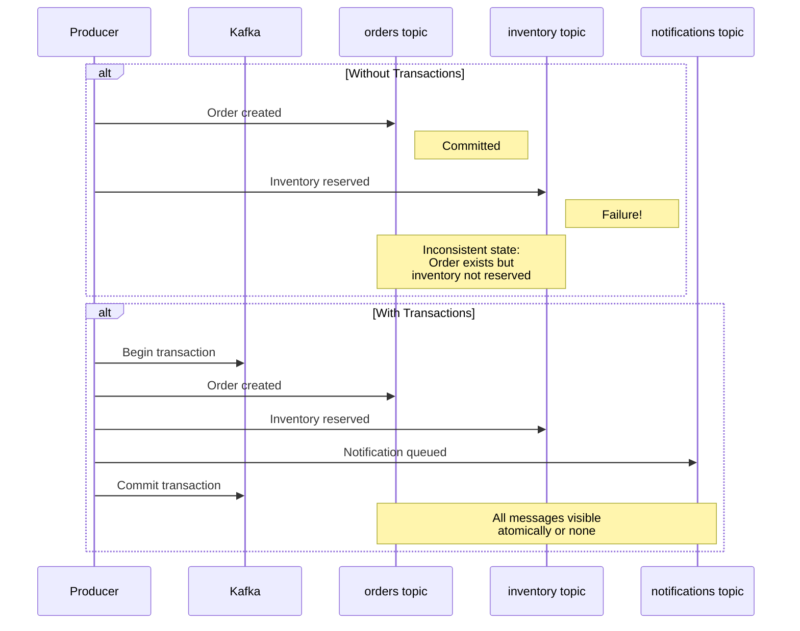

# How to Execute Multi-Partition Transactions in Kafka

Author: [nawazdhandala](https://www.github.com/nawazdhandala)

Tags: Kafka, Transactions, Atomicity, Data Consistency, Distributed Systems

Description: Learn how to use Kafka transactions to atomically write messages across multiple partitions and topics, ensuring all-or-nothing delivery for complex event publishing scenarios.

---

Kafka transactions allow you to write messages to multiple partitions and topics atomically. Either all messages are visible to consumers, or none are. This is essential for scenarios like updating an order and its associated inventory in a single atomic operation. This guide covers implementing multi-partition transactions with practical examples.

## When You Need Transactions

Consider an order processing system that must update multiple topics:



Transactions prevent partial updates that leave your system in an inconsistent state.

## Basic Transaction Setup

Configure a producer for transactional writes:

```java
import org.apache.kafka.clients.producer.*;
import org.apache.kafka.common.serialization.StringSerializer;
import java.util.Properties;

public class TransactionalProducer {

    public static KafkaProducer<String, String> createTransactionalProducer() {
        Properties props = new Properties();

        // Broker connection
        props.put(ProducerConfig.BOOTSTRAP_SERVERS_CONFIG, "kafka1:9092,kafka2:9092");

        // Serializers
        props.put(ProducerConfig.KEY_SERIALIZER_CLASS_CONFIG, StringSerializer.class);
        props.put(ProducerConfig.VALUE_SERIALIZER_CLASS_CONFIG, StringSerializer.class);

        // Transaction configuration
        // This ID must be unique per producer instance but stable across restarts
        props.put(ProducerConfig.TRANSACTIONAL_ID_CONFIG, "order-service-txn-1");

        // Idempotence is required for transactions (automatically enabled)
        props.put(ProducerConfig.ENABLE_IDEMPOTENCE_CONFIG, "true");

        // Recommended settings for transactions
        props.put(ProducerConfig.ACKS_CONFIG, "all");
        props.put(ProducerConfig.RETRIES_CONFIG, Integer.MAX_VALUE);
        props.put(ProducerConfig.MAX_IN_FLIGHT_REQUESTS_PER_CONNECTION, 5);

        // Transaction timeout (default 60s, increase for long transactions)
        props.put(ProducerConfig.TRANSACTION_TIMEOUT_CONFIG, 60000);

        KafkaProducer<String, String> producer = new KafkaProducer<>(props);

        // Initialize transactions (call once per producer lifecycle)
        producer.initTransactions();

        return producer;
    }
}
```

## Writing to Multiple Topics Atomically

Send messages to different topics within a single transaction:

```java
public class OrderService {

    private final KafkaProducer<String, String> producer;

    public OrderService() {
        this.producer = TransactionalProducer.createTransactionalProducer();
    }

    public void processOrder(Order order) {
        String orderId = order.getId();

        try {
            // Start the transaction
            producer.beginTransaction();

            // Message 1: Create order record
            ProducerRecord<String, String> orderRecord = new ProducerRecord<>(
                "orders",
                orderId,
                toJson(new OrderCreatedEvent(order))
            );
            producer.send(orderRecord);

            // Message 2: Reserve inventory (same transaction)
            for (OrderItem item : order.getItems()) {
                ProducerRecord<String, String> inventoryRecord = new ProducerRecord<>(
                    "inventory-reservations",
                    item.getProductId(),
                    toJson(new InventoryReservation(orderId, item.getProductId(), item.getQuantity()))
                );
                producer.send(inventoryRecord);
            }

            // Message 3: Queue customer notification
            ProducerRecord<String, String> notificationRecord = new ProducerRecord<>(
                "notifications",
                order.getCustomerId(),
                toJson(new OrderNotification(orderId, "Order placed successfully"))
            );
            producer.send(notificationRecord);

            // Message 4: Update analytics (different partition based on category)
            ProducerRecord<String, String> analyticsRecord = new ProducerRecord<>(
                "order-analytics",
                order.getCategory(),  // Partition by category
                toJson(new OrderAnalyticsEvent(order))
            );
            producer.send(analyticsRecord);

            // Commit all messages atomically
            producer.commitTransaction();

            System.out.println("Order " + orderId + " processed successfully");

        } catch (ProducerFencedException e) {
            // Another producer with the same transactional.id is active
            // This producer instance should be closed
            System.err.println("Producer fenced, shutting down: " + e.getMessage());
            producer.close();
            throw new RuntimeException("Producer fenced", e);

        } catch (KafkaException e) {
            // Transaction failed, abort and retry or handle error
            System.err.println("Transaction failed, aborting: " + e.getMessage());
            producer.abortTransaction();
            throw new OrderProcessingException("Failed to process order " + orderId, e);
        }
    }

    public void close() {
        producer.close();
    }
}
```

## Consume-Transform-Produce Pattern

The most powerful use of transactions is atomic consume-transform-produce. Consumer offsets are committed as part of the producer transaction.

```java
import org.apache.kafka.clients.consumer.*;
import org.apache.kafka.clients.producer.*;
import org.apache.kafka.common.TopicPartition;
import java.time.Duration;
import java.util.*;

public class TransactionalProcessor {

    private final KafkaConsumer<String, String> consumer;
    private final KafkaProducer<String, String> producer;

    public TransactionalProcessor() {
        // Consumer setup
        Properties consumerProps = new Properties();
        consumerProps.put(ConsumerConfig.BOOTSTRAP_SERVERS_CONFIG, "kafka:9092");
        consumerProps.put(ConsumerConfig.GROUP_ID_CONFIG, "order-enrichment-group");

        // Critical: Read only committed messages
        consumerProps.put(ConsumerConfig.ISOLATION_LEVEL_CONFIG, "read_committed");

        // Disable auto-commit (offsets committed via transaction)
        consumerProps.put(ConsumerConfig.ENABLE_AUTO_COMMIT_CONFIG, "false");

        consumerProps.put(ConsumerConfig.KEY_DESERIALIZER_CLASS_CONFIG,
            "org.apache.kafka.common.serialization.StringDeserializer");
        consumerProps.put(ConsumerConfig.VALUE_DESERIALIZER_CLASS_CONFIG,
            "org.apache.kafka.common.serialization.StringDeserializer");

        this.consumer = new KafkaConsumer<>(consumerProps);

        // Producer setup
        Properties producerProps = new Properties();
        producerProps.put(ProducerConfig.BOOTSTRAP_SERVERS_CONFIG, "kafka:9092");
        producerProps.put(ProducerConfig.TRANSACTIONAL_ID_CONFIG, "order-enrichment-txn-1");
        producerProps.put(ProducerConfig.ENABLE_IDEMPOTENCE_CONFIG, "true");
        producerProps.put(ProducerConfig.KEY_SERIALIZER_CLASS_CONFIG,
            "org.apache.kafka.common.serialization.StringSerializer");
        producerProps.put(ProducerConfig.VALUE_SERIALIZER_CLASS_CONFIG,
            "org.apache.kafka.common.serialization.StringSerializer");

        this.producer = new KafkaProducer<>(producerProps);
        producer.initTransactions();
    }

    public void process() {
        consumer.subscribe(Collections.singletonList("raw-orders"));

        while (true) {
            ConsumerRecords<String, String> records = consumer.poll(Duration.ofMillis(100));

            if (records.isEmpty()) {
                continue;
            }

            // Begin transaction for this batch
            producer.beginTransaction();

            try {
                Map<TopicPartition, OffsetAndMetadata> offsetsToCommit = new HashMap<>();

                for (ConsumerRecord<String, String> record : records) {
                    // Transform the message
                    String enrichedOrder = enrichOrder(record.value());

                    // Send to output topic
                    ProducerRecord<String, String> outputRecord = new ProducerRecord<>(
                        "enriched-orders",
                        record.key(),
                        enrichedOrder
                    );
                    producer.send(outputRecord);

                    // Also send to analytics topic
                    ProducerRecord<String, String> analyticsRecord = new ProducerRecord<>(
                        "order-metrics",
                        record.key(),
                        extractMetrics(enrichedOrder)
                    );
                    producer.send(analyticsRecord);

                    // Track the offset to commit
                    TopicPartition tp = new TopicPartition(record.topic(), record.partition());
                    offsetsToCommit.put(tp, new OffsetAndMetadata(record.offset() + 1));
                }

                // Commit consumer offsets as part of the transaction
                // This is the key to exactly-once semantics
                producer.sendOffsetsToTransaction(offsetsToCommit, consumer.groupMetadata());

                // Commit everything atomically
                producer.commitTransaction();

            } catch (Exception e) {
                System.err.println("Transaction failed: " + e.getMessage());
                producer.abortTransaction();

                // Reset consumer position to re-read uncommitted messages
                // This happens automatically on the next poll after abort
            }
        }
    }

    private String enrichOrder(String rawOrder) {
        // Add customer data, pricing, etc.
        return rawOrder + ",\"enriched\":true";
    }

    private String extractMetrics(String order) {
        // Extract metrics for analytics
        return "{\"order_count\":1}";
    }
}
```

## Handling Transaction Failures

Different exceptions require different handling:

```java
public void processWithErrorHandling(Order order) {
    int attempts = 0;
    int maxAttempts = 3;

    while (attempts < maxAttempts) {
        try {
            producer.beginTransaction();

            // Send messages...
            sendOrderMessages(order);

            producer.commitTransaction();
            return; // Success

        } catch (ProducerFencedException | OutOfOrderSequenceException e) {
            // Fatal errors - producer is no longer usable
            // These indicate a zombie producer or serious state corruption
            System.err.println("Fatal transaction error: " + e.getMessage());
            producer.close();
            throw new RuntimeException("Producer must be recreated", e);

        } catch (KafkaException e) {
            // Retriable error - abort and try again
            System.err.println("Transaction failed (attempt " + (attempts + 1) + "): " + e.getMessage());

            try {
                producer.abortTransaction();
            } catch (Exception abortEx) {
                System.err.println("Abort also failed: " + abortEx.getMessage());
            }

            attempts++;

            if (attempts < maxAttempts) {
                // Exponential backoff before retry
                sleep(100 * (long) Math.pow(2, attempts));
            }
        }
    }

    throw new OrderProcessingException("Failed after " + maxAttempts + " attempts");
}
```

## Broker Configuration for Transactions

Ensure your brokers support transactions:

```properties
# server.properties

# Transaction coordinator configuration
# Replication factor for internal transaction topics
transaction.state.log.replication.factor=3
transaction.state.log.min.isr=2

# Maximum time for a transaction before automatic abort
transaction.max.timeout.ms=900000

# Cleanup interval for aborted transactions
transaction.abort.timed.out.transaction.cleanup.interval.ms=10000

# Required for idempotent producers
enable.idempotence=true
```

## Transaction Performance Tuning

Transactions add latency due to coordination. Optimize with these settings:

```java
// Batch more messages per transaction to amortize overhead
props.put(ProducerConfig.BATCH_SIZE_CONFIG, 65536);   // 64KB
props.put(ProducerConfig.LINGER_MS_CONFIG, 20);       // Wait up to 20ms for batching

// Increase buffer for high-throughput scenarios
props.put(ProducerConfig.BUFFER_MEMORY_CONFIG, 67108864);  // 64MB

// Compression reduces network overhead
props.put(ProducerConfig.COMPRESSION_TYPE_CONFIG, "lz4");
```

## Testing Transactions

Verify your transaction implementation handles failures correctly:

```java
@Test
public void testTransactionAbortOnFailure() {
    // Setup consumer to read uncommitted (for testing only)
    Properties testConsumerProps = new Properties();
    testConsumerProps.put(ConsumerConfig.ISOLATION_LEVEL_CONFIG, "read_uncommitted");
    // ... other props

    // Inject failure during transaction
    doThrow(new RuntimeException("Simulated failure"))
        .when(mockDatabase).save(any());

    // Attempt to process order
    assertThrows(OrderProcessingException.class,
        () -> orderService.processOrder(testOrder));

    // Verify no messages are visible to read_committed consumers
    Properties commitConsumerProps = new Properties();
    commitConsumerProps.put(ConsumerConfig.ISOLATION_LEVEL_CONFIG, "read_committed");

    try (KafkaConsumer<String, String> consumer = new KafkaConsumer<>(commitConsumerProps)) {
        consumer.subscribe(Collections.singletonList("orders"));
        ConsumerRecords<String, String> records = consumer.poll(Duration.ofSeconds(5));
        assertTrue(records.isEmpty(), "Aborted transaction should not be visible");
    }
}
```

## Best Practices

1. **Use unique transactional.id per instance**: Use hostname or pod name as suffix
2. **Keep transactions short**: Long transactions increase abort risk and memory usage
3. **Batch appropriately**: Group related messages but do not hold transactions open too long
4. **Handle fencing gracefully**: ProducerFencedException means another instance took over
5. **Monitor transaction metrics**: Track commit rate, abort rate, and transaction duration
6. **Test failure scenarios**: Verify your code handles aborts and retries correctly

---

Kafka transactions enable atomic writes across multiple partitions and topics. Combined with the consume-transform-produce pattern, they provide exactly-once processing guarantees. Use transactions when data consistency across topics is critical, but be aware of the performance overhead and design your batching strategy to minimize transaction duration.
