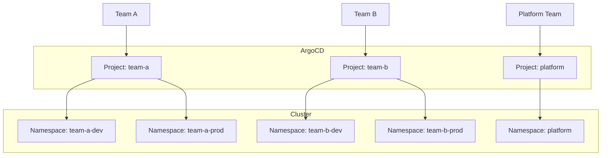

# How to Configure Multi-Tenancy in ArgoCD

Author: [nawazdhandala](https://www.github.com/nawazdhandala)

Tags: ArgoCD, Multi-Tenancy, Kubernetes, RBAC, Security, Projects

Description: Learn how to configure ArgoCD for multi-tenant environments where multiple teams share a single ArgoCD instance with proper isolation, access control, and resource boundaries.

---

Multiple teams sharing one ArgoCD instance need isolation. Team A should not deploy to Team B's namespaces. Developers should not modify production applications. Multi-tenancy in ArgoCD achieves this through projects, RBAC policies, and namespace restrictions.

## Multi-Tenancy Architecture



## Creating Projects for Teams

Projects are the primary isolation boundary. Each team gets their own project:

```yaml
# team-a-project.yaml
apiVersion: argoproj.io/v1alpha1
kind: AppProject
metadata:
  name: team-a
  namespace: argocd
spec:
  description: Team A applications

  # Allowed source repositories
  sourceRepos:
    - 'https://github.com/myorg/team-a-*'
    - 'https://github.com/myorg/shared-libraries'

  # Allowed destinations
  destinations:
    # Can deploy to team-a namespaces on any cluster
    - namespace: 'team-a-*'
      server: '*'
    # Specific namespace on production cluster
    - namespace: 'team-a-prod'
      server: 'https://prod.example.com'

  # What cluster resources can be created
  clusterResourceWhitelist:
    - group: ''
      kind: Namespace

  # What namespace resources can be created
  namespaceResourceWhitelist:
    - group: '*'
      kind: '*'

  # Deny dangerous resources
  namespaceResourceBlacklist:
    - group: ''
      kind: ResourceQuota
    - group: ''
      kind: LimitRange

  # Roles within this project
  roles:
    - name: developer
      description: Developer access to team-a
      policies:
        - p, proj:team-a:developer, applications, get, team-a/*, allow
        - p, proj:team-a:developer, applications, sync, team-a/*, allow
        - p, proj:team-a:developer, logs, get, team-a/*, allow
      groups:
        - team-a-developers

    - name: admin
      description: Admin access to team-a
      policies:
        - p, proj:team-a:admin, applications, *, team-a/*, allow
        - p, proj:team-a:admin, repositories, *, *, allow
      groups:
        - team-a-leads
```

## RBAC Configuration

Configure global RBAC in the argocd-rbac-cm ConfigMap:

```yaml
apiVersion: v1
kind: ConfigMap
metadata:
  name: argocd-rbac-cm
  namespace: argocd
data:
  # Default policy for authenticated users
  policy.default: ''

  # Global policies
  policy.csv: |
    # Platform team has admin on all projects
    g, platform-admins, role:admin

    # Team-specific access is handled by project roles
    # (defined in AppProject specs)

    # Read-only access to all for monitoring team
    p, role:monitoring, applications, get, */*, allow
    g, monitoring-team, role:monitoring

    # Deny all by default - explicit allow required
    p, *, *, *, */*, deny

  # Enable group-based access from SSO
  scopes: '[groups]'
```

## Namespace Isolation

Restrict teams to specific namespaces:

### Using Project Destinations

```yaml
apiVersion: argoproj.io/v1alpha1
kind: AppProject
metadata:
  name: team-a
spec:
  destinations:
    # Exact namespace match
    - namespace: team-a-dev
      server: https://kubernetes.default.svc
    - namespace: team-a-staging
      server: https://kubernetes.default.svc
    - namespace: team-a-prod
      server: https://prod.example.com

    # Wildcard namespace match
    - namespace: 'team-a-*'
      server: '*'

    # Deny specific namespaces (by not including them)
    # team-b-*, kube-system, default are all denied
```

### Kubernetes RBAC Integration

Create corresponding Kubernetes RBAC:

```yaml
# Namespace for team A
apiVersion: v1
kind: Namespace
metadata:
  name: team-a-dev
  labels:
    team: team-a
    environment: dev

---
# RoleBinding for ArgoCD to manage the namespace
apiVersion: rbac.authorization.k8s.io/v1
kind: RoleBinding
metadata:
  name: argocd-admin
  namespace: team-a-dev
roleRef:
  apiGroup: rbac.authorization.k8s.io
  kind: ClusterRole
  name: admin
subjects:
  - kind: ServiceAccount
    name: argocd-application-controller
    namespace: argocd
```

## Resource Restrictions

Control what resources each project can create:

### Cluster Resources

```yaml
apiVersion: argoproj.io/v1alpha1
kind: AppProject
metadata:
  name: team-a
spec:
  # Allow creating Namespaces and ClusterRoles
  clusterResourceWhitelist:
    - group: ''
      kind: Namespace
    - group: rbac.authorization.k8s.io
      kind: ClusterRole
    - group: rbac.authorization.k8s.io
      kind: ClusterRoleBinding
```

### Namespace Resources

```yaml
spec:
  # Allow all namespace resources except specific ones
  namespaceResourceWhitelist:
    - group: '*'
      kind: '*'

  # Deny specific resources
  namespaceResourceBlacklist:
    # Prevent modifying resource limits
    - group: ''
      kind: ResourceQuota
    - group: ''
      kind: LimitRange
    # Prevent PodSecurityPolicy bypass
    - group: policy
      kind: PodSecurityPolicy
```

## Sync Windows

Control when teams can deploy:

```yaml
apiVersion: argoproj.io/v1alpha1
kind: AppProject
metadata:
  name: team-a
spec:
  syncWindows:
    # Allow syncs during business hours
    - kind: allow
      schedule: '0 9-17 * * 1-5'
      duration: 8h
      applications:
        - '*'

    # Deny syncs during maintenance
    - kind: deny
      schedule: '0 2 * * 0'
      duration: 4h
      applications:
        - '*-prod'

    # Always allow manual syncs
    - kind: allow
      schedule: '* * * * *'
      duration: 24h
      manualSync: true
```

## Repository Restrictions

Limit which repositories each project can access:

```yaml
apiVersion: argoproj.io/v1alpha1
kind: AppProject
metadata:
  name: team-a
spec:
  sourceRepos:
    # Team's own repositories
    - 'https://github.com/myorg/team-a-*'
    # Shared Helm charts
    - 'https://charts.example.com'
    # Specific public chart repos
    - 'https://charts.bitnami.com/bitnami'
    # Deny all others by not including them
```

## Orphaned Resources

Control what happens to resources not in Git:

```yaml
apiVersion: argoproj.io/v1alpha1
kind: AppProject
metadata:
  name: team-a
spec:
  # Warn about orphaned resources
  orphanedResources:
    warn: true
    ignore:
      # Ignore certain resource types
      - group: ''
        kind: ConfigMap
        name: kube-root-ca.crt
```

## ApplicationSet Restrictions

Control ApplicationSet usage per project:

```yaml
apiVersion: argoproj.io/v1alpha1
kind: AppProject
metadata:
  name: team-a
spec:
  # Allow ApplicationSets only for specific generators
  applicationSetAllowList:
    - list
    - git

  # Or deny specific generators
  applicationSetDenyList:
    - clusters  # Prevent creating apps on all clusters
```

## Hierarchical Projects

Create project hierarchies for large organizations:

```yaml
# Parent project for all teams
apiVersion: argoproj.io/v1alpha1
kind: AppProject
metadata:
  name: all-teams
spec:
  sourceRepos:
    - '*'
  destinations:
    - namespace: '*'
      server: '*'

---
# Child project inherits restrictions
apiVersion: argoproj.io/v1alpha1
kind: AppProject
metadata:
  name: team-a
  annotations:
    # Reference parent project
    argocd.argoproj.io/parent-project: all-teams
spec:
  # More restrictive than parent
  sourceRepos:
    - 'https://github.com/myorg/team-a-*'
  destinations:
    - namespace: 'team-a-*'
      server: '*'
```

## Monitoring Multi-Tenant Usage

### Per-Project Metrics

```yaml
# Prometheus alert for project violations
groups:
  - name: argocd-tenancy
    rules:
      - alert: UnauthorizedDeploymentAttempt
        expr: |
          increase(argocd_app_sync_total{phase="Error", dest_server=~".*"}[5m]) > 0
        labels:
          severity: warning
        annotations:
          summary: "Sync failed for {{ $labels.name }} in project {{ $labels.project }}"
```

### Audit Logging

Enable audit logging to track who does what:

```yaml
apiVersion: v1
kind: ConfigMap
metadata:
  name: argocd-cm
  namespace: argocd
data:
  # Enable audit logging
  audit.enabled: "true"
```

## Best Practices

### Use Meaningful Project Names

```yaml
# Good: descriptive names
name: team-payments
name: platform-monitoring

# Avoid: generic names
name: project1
name: team-a
```

### Start Restrictive

Begin with minimal permissions and expand as needed:

```yaml
spec:
  # Start with empty lists
  clusterResourceWhitelist: []
  destinations: []
  sourceRepos: []
```

### Document Project Ownership

```yaml
apiVersion: argoproj.io/v1alpha1
kind: AppProject
metadata:
  name: team-a
  annotations:
    owner: "team-a-leads@example.com"
    slack-channel: "#team-a-deployments"
    cost-center: "CC-12345"
```

### Regular Access Reviews

```bash
# Script to audit project access
for project in $(argocd proj list -o name); do
  echo "Project: $project"
  argocd proj role list $project
  echo "---"
done
```

## Troubleshooting

### Permission Denied Errors

```bash
# Check what project allows
argocd proj get team-a

# Verify user's groups
argocd account get-user-info

# Test specific permission
argocd admin settings rbac can user@example.com sync applications 'team-a/myapp'
```

### Application Cannot Deploy

```bash
# Check destination is allowed
argocd proj get team-a -o yaml | grep -A 20 destinations

# Check source repo is allowed
argocd proj get team-a -o yaml | grep -A 10 sourceRepos
```

Multi-tenancy requires careful planning upfront but pays off in security and autonomy. Teams can move independently within their boundaries while the platform team maintains overall governance. Start with clear project definitions, add RBAC policies, and iterate based on actual usage patterns.
