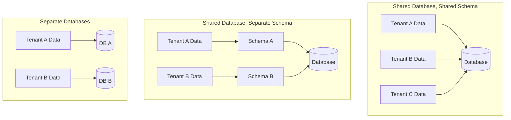

# How to Build Multi-Tenant APIs in Node.js

Author: [nawazdhandala](https://www.github.com/nawazdhandala)

Tags: Node.js, TypeScript, Multi-Tenancy, API, Architecture, SaaS

Description: Learn how to build multi-tenant APIs in Node.js that securely isolate tenant data while sharing infrastructure. This guide covers tenant identification, data isolation strategies, and middleware patterns.

---

Multi-tenancy is the foundation of SaaS applications. It allows you to serve multiple customers (tenants) from a single deployment while keeping their data isolated and secure. In this guide, we will build a multi-tenant API in Node.js that handles tenant identification, data isolation, and common multi-tenancy patterns.

## Understanding Multi-Tenancy Models

There are three primary models for multi-tenant data isolation:



| Model | Isolation | Cost | Complexity |
|-------|-----------|------|------------|
| Shared Schema | Row-level | Lowest | Lowest |
| Separate Schema | Schema-level | Medium | Medium |
| Separate Database | Full | Highest | Highest |

We will focus on the shared schema approach since it is the most common for SaaS applications.

## Project Structure

```
multi-tenant-api/
  src/
    middleware/
      tenantContext.ts
      tenantAuth.ts
    services/
      TenantService.ts
      TenantConnectionManager.ts
    repositories/
      BaseRepository.ts
      UserRepository.ts
    entities/
      Tenant.ts
      User.ts
    decorators/
      TenantAware.ts
    types/
      index.ts
```

## Tenant Context and Identification

First, create a tenant context that travels with each request.

```typescript
// src/types/index.ts

export interface Tenant {
  id: string;
  name: string;
  slug: string;
  plan: 'free' | 'starter' | 'professional' | 'enterprise';
  settings: TenantSettings;
  createdAt: Date;
}

export interface TenantSettings {
  maxUsers: number;
  features: string[];
  customDomain?: string;
}

export interface TenantContext {
  tenant: Tenant;
  userId?: string;
  requestId: string;
}

// Extend Express Request type
declare global {
  namespace Express {
    interface Request {
      tenantContext?: TenantContext;
    }
  }
}
```

```typescript
// src/context/AsyncLocalStorage.ts

import { AsyncLocalStorage } from 'async_hooks';
import { TenantContext } from '../types';

// Create async local storage for tenant context
export const tenantStorage = new AsyncLocalStorage<TenantContext>();

// Helper functions to access context
export function getTenantContext(): TenantContext | undefined {
  return tenantStorage.getStore();
}

export function getTenant(): Tenant | undefined {
  return getTenantContext()?.tenant;
}

export function getTenantId(): string {
  const tenant = getTenant();
  if (!tenant) {
    throw new Error('No tenant context available');
  }
  return tenant.id;
}

export function requireTenantContext(): TenantContext {
  const context = getTenantContext();
  if (!context) {
    throw new Error('Tenant context is required but not available');
  }
  return context;
}
```

## Tenant Identification Middleware

Create middleware to identify tenants from requests.

```typescript
// src/middleware/tenantContext.ts

import { Request, Response, NextFunction } from 'express';
import { v4 as uuidv4 } from 'uuid';
import { TenantService } from '../services/TenantService';
import { tenantStorage } from '../context/AsyncLocalStorage';
import { TenantContext } from '../types';

export class TenantContextMiddleware {
  constructor(private tenantService: TenantService) {}

  // Identify tenant from subdomain
  fromSubdomain() {
    return async (req: Request, res: Response, next: NextFunction) => {
      try {
        const host = req.headers.host || '';
        const subdomain = this.extractSubdomain(host);

        if (!subdomain) {
          return res.status(400).json({
            error: 'Bad Request',
            message: 'Tenant identifier not found in subdomain',
          });
        }

        const tenant = await this.tenantService.findBySlug(subdomain);

        if (!tenant) {
          return res.status(404).json({
            error: 'Not Found',
            message: 'Tenant not found',
          });
        }

        await this.setTenantContext(req, res, next, tenant);
      } catch (error) {
        next(error);
      }
    };
  }

  // Identify tenant from header
  fromHeader(headerName: string = 'X-Tenant-ID') {
    return async (req: Request, res: Response, next: NextFunction) => {
      try {
        const tenantId = req.headers[headerName.toLowerCase()] as string;

        if (!tenantId) {
          return res.status(400).json({
            error: 'Bad Request',
            message: `Missing ${headerName} header`,
          });
        }

        const tenant = await this.tenantService.findById(tenantId);

        if (!tenant) {
          return res.status(404).json({
            error: 'Not Found',
            message: 'Tenant not found',
          });
        }

        await this.setTenantContext(req, res, next, tenant);
      } catch (error) {
        next(error);
      }
    };
  }

  // Identify tenant from URL path parameter
  fromPathParam(paramName: string = 'tenantId') {
    return async (req: Request, res: Response, next: NextFunction) => {
      try {
        const tenantId = req.params[paramName];

        if (!tenantId) {
          return res.status(400).json({
            error: 'Bad Request',
            message: `Missing ${paramName} parameter`,
          });
        }

        const tenant = await this.tenantService.findById(tenantId);

        if (!tenant) {
          return res.status(404).json({
            error: 'Not Found',
            message: 'Tenant not found',
          });
        }

        await this.setTenantContext(req, res, next, tenant);
      } catch (error) {
        next(error);
      }
    };
  }

  // Identify tenant from JWT claims
  fromJWT() {
    return async (req: Request, res: Response, next: NextFunction) => {
      try {
        // Assumes JWT middleware has already run and populated req.user
        const user = (req as any).user;

        if (!user?.tenantId) {
          return res.status(401).json({
            error: 'Unauthorized',
            message: 'No tenant information in token',
          });
        }

        const tenant = await this.tenantService.findById(user.tenantId);

        if (!tenant) {
          return res.status(404).json({
            error: 'Not Found',
            message: 'Tenant not found',
          });
        }

        await this.setTenantContext(req, res, next, tenant, user.id);
      } catch (error) {
        next(error);
      }
    };
  }

  private extractSubdomain(host: string): string | null {
    // Remove port if present
    const hostname = host.split(':')[0];
    const parts = hostname.split('.');

    // Expect format: tenant.example.com
    if (parts.length >= 3) {
      return parts[0];
    }

    return null;
  }

  private async setTenantContext(
    req: Request,
    res: Response,
    next: NextFunction,
    tenant: Tenant,
    userId?: string
  ): Promise<void> {
    const context: TenantContext = {
      tenant,
      userId,
      requestId: uuidv4(),
    };

    req.tenantContext = context;

    // Run the rest of the request within the tenant context
    tenantStorage.run(context, () => {
      next();
    });
  }
}
```

## Tenant-Aware Repository Pattern

Create a base repository that automatically filters by tenant.

```typescript
// src/repositories/BaseRepository.ts

import { PrismaClient, Prisma } from '@prisma/client';
import { getTenantId } from '../context/AsyncLocalStorage';

// Generic type for models with tenantId
interface TenantAwareModel {
  tenantId: string;
}

export abstract class BaseRepository<T extends TenantAwareModel> {
  protected abstract modelName: Prisma.ModelName;

  constructor(protected prisma: PrismaClient) {}

  // Get the delegate for the model
  protected abstract getDelegate(): any;

  // Automatically inject tenantId into where clauses
  protected getTenantWhere(): { tenantId: string } {
    return { tenantId: getTenantId() };
  }

  // Find by ID with tenant scope
  async findById(id: string): Promise<T | null> {
    return this.getDelegate().findFirst({
      where: {
        id,
        ...this.getTenantWhere(),
      },
    });
  }

  // Find all with tenant scope
  async findAll(options?: {
    where?: Partial<T>;
    orderBy?: any;
    take?: number;
    skip?: number;
  }): Promise<T[]> {
    return this.getDelegate().findMany({
      where: {
        ...options?.where,
        ...this.getTenantWhere(),
      },
      orderBy: options?.orderBy,
      take: options?.take,
      skip: options?.skip,
    });
  }

  // Count with tenant scope
  async count(where?: Partial<T>): Promise<number> {
    return this.getDelegate().count({
      where: {
        ...where,
        ...this.getTenantWhere(),
      },
    });
  }

  // Create with automatic tenant assignment
  async create(data: Omit<T, 'id' | 'tenantId' | 'createdAt' | 'updatedAt'>): Promise<T> {
    return this.getDelegate().create({
      data: {
        ...data,
        tenantId: getTenantId(),
      },
    });
  }

  // Update with tenant scope
  async update(id: string, data: Partial<Omit<T, 'id' | 'tenantId'>>): Promise<T> {
    // First verify the record belongs to this tenant
    const existing = await this.findById(id);
    if (!existing) {
      throw new Error(`${this.modelName} not found`);
    }

    return this.getDelegate().update({
      where: { id },
      data,
    });
  }

  // Delete with tenant scope
  async delete(id: string): Promise<void> {
    // First verify the record belongs to this tenant
    const existing = await this.findById(id);
    if (!existing) {
      throw new Error(`${this.modelName} not found`);
    }

    await this.getDelegate().delete({
      where: { id },
    });
  }

  // Bulk operations with tenant scope
  async deleteMany(where: Partial<T>): Promise<number> {
    const result = await this.getDelegate().deleteMany({
      where: {
        ...where,
        ...this.getTenantWhere(),
      },
    });
    return result.count;
  }

  async updateMany(
    where: Partial<T>,
    data: Partial<Omit<T, 'id' | 'tenantId'>>
  ): Promise<number> {
    const result = await this.getDelegate().updateMany({
      where: {
        ...where,
        ...this.getTenantWhere(),
      },
      data,
    });
    return result.count;
  }
}
```

```typescript
// src/repositories/UserRepository.ts

import { PrismaClient, Prisma, User } from '@prisma/client';
import { BaseRepository } from './BaseRepository';

export class UserRepository extends BaseRepository<User> {
  protected modelName = Prisma.ModelName.User;

  constructor(prisma: PrismaClient) {
    super(prisma);
  }

  protected getDelegate() {
    return this.prisma.user;
  }

  // Custom methods specific to users
  async findByEmail(email: string): Promise<User | null> {
    return this.prisma.user.findFirst({
      where: {
        email,
        ...this.getTenantWhere(),
      },
    });
  }

  async findByRole(role: string): Promise<User[]> {
    return this.prisma.user.findMany({
      where: {
        role,
        ...this.getTenantWhere(),
      },
    });
  }
}
```

## Database Schema with Tenant Isolation

Design your schema with tenant isolation in mind.

```prisma
// prisma/schema.prisma

generator client {
  provider = "prisma-client-js"
}

datasource db {
  provider = "postgresql"
  url      = env("DATABASE_URL")
}

model Tenant {
  id        String   @id @default(uuid())
  name      String
  slug      String   @unique
  plan      String   @default("free")
  settings  Json     @default("{}")
  createdAt DateTime @default(now())
  updatedAt DateTime @updatedAt

  // Relations
  users     User[]
  projects  Project[]
  apiKeys   ApiKey[]

  @@index([slug])
}

model User {
  id        String   @id @default(uuid())
  tenantId  String
  email     String
  name      String
  role      String   @default("member")
  createdAt DateTime @default(now())
  updatedAt DateTime @updatedAt

  tenant    Tenant   @relation(fields: [tenantId], references: [id], onDelete: Cascade)
  projects  ProjectMember[]

  // Unique email per tenant, not globally
  @@unique([tenantId, email])
  @@index([tenantId])
  @@index([email])
}

model Project {
  id          String   @id @default(uuid())
  tenantId    String
  name        String
  description String?
  createdAt   DateTime @default(now())
  updatedAt   DateTime @updatedAt

  tenant      Tenant   @relation(fields: [tenantId], references: [id], onDelete: Cascade)
  members     ProjectMember[]
  tasks       Task[]

  @@index([tenantId])
}

model ProjectMember {
  id        String   @id @default(uuid())
  tenantId  String
  projectId String
  userId    String
  role      String   @default("member")
  createdAt DateTime @default(now())

  project   Project  @relation(fields: [projectId], references: [id], onDelete: Cascade)
  user      User     @relation(fields: [userId], references: [id], onDelete: Cascade)

  @@unique([projectId, userId])
  @@index([tenantId])
}

model Task {
  id          String   @id @default(uuid())
  tenantId    String
  projectId   String
  title       String
  description String?
  status      String   @default("todo")
  assigneeId  String?
  createdAt   DateTime @default(now())
  updatedAt   DateTime @updatedAt

  project     Project  @relation(fields: [projectId], references: [id], onDelete: Cascade)

  @@index([tenantId])
  @@index([projectId])
  @@index([assigneeId])
}

model ApiKey {
  id        String   @id @default(uuid())
  tenantId  String
  name      String
  key       String   @unique
  scopes    String[] @default([])
  expiresAt DateTime?
  lastUsed  DateTime?
  createdAt DateTime @default(now())

  tenant    Tenant   @relation(fields: [tenantId], references: [id], onDelete: Cascade)

  @@index([tenantId])
  @@index([key])
}
```

## Row-Level Security with Prisma Middleware

Add an extra layer of security with Prisma middleware.

```typescript
// src/middleware/prismaMiddleware.ts

import { Prisma, PrismaClient } from '@prisma/client';
import { getTenantId, getTenantContext } from '../context/AsyncLocalStorage';

// Models that require tenant isolation
const tenantAwareModels = ['User', 'Project', 'ProjectMember', 'Task', 'ApiKey'];

export function setupPrismaMiddleware(prisma: PrismaClient): void {
  // Middleware to enforce tenant isolation on reads
  prisma.$use(async (params, next) => {
    const context = getTenantContext();

    // Skip middleware if no tenant context (admin operations)
    if (!context) {
      return next(params);
    }

    const modelName = params.model;

    // Only apply to tenant-aware models
    if (!modelName || !tenantAwareModels.includes(modelName)) {
      return next(params);
    }

    const tenantId = context.tenant.id;

    // Inject tenantId into read operations
    if (['findUnique', 'findFirst', 'findMany', 'count', 'aggregate'].includes(params.action)) {
      params.args = params.args || {};
      params.args.where = {
        ...params.args.where,
        tenantId,
      };
    }

    // Inject tenantId into create operations
    if (params.action === 'create') {
      params.args = params.args || {};
      params.args.data = {
        ...params.args.data,
        tenantId,
      };
    }

    // Inject tenantId into createMany operations
    if (params.action === 'createMany') {
      params.args = params.args || {};
      if (Array.isArray(params.args.data)) {
        params.args.data = params.args.data.map((item: any) => ({
          ...item,
          tenantId,
        }));
      }
    }

    // Inject tenantId into update and delete operations
    if (['update', 'updateMany', 'delete', 'deleteMany'].includes(params.action)) {
      params.args = params.args || {};
      params.args.where = {
        ...params.args.where,
        tenantId,
      };
    }

    return next(params);
  });

  // Middleware to log tenant operations (optional)
  prisma.$use(async (params, next) => {
    const context = getTenantContext();
    const startTime = Date.now();

    const result = await next(params);

    const duration = Date.now() - startTime;

    if (context && duration > 100) {
      console.log({
        type: 'slow_query',
        tenant: context.tenant.slug,
        model: params.model,
        action: params.action,
        duration,
        requestId: context.requestId,
      });
    }

    return result;
  });
}
```

## Tenant-Aware Services

Build services that respect tenant boundaries.

```typescript
// src/services/ProjectService.ts

import { PrismaClient, Project, ProjectMember } from '@prisma/client';
import { getTenantId, requireTenantContext } from '../context/AsyncLocalStorage';

interface CreateProjectInput {
  name: string;
  description?: string;
}

interface AddMemberInput {
  userId: string;
  role?: string;
}

export class ProjectService {
  constructor(private prisma: PrismaClient) {}

  async create(input: CreateProjectInput): Promise<Project> {
    const context = requireTenantContext();

    // Check tenant limits
    const projectCount = await this.prisma.project.count({
      where: { tenantId: context.tenant.id },
    });

    const maxProjects = this.getMaxProjects(context.tenant.plan);

    if (projectCount >= maxProjects) {
      throw new Error(
        `Project limit reached. Your ${context.tenant.plan} plan allows ${maxProjects} projects.`
      );
    }

    return this.prisma.project.create({
      data: {
        name: input.name,
        description: input.description,
        tenantId: context.tenant.id,
      },
    });
  }

  async findAll(): Promise<Project[]> {
    const tenantId = getTenantId();

    return this.prisma.project.findMany({
      where: { tenantId },
      include: {
        members: {
          include: { user: true },
        },
        _count: {
          select: { tasks: true },
        },
      },
    });
  }

  async findById(id: string): Promise<Project | null> {
    const tenantId = getTenantId();

    return this.prisma.project.findFirst({
      where: {
        id,
        tenantId,
      },
      include: {
        members: {
          include: { user: true },
        },
      },
    });
  }

  async addMember(projectId: string, input: AddMemberInput): Promise<ProjectMember> {
    const tenantId = getTenantId();

    // Verify project belongs to tenant
    const project = await this.prisma.project.findFirst({
      where: { id: projectId, tenantId },
    });

    if (!project) {
      throw new Error('Project not found');
    }

    // Verify user belongs to tenant
    const user = await this.prisma.user.findFirst({
      where: { id: input.userId, tenantId },
    });

    if (!user) {
      throw new Error('User not found');
    }

    return this.prisma.projectMember.create({
      data: {
        projectId,
        userId: input.userId,
        role: input.role || 'member',
        tenantId,
      },
    });
  }

  private getMaxProjects(plan: string): number {
    const limits: Record<string, number> = {
      free: 3,
      starter: 10,
      professional: 50,
      enterprise: Infinity,
    };
    return limits[plan] || 3;
  }
}
```

## API Routes with Tenant Context

Set up Express routes with tenant middleware.

```typescript
// src/app.ts

import express from 'express';
import { PrismaClient } from '@prisma/client';
import { TenantContextMiddleware } from './middleware/tenantContext';
import { TenantService } from './services/TenantService';
import { ProjectService } from './services/ProjectService';
import { setupPrismaMiddleware } from './middleware/prismaMiddleware';

const app = express();
const prisma = new PrismaClient();

// Set up Prisma middleware for tenant isolation
setupPrismaMiddleware(prisma);

const tenantService = new TenantService(prisma);
const tenantMiddleware = new TenantContextMiddleware(tenantService);
const projectService = new ProjectService(prisma);

app.use(express.json());

// Public routes (no tenant context required)
app.get('/health', (req, res) => {
  res.json({ status: 'healthy' });
});

// Tenant-scoped routes using subdomain identification
app.use('/api', tenantMiddleware.fromSubdomain());

// Alternatively, use header-based identification
// app.use('/api', tenantMiddleware.fromHeader('X-Tenant-ID'));

// Project routes
app.get('/api/projects', async (req, res, next) => {
  try {
    const projects = await projectService.findAll();
    res.json({ data: projects });
  } catch (error) {
    next(error);
  }
});

app.post('/api/projects', async (req, res, next) => {
  try {
    const project = await projectService.create(req.body);
    res.status(201).json({ data: project });
  } catch (error) {
    next(error);
  }
});

app.get('/api/projects/:id', async (req, res, next) => {
  try {
    const project = await projectService.findById(req.params.id);
    if (!project) {
      return res.status(404).json({ error: 'Project not found' });
    }
    res.json({ data: project });
  } catch (error) {
    next(error);
  }
});

// Tenant info endpoint
app.get('/api/tenant', (req, res) => {
  const context = req.tenantContext;
  res.json({
    data: {
      id: context?.tenant.id,
      name: context?.tenant.name,
      plan: context?.tenant.plan,
    },
  });
});

// Error handler
app.use((err: Error, req: express.Request, res: express.Response, next: express.NextFunction) => {
  console.error(err);
  res.status(500).json({
    error: 'Internal Server Error',
    message: err.message,
  });
});

export default app;
```

## Testing Multi-Tenant APIs

Write tests that verify tenant isolation.

```typescript
// src/__tests__/tenantIsolation.test.ts

import { PrismaClient } from '@prisma/client';
import { tenantStorage } from '../context/AsyncLocalStorage';
import { ProjectService } from '../services/ProjectService';

describe('Tenant Isolation', () => {
  let prisma: PrismaClient;
  let projectService: ProjectService;
  let tenantA: Tenant;
  let tenantB: Tenant;

  beforeAll(async () => {
    prisma = new PrismaClient();
    projectService = new ProjectService(prisma);

    // Create test tenants
    tenantA = await prisma.tenant.create({
      data: { name: 'Tenant A', slug: 'tenant-a', plan: 'professional' },
    });

    tenantB = await prisma.tenant.create({
      data: { name: 'Tenant B', slug: 'tenant-b', plan: 'professional' },
    });
  });

  afterAll(async () => {
    await prisma.tenant.deleteMany({
      where: { id: { in: [tenantA.id, tenantB.id] } },
    });
    await prisma.$disconnect();
  });

  it('should only return projects for the current tenant', async () => {
    // Create project for Tenant A
    const contextA = { tenant: tenantA, requestId: '1' };
    const projectA = await tenantStorage.run(contextA, () =>
      projectService.create({ name: 'Project A' })
    );

    // Create project for Tenant B
    const contextB = { tenant: tenantB, requestId: '2' };
    const projectB = await tenantStorage.run(contextB, () =>
      projectService.create({ name: 'Project B' })
    );

    // Tenant A should only see their project
    const tenantAProjects = await tenantStorage.run(contextA, () =>
      projectService.findAll()
    );
    expect(tenantAProjects).toHaveLength(1);
    expect(tenantAProjects[0].id).toBe(projectA.id);

    // Tenant B should only see their project
    const tenantBProjects = await tenantStorage.run(contextB, () =>
      projectService.findAll()
    );
    expect(tenantBProjects).toHaveLength(1);
    expect(tenantBProjects[0].id).toBe(projectB.id);
  });

  it('should not allow access to another tenant project by ID', async () => {
    // Create project for Tenant A
    const contextA = { tenant: tenantA, requestId: '3' };
    const projectA = await tenantStorage.run(contextA, () =>
      projectService.create({ name: 'Secret Project' })
    );

    // Tenant B should not be able to access it
    const contextB = { tenant: tenantB, requestId: '4' };
    const result = await tenantStorage.run(contextB, () =>
      projectService.findById(projectA.id)
    );

    expect(result).toBeNull();
  });
});
```

## Summary

Building multi-tenant APIs requires careful attention to data isolation at every layer.

| Layer | Implementation |
|-------|----------------|
| Request | Tenant identification middleware |
| Context | AsyncLocalStorage for request-scoped tenant |
| Repository | Base repository with automatic tenant filtering |
| Database | Prisma middleware for row-level security |
| Schema | Tenant ID on all tenant-scoped tables |

Key takeaways:

1. Use AsyncLocalStorage to propagate tenant context without passing it through every function
2. Choose your isolation model based on compliance and security requirements
3. Add tenant ID to every tenant-scoped table with proper indexes
4. Use middleware at both the application and database layers for defense in depth
5. Test tenant isolation explicitly to catch cross-tenant data leaks
6. Implement tenant-specific limits based on subscription plans

Multi-tenancy done right provides both security and scalability for SaaS applications.
