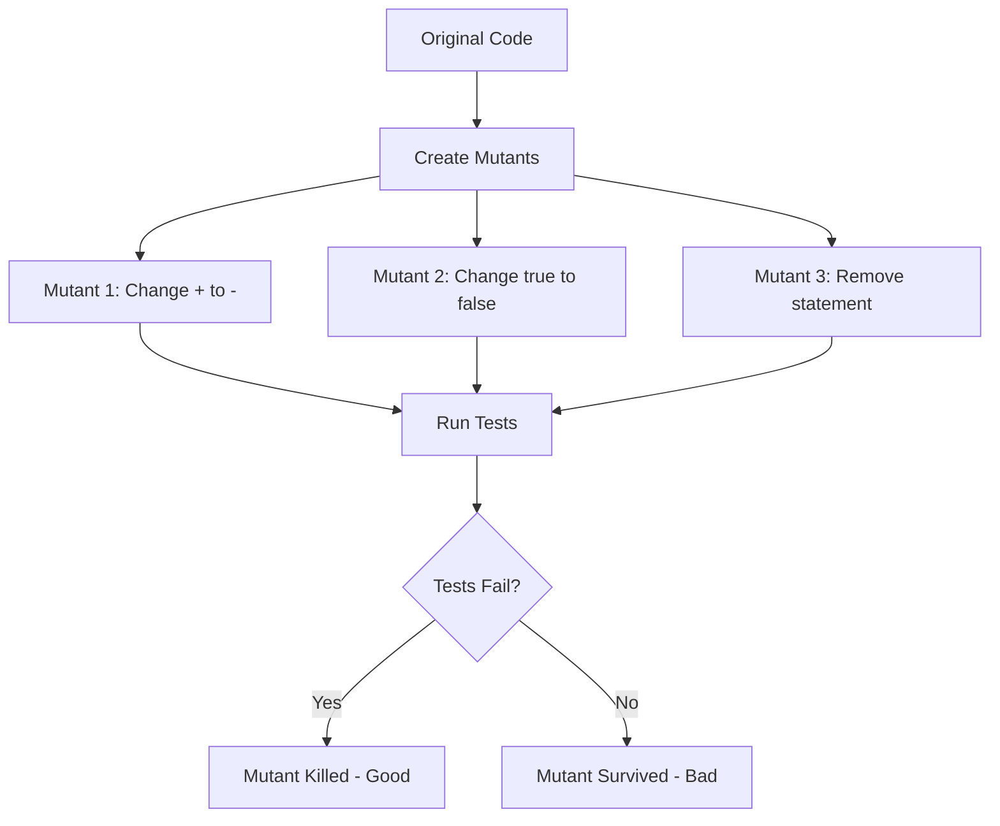

# How to Configure Mutation Testing with Stryker

Author: [nawazdhandala](https://www.github.com/nawazdhandala)

Tags: Stryker, Mutation Testing, Test Quality, Code Coverage, JavaScript, TypeScript

Description: Learn how to implement mutation testing with Stryker to measure the effectiveness of your test suite beyond simple code coverage metrics.

---

Code coverage tells you which lines your tests execute. It does not tell you if those tests actually catch bugs. You can have 100% coverage with tests that never fail. Mutation testing solves this by introducing small changes (mutations) to your code and checking if your tests catch them.

## How Mutation Testing Works



If a mutation survives (tests still pass), your tests have a blind spot.

## Installing Stryker

For JavaScript/TypeScript projects:

```bash
# Initialize Stryker in your project
npm init stryker

# Or install manually
npm install --save-dev @stryker-mutator/core
npm install --save-dev @stryker-mutator/jest-runner  # or mocha-runner, karma-runner
npm install --save-dev @stryker-mutator/typescript-checker  # for TypeScript
```

The init command asks questions and creates a configuration file.

## Configuration

Create or modify `stryker.conf.js`:

```javascript
// stryker.conf.js
module.exports = {
  // Package manager
  packageManager: 'npm',

  // Test runner
  testRunner: 'jest',
  jest: {
    projectType: 'custom',
    configFile: 'jest.config.js',
    enableFindRelatedTests: true,
  },

  // Files to mutate
  mutate: [
    'src/**/*.ts',
    '!src/**/*.spec.ts',
    '!src/**/*.test.ts',
    '!src/index.ts',
  ],

  // TypeScript support
  checkers: ['typescript'],
  tsconfigFile: 'tsconfig.json',

  // Reporters
  reporters: ['html', 'clear-text', 'progress', 'dashboard'],
  htmlReporter: {
    fileName: 'reports/mutation/mutation-report.html',
  },

  // Thresholds
  thresholds: {
    high: 80,
    low: 60,
    break: 50,  // Fail if score below 50%
  },

  // Performance
  concurrency: 4,
  timeoutMS: 60000,
  timeoutFactor: 1.5,

  // Incremental mode (reuse previous results)
  incremental: true,
  incrementalFile: '.stryker-tmp/incremental.json',
};
```

## Running Mutation Tests

```bash
# Run Stryker
npx stryker run

# Run with specific config
npx stryker run stryker.conf.js

# Run in incremental mode (faster for CI)
npx stryker run --incremental
```

## Understanding the Report

Stryker reports show:

- **Killed**: Test failed when mutation was applied (good)
- **Survived**: Tests passed despite mutation (bad - tests need improvement)
- **No Coverage**: No test covers this code
- **Timeout**: Tests took too long (likely infinite loop)
- **Runtime Error**: Mutation caused crash
- **Compile Error**: Mutation created invalid code

Example output:

```
Mutation testing  [====================] 100% (elapsed: 2m, remaining: 0s)
  Kill: 245 Survived: 12 Timeout: 3 No Coverage: 5

All files             | 92.45 | 245/265

File                  | % score | # killed | # survived | # timeout | # no cov
src/calculator.ts     |  100.00 |       25 |          0 |         0 |        0
src/validator.ts      |   85.71 |       12 |          2 |         0 |        0
src/parser.ts         |   90.00 |       18 |          2 |         1 |        0
```

## Writing Better Tests

When mutants survive, improve your tests. Here is an example:

Original code:

```typescript
// src/calculator.ts
export function add(a: number, b: number): number {
  return a + b;
}

export function isPositive(n: number): boolean {
  return n > 0;
}

export function divide(a: number, b: number): number {
  if (b === 0) {
    throw new Error('Cannot divide by zero');
  }
  return a / b;
}
```

Weak tests (mutants survive):

```typescript
// src/calculator.spec.ts - WEAK
import { add, isPositive, divide } from './calculator';

test('add returns a number', () => {
  const result = add(1, 2);
  expect(typeof result).toBe('number');
});

test('isPositive returns boolean', () => {
  expect(typeof isPositive(5)).toBe('boolean');
});

test('divide works', () => {
  expect(divide(10, 2)).toBeDefined();
});
```

These tests pass but do not verify actual behavior. Stryker would report surviving mutants.

Strong tests (mutants killed):

```typescript
// src/calculator.spec.ts - STRONG
import { add, isPositive, divide } from './calculator';

describe('add', () => {
  test('adds two positive numbers', () => {
    expect(add(2, 3)).toBe(5);
  });

  test('adds negative numbers', () => {
    expect(add(-2, -3)).toBe(-5);
  });

  test('adds zero', () => {
    expect(add(5, 0)).toBe(5);
  });
});

describe('isPositive', () => {
  test('returns true for positive numbers', () => {
    expect(isPositive(1)).toBe(true);
    expect(isPositive(100)).toBe(true);
  });

  test('returns false for zero', () => {
    expect(isPositive(0)).toBe(false);
  });

  test('returns false for negative numbers', () => {
    expect(isPositive(-1)).toBe(false);
    expect(isPositive(-100)).toBe(false);
  });
});

describe('divide', () => {
  test('divides correctly', () => {
    expect(divide(10, 2)).toBe(5);
    expect(divide(9, 3)).toBe(3);
  });

  test('throws on division by zero', () => {
    expect(() => divide(10, 0)).toThrow('Cannot divide by zero');
  });

  test('handles decimal results', () => {
    expect(divide(5, 2)).toBe(2.5);
  });
});
```

## Mutation Operators

Stryker applies various mutation types:

```typescript
// Arithmetic operator replacement
a + b  =>  a - b
a * b  =>  a / b

// Comparison operator replacement
a > b   =>  a >= b
a === b =>  a !== b

// Logical operator replacement
a && b  =>  a || b
!a      =>  a

// Conditional replacement
if (condition) => if (true)
if (condition) => if (false)

// Statement removal
return value;  =>  (removed)

// Array method replacement
array.filter() => array
array.map()    => array

// String mutation
"hello" => ""
```

## Excluding Code from Mutation

Some code should not be mutated:

```typescript
// Exclude specific lines with comments
function debug(message: string): void {
  // Stryker disable next-line all
  console.log(`[DEBUG] ${message}`);
}

// Exclude blocks
// Stryker disable all
function legacyCode(): void {
  // ... old code not worth testing
}
// Stryker restore all
```

In configuration:

```javascript
// stryker.conf.js
module.exports = {
  mutate: [
    'src/**/*.ts',
    '!src/**/*.spec.ts',
    '!src/legacy/**',        // Exclude legacy folder
    '!src/generated/**',     // Exclude generated code
    '!src/**/*.d.ts',        // Exclude type definitions
  ],

  // Disable specific mutators
  mutator: {
    excludedMutations: [
      'StringLiteral',  // Do not mutate strings
      'ArrayDeclaration',
    ],
  },
};
```

## CI/CD Integration

GitHub Actions workflow:

```yaml
# .github/workflows/mutation-test.yml
name: Mutation Tests

on:
  push:
    branches: [main]
  pull_request:
    branches: [main]

jobs:
  stryker:
    runs-on: ubuntu-latest

    steps:
      - uses: actions/checkout@v4

      - name: Setup Node.js
        uses: actions/setup-node@v4
        with:
          node-version: '20'
          cache: 'npm'

      - name: Install dependencies
        run: npm ci

      - name: Run mutation tests
        run: npx stryker run --incremental

      - name: Upload mutation report
        uses: actions/upload-artifact@v4
        if: always()
        with:
          name: mutation-report
          path: reports/mutation/

      - name: Check mutation score
        run: |
          SCORE=$(cat reports/mutation/mutation-report.json | jq '.files | to_entries | map(.value.mutationScore) | add / length')
          echo "Mutation score: $SCORE%"
          if (( $(echo "$SCORE < 80" | bc -l) )); then
            echo "Mutation score below threshold"
            exit 1
          fi
```

## Performance Optimization

Mutation testing is slow. Speed it up:

```javascript
// stryker.conf.js
module.exports = {
  // Run tests in parallel
  concurrency: 4,

  // Use incremental mode
  incremental: true,

  // Only mutate changed files in CI
  // (use git diff to determine)

  // Reduce timeout for faster feedback
  timeoutMS: 30000,

  // Disable expensive mutators
  mutator: {
    excludedMutations: [
      'ObjectLiteral',  // Can be slow
    ],
  },

  // Use test filtering
  jest: {
    enableFindRelatedTests: true,
  },
};
```

Run on changed files only:

```bash
# Get list of changed TypeScript files
CHANGED_FILES=$(git diff --name-only HEAD~1 | grep '\.ts$' | grep -v '\.spec\.ts$' | tr '\n' ',')

# Run Stryker on changed files only
npx stryker run --mutate "$CHANGED_FILES"
```

## Best Practices

1. Start with critical business logic, not utility functions
2. Use incremental mode in CI for speed
3. Set realistic thresholds (80% is good, 100% is impractical)
4. Fix surviving mutants in boundary conditions first
5. Exclude generated code and type definitions
6. Run full mutation tests nightly, incremental on PRs
7. Track mutation score over time
8. Do not chase 100% - diminishing returns

---

Mutation testing reveals the true strength of your test suite. Code coverage lies; mutation score tells the truth. Start with Stryker on your most important modules and gradually expand coverage. When a mutant survives, you have found a gap in your tests that could let a real bug through.
