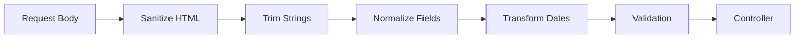

# How to Transform Data with Custom NestJS Transformers

Author: [nawazdhandala](https://www.github.com/nawazdhandala)

Tags: NestJS, TypeScript, NodeJS, Data Transformation, Validation, Backend

Description: Learn how to build custom transformers in NestJS to clean, validate, and reshape incoming request data before it reaches your controllers.

---

Data transformation is one of those problems that seems simple until your API starts handling real-world input. Users send strings when you expect numbers, dates come in multiple formats, and nested objects need flattening. NestJS provides a powerful pipe system for transforming data, but the built-in options only scratch the surface.

This guide shows you how to build custom transformers that handle complex data mutations, work with class-transformer decorators, and integrate cleanly with the validation pipeline.

## Why Custom Transformers?

NestJS includes `ValidationPipe` and basic transformation through class-transformer. These work well for simple cases, but fall short when you need to:

- Convert nested string dates to Date objects recursively
- Normalize phone numbers, emails, or other user input
- Transform arrays of mixed types into consistent structures
- Apply business-specific formatting rules

The solution is custom transformers that run before validation, giving you clean data to work with.

## Basic Transformer Structure

A transformer in NestJS is a pipe that implements `PipeTransform`. Here is a simple example that trims whitespace from strings:

```typescript
// pipes/trim-strings.pipe.ts
import { PipeTransform, Injectable, ArgumentMetadata } from '@nestjs/common';

@Injectable()
export class TrimStringsPipe implements PipeTransform {
  // The transform method receives the value and metadata about it
  transform(value: any, metadata: ArgumentMetadata) {
    // Only transform the body of POST/PUT requests
    if (metadata.type !== 'body') {
      return value;
    }

    return this.trimRecursive(value);
  }

  private trimRecursive(obj: any): any {
    // Handle null and undefined
    if (obj === null || obj === undefined) {
      return obj;
    }

    // Trim strings directly
    if (typeof obj === 'string') {
      return obj.trim();
    }

    // Process arrays recursively
    if (Array.isArray(obj)) {
      return obj.map(item => this.trimRecursive(item));
    }

    // Process object properties recursively
    if (typeof obj === 'object') {
      const result: Record<string, any> = {};
      for (const key of Object.keys(obj)) {
        result[key] = this.trimRecursive(obj[key]);
      }
      return result;
    }

    return obj;
  }
}
```

Apply this pipe globally in your main.ts:

```typescript
// main.ts
import { NestFactory } from '@nestjs/core';
import { AppModule } from './app.module';
import { TrimStringsPipe } from './pipes/trim-strings.pipe';
import { ValidationPipe } from '@nestjs/common';

async function bootstrap() {
  const app = await NestFactory.create(AppModule);

  // Pipes run in order - trim first, then validate
  app.useGlobalPipes(
    new TrimStringsPipe(),
    new ValidationPipe({ transform: true }),
  );

  await app.listen(3000);
}
bootstrap();
```

## Transforming Dates

Date handling is notoriously tricky. Users send ISO strings, Unix timestamps, and localized formats. This transformer normalizes them all:

```typescript
// pipes/transform-dates.pipe.ts
import { PipeTransform, Injectable, ArgumentMetadata } from '@nestjs/common';

@Injectable()
export class TransformDatesPipe implements PipeTransform {
  // Fields that should be converted to Date objects
  private dateFields = ['createdAt', 'updatedAt', 'birthDate', 'startDate', 'endDate'];

  transform(value: any, metadata: ArgumentMetadata) {
    if (metadata.type !== 'body' || !value) {
      return value;
    }

    return this.transformDates(value);
  }

  private transformDates(obj: any): any {
    if (Array.isArray(obj)) {
      return obj.map(item => this.transformDates(item));
    }

    if (typeof obj !== 'object' || obj === null) {
      return obj;
    }

    const result: Record<string, any> = {};

    for (const [key, val] of Object.entries(obj)) {
      if (this.dateFields.includes(key) && val !== null) {
        // Convert to Date object if possible
        result[key] = this.parseDate(val);
      } else if (typeof val === 'object') {
        // Recurse into nested objects
        result[key] = this.transformDates(val);
      } else {
        result[key] = val;
      }
    }

    return result;
  }

  private parseDate(value: any): Date | null {
    // Already a Date
    if (value instanceof Date) {
      return isNaN(value.getTime()) ? null : value;
    }

    // Unix timestamp in seconds
    if (typeof value === 'number' && value < 9999999999) {
      return new Date(value * 1000);
    }

    // Unix timestamp in milliseconds
    if (typeof value === 'number') {
      return new Date(value);
    }

    // ISO string or other parseable format
    if (typeof value === 'string') {
      const parsed = new Date(value);
      return isNaN(parsed.getTime()) ? null : parsed;
    }

    return null;
  }
}
```

## Using class-transformer Decorators

For more control, use the `@Transform` decorator from class-transformer. This approach ties transformations to your DTO definitions:

```typescript
// dto/create-user.dto.ts
import { Transform, Type } from 'class-transformer';
import { IsString, IsEmail, IsDate, IsOptional, ValidateNested } from 'class-validator';

// Helper function for normalizing emails
function normalizeEmail(email: string): string {
  const [localPart, domain] = email.toLowerCase().split('@');
  // Remove dots from Gmail addresses (they are ignored)
  if (domain === 'gmail.com') {
    return `${localPart.replace(/\./g, '')}@${domain}`;
  }
  return `${localPart}@${domain}`;
}

export class AddressDto {
  @IsString()
  @Transform(({ value }) => value?.trim())
  street: string;

  @IsString()
  @Transform(({ value }) => value?.trim().toUpperCase())
  state: string;

  @IsString()
  @Transform(({ value }) => value?.replace(/\D/g, '')) // Remove non-digits
  zipCode: string;
}

export class CreateUserDto {
  @IsString()
  @Transform(({ value }) => value?.trim())
  name: string;

  @IsEmail()
  @Transform(({ value }) => normalizeEmail(value))
  email: string;

  @IsOptional()
  @IsString()
  @Transform(({ value }) => {
    // Normalize phone to E.164 format
    if (!value) return null;
    const digits = value.replace(/\D/g, '');
    if (digits.length === 10) return `+1${digits}`;
    if (digits.length === 11 && digits[0] === '1') return `+${digits}`;
    return `+${digits}`;
  })
  phone?: string;

  @IsDate()
  @Transform(({ value }) => new Date(value))
  birthDate: Date;

  @ValidateNested()
  @Type(() => AddressDto) // Required for nested object transformation
  address: AddressDto;
}
```

Make sure your ValidationPipe has `transform: true`:

```typescript
// main.ts or in a module
app.useGlobalPipes(
  new ValidationPipe({
    transform: true, // Enables class-transformer
    whitelist: true, // Strips properties not in DTO
    forbidNonWhitelisted: true, // Throws on extra properties
  }),
);
```

## Custom Parameter Decorator with Transformation

Sometimes you need transformation logic specific to a route parameter. Create a custom decorator that combines extraction and transformation:

```typescript
// decorators/parsed-int.decorator.ts
import { createParamDecorator, ExecutionContext, BadRequestException } from '@nestjs/common';

export const ParsedInt = createParamDecorator(
  (data: string, ctx: ExecutionContext) => {
    const request = ctx.switchToHttp().getRequest();
    const value = request.params[data];

    const parsed = parseInt(value, 10);

    if (isNaN(parsed)) {
      throw new BadRequestException(`Parameter ${data} must be a valid integer`);
    }

    return parsed;
  },
);

// Usage in controller
@Get(':id')
findOne(@ParsedInt('id') id: number) {
  // id is guaranteed to be a number
  return this.userService.findOne(id);
}
```

## Building a Configurable Transformer

For reusable transformations across different DTOs, create a configurable pipe:

```typescript
// pipes/field-transformer.pipe.ts
import { PipeTransform, Injectable, ArgumentMetadata } from '@nestjs/common';

type TransformFn = (value: any) => any;

interface FieldTransformConfig {
  [fieldPath: string]: TransformFn;
}

@Injectable()
export class FieldTransformerPipe implements PipeTransform {
  constructor(private config: FieldTransformConfig) {}

  transform(value: any, metadata: ArgumentMetadata) {
    if (metadata.type !== 'body' || !value) {
      return value;
    }

    return this.applyTransforms(value, this.config);
  }

  private applyTransforms(obj: any, config: FieldTransformConfig): any {
    const result = { ...obj };

    for (const [path, transformFn] of Object.entries(config)) {
      this.setNestedValue(result, path, transformFn);
    }

    return result;
  }

  private setNestedValue(obj: any, path: string, transformFn: TransformFn): void {
    const parts = path.split('.');
    let current = obj;

    // Navigate to the parent of the target field
    for (let i = 0; i < parts.length - 1; i++) {
      if (current[parts[i]] === undefined) return;
      current = current[parts[i]];
    }

    // Apply transformation to the target field
    const lastPart = parts[parts.length - 1];
    if (current[lastPart] !== undefined) {
      current[lastPart] = transformFn(current[lastPart]);
    }
  }
}

// Usage in controller
@Post()
@UsePipes(
  new FieldTransformerPipe({
    'email': (v) => v.toLowerCase(),
    'profile.bio': (v) => v.substring(0, 500), // Truncate bio
    'tags': (v) => [...new Set(v)], // Remove duplicates
  }),
)
createUser(@Body() dto: CreateUserDto) {
  return this.userService.create(dto);
}
```

## Transformation Pipeline Architecture

For complex applications, organize transformers into a pipeline:



Implement this as a composite pipe:

```typescript
// pipes/transformation-pipeline.pipe.ts
import { PipeTransform, Injectable, ArgumentMetadata } from '@nestjs/common';
import { TrimStringsPipe } from './trim-strings.pipe';
import { TransformDatesPipe } from './transform-dates.pipe';

// A sanitizer that removes potential XSS content
const sanitizeHtml = (str: string): string => {
  return str
    .replace(/<script\b[^<]*(?:(?!<\/script>)<[^<]*)*<\/script>/gi, '')
    .replace(/on\w+="[^"]*"/g, '')
    .replace(/javascript:/gi, '');
};

@Injectable()
export class TransformationPipelinePipe implements PipeTransform {
  private pipes: PipeTransform[];

  constructor() {
    this.pipes = [
      new SanitizeHtmlPipe(),
      new TrimStringsPipe(),
      new TransformDatesPipe(),
    ];
  }

  async transform(value: any, metadata: ArgumentMetadata) {
    let result = value;

    for (const pipe of this.pipes) {
      result = await pipe.transform(result, metadata);
    }

    return result;
  }
}

@Injectable()
class SanitizeHtmlPipe implements PipeTransform {
  transform(value: any, metadata: ArgumentMetadata) {
    if (metadata.type !== 'body') return value;
    return this.sanitizeRecursive(value);
  }

  private sanitizeRecursive(obj: any): any {
    if (typeof obj === 'string') {
      return sanitizeHtml(obj);
    }
    if (Array.isArray(obj)) {
      return obj.map(item => this.sanitizeRecursive(item));
    }
    if (typeof obj === 'object' && obj !== null) {
      const result: Record<string, any> = {};
      for (const [key, val] of Object.entries(obj)) {
        result[key] = this.sanitizeRecursive(val);
      }
      return result;
    }
    return obj;
  }
}
```

## Testing Transformers

Write unit tests for your transformers to verify edge cases:

```typescript
// pipes/trim-strings.pipe.spec.ts
import { TrimStringsPipe } from './trim-strings.pipe';

describe('TrimStringsPipe', () => {
  let pipe: TrimStringsPipe;

  beforeEach(() => {
    pipe = new TrimStringsPipe();
  });

  it('should trim string values', () => {
    const input = { name: '  John Doe  ' };
    const result = pipe.transform(input, { type: 'body' } as any);
    expect(result.name).toBe('John Doe');
  });

  it('should handle nested objects', () => {
    const input = {
      user: {
        name: '  Jane  ',
        address: { city: ' NYC ' },
      },
    };
    const result = pipe.transform(input, { type: 'body' } as any);
    expect(result.user.name).toBe('Jane');
    expect(result.user.address.city).toBe('NYC');
  });

  it('should handle arrays', () => {
    const input = { tags: ['  a  ', '  b  '] };
    const result = pipe.transform(input, { type: 'body' } as any);
    expect(result.tags).toEqual(['a', 'b']);
  });

  it('should not transform query parameters', () => {
    const input = '  test  ';
    const result = pipe.transform(input, { type: 'query' } as any);
    expect(result).toBe('  test  ');
  });
});
```

## Summary

Custom transformers in NestJS give you fine-grained control over incoming data. The key patterns are:

| Pattern | Use Case |
|---------|----------|
| Global pipes | Apply to all requests (trimming, sanitization) |
| DTO decorators | Field-specific transformations tied to your types |
| Custom parameter decorators | Route-specific parsing with validation |
| Configurable pipes | Reusable transformations with different configs |
| Pipeline composition | Complex multi-stage transformations |

By transforming data before validation, you ensure your business logic receives clean, consistent input regardless of what clients send. This separation of concerns makes your code more maintainable and your APIs more robust.
