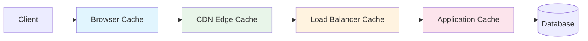

# How to Configure Network Caching

Author: [nawazdhandala](https://www.github.com/nawazdhandala)

Tags: Networking, Caching, Performance, CDN, HTTP Cache, Reverse Proxy, Optimization

Description: Learn how to implement network caching to reduce latency and server load. This guide covers HTTP caching headers, CDN configuration, reverse proxy caching, and cache invalidation strategies.

---

Network caching stores responses closer to users, reducing latency and backend load. A well-configured caching strategy can handle 90% or more of traffic without touching your origin servers. This guide shows you how to implement caching at multiple layers of your infrastructure.

## Caching Layers



Each layer serves different purposes:
- **Browser cache** - Fastest, per-user
- **CDN cache** - Geographic distribution, shared across users
- **Reverse proxy cache** - Protects origin servers
- **Application cache** - Complex business logic caching

## HTTP Caching Headers

### Cache-Control Directives

```python
# cache_headers.py - Setting appropriate cache headers
from flask import Flask, make_response, request
from datetime import datetime, timedelta

app = Flask(__name__)

@app.route('/static/style.css')
def static_asset():
    """Static assets - cache for a long time"""
    response = make_response(open('static/style.css').read())
    response.headers['Content-Type'] = 'text/css'

    # Cache for 1 year (with versioned filenames)
    response.headers['Cache-Control'] = 'public, max-age=31536000, immutable'

    return response

@app.route('/api/products')
def product_list():
    """API data - cache briefly, validate before reuse"""
    data = get_products()  # Fetch from database

    response = make_response(data)
    response.headers['Content-Type'] = 'application/json'

    # Cache for 5 minutes, must revalidate after
    response.headers['Cache-Control'] = 'public, max-age=300, must-revalidate'

    # ETag for conditional requests
    response.headers['ETag'] = generate_etag(data)

    return response

@app.route('/api/user/profile')
def user_profile():
    """Private user data - no shared caching"""
    user = get_current_user()
    data = get_profile(user)

    response = make_response(data)

    # Private = only browser can cache, not CDN/proxies
    response.headers['Cache-Control'] = 'private, max-age=60'

    return response

@app.route('/api/account/balance')
def account_balance():
    """Sensitive data - no caching"""
    balance = get_balance()

    response = make_response({'balance': balance})

    # Prevent all caching
    response.headers['Cache-Control'] = 'no-store, no-cache, must-revalidate'
    response.headers['Pragma'] = 'no-cache'
    response.headers['Expires'] = '0'

    return response
```

### Cache-Control Reference

| Directive | Meaning |
|-----------|---------|
| `public` | Any cache can store |
| `private` | Only browser can cache |
| `max-age=N` | Fresh for N seconds |
| `s-maxage=N` | Fresh for N seconds in shared caches |
| `no-cache` | Must revalidate before use |
| `no-store` | Never store |
| `must-revalidate` | Use stale only if cannot revalidate |
| `stale-while-revalidate=N` | Serve stale while refreshing for N seconds |
| `immutable` | Content will never change |

## NGINX Caching

Configure NGINX as a caching reverse proxy:

```nginx
# nginx_cache.conf - NGINX proxy cache configuration

http {
    # Define cache zone
    # levels: directory structure for cache files
    # keys_zone: shared memory zone for keys (10MB = ~80k keys)
    # max_size: maximum cache size on disk
    # inactive: remove unused items after this time
    proxy_cache_path /var/cache/nginx/proxy
        levels=1:2
        keys_zone=api_cache:10m
        max_size=10g
        inactive=60m
        use_temp_path=off;

    # Cache for static content
    proxy_cache_path /var/cache/nginx/static
        levels=1:2
        keys_zone=static_cache:10m
        max_size=50g
        inactive=7d
        use_temp_path=off;

    server {
        listen 80;

        # Static assets - aggressive caching
        location /static/ {
            proxy_pass http://backend;
            proxy_cache static_cache;

            # Cache for 7 days
            proxy_cache_valid 200 7d;
            proxy_cache_valid 404 1m;

            # Cache key
            proxy_cache_key "$scheme$request_method$host$request_uri";

            # Add cache status header for debugging
            add_header X-Cache-Status $upstream_cache_status;

            # Serve stale on errors
            proxy_cache_use_stale error timeout updating http_500 http_502 http_503 http_504;

            # Background refresh
            proxy_cache_background_update on;
        }

        # API responses - shorter cache
        location /api/ {
            proxy_pass http://backend;
            proxy_cache api_cache;

            # Respect Cache-Control from backend
            proxy_cache_valid 200 5m;
            proxy_cache_valid 404 1m;

            # Cache key includes query string
            proxy_cache_key "$scheme$request_method$host$uri$is_args$args";

            # Bypass cache for authenticated requests
            proxy_cache_bypass $http_authorization;
            proxy_no_cache $http_authorization;

            # Add debug headers
            add_header X-Cache-Status $upstream_cache_status;
        }

        # Never cache these paths
        location /api/auth/ {
            proxy_pass http://backend;
            proxy_no_cache 1;
            proxy_cache_bypass 1;
        }
    }
}
```

## Varnish Cache Configuration

Varnish provides sophisticated HTTP caching:

```vcl
# default.vcl - Varnish cache configuration
vcl 4.1;

backend default {
    .host = "127.0.0.1";
    .port = "8080";
    .connect_timeout = 5s;
    .first_byte_timeout = 30s;
    .between_bytes_timeout = 10s;
}

sub vcl_recv {
    # Normalize request
    set req.url = std.querysort(req.url);

    # Remove tracking parameters from cache key
    set req.url = regsuball(req.url, "([\?&])utm_[^&]+", "\1");
    set req.url = regsuball(req.url, "([\?&])fbclid=[^&]+", "\1");

    # Strip cookies for static assets
    if (req.url ~ "^/static/") {
        unset req.http.Cookie;
        return (hash);
    }

    # Pass authenticated requests to backend
    if (req.http.Authorization) {
        return (pass);
    }

    # Cache GET and HEAD only
    if (req.method != "GET" && req.method != "HEAD") {
        return (pass);
    }

    # Check cache
    return (hash);
}

sub vcl_backend_response {
    # Set default TTL if not specified
    if (beresp.ttl <= 0s) {
        set beresp.ttl = 1m;
    }

    # Long TTL for static assets
    if (bereq.url ~ "^/static/") {
        set beresp.ttl = 7d;
        unset beresp.http.Set-Cookie;
    }

    # Grace period - serve stale during refresh
    set beresp.grace = 1h;

    # Keep objects in cache for debugging
    set beresp.keep = 8s;

    return (deliver);
}

sub vcl_deliver {
    # Add cache status header
    if (obj.hits > 0) {
        set resp.http.X-Cache = "HIT";
        set resp.http.X-Cache-Hits = obj.hits;
    } else {
        set resp.http.X-Cache = "MISS";
    }

    return (deliver);
}

sub vcl_hash {
    # Cache key
    hash_data(req.url);
    hash_data(req.http.Host);

    # Vary by Accept-Encoding
    if (req.http.Accept-Encoding) {
        hash_data(req.http.Accept-Encoding);
    }

    return (lookup);
}

# Purge cache
sub vcl_recv {
    if (req.method == "PURGE") {
        if (!client.ip ~ purge_acl) {
            return (synth(405, "Not allowed"));
        }
        return (purge);
    }
}

acl purge_acl {
    "localhost";
    "10.0.0.0"/8;
}
```

## CDN Caching with CloudFront

```python
# cloudfront_setup.py - Configure CloudFront caching
import boto3

cloudfront = boto3.client('cloudfront')

def create_distribution(origin_domain: str, bucket_name: str):
    """Create CloudFront distribution with caching policies"""

    distribution_config = {
        'CallerReference': f'dist-{int(time.time())}',
        'Origins': {
            'Quantity': 1,
            'Items': [{
                'Id': 'api-origin',
                'DomainName': origin_domain,
                'CustomOriginConfig': {
                    'HTTPPort': 80,
                    'HTTPSPort': 443,
                    'OriginProtocolPolicy': 'https-only',
                    'OriginSslProtocols': {'Quantity': 1, 'Items': ['TLSv1.2']}
                }
            }]
        },
        'DefaultCacheBehavior': {
            'TargetOriginId': 'api-origin',
            'ViewerProtocolPolicy': 'redirect-to-https',
            'CachePolicyId': create_cache_policy(),
            'Compress': True
        },
        'CacheBehaviors': {
            'Quantity': 2,
            'Items': [
                # Static assets - long cache
                {
                    'PathPattern': '/static/*',
                    'TargetOriginId': 'api-origin',
                    'ViewerProtocolPolicy': 'redirect-to-https',
                    'CachePolicyId': get_long_cache_policy_id(),
                    'Compress': True
                },
                # API - short cache
                {
                    'PathPattern': '/api/*',
                    'TargetOriginId': 'api-origin',
                    'ViewerProtocolPolicy': 'redirect-to-https',
                    'CachePolicyId': get_api_cache_policy_id(),
                    'Compress': True
                }
            ]
        },
        'Enabled': True,
        'Comment': 'Production CDN'
    }

    response = cloudfront.create_distribution(
        DistributionConfig=distribution_config
    )

    return response['Distribution']['Id']

def create_cache_policy():
    """Create a custom cache policy"""
    response = cloudfront.create_cache_policy(
        CachePolicyConfig={
            'Name': 'api-cache-policy',
            'DefaultTTL': 300,      # 5 minutes default
            'MaxTTL': 86400,        # 1 day max
            'MinTTL': 0,            # Respect no-cache
            'ParametersInCacheKeyAndForwardedToOrigin': {
                'EnableAcceptEncodingGzip': True,
                'EnableAcceptEncodingBrotli': True,
                'HeadersConfig': {
                    'HeaderBehavior': 'whitelist',
                    'Headers': {
                        'Quantity': 1,
                        'Items': ['Accept']  # Vary by Accept header
                    }
                },
                'CookiesConfig': {
                    'CookieBehavior': 'none'  # Don't include cookies in cache key
                },
                'QueryStringsConfig': {
                    'QueryStringBehavior': 'whitelist',
                    'QueryStrings': {
                        'Quantity': 2,
                        'Items': ['page', 'limit']  # Only these params in cache key
                    }
                }
            }
        }
    )

    return response['CachePolicy']['Id']
```

## Cache Invalidation

Invalidating cache when content changes:

```python
# cache_invalidation.py - Cache invalidation strategies
import hashlib
import time
import redis

class CacheInvalidator:
    def __init__(self, redis_client):
        self.redis = redis_client
        self.version_key = "cache:version"

    def invalidate_by_tag(self, tag: str):
        """Invalidate all cache entries with a given tag"""
        # Find all keys with this tag
        pattern = f"cache:tag:{tag}:*"
        keys = self.redis.keys(pattern)

        if keys:
            # Delete the actual cached values
            for key in keys:
                cache_key = self.redis.get(key)
                if cache_key:
                    self.redis.delete(cache_key)

            # Delete tag mappings
            self.redis.delete(*keys)

    def invalidate_by_pattern(self, pattern: str):
        """Invalidate cache entries matching a pattern"""
        keys = self.redis.keys(f"cache:{pattern}")
        if keys:
            self.redis.delete(*keys)

    def bump_version(self):
        """Invalidate entire cache by bumping version"""
        return self.redis.incr(self.version_key)

    def get_versioned_key(self, key: str) -> str:
        """Get cache key with current version"""
        version = self.redis.get(self.version_key) or 0
        return f"cache:v{version}:{key}"

# Varnish/NGINX purge
import requests

def purge_url(url: str, purge_hosts: list):
    """Send PURGE request to cache servers"""
    for host in purge_hosts:
        try:
            response = requests.request(
                method='PURGE',
                url=url,
                headers={'Host': host},
                timeout=5
            )
            print(f"Purged {url} from {host}: {response.status_code}")
        except requests.RequestException as e:
            print(f"Failed to purge {url} from {host}: {e}")

def purge_by_tag(tag: str, varnish_hosts: list):
    """Purge Varnish cache by tag (requires xkey vmod)"""
    for host in varnish_hosts:
        try:
            response = requests.request(
                method='PURGE',
                url=f"http://{host}",
                headers={'xkey': tag},
                timeout=5
            )
            print(f"Tag purge {tag} from {host}: {response.status_code}")
        except requests.RequestException as e:
            print(f"Failed to purge tag {tag} from {host}: {e}")
```

## Stale-While-Revalidate Pattern

Serve stale content while refreshing in background:

```nginx
# stale_while_revalidate.conf - NGINX configuration

location /api/ {
    proxy_pass http://backend;
    proxy_cache api_cache;

    # Cache valid responses for 1 minute
    proxy_cache_valid 200 1m;

    # Serve stale content for up to 1 hour while revalidating
    proxy_cache_use_stale updating error timeout http_500 http_502 http_503;

    # Refresh cache in background
    proxy_cache_background_update on;

    # Lock so only one request refreshes cache
    proxy_cache_lock on;
    proxy_cache_lock_timeout 5s;

    # Add headers for debugging
    add_header X-Cache-Status $upstream_cache_status;
    add_header Cache-Control "public, max-age=60, stale-while-revalidate=3600";
}
```

## Cache Warming

Pre-populate cache for critical paths:

```python
# cache_warmer.py - Pre-warm cache after deployments
import asyncio
import aiohttp
from typing import List

async def warm_cache(urls: List[str], concurrency: int = 10):
    """Warm cache by requesting URLs"""
    semaphore = asyncio.Semaphore(concurrency)

    async def fetch(session: aiohttp.ClientSession, url: str):
        async with semaphore:
            try:
                async with session.get(url, timeout=30) as response:
                    await response.read()
                    print(f"Warmed: {url} ({response.status})")
                    return url, response.status
            except Exception as e:
                print(f"Failed: {url} ({e})")
                return url, None

    async with aiohttp.ClientSession() as session:
        tasks = [fetch(session, url) for url in urls]
        results = await asyncio.gather(*tasks)

    return results

# Generate URLs to warm
def generate_warm_urls(base_url: str) -> List[str]:
    """Generate list of URLs to pre-warm"""
    urls = []

    # Static assets
    urls.append(f"{base_url}/static/main.js")
    urls.append(f"{base_url}/static/style.css")

    # API endpoints
    urls.append(f"{base_url}/api/products")
    urls.append(f"{base_url}/api/categories")

    # Common pages
    for page in range(1, 11):
        urls.append(f"{base_url}/api/products?page={page}")

    return urls

# Run warmer after deployment
if __name__ == '__main__':
    base_url = "https://api.example.com"
    urls = generate_warm_urls(base_url)
    asyncio.run(warm_cache(urls))
```

## Monitoring Cache Performance

```python
# cache_metrics.py - Track cache effectiveness
from prometheus_client import Counter, Histogram, Gauge

# Cache hit/miss ratio
cache_requests = Counter(
    'cache_requests_total',
    'Total cache requests',
    ['cache_layer', 'status']  # hit, miss, stale, bypass
)

# Cache hit ratio gauge
cache_hit_ratio = Gauge(
    'cache_hit_ratio',
    'Cache hit ratio',
    ['cache_layer']
)

# Response time by cache status
response_time = Histogram(
    'cache_response_time_seconds',
    'Response time by cache status',
    ['cache_layer', 'status'],
    buckets=[0.01, 0.05, 0.1, 0.25, 0.5, 1, 2.5]
)

# Cache size
cache_size_bytes = Gauge(
    'cache_size_bytes',
    'Current cache size',
    ['cache_layer']
)
```

## Best Practices

1. **Cache at multiple layers** - Use browser, CDN, and origin caches together for best performance.

2. **Use appropriate TTLs** - Longer for static assets, shorter for dynamic content.

3. **Implement cache invalidation** - Plan how to clear cache when content changes.

4. **Add cache debug headers** - X-Cache-Status helps troubleshoot caching issues.

5. **Use stale-while-revalidate** - Keeps users fast while refreshing cache.

6. **Warm cache after deployments** - Pre-populate cache to avoid cold start penalties.

7. **Monitor hit ratios** - Low hit ratios indicate configuration problems.

8. **Consider cache stampede** - Use locking to prevent thundering herd on cache misses.

## Conclusion

Network caching is one of the most effective ways to improve performance and reduce infrastructure costs. Configure HTTP headers to enable browser caching, deploy a CDN for geographic distribution, and use reverse proxy caching to protect origin servers. Implement proper cache invalidation to ensure users see fresh content, and monitor hit ratios to verify your caching strategy is effective.
