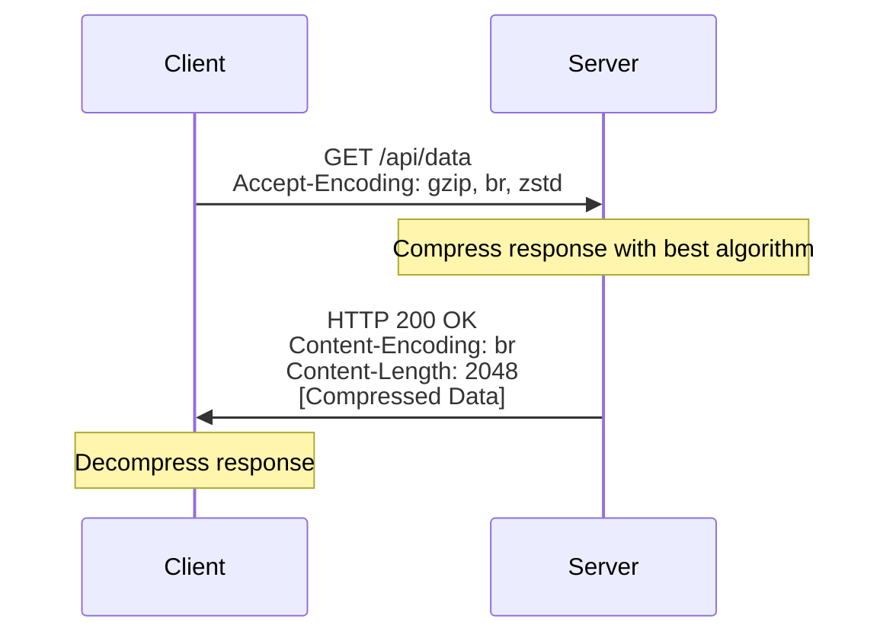

# How to Implement Network Compression

Author: [nawazdhandala](https://www.github.com/nawazdhandala)

Tags: Networking, Compression, Performance, gzip, Brotli, HTTP, Bandwidth Optimization

Description: Learn how to implement network compression to reduce bandwidth usage and improve response times. This guide covers gzip, Brotli, and zstd compression with practical configurations for web servers and applications.

---

Network compression reduces the size of data transmitted between clients and servers. For text-based content like HTML, CSS, JavaScript, and JSON, compression can reduce payload sizes by 70-90%. This translates directly to faster page loads and lower bandwidth costs. This guide shows you how to implement compression effectively.

## How HTTP Compression Works

The client announces supported compression algorithms via the Accept-Encoding header. The server compresses the response and indicates the algorithm used via Content-Encoding:



## Compression Algorithm Comparison

| Algorithm | Compression Ratio | Speed | Browser Support |
|-----------|------------------|-------|-----------------|
| gzip | Good | Fast | Universal |
| Brotli (br) | Better | Slower | Modern browsers |
| zstd | Best | Fastest | Limited (growing) |

## NGINX Compression Configuration

```nginx
# nginx_compression.conf - Comprehensive compression setup

http {
    # Enable gzip compression
    gzip on;

    # Compression level (1-9, higher = more compression, more CPU)
    gzip_comp_level 5;

    # Minimum size to compress (skip tiny files)
    gzip_min_length 256;

    # Compress for all proxied requests
    gzip_proxied any;

    # MIME types to compress
    gzip_types
        text/plain
        text/css
        text/xml
        text/javascript
        application/json
        application/javascript
        application/x-javascript
        application/xml
        application/xml+rss
        application/atom+xml
        image/svg+xml
        font/truetype
        font/opentype
        application/vnd.ms-fontobject;

    # Add Vary header for proper caching
    gzip_vary on;

    # Disable for old IE
    gzip_disable "msie6";

    # Enable Brotli (requires ngx_brotli module)
    brotli on;
    brotli_comp_level 6;
    brotli_min_length 256;
    brotli_types
        text/plain
        text/css
        text/xml
        text/javascript
        application/json
        application/javascript
        application/xml
        image/svg+xml;

    server {
        listen 80;

        # Serve pre-compressed files if available
        location / {
            root /var/www/html;

            # Try .br first, then .gz, then original
            gzip_static on;
            brotli_static on;
        }

        # API responses - dynamic compression
        location /api/ {
            proxy_pass http://backend;

            # Enable compression for proxied responses
            gzip on;
            gzip_proxied any;
        }
    }
}
```

## HAProxy Compression

```haproxy
# haproxy_compression.cfg - HAProxy compression configuration

global
    maxconn 50000

defaults
    mode http
    timeout connect 5s
    timeout client 30s
    timeout server 30s

frontend http_front
    bind *:80

    # Enable compression
    compression algo gzip
    compression type text/html text/plain text/css text/javascript
    compression type application/javascript application/json application/xml

    default_backend http_back

backend http_back
    balance roundrobin

    # Compress responses from backend
    compression algo gzip
    compression type text/html text/plain text/css text/javascript application/json

    # Only compress if backend did not already compress
    compression offload

    server web1 10.0.1.10:8080 check
    server web2 10.0.1.11:8080 check
```

## Application-Level Compression

### Python Flask/FastAPI

```python
# compression_middleware.py - Compression in Python web frameworks
import gzip
import zlib
from io import BytesIO
from flask import Flask, request, Response
from functools import wraps

app = Flask(__name__)

def compress_response(response_data: bytes, encoding: str) -> tuple:
    """Compress response data using specified encoding"""
    if encoding == 'gzip':
        buffer = BytesIO()
        with gzip.GzipFile(fileobj=buffer, mode='wb', compresslevel=6) as f:
            f.write(response_data)
        return buffer.getvalue(), 'gzip'

    elif encoding == 'deflate':
        compressed = zlib.compress(response_data, level=6)
        return compressed, 'deflate'

    return response_data, None

def compression_middleware(min_size: int = 500):
    """Decorator to add compression to Flask routes"""
    def decorator(f):
        @wraps(f)
        def wrapper(*args, **kwargs):
            response = f(*args, **kwargs)

            # Get response data
            if isinstance(response, Response):
                data = response.get_data()
                content_type = response.content_type
            else:
                data = response.encode() if isinstance(response, str) else response
                content_type = 'application/json'

            # Skip small responses
            if len(data) < min_size:
                return response

            # Check Accept-Encoding
            accepted = request.headers.get('Accept-Encoding', '')

            # Choose best encoding
            if 'gzip' in accepted:
                compressed, encoding = compress_response(data, 'gzip')
            elif 'deflate' in accepted:
                compressed, encoding = compress_response(data, 'deflate')
            else:
                return response

            # Create compressed response
            resp = Response(compressed)
            resp.headers['Content-Encoding'] = encoding
            resp.headers['Content-Type'] = content_type
            resp.headers['Vary'] = 'Accept-Encoding'

            return resp
        return wrapper
    return decorator

@app.route('/api/data')
@compression_middleware(min_size=256)
def get_data():
    return {'data': 'Large response data...' * 1000}

# FastAPI with built-in compression
from fastapi import FastAPI
from fastapi.middleware.gzip import GZipMiddleware

app = FastAPI()

# Add gzip middleware
app.add_middleware(GZipMiddleware, minimum_size=500)

@app.get("/api/data")
async def get_data():
    return {"data": "Large response data..." * 1000}
```

### Node.js Express

```javascript
// compression_express.js - Compression middleware for Express
const express = require('express');
const compression = require('compression');
const zlib = require('zlib');

const app = express();

// Basic compression middleware
app.use(compression({
    // Compression level (0-9)
    level: 6,

    // Minimum size to compress (bytes)
    threshold: 256,

    // Filter function to decide what to compress
    filter: (req, res) => {
        // Don't compress if client doesn't support it
        if (req.headers['x-no-compression']) {
            return false;
        }

        // Use default filter (compresses text-based content)
        return compression.filter(req, res);
    },

    // Memory level (1-9)
    memLevel: 8
}));

// Custom Brotli compression for specific routes
const brotliMiddleware = (req, res, next) => {
    const acceptEncoding = req.headers['accept-encoding'] || '';

    if (acceptEncoding.includes('br')) {
        // Store original send
        const originalSend = res.send.bind(res);

        res.send = (body) => {
            if (typeof body === 'string' || Buffer.isBuffer(body)) {
                const input = Buffer.isBuffer(body) ? body : Buffer.from(body);

                if (input.length > 256) {
                    zlib.brotliCompress(input, {
                        params: {
                            [zlib.constants.BROTLI_PARAM_QUALITY]: 6
                        }
                    }, (err, compressed) => {
                        if (err) {
                            return originalSend(body);
                        }

                        res.setHeader('Content-Encoding', 'br');
                        res.setHeader('Vary', 'Accept-Encoding');
                        originalSend(compressed);
                    });
                    return;
                }
            }
            originalSend(body);
        };
    }
    next();
};

app.get('/api/data', brotliMiddleware, (req, res) => {
    res.json({ data: 'Large response data...'.repeat(1000) });
});

app.listen(3000);
```

### Go

```go
// compression_go.go - HTTP compression in Go
package main

import (
    "compress/gzip"
    "io"
    "net/http"
    "strings"
    "sync"

    "github.com/andybalholm/brotli"
)

// Gzip writer pool for reuse
var gzipPool = sync.Pool{
    New: func() interface{} {
        w, _ := gzip.NewWriterLevel(nil, gzip.DefaultCompression)
        return w
    },
}

type compressedResponseWriter struct {
    io.Writer
    http.ResponseWriter
    encoding string
}

func (w compressedResponseWriter) Write(b []byte) (int, error) {
    return w.Writer.Write(b)
}

func compressionMiddleware(next http.Handler) http.Handler {
    return http.HandlerFunc(func(w http.ResponseWriter, r *http.Request) {
        // Check Accept-Encoding
        acceptEncoding := r.Header.Get("Accept-Encoding")

        // Try Brotli first, then gzip
        if strings.Contains(acceptEncoding, "br") {
            w.Header().Set("Content-Encoding", "br")
            w.Header().Set("Vary", "Accept-Encoding")

            bw := brotli.NewWriterLevel(w, brotli.DefaultCompression)
            defer bw.Close()

            crw := compressedResponseWriter{Writer: bw, ResponseWriter: w, encoding: "br"}
            next.ServeHTTP(crw, r)
            return
        }

        if strings.Contains(acceptEncoding, "gzip") {
            w.Header().Set("Content-Encoding", "gzip")
            w.Header().Set("Vary", "Accept-Encoding")

            gz := gzipPool.Get().(*gzip.Writer)
            defer gzipPool.Put(gz)
            gz.Reset(w)
            defer gz.Close()

            crw := compressedResponseWriter{Writer: gz, ResponseWriter: w, encoding: "gzip"}
            next.ServeHTTP(crw, r)
            return
        }

        // No compression
        next.ServeHTTP(w, r)
    })
}

func main() {
    mux := http.NewServeMux()

    mux.HandleFunc("/api/data", func(w http.ResponseWriter, r *http.Request) {
        w.Header().Set("Content-Type", "application/json")
        w.Write([]byte(`{"data": "` + strings.Repeat("Large response data...", 1000) + `"}`))
    })

    // Wrap with compression middleware
    handler := compressionMiddleware(mux)

    http.ListenAndServe(":8080", handler)
}
```

## Pre-Compression for Static Assets

Compress files at build time for maximum efficiency:

```bash
#!/bin/bash
# precompress.sh - Pre-compress static assets

STATIC_DIR="/var/www/html/static"

# Find compressible files
find $STATIC_DIR -type f \( \
    -name "*.html" -o \
    -name "*.css" -o \
    -name "*.js" -o \
    -name "*.json" -o \
    -name "*.xml" -o \
    -name "*.svg" \
\) | while read file; do
    echo "Compressing: $file"

    # Create gzip version
    gzip -9 -k -f "$file"

    # Create Brotli version (requires brotli package)
    brotli -9 -k -f "$file"

    # Create zstd version (requires zstd package)
    zstd -19 -k -f "$file"
done

echo "Compression complete"
ls -la $STATIC_DIR/*.{gz,br,zst} 2>/dev/null | head -20
```

Webpack configuration for pre-compression:

```javascript
// webpack.config.js - Pre-compress assets during build
const CompressionPlugin = require('compression-webpack-plugin');
const zlib = require('zlib');

module.exports = {
    // ... other config

    plugins: [
        // Gzip compression
        new CompressionPlugin({
            filename: '[path][base].gz',
            algorithm: 'gzip',
            test: /\.(js|css|html|svg|json)$/,
            threshold: 256,
            minRatio: 0.8
        }),

        // Brotli compression
        new CompressionPlugin({
            filename: '[path][base].br',
            algorithm: 'brotliCompress',
            test: /\.(js|css|html|svg|json)$/,
            compressionOptions: {
                params: {
                    [zlib.constants.BROTLI_PARAM_QUALITY]: 11
                }
            },
            threshold: 256,
            minRatio: 0.8
        })
    ]
};
```

## Conditional Compression

Not everything should be compressed:

```python
# conditional_compression.py - Smart compression decisions
from typing import Optional

def should_compress(
    content_type: str,
    content_length: int,
    already_compressed: bool
) -> bool:
    """Determine if response should be compressed"""

    # Skip if already compressed
    if already_compressed:
        return False

    # Skip small responses (compression overhead not worth it)
    if content_length < 256:
        return False

    # Skip already-compressed formats
    compressed_types = {
        'image/jpeg', 'image/png', 'image/gif', 'image/webp',
        'video/mp4', 'video/webm',
        'audio/mpeg', 'audio/ogg',
        'application/zip', 'application/gzip',
        'application/pdf'
    }

    if content_type in compressed_types:
        return False

    # Compress text-based content
    compressible_types = {
        'text/html', 'text/plain', 'text/css', 'text/xml',
        'text/javascript', 'application/javascript',
        'application/json', 'application/xml',
        'image/svg+xml', 'application/xhtml+xml'
    }

    # Check exact match or prefix match
    for ct in compressible_types:
        if content_type.startswith(ct):
            return True

    return False
```

## Measuring Compression Effectiveness

```bash
#!/bin/bash
# measure_compression.sh - Measure compression ratios

URL="https://example.com/api/data"

echo "Testing compression for: $URL"
echo ""

# No compression
echo "=== No Compression ==="
SIZE_NONE=$(curl -s -o /dev/null -w '%{size_download}' \
    -H "Accept-Encoding: identity" "$URL")
echo "Size: $SIZE_NONE bytes"

# Gzip
echo ""
echo "=== Gzip Compression ==="
SIZE_GZIP=$(curl -s -o /dev/null -w '%{size_download}' \
    -H "Accept-Encoding: gzip" "$URL")
RATIO_GZIP=$(echo "scale=2; $SIZE_GZIP * 100 / $SIZE_NONE" | bc)
echo "Size: $SIZE_GZIP bytes ($RATIO_GZIP% of original)"

# Brotli
echo ""
echo "=== Brotli Compression ==="
SIZE_BR=$(curl -s -o /dev/null -w '%{size_download}' \
    -H "Accept-Encoding: br" "$URL")
RATIO_BR=$(echo "scale=2; $SIZE_BR * 100 / $SIZE_NONE" | bc)
echo "Size: $SIZE_BR bytes ($RATIO_BR% of original)"

# Summary
echo ""
echo "=== Summary ==="
echo "Original:  $SIZE_NONE bytes"
echo "Gzip:      $SIZE_GZIP bytes ($(echo "scale=0; 100 - $RATIO_GZIP" | bc)% reduction)"
echo "Brotli:    $SIZE_BR bytes ($(echo "scale=0; 100 - $RATIO_BR" | bc)% reduction)"
```

## Monitoring Compression Metrics

```python
# compression_metrics.py - Track compression effectiveness
from prometheus_client import Counter, Histogram, Gauge

# Bytes saved by compression
compression_bytes_saved = Counter(
    'http_compression_bytes_saved_total',
    'Total bytes saved by compression',
    ['algorithm']
)

# Compression ratio distribution
compression_ratio = Histogram(
    'http_compression_ratio',
    'Compression ratio (compressed/original)',
    ['algorithm', 'content_type'],
    buckets=[0.1, 0.2, 0.3, 0.4, 0.5, 0.6, 0.7, 0.8, 0.9, 1.0]
)

# Compression time
compression_duration = Histogram(
    'http_compression_duration_seconds',
    'Time spent compressing responses',
    ['algorithm'],
    buckets=[0.001, 0.005, 0.01, 0.025, 0.05, 0.1, 0.25]
)
```

## Best Practices

1. **Compress text, skip binary** - Text compresses well. Images, videos, and already-compressed files do not benefit.

2. **Use appropriate compression levels** - Higher levels use more CPU. Level 5-6 is usually the sweet spot.

3. **Pre-compress static assets** - Compress once at build time, serve many times without CPU overhead.

4. **Set minimum size threshold** - Compressing tiny responses adds overhead without benefit.

5. **Use Brotli for modern browsers** - Brotli achieves 15-25% better compression than gzip for web content.

6. **Always set Vary header** - Include `Vary: Accept-Encoding` for proper caching behavior.

7. **Monitor CPU usage** - Dynamic compression uses CPU. Watch for bottlenecks under high load.

## Conclusion

Network compression significantly reduces bandwidth usage and improves load times for text-based content. Configure compression at your web server or load balancer for broad coverage, pre-compress static assets for efficiency, and implement application-level compression for dynamic content. Monitor compression ratios and CPU usage to find the right balance between compression effectiveness and server performance.
