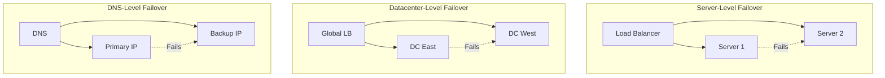

# How to Implement Network Failover

Author: [nawazdhandala](https://www.github.com/nawazdhandala)

Tags: Networking, High Availability, Failover, Disaster Recovery, DNS, Load Balancing, Resilience

Description: Learn how to implement network failover to ensure service continuity during outages. This guide covers DNS failover, load balancer failover, and multi-region deployment strategies with practical examples.

---

Network failover automatically redirects traffic from failed components to healthy backups. Without failover, a single server failure can take down your entire service. This guide shows you how to implement failover at multiple levels of your infrastructure for maximum resilience.

## Failover Strategies

Different levels of failover protection:



## HAProxy Failover Configuration

Configure HAProxy for automatic server failover:

```haproxy
# /etc/haproxy/haproxy.cfg - Server failover configuration

global
    maxconn 50000
    stats socket /var/run/haproxy.sock mode 600 level admin

defaults
    mode http
    timeout connect 5s
    timeout client 30s
    timeout server 30s

    # Retry failed requests on another server
    option redispatch
    retries 3

frontend http_front
    bind *:80
    default_backend http_back

backend http_back
    balance roundrobin

    # Health check configuration
    option httpchk GET /health
    http-check expect status 200

    # Primary servers
    server web1 10.0.1.10:8080 check inter 2s fall 3 rise 2 weight 100
    server web2 10.0.1.11:8080 check inter 2s fall 3 rise 2 weight 100

    # Backup servers (only used when all primary servers are down)
    server web3 10.0.2.10:8080 check inter 2s fall 3 rise 2 backup
    server web4 10.0.2.11:8080 check inter 2s fall 3 rise 2 backup

backend http_back_with_priorities
    balance roundrobin
    option httpchk GET /health

    # Weighted failover - higher priority servers preferred
    # If weight-100 servers fail, traffic goes to weight-50, then weight-10
    server primary1 10.0.1.10:8080 check weight 100
    server primary2 10.0.1.11:8080 check weight 100
    server secondary1 10.0.2.10:8080 check weight 50
    server secondary2 10.0.2.11:8080 check weight 50
    server tertiary1 10.0.3.10:8080 check weight 10 backup
```

## DNS Failover with Health Checks

Implement DNS-based failover using Route 53:

```python
# dns_failover.py - AWS Route 53 DNS failover configuration
import boto3

route53 = boto3.client('route53')
hosted_zone_id = 'Z1234567890ABC'

def create_failover_configuration():
    """Create primary/secondary DNS failover"""

    # Create health check for primary
    primary_health_check = route53.create_health_check(
        CallerReference='primary-health-check',
        HealthCheckConfig={
            'IPAddress': '54.1.2.3',
            'Port': 443,
            'Type': 'HTTPS',
            'ResourcePath': '/health',
            'RequestInterval': 10,
            'FailureThreshold': 3,
            'EnableSNI': True
        }
    )

    primary_hc_id = primary_health_check['HealthCheck']['Id']

    # Create health check for secondary
    secondary_health_check = route53.create_health_check(
        CallerReference='secondary-health-check',
        HealthCheckConfig={
            'IPAddress': '54.4.5.6',
            'Port': 443,
            'Type': 'HTTPS',
            'ResourcePath': '/health',
            'RequestInterval': 10,
            'FailureThreshold': 3,
            'EnableSNI': True
        }
    )

    secondary_hc_id = secondary_health_check['HealthCheck']['Id']

    # Create failover DNS records
    route53.change_resource_record_sets(
        HostedZoneId=hosted_zone_id,
        ChangeBatch={
            'Changes': [
                # Primary record
                {
                    'Action': 'UPSERT',
                    'ResourceRecordSet': {
                        'Name': 'api.example.com',
                        'Type': 'A',
                        'SetIdentifier': 'primary',
                        'Failover': 'PRIMARY',
                        'TTL': 60,
                        'ResourceRecords': [{'Value': '54.1.2.3'}],
                        'HealthCheckId': primary_hc_id
                    }
                },
                # Secondary record
                {
                    'Action': 'UPSERT',
                    'ResourceRecordSet': {
                        'Name': 'api.example.com',
                        'Type': 'A',
                        'SetIdentifier': 'secondary',
                        'Failover': 'SECONDARY',
                        'TTL': 60,
                        'ResourceRecords': [{'Value': '54.4.5.6'}],
                        'HealthCheckId': secondary_hc_id
                    }
                }
            ]
        }
    )

    print("Failover DNS configuration created")

def create_multivalue_failover():
    """Create multi-value DNS with health checks (returns all healthy IPs)"""

    endpoints = [
        ('us-east-1', '54.1.2.3'),
        ('us-west-2', '54.4.5.6'),
        ('eu-west-1', '54.7.8.9'),
    ]

    changes = []

    for region, ip in endpoints:
        # Create health check
        hc_response = route53.create_health_check(
            CallerReference=f'hc-{region}',
            HealthCheckConfig={
                'IPAddress': ip,
                'Port': 443,
                'Type': 'HTTPS',
                'ResourcePath': '/health',
                'RequestInterval': 10,
                'FailureThreshold': 2
            }
        )

        hc_id = hc_response['HealthCheck']['Id']

        # Create DNS record
        changes.append({
            'Action': 'UPSERT',
            'ResourceRecordSet': {
                'Name': 'api.example.com',
                'Type': 'A',
                'SetIdentifier': region,
                'MultiValueAnswer': True,
                'TTL': 60,
                'ResourceRecords': [{'Value': ip}],
                'HealthCheckId': hc_id
            }
        })

    route53.change_resource_record_sets(
        HostedZoneId=hosted_zone_id,
        ChangeBatch={'Changes': changes}
    )

create_failover_configuration()
```

## Keepalived for IP Failover

Use Keepalived for floating IP failover between servers:

```bash
# /etc/keepalived/keepalived.conf - Primary server

global_defs {
    router_id LB_PRIMARY
    script_user root
    enable_script_security
}

# Health check script
vrrp_script check_haproxy {
    script "/usr/bin/pgrep haproxy"
    interval 2
    weight 2
    fall 3
    rise 2
}

vrrp_instance VI_1 {
    state MASTER
    interface eth0
    virtual_router_id 51
    priority 100                    # Higher priority = master
    advert_int 1                    # Advertisement interval

    # Authentication
    authentication {
        auth_type PASS
        auth_pass secret123
    }

    # Virtual IP (floating IP)
    virtual_ipaddress {
        192.168.1.100/24
    }

    # Track health check
    track_script {
        check_haproxy
    }

    # Notification scripts
    notify_master "/etc/keepalived/notify.sh master"
    notify_backup "/etc/keepalived/notify.sh backup"
    notify_fault "/etc/keepalived/notify.sh fault"
}
```

```bash
# /etc/keepalived/keepalived.conf - Secondary server

global_defs {
    router_id LB_SECONDARY
    script_user root
    enable_script_security
}

vrrp_script check_haproxy {
    script "/usr/bin/pgrep haproxy"
    interval 2
    weight 2
    fall 3
    rise 2
}

vrrp_instance VI_1 {
    state BACKUP
    interface eth0
    virtual_router_id 51
    priority 90                     # Lower priority = backup
    advert_int 1

    authentication {
        auth_type PASS
        auth_pass secret123
    }

    virtual_ipaddress {
        192.168.1.100/24
    }

    track_script {
        check_haproxy
    }

    notify_master "/etc/keepalived/notify.sh master"
    notify_backup "/etc/keepalived/notify.sh backup"
    notify_fault "/etc/keepalived/notify.sh fault"
}
```

Notification script:

```bash
#!/bin/bash
# /etc/keepalived/notify.sh

STATE=$1
TIMESTAMP=$(date '+%Y-%m-%d %H:%M:%S')

case $STATE in
    master)
        echo "$TIMESTAMP: Becoming MASTER" >> /var/log/keepalived-state.log
        # Start accepting traffic
        systemctl start haproxy
        ;;
    backup)
        echo "$TIMESTAMP: Becoming BACKUP" >> /var/log/keepalived-state.log
        ;;
    fault)
        echo "$TIMESTAMP: Entering FAULT state" >> /var/log/keepalived-state.log
        # Alert on-call
        curl -X POST "https://alerts.example.com/webhook" \
            -d '{"message": "Keepalived entered FAULT state"}'
        ;;
esac
```

## Multi-Region Failover

Implement cross-region failover:

```python
# multi_region_failover.py - Multi-region failover controller
import boto3
import time
from dataclasses import dataclass
from typing import List, Optional
import requests

@dataclass
class Region:
    name: str
    endpoint: str
    health_url: str
    priority: int
    healthy: bool = True

class MultiRegionFailover:
    def __init__(self, regions: List[Region]):
        self.regions = sorted(regions, key=lambda r: r.priority)
        self.active_region: Optional[Region] = None
        self.route53 = boto3.client('route53')
        self.hosted_zone_id = 'Z1234567890ABC'
        self.domain = 'api.example.com'

    def check_health(self, region: Region) -> bool:
        """Check if a region is healthy"""
        try:
            response = requests.get(
                region.health_url,
                timeout=5,
                headers={'Host': self.domain}
            )
            return response.status_code == 200
        except requests.RequestException:
            return False

    def update_dns(self, region: Region):
        """Update DNS to point to the specified region"""
        self.route53.change_resource_record_sets(
            HostedZoneId=self.hosted_zone_id,
            ChangeBatch={
                'Changes': [{
                    'Action': 'UPSERT',
                    'ResourceRecordSet': {
                        'Name': self.domain,
                        'Type': 'A',
                        'TTL': 60,
                        'ResourceRecords': [{'Value': region.endpoint}]
                    }
                }]
            }
        )
        print(f"DNS updated to {region.name} ({region.endpoint})")

    def failover(self):
        """Check health and failover if needed"""
        # Check health of all regions
        for region in self.regions:
            region.healthy = self.check_health(region)
            status = "healthy" if region.healthy else "unhealthy"
            print(f"Region {region.name}: {status}")

        # Find highest priority healthy region
        healthy_regions = [r for r in self.regions if r.healthy]

        if not healthy_regions:
            print("ERROR: All regions unhealthy!")
            return

        best_region = healthy_regions[0]

        # Failover if needed
        if self.active_region != best_region:
            print(f"Failing over from {self.active_region.name if self.active_region else 'None'} to {best_region.name}")
            self.update_dns(best_region)
            self.active_region = best_region

    def run(self, interval: int = 30):
        """Continuous failover monitoring"""
        print("Starting multi-region failover monitor")

        while True:
            self.failover()
            time.sleep(interval)

# Example usage
regions = [
    Region('us-east-1', '54.1.2.3', 'https://us-east-1.api.example.com/health', priority=1),
    Region('us-west-2', '54.4.5.6', 'https://us-west-2.api.example.com/health', priority=2),
    Region('eu-west-1', '54.7.8.9', 'https://eu-west-1.api.example.com/health', priority=3),
]

failover = MultiRegionFailover(regions)
failover.run()
```

## Database Failover

PostgreSQL automatic failover with Patroni:

```yaml
# patroni.yml - PostgreSQL high availability with Patroni
scope: postgres-cluster
name: pg-node-1

restapi:
  listen: 0.0.0.0:8008
  connect_address: 10.0.1.10:8008

etcd:
  hosts:
    - 10.0.0.10:2379
    - 10.0.0.11:2379
    - 10.0.0.12:2379

bootstrap:
  dcs:
    ttl: 30
    loop_wait: 10
    retry_timeout: 10
    maximum_lag_on_failover: 1048576
    postgresql:
      use_pg_rewind: true
      parameters:
        wal_level: replica
        hot_standby: "on"
        max_wal_senders: 10
        max_replication_slots: 10
        wal_keep_segments: 8

  initdb:
    - encoding: UTF8
    - data-checksums

postgresql:
  listen: 0.0.0.0:5432
  connect_address: 10.0.1.10:5432
  data_dir: /var/lib/postgresql/data
  bin_dir: /usr/lib/postgresql/15/bin

  authentication:
    replication:
      username: replicator
      password: replpass
    superuser:
      username: postgres
      password: secretpassword

  parameters:
    unix_socket_directories: '/var/run/postgresql'

tags:
  nofailover: false
  noloadbalance: false
  clonefrom: false
```

## Application-Level Failover

Implement failover in your application code:

```python
# app_failover.py - Application-level failover client
import time
from typing import List, Optional, Callable, TypeVar
from dataclasses import dataclass
import requests

T = TypeVar('T')

@dataclass
class Endpoint:
    url: str
    priority: int
    healthy: bool = True
    last_check: float = 0
    consecutive_failures: int = 0

class FailoverClient:
    def __init__(
        self,
        endpoints: List[str],
        health_check_interval: float = 30,
        failure_threshold: int = 3
    ):
        self.endpoints = [
            Endpoint(url=url, priority=i)
            for i, url in enumerate(endpoints)
        ]
        self.health_check_interval = health_check_interval
        self.failure_threshold = failure_threshold
        self._current_endpoint: Optional[Endpoint] = None

    def _check_endpoint_health(self, endpoint: Endpoint) -> bool:
        """Check if an endpoint is healthy"""
        try:
            response = requests.get(
                f"{endpoint.url}/health",
                timeout=5
            )
            return response.status_code == 200
        except requests.RequestException:
            return False

    def _get_healthy_endpoint(self) -> Optional[Endpoint]:
        """Get the highest priority healthy endpoint"""
        now = time.time()

        for endpoint in sorted(self.endpoints, key=lambda e: e.priority):
            # Check health if needed
            if now - endpoint.last_check > self.health_check_interval:
                endpoint.healthy = self._check_endpoint_health(endpoint)
                endpoint.last_check = now

                if endpoint.healthy:
                    endpoint.consecutive_failures = 0

            if endpoint.healthy:
                return endpoint

        return None

    def _mark_failure(self, endpoint: Endpoint):
        """Mark an endpoint as having failed"""
        endpoint.consecutive_failures += 1
        if endpoint.consecutive_failures >= self.failure_threshold:
            endpoint.healthy = False
            print(f"Endpoint {endpoint.url} marked unhealthy after {self.failure_threshold} failures")

    def request(
        self,
        method: str,
        path: str,
        **kwargs
    ) -> requests.Response:
        """Make request with automatic failover"""
        max_attempts = len(self.endpoints)

        for attempt in range(max_attempts):
            endpoint = self._get_healthy_endpoint()

            if not endpoint:
                raise Exception("No healthy endpoints available")

            try:
                url = f"{endpoint.url}{path}"
                response = requests.request(method, url, timeout=10, **kwargs)

                # Check for server errors (might indicate unhealthy endpoint)
                if response.status_code >= 500:
                    self._mark_failure(endpoint)
                    continue

                return response

            except requests.RequestException as e:
                self._mark_failure(endpoint)
                print(f"Request to {endpoint.url} failed: {e}")
                continue

        raise Exception("All endpoints failed")

    def get(self, path: str, **kwargs) -> requests.Response:
        return self.request('GET', path, **kwargs)

    def post(self, path: str, **kwargs) -> requests.Response:
        return self.request('POST', path, **kwargs)

# Usage
client = FailoverClient([
    'https://primary.example.com',
    'https://secondary.example.com',
    'https://tertiary.example.com'
])

response = client.get('/api/data')
```

## Testing Failover

Verify your failover works correctly:

```bash
#!/bin/bash
# test_failover.sh - Test failover scenarios

echo "=== Failover Test Suite ==="

# Test 1: Primary healthy
echo ""
echo "Test 1: Primary healthy - should use primary"
curl -s https://api.example.com/health
dig +short api.example.com

# Test 2: Simulate primary failure
echo ""
echo "Test 2: Simulating primary failure..."
# Stop primary server or block health check
ssh primary-server "sudo systemctl stop haproxy"

echo "Waiting for failover (60s)..."
sleep 60

echo "Checking DNS and health:"
dig +short api.example.com
curl -s https://api.example.com/health

# Test 3: Restore primary
echo ""
echo "Test 3: Restoring primary..."
ssh primary-server "sudo systemctl start haproxy"

echo "Waiting for failback (60s)..."
sleep 60

echo "Checking DNS and health:"
dig +short api.example.com
curl -s https://api.example.com/health

echo ""
echo "=== Failover tests complete ==="
```

## Monitoring Failover Events

```python
# failover_metrics.py - Track failover events
from prometheus_client import Counter, Gauge, Histogram

# Failover events
failover_events = Counter(
    'failover_events_total',
    'Total failover events',
    ['from_endpoint', 'to_endpoint', 'reason']
)

# Current active endpoint
active_endpoint = Gauge(
    'active_endpoint_info',
    'Currently active endpoint',
    ['endpoint', 'region']
)

# Failover duration
failover_duration = Histogram(
    'failover_duration_seconds',
    'Time taken to complete failover',
    buckets=[1, 5, 10, 30, 60, 120, 300]
)

# Endpoint health
endpoint_health = Gauge(
    'endpoint_health',
    'Endpoint health status (1=healthy, 0=unhealthy)',
    ['endpoint']
)
```

## Best Practices

1. **Test failover regularly** - Schedule monthly failover drills. Untested failover is unreliable failover.

2. **Use multiple failover layers** - Combine DNS, load balancer, and application failover for defense in depth.

3. **Set appropriate health check intervals** - Too frequent wastes resources, too infrequent delays failover.

4. **Consider failback strategy** - Decide whether to automatically fail back to primary or require manual intervention.

5. **Monitor failover events** - Alert on failovers to investigate root cause.

6. **Keep DNS TTLs low** - Short TTLs enable faster DNS-based failover.

7. **Document runbooks** - Create clear procedures for manual failover when automation fails.

8. **Test data consistency** - Ensure failover does not cause data loss or inconsistency.

## Conclusion

Network failover is critical for maintaining service availability. Implement failover at multiple levels: load balancer failover for server failures, DNS failover for datacenter failures, and application-level failover for fine-grained control. Test your failover regularly, monitor failover events, and maintain clear runbooks for when automated failover is not enough. The goal is ensuring your users experience continuous service regardless of infrastructure failures.
