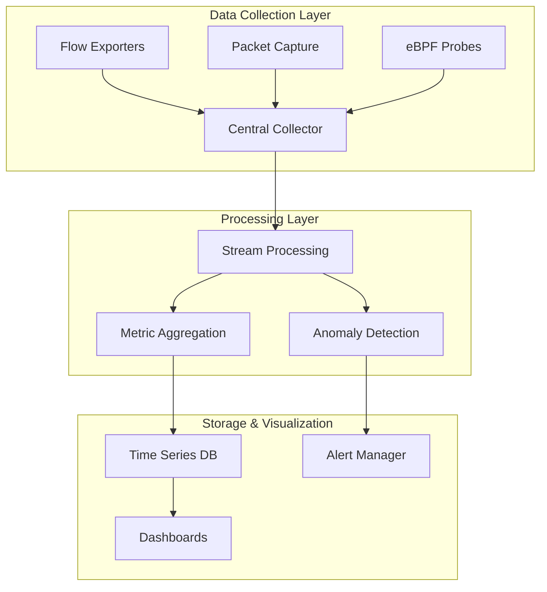

# How to Implement Network Observability

Author: [nawazdhandala](https://www.github.com/nawazdhandala)

Tags: Networking, Observability, Monitoring, OpenTelemetry, eBPF, Traffic Analysis, Infrastructure

Description: A practical guide to implementing network observability in your infrastructure. Learn how to capture, analyze, and visualize network traffic patterns to identify bottlenecks and troubleshoot issues faster.

---

Network observability goes beyond traditional monitoring by providing deep insights into how data flows through your infrastructure. While monitoring tells you if something is up or down, observability answers the "why" questions when things go wrong. This guide walks through practical implementations you can deploy today.

## Why Network Observability Matters

Traditional network monitoring focuses on availability checks and basic metrics like bandwidth utilization. Network observability extends this by capturing the context needed to understand complex issues:

- Which services communicate with each other
- How latency changes across different network paths
- Where packet loss occurs and under what conditions
- How traffic patterns shift during incidents

## Core Components of Network Observability

A complete network observability stack typically includes three layers:



## Implementing Flow Collection with NetFlow

NetFlow (or IPFIX/sFlow) provides aggregate statistics about network conversations. Here is how to configure a Linux server as a flow collector using softflowd and nfdump:

```bash
# Install softflowd for flow export and nfdump for collection
sudo apt-get update
sudo apt-get install softflowd nfdump

# Start softflowd on your main interface to export flows
# The -n flag specifies the collector address and port
sudo softflowd -i eth0 -n 127.0.0.1:9995 -v 9

# Create a directory for flow data storage
sudo mkdir -p /var/cache/nfdump/flows

# Start nfcapd to collect and store flows
# Flows are rotated every 5 minutes for analysis
sudo nfcapd -w -D -l /var/cache/nfdump/flows -p 9995
```

Query collected flows to identify top talkers:

```bash
# Show top 10 source IPs by traffic volume in the last hour
nfdump -R /var/cache/nfdump/flows -s srcip -n 10

# Find all connections to a specific destination port
nfdump -R /var/cache/nfdump/flows 'dst port 443' -o extended

# Identify connections with unusual packet counts (potential scans)
nfdump -R /var/cache/nfdump/flows -s srcip 'packets < 3' -n 20
```

## Packet-Level Visibility with tcpdump and tshark

For deeper analysis, packet capture provides the detail needed to troubleshoot specific issues:

```bash
# Capture packets with connection timing information
# The -ttt flag shows delta time between packets
sudo tcpdump -i eth0 -ttt -nn 'tcp port 80' -c 100

# Capture to file for later analysis (rotate files at 100MB)
sudo tcpdump -i eth0 -w /tmp/capture.pcap -C 100 -W 5

# Use tshark for extracting specific fields
# This extracts HTTP response times for performance analysis
tshark -r /tmp/capture.pcap -T fields \
    -e ip.src -e ip.dst -e http.time \
    -Y "http.response"
```

## Modern Approach with eBPF

eBPF (extended Berkeley Packet Filter) allows you to run sandboxed programs in the Linux kernel without modifying kernel source code. This enables powerful network observability with minimal overhead:

```python
#!/usr/bin/env python3
# tcp_latency.py - Measure TCP connection latency using BCC/eBPF
# Requires: pip install bcc

from bcc import BPF
from time import strftime

# eBPF program that traces TCP connection establishment
bpf_program = """
#include <uapi/linux/ptrace.h>
#include <net/sock.h>
#include <bcc/proto.h>

// Structure to hold connection timing data
struct conn_info {
    u64 ts;
    u32 pid;
    u32 saddr;
    u32 daddr;
    u16 dport;
};

// Hash map to track connection start times
BPF_HASH(start, struct sock *, struct conn_info);

// Perf buffer for sending events to userspace
BPF_PERF_OUTPUT(events);

// Trace when TCP connect is initiated
int trace_connect(struct pt_regs *ctx, struct sock *sk) {
    struct conn_info info = {};
    info.ts = bpf_ktime_get_ns();
    info.pid = bpf_get_current_pid_tgid() >> 32;

    // Store start time keyed by socket pointer
    start.update(&sk, &info);
    return 0;
}

// Trace when TCP connection is established
int trace_connect_return(struct pt_regs *ctx) {
    struct sock *sk = (struct sock *)PT_REGS_PARM1(ctx);
    struct conn_info *infop = start.lookup(&sk);

    if (infop == 0) {
        return 0;
    }

    // Calculate connection latency
    u64 latency = bpf_ktime_get_ns() - infop->ts;

    // Send event to userspace via perf buffer
    events.perf_submit(ctx, infop, sizeof(*infop));

    start.delete(&sk);
    return 0;
}
"""

# Load and attach the eBPF program
b = BPF(text=bpf_program)
b.attach_kprobe(event="tcp_v4_connect", fn_name="trace_connect")
b.attach_kretprobe(event="tcp_v4_connect", fn_name="trace_connect_return")

# Process events from the kernel
def print_event(cpu, data, size):
    event = b["events"].event(data)
    print(f"{strftime('%H:%M:%S')} PID={event.pid} latency event captured")

b["events"].open_perf_buffer(print_event)

print("Tracing TCP connections... Ctrl+C to exit")
while True:
    b.perf_buffer_poll()
```

## Exporting Metrics to Prometheus

Integrate network metrics into your existing observability stack:

```yaml
# prometheus.yml - Scrape configuration for network metrics
global:
  scrape_interval: 15s

scrape_configs:
  # Scrape node exporter for basic network stats
  - job_name: 'node'
    static_configs:
      - targets: ['localhost:9100']

  # Scrape custom network metrics exporter
  - job_name: 'network-observability'
    static_configs:
      - targets: ['localhost:9101']
    metrics_path: /metrics
    scrape_timeout: 10s
```

Create a simple exporter for custom network metrics:

```python
# network_exporter.py - Export custom network metrics to Prometheus
from prometheus_client import start_http_server, Gauge, Counter
import subprocess
import time

# Define metrics
tcp_connections = Gauge(
    'tcp_connections_total',
    'Total TCP connections by state',
    ['state']
)

packets_dropped = Counter(
    'network_packets_dropped_total',
    'Total dropped packets by interface',
    ['interface']
)

retransmits = Counter(
    'tcp_retransmits_total',
    'Total TCP retransmissions'
)

def collect_tcp_states():
    """Parse /proc/net/tcp to count connection states"""
    states = {
        '01': 'ESTABLISHED', '02': 'SYN_SENT', '03': 'SYN_RECV',
        '04': 'FIN_WAIT1', '05': 'FIN_WAIT2', '06': 'TIME_WAIT',
        '07': 'CLOSE', '08': 'CLOSE_WAIT', '09': 'LAST_ACK',
        '0A': 'LISTEN', '0B': 'CLOSING'
    }

    counts = {v: 0 for v in states.values()}

    with open('/proc/net/tcp', 'r') as f:
        next(f)  # Skip header
        for line in f:
            parts = line.split()
            state_code = parts[3].upper()
            if state_code in states:
                counts[states[state_code]] += 1

    for state, count in counts.items():
        tcp_connections.labels(state=state).set(count)

def collect_interface_stats():
    """Read interface statistics from /proc/net/dev"""
    with open('/proc/net/dev', 'r') as f:
        lines = f.readlines()[2:]  # Skip headers
        for line in lines:
            parts = line.split()
            interface = parts[0].rstrip(':')
            # Column 4 is drop count for receive
            drops = int(parts[4])
            packets_dropped.labels(interface=interface).inc(drops)

if __name__ == '__main__':
    # Start metrics server on port 9101
    start_http_server(9101)

    while True:
        collect_tcp_states()
        collect_interface_stats()
        time.sleep(15)
```

## Building Network Topology Maps

Understanding service dependencies helps during incident response:

```python
# topology_builder.py - Build network topology from flow data
import json
from collections import defaultdict

class NetworkTopology:
    def __init__(self):
        # Store edges as source -> set of destinations
        self.edges = defaultdict(set)
        # Store traffic volumes for edge weights
        self.volumes = defaultdict(int)

    def add_flow(self, src_ip, dst_ip, bytes_count):
        """Record a network flow between two endpoints"""
        self.edges[src_ip].add(dst_ip)
        edge_key = f"{src_ip}->{dst_ip}"
        self.volumes[edge_key] += bytes_count

    def export_for_visualization(self):
        """Export topology in format suitable for D3.js or Grafana"""
        nodes = set()
        links = []

        for src, destinations in self.edges.items():
            nodes.add(src)
            for dst in destinations:
                nodes.add(dst)
                edge_key = f"{src}->{dst}"
                links.append({
                    'source': src,
                    'target': dst,
                    'weight': self.volumes[edge_key]
                })

        return {
            'nodes': [{'id': n} for n in nodes],
            'links': links
        }

# Example usage with flow data
topology = NetworkTopology()
topology.add_flow('10.0.1.5', '10.0.2.10', 1024000)
topology.add_flow('10.0.1.5', '10.0.3.15', 512000)
topology.add_flow('10.0.2.10', '10.0.3.15', 256000)

print(json.dumps(topology.export_for_visualization(), indent=2))
```

## Alerting on Network Anomalies

Set up alerts for unusual network patterns:

```yaml
# alerting_rules.yml - Prometheus alerting rules for network issues
groups:
  - name: network_alerts
    rules:
      # Alert when connection establishment rate spikes
      - alert: HighConnectionRate
        expr: rate(tcp_connections_total{state="SYN_RECV"}[5m]) > 1000
        for: 2m
        labels:
          severity: warning
        annotations:
          summary: "High rate of incoming connections"
          description: "Connection rate is {{ $value }}/s on {{ $labels.instance }}"

      # Alert on packet drops indicating congestion
      - alert: PacketDropsDetected
        expr: rate(network_packets_dropped_total[5m]) > 10
        for: 5m
        labels:
          severity: critical
        annotations:
          summary: "Network packet drops detected"
          description: "Interface {{ $labels.interface }} dropping packets"

      # Alert on high retransmission rate
      - alert: HighRetransmissionRate
        expr: rate(tcp_retransmits_total[5m]) / rate(tcp_segments_sent_total[5m]) > 0.05
        for: 5m
        labels:
          severity: warning
        annotations:
          summary: "TCP retransmission rate above 5%"
```

## Best Practices

1. **Sample intelligently** - You do not need to capture every packet. Use sampling at high-traffic points and full capture only when investigating issues.

2. **Correlate with application data** - Network metrics become more valuable when combined with application traces. Use OpenTelemetry to propagate trace context.

3. **Automate baseline detection** - Static thresholds break as traffic patterns change. Use statistical methods to detect deviations from normal behavior.

4. **Retain data strategically** - Keep high-resolution data for hours, aggregated data for days, and summary statistics for months.

5. **Test your observability** - Inject network faults (latency, drops) in staging to verify your tooling catches the issues.

## Conclusion

Network observability transforms troubleshooting from guesswork into a systematic process. Start with flow collection for broad visibility, add packet capture for deep dives, and consider eBPF for production-safe kernel-level insights. The investment pays off in faster incident resolution and proactive capacity planning.
