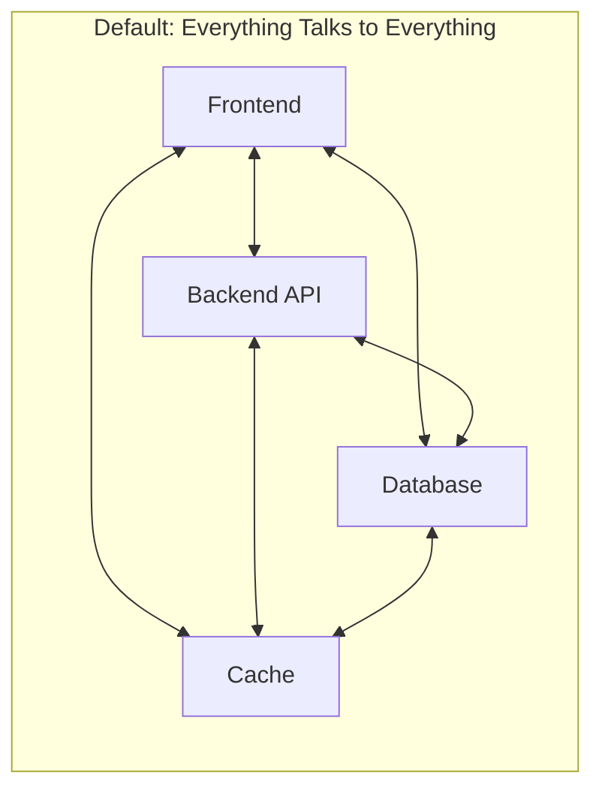
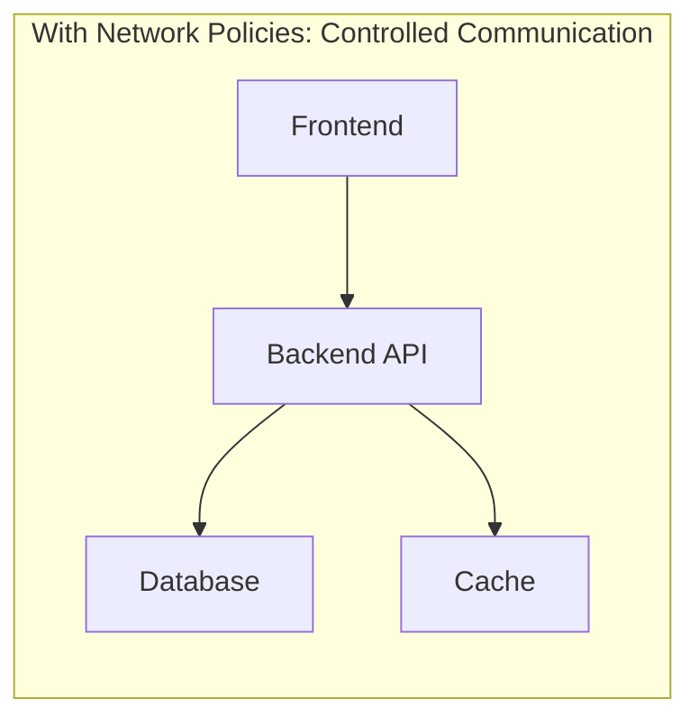

# How to Configure Network Policies for Security

Author: [nawazdhandala](https://www.github.com/nawazdhandala)

Tags: Networking, Security, Kubernetes, Network Policies, Zero Trust, Firewall, Microsegmentation

Description: Learn how to implement network policies to secure your infrastructure. This guide covers Kubernetes NetworkPolicies, iptables rules, and cloud security groups with practical examples.

---

Network policies define which traffic is allowed between services in your infrastructure. Without them, any compromised service can communicate with any other service, turning a small breach into a complete takeover. This guide shows you how to implement network policies at different layers of your stack.

## The Default Problem

By default, most systems allow all network traffic. In Kubernetes, any pod can talk to any other pod. In cloud environments, instances in the same VPC can communicate freely. This "allow all" default makes initial setup easy but creates security risks.





## Kubernetes NetworkPolicies

Kubernetes NetworkPolicies control pod-to-pod communication. They require a CNI plugin that supports policies (Calico, Cilium, Weave Net).

### Default Deny All Ingress

Start by denying all ingress traffic, then explicitly allow what is needed:

```yaml
# default-deny-ingress.yaml
# Apply this to each namespace to establish zero-trust baseline
apiVersion: networking.k8s.io/v1
kind: NetworkPolicy
metadata:
  name: default-deny-ingress
  namespace: production
spec:
  podSelector: {}  # Empty selector matches all pods
  policyTypes:
    - Ingress
  # No ingress rules means all ingress is denied
```

### Allow Specific Service Communication

Now allow the frontend to talk to the API:

```yaml
# allow-frontend-to-api.yaml
apiVersion: networking.k8s.io/v1
kind: NetworkPolicy
metadata:
  name: allow-frontend-to-api
  namespace: production
spec:
  podSelector:
    matchLabels:
      app: api-server
  policyTypes:
    - Ingress
  ingress:
    - from:
        - podSelector:
            matchLabels:
              app: frontend
      ports:
        - protocol: TCP
          port: 8080
```

### Database Access Policy

Restrict database access to only the API pods:

```yaml
# database-access-policy.yaml
apiVersion: networking.k8s.io/v1
kind: NetworkPolicy
metadata:
  name: database-access-policy
  namespace: production
spec:
  podSelector:
    matchLabels:
      app: postgresql
  policyTypes:
    - Ingress
  ingress:
    # Allow connections only from API pods
    - from:
        - podSelector:
            matchLabels:
              app: api-server
      ports:
        - protocol: TCP
          port: 5432
    # Allow connections from within the same app (replication)
    - from:
        - podSelector:
            matchLabels:
              app: postgresql
      ports:
        - protocol: TCP
          port: 5432
```

### Cross-Namespace Policies

When services span namespaces, use namespace selectors:

```yaml
# allow-monitoring-access.yaml
# Allow Prometheus in monitoring namespace to scrape metrics
apiVersion: networking.k8s.io/v1
kind: NetworkPolicy
metadata:
  name: allow-prometheus-scraping
  namespace: production
spec:
  podSelector: {}  # All pods in production
  policyTypes:
    - Ingress
  ingress:
    - from:
        - namespaceSelector:
            matchLabels:
              name: monitoring
          podSelector:
            matchLabels:
              app: prometheus
      ports:
        - protocol: TCP
          port: 9090  # Metrics port
```

### Egress Policies

Control outbound traffic as well:

```yaml
# api-egress-policy.yaml
# API can only reach database, cache, and external APIs
apiVersion: networking.k8s.io/v1
kind: NetworkPolicy
metadata:
  name: api-egress-policy
  namespace: production
spec:
  podSelector:
    matchLabels:
      app: api-server
  policyTypes:
    - Egress
  egress:
    # Allow DNS resolution
    - to:
        - namespaceSelector: {}
          podSelector:
            matchLabels:
              k8s-app: kube-dns
      ports:
        - protocol: UDP
          port: 53

    # Allow database access
    - to:
        - podSelector:
            matchLabels:
              app: postgresql
      ports:
        - protocol: TCP
          port: 5432

    # Allow cache access
    - to:
        - podSelector:
            matchLabels:
              app: redis
      ports:
        - protocol: TCP
          port: 6379

    # Allow external HTTPS (for external API calls)
    - to:
        - ipBlock:
            cidr: 0.0.0.0/0
            except:
              - 10.0.0.0/8
              - 172.16.0.0/12
              - 192.168.0.0/16
      ports:
        - protocol: TCP
          port: 443
```

## Linux iptables Policies

For non-Kubernetes environments or additional host-level protection:

```bash
#!/bin/bash
# secure-host-firewall.sh - Configure iptables for a backend server

# Flush existing rules
iptables -F
iptables -X

# Set default policies to DROP
iptables -P INPUT DROP
iptables -P FORWARD DROP
iptables -P OUTPUT DROP

# Allow loopback traffic
iptables -A INPUT -i lo -j ACCEPT
iptables -A OUTPUT -o lo -j ACCEPT

# Allow established connections
iptables -A INPUT -m state --state ESTABLISHED,RELATED -j ACCEPT
iptables -A OUTPUT -m state --state ESTABLISHED,RELATED -j ACCEPT

# Allow SSH from specific management network only
iptables -A INPUT -s 10.0.100.0/24 -p tcp --dport 22 -j ACCEPT

# Allow application port from frontend servers
iptables -A INPUT -s 10.0.1.0/24 -p tcp --dport 8080 -j ACCEPT

# Allow health checks from load balancer
iptables -A INPUT -s 10.0.0.10 -p tcp --dport 8080 -j ACCEPT
iptables -A INPUT -s 10.0.0.11 -p tcp --dport 8080 -j ACCEPT

# Allow DNS resolution
iptables -A OUTPUT -p udp --dport 53 -j ACCEPT

# Allow connections to database server
iptables -A OUTPUT -d 10.0.2.50 -p tcp --dport 5432 -j ACCEPT

# Allow connections to cache server
iptables -A OUTPUT -d 10.0.2.51 -p tcp --dport 6379 -j ACCEPT

# Allow NTP for time sync
iptables -A OUTPUT -p udp --dport 123 -j ACCEPT

# Allow HTTPS for external API calls (specific IPs only)
iptables -A OUTPUT -d 54.239.28.85 -p tcp --dport 443 -j ACCEPT

# Log dropped packets for debugging
iptables -A INPUT -j LOG --log-prefix "INPUT_DROP: " --log-level 4
iptables -A OUTPUT -j LOG --log-prefix "OUTPUT_DROP: " --log-level 4

# Save rules to persist across reboots
iptables-save > /etc/iptables/rules.v4

echo "Firewall rules applied"
```

## nftables for Modern Linux

nftables is the modern replacement for iptables with better syntax:

```bash
#!/usr/sbin/nft -f
# /etc/nftables.conf - Application server firewall rules

flush ruleset

table inet filter {
    # Define sets for reusable IP groups
    set management_nets {
        type ipv4_addr
        flags interval
        elements = { 10.0.100.0/24 }
    }

    set frontend_servers {
        type ipv4_addr
        elements = { 10.0.1.10, 10.0.1.11, 10.0.1.12 }
    }

    set backend_services {
        type ipv4_addr
        elements = { 10.0.2.50, 10.0.2.51 }
    }

    chain input {
        type filter hook input priority 0; policy drop;

        # Allow established connections
        ct state established,related accept

        # Allow loopback
        iif lo accept

        # SSH from management only
        ip saddr @management_nets tcp dport 22 accept

        # Application port from frontends
        ip saddr @frontend_servers tcp dport 8080 accept

        # Prometheus scraping from monitoring
        ip saddr 10.0.50.10 tcp dport 9090 accept

        # Log and drop everything else
        log prefix "nft_input_drop: " drop
    }

    chain output {
        type filter hook output priority 0; policy drop;

        # Allow established connections
        ct state established,related accept

        # Allow loopback
        oif lo accept

        # DNS
        udp dport 53 accept

        # Backend services
        ip daddr @backend_services accept

        # NTP
        udp dport 123 accept

        # Log and drop
        log prefix "nft_output_drop: " drop
    }
}
```

## AWS Security Groups

Security groups provide stateful firewalling in AWS:

```python
# aws_security_groups.py - Configure security groups via boto3
import boto3

ec2 = boto3.client('ec2')
vpc_id = 'vpc-12345678'

def create_security_group(name: str, description: str) -> str:
    """Create a security group and return its ID"""
    response = ec2.create_security_group(
        GroupName=name,
        Description=description,
        VpcId=vpc_id
    )
    return response['GroupId']

# Create security groups for each tier
frontend_sg = create_security_group(
    'frontend-sg',
    'Security group for frontend servers'
)

api_sg = create_security_group(
    'api-sg',
    'Security group for API servers'
)

database_sg = create_security_group(
    'database-sg',
    'Security group for database servers'
)

# Frontend: Allow HTTP/HTTPS from anywhere, SSH from bastion
ec2.authorize_security_group_ingress(
    GroupId=frontend_sg,
    IpPermissions=[
        {
            'IpProtocol': 'tcp',
            'FromPort': 80,
            'ToPort': 80,
            'IpRanges': [{'CidrIp': '0.0.0.0/0', 'Description': 'HTTP from anywhere'}]
        },
        {
            'IpProtocol': 'tcp',
            'FromPort': 443,
            'ToPort': 443,
            'IpRanges': [{'CidrIp': '0.0.0.0/0', 'Description': 'HTTPS from anywhere'}]
        },
        {
            'IpProtocol': 'tcp',
            'FromPort': 22,
            'ToPort': 22,
            'IpRanges': [{'CidrIp': '10.0.100.0/24', 'Description': 'SSH from management'}]
        }
    ]
)

# API: Allow traffic only from frontend security group
ec2.authorize_security_group_ingress(
    GroupId=api_sg,
    IpPermissions=[
        {
            'IpProtocol': 'tcp',
            'FromPort': 8080,
            'ToPort': 8080,
            'UserIdGroupPairs': [
                {'GroupId': frontend_sg, 'Description': 'API access from frontend'}
            ]
        },
        {
            'IpProtocol': 'tcp',
            'FromPort': 22,
            'ToPort': 22,
            'IpRanges': [{'CidrIp': '10.0.100.0/24', 'Description': 'SSH from management'}]
        }
    ]
)

# Database: Allow traffic only from API security group
ec2.authorize_security_group_ingress(
    GroupId=database_sg,
    IpPermissions=[
        {
            'IpProtocol': 'tcp',
            'FromPort': 5432,
            'ToPort': 5432,
            'UserIdGroupPairs': [
                {'GroupId': api_sg, 'Description': 'PostgreSQL from API'}
            ]
        }
    ]
)

print(f"Frontend SG: {frontend_sg}")
print(f"API SG: {api_sg}")
print(f"Database SG: {database_sg}")
```

## Testing Network Policies

Verify policies work as expected before relying on them:

```bash
#!/bin/bash
# test-network-policies.sh - Test Kubernetes network policies

NAMESPACE="production"

# Deploy a test pod for connectivity checks
kubectl run nettest --image=nicolaka/netshoot -n $NAMESPACE \
    --labels="app=nettest" --command -- sleep infinity

# Wait for pod to be ready
kubectl wait --for=condition=Ready pod/nettest -n $NAMESPACE --timeout=60s

# Test connectivity to allowed services
echo "Testing allowed connection to api-server:"
kubectl exec -n $NAMESPACE nettest -- \
    curl -s --connect-timeout 5 http://api-server:8080/health && echo "SUCCESS" || echo "FAILED"

# Test connectivity to blocked services (should fail)
echo "Testing blocked connection to database (should fail):"
kubectl exec -n $NAMESPACE nettest -- \
    nc -zv postgresql 5432 -w 5 2>&1 && echo "UNEXPECTED SUCCESS" || echo "BLOCKED (expected)"

# Test egress to external services
echo "Testing allowed egress to external HTTPS:"
kubectl exec -n $NAMESPACE nettest -- \
    curl -s --connect-timeout 5 https://api.github.com && echo "SUCCESS" || echo "FAILED"

# Cleanup
kubectl delete pod nettest -n $NAMESPACE
```

## Monitoring Policy Violations

Track blocked connections to detect attacks or misconfigurations:

```yaml
# Calico network policy with logging
apiVersion: projectcalico.org/v3
kind: NetworkPolicy
metadata:
  name: api-server-policy
  namespace: production
spec:
  selector: app == 'api-server'
  types:
    - Ingress
  ingress:
    - action: Allow
      protocol: TCP
      source:
        selector: app == 'frontend'
      destination:
        ports:
          - 8080

    # Log and deny everything else
    - action: Log
      metadata:
        annotations:
          policy: "api-server-deny-ingress"
    - action: Deny
```

Query policy violation logs:

```bash
# View Calico flow logs for denied connections
kubectl logs -n calico-system -l k8s-app=calico-node | grep "DENY"

# Set up Prometheus alerts for policy violations
# prometheus-rules.yaml
groups:
  - name: network-policy-alerts
    rules:
      - alert: NetworkPolicyViolation
        expr: increase(calico_denied_packets_total[5m]) > 10
        for: 2m
        labels:
          severity: warning
        annotations:
          summary: "Network policy violations detected"
          description: "{{ $value }} packets denied in the last 5 minutes"
```

## Best Practices

1. **Start with default deny** - Apply default deny policies before deploying workloads. Retrofitting policies is much harder.

2. **Use labels consistently** - Network policies rely on pod labels. Establish naming conventions and enforce them.

3. **Test in staging first** - Policy mistakes can take down applications. Always test changes in a non-production environment.

4. **Document policy intent** - Use annotations to explain why each policy exists. Future you will appreciate it.

5. **Monitor policy effectiveness** - Track allowed and denied connections to verify policies work and detect anomalies.

6. **Review regularly** - Services change over time. Schedule quarterly reviews of network policies.

## Conclusion

Network policies are a critical layer of defense that limit the blast radius of security incidents. Start with Kubernetes NetworkPolicies if you run containers, add host-level iptables or nftables rules for defense in depth, and use cloud security groups to control traffic between instances. The key is starting with "deny all" and explicitly allowing only the communication paths your application needs.
