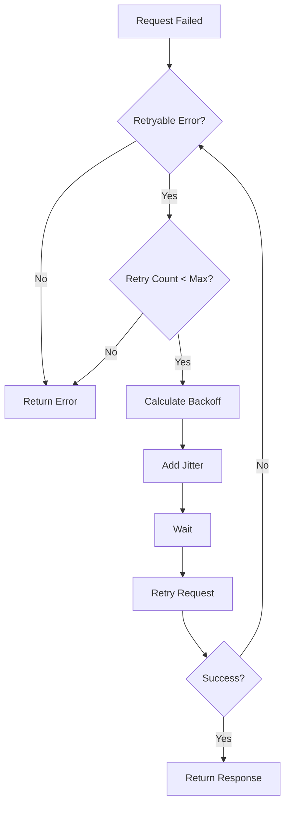

# How to Implement Network Retry Strategies

Author: [nawazdhandala](https://www.github.com/nawazdhandala)

Tags: Networking, Resilience, Retry, Exponential Backoff, Fault Tolerance, Microservices, Reliability

Description: Learn how to implement effective network retry strategies that improve reliability without causing cascading failures. This guide covers exponential backoff, jitter, circuit breakers, and idempotency considerations.

---

Network requests fail. Servers restart, connections timeout, and packets get lost. Retry strategies help your applications recover from transient failures, but poorly implemented retries can amplify problems into outages. This guide shows you how to implement retries correctly.

## Why Retries Need Strategy

Naive retry implementations cause problems:

- **Retry storms** - When multiple clients retry simultaneously, they overwhelm recovering servers
- **Cascading failures** - Retries to failing dependencies pile up, exhausting resources
- **Duplicate operations** - Retrying non-idempotent operations causes data inconsistency

Good retry strategies address all three concerns.



## Exponential Backoff Fundamentals

Exponential backoff increases delay between retries, giving servers time to recover:

```python
# exponential_backoff.py - Basic exponential backoff implementation
import time
import random
import requests
from typing import Optional, Callable, TypeVar

T = TypeVar('T')

class RetryConfig:
    def __init__(
        self,
        max_retries: int = 3,
        base_delay: float = 1.0,
        max_delay: float = 60.0,
        exponential_base: float = 2.0,
        jitter: bool = True
    ):
        self.max_retries = max_retries
        self.base_delay = base_delay
        self.max_delay = max_delay
        self.exponential_base = exponential_base
        self.jitter = jitter

    def get_delay(self, attempt: int) -> float:
        """Calculate delay for the given attempt number (0-indexed)"""
        # Exponential delay: base_delay * (exponential_base ^ attempt)
        delay = self.base_delay * (self.exponential_base ** attempt)

        # Cap at maximum delay
        delay = min(delay, self.max_delay)

        # Add jitter to prevent thundering herd
        if self.jitter:
            # Full jitter: random value between 0 and calculated delay
            delay = random.uniform(0, delay)

        return delay

def retry_with_backoff(
    func: Callable[[], T],
    config: Optional[RetryConfig] = None,
    retryable_exceptions: tuple = (requests.RequestException,)
) -> T:
    """Execute function with exponential backoff retry"""
    config = config or RetryConfig()

    last_exception = None

    for attempt in range(config.max_retries + 1):
        try:
            return func()
        except retryable_exceptions as e:
            last_exception = e

            if attempt == config.max_retries:
                # No more retries
                raise

            delay = config.get_delay(attempt)
            print(f"Attempt {attempt + 1} failed: {e}. Retrying in {delay:.2f}s")
            time.sleep(delay)

    raise last_exception

# Usage example
def fetch_data():
    response = requests.get("https://api.example.com/data", timeout=10)
    response.raise_for_status()
    return response.json()

config = RetryConfig(max_retries=5, base_delay=0.5, max_delay=30)
data = retry_with_backoff(fetch_data, config)
```

## Jitter Strategies

Different jitter approaches prevent retry synchronization:

```python
# jitter_strategies.py - Different jitter implementations
import random

class JitterStrategies:
    @staticmethod
    def no_jitter(delay: float) -> float:
        """No jitter - not recommended for production"""
        return delay

    @staticmethod
    def full_jitter(delay: float) -> float:
        """Random delay between 0 and calculated delay"""
        return random.uniform(0, delay)

    @staticmethod
    def equal_jitter(delay: float) -> float:
        """Half the delay is guaranteed, half is random"""
        return delay / 2 + random.uniform(0, delay / 2)

    @staticmethod
    def decorrelated_jitter(delay: float, previous_delay: float, base: float = 1.0) -> float:
        """Delay based on previous delay with randomization"""
        return min(delay, random.uniform(base, previous_delay * 3))

# Example: Compare jitter strategies
def compare_jitter_strategies():
    base_delay = 1.0
    delays = []

    print("Retry | No Jitter | Full Jitter | Equal Jitter")
    print("-" * 50)

    for attempt in range(5):
        calculated = base_delay * (2 ** attempt)

        no_jit = JitterStrategies.no_jitter(calculated)
        full_jit = JitterStrategies.full_jitter(calculated)
        equal_jit = JitterStrategies.equal_jitter(calculated)

        print(f"  {attempt}   |   {no_jit:5.2f}s  |   {full_jit:5.2f}s   |   {equal_jit:5.2f}s")

compare_jitter_strategies()
```

## Retryable vs Non-Retryable Errors

Not all errors should trigger retries:

```python
# retryable_errors.py - Classify errors for retry decisions
from enum import Enum
import requests

class RetryDecision(Enum):
    RETRY = "retry"
    NO_RETRY = "no_retry"
    RETRY_WITH_BACKOFF = "retry_with_backoff"

def classify_http_error(status_code: int, headers: dict = None) -> RetryDecision:
    """Determine if an HTTP error should be retried"""
    headers = headers or {}

    # Client errors (4xx) - generally not retryable
    if 400 <= status_code < 500:
        if status_code == 429:  # Too Many Requests
            # Respect Retry-After header if present
            return RetryDecision.RETRY_WITH_BACKOFF
        if status_code == 408:  # Request Timeout
            return RetryDecision.RETRY
        # Other 4xx errors are client problems, not transient
        return RetryDecision.NO_RETRY

    # Server errors (5xx) - generally retryable
    if 500 <= status_code < 600:
        if status_code == 501:  # Not Implemented
            return RetryDecision.NO_RETRY
        if status_code in (502, 503, 504):  # Gateway errors
            return RetryDecision.RETRY_WITH_BACKOFF
        return RetryDecision.RETRY

    return RetryDecision.NO_RETRY

def classify_exception(exception: Exception) -> RetryDecision:
    """Determine if an exception should trigger retry"""

    # Connection errors - usually transient
    if isinstance(exception, requests.ConnectionError):
        return RetryDecision.RETRY_WITH_BACKOFF

    # Timeout - might be transient
    if isinstance(exception, requests.Timeout):
        return RetryDecision.RETRY

    # SSL errors - usually configuration issues, not transient
    if isinstance(exception, requests.exceptions.SSLError):
        return RetryDecision.NO_RETRY

    # DNS resolution failures - might resolve
    if "Name or service not known" in str(exception):
        return RetryDecision.RETRY_WITH_BACKOFF

    return RetryDecision.NO_RETRY
```

## Retry with Context: HTTP Client

A complete HTTP client with retry logic:

```python
# http_client_retry.py - HTTP client with comprehensive retry handling
import time
import random
import logging
from typing import Optional, Dict, Any
from dataclasses import dataclass
import requests
from requests.adapters import HTTPAdapter
from urllib3.util.retry import Retry

logging.basicConfig(level=logging.INFO)
logger = logging.getLogger(__name__)

@dataclass
class RetryStats:
    """Track retry statistics for observability"""
    total_requests: int = 0
    successful_requests: int = 0
    failed_requests: int = 0
    total_retries: int = 0
    total_retry_delay: float = 0.0

class ResilientHTTPClient:
    def __init__(
        self,
        base_url: str,
        max_retries: int = 3,
        base_delay: float = 1.0,
        max_delay: float = 30.0,
        timeout: float = 10.0
    ):
        self.base_url = base_url.rstrip('/')
        self.max_retries = max_retries
        self.base_delay = base_delay
        self.max_delay = max_delay
        self.timeout = timeout
        self.stats = RetryStats()

        # Create session with connection pooling
        self.session = requests.Session()

        # Configure urllib3 retry for connection-level retries
        retry_strategy = Retry(
            total=0,  # We handle retries manually for more control
            backoff_factor=0,
        )

        adapter = HTTPAdapter(
            max_retries=retry_strategy,
            pool_connections=10,
            pool_maxsize=20
        )

        self.session.mount("http://", adapter)
        self.session.mount("https://", adapter)

    def _should_retry(self, exception: Optional[Exception], response: Optional[requests.Response]) -> bool:
        """Determine if request should be retried"""
        if exception:
            # Retry on connection errors and timeouts
            if isinstance(exception, (requests.ConnectionError, requests.Timeout)):
                return True
            return False

        if response:
            # Retry on specific status codes
            return response.status_code in (429, 500, 502, 503, 504)

        return False

    def _get_retry_delay(self, attempt: int, response: Optional[requests.Response]) -> float:
        """Calculate retry delay, respecting Retry-After header"""
        # Check for Retry-After header
        if response and response.headers.get('Retry-After'):
            try:
                return float(response.headers['Retry-After'])
            except ValueError:
                pass

        # Exponential backoff with full jitter
        delay = self.base_delay * (2 ** attempt)
        delay = min(delay, self.max_delay)
        return random.uniform(0, delay)

    def request(
        self,
        method: str,
        path: str,
        **kwargs
    ) -> requests.Response:
        """Make HTTP request with retry logic"""
        url = f"{self.base_url}{path}"
        kwargs.setdefault('timeout', self.timeout)

        self.stats.total_requests += 1
        last_exception = None

        for attempt in range(self.max_retries + 1):
            response = None

            try:
                response = self.session.request(method, url, **kwargs)

                # Check for retriable status codes
                if not self._should_retry(None, response):
                    self.stats.successful_requests += 1
                    return response

            except requests.RequestException as e:
                last_exception = e
                if not self._should_retry(e, None):
                    self.stats.failed_requests += 1
                    raise

            # Determine if we should retry
            if attempt == self.max_retries:
                self.stats.failed_requests += 1
                if last_exception:
                    raise last_exception
                response.raise_for_status()

            # Calculate and wait for backoff
            delay = self._get_retry_delay(attempt, response)
            self.stats.total_retries += 1
            self.stats.total_retry_delay += delay

            logger.info(
                f"Request to {path} failed (attempt {attempt + 1}/{self.max_retries + 1}). "
                f"Retrying in {delay:.2f}s"
            )
            time.sleep(delay)

        # Should not reach here
        raise RuntimeError("Unexpected retry loop exit")

    def get(self, path: str, **kwargs) -> requests.Response:
        return self.request('GET', path, **kwargs)

    def post(self, path: str, **kwargs) -> requests.Response:
        return self.request('POST', path, **kwargs)

    def put(self, path: str, **kwargs) -> requests.Response:
        return self.request('PUT', path, **kwargs)

    def delete(self, path: str, **kwargs) -> requests.Response:
        return self.request('DELETE', path, **kwargs)

# Usage
client = ResilientHTTPClient(
    base_url="https://api.example.com",
    max_retries=3,
    base_delay=1.0
)

response = client.get("/users/123")
print(f"Stats: {client.stats}")
```

## Idempotency Keys for Safe Retries

Retrying non-idempotent operations requires idempotency keys:

```python
# idempotent_requests.py - Safe retries with idempotency keys
import uuid
import hashlib
from typing import Optional
import requests

class IdempotentClient:
    def __init__(self, base_url: str):
        self.base_url = base_url
        self.session = requests.Session()

    def _generate_idempotency_key(self, method: str, path: str, body: Optional[dict]) -> str:
        """Generate a unique key for this operation"""
        # Option 1: Random UUID (use when you want each call to be unique)
        return str(uuid.uuid4())

    def _generate_deterministic_key(self, method: str, path: str, body: Optional[dict]) -> str:
        """Generate a key based on request content (for deduplication)"""
        # Option 2: Hash of request (use when retrying same logical operation)
        content = f"{method}:{path}:{body}"
        return hashlib.sha256(content.encode()).hexdigest()[:32]

    def post_with_idempotency(
        self,
        path: str,
        json: dict,
        idempotency_key: Optional[str] = None,
        max_retries: int = 3
    ) -> requests.Response:
        """POST request with idempotency key for safe retries"""
        # Generate key if not provided
        key = idempotency_key or self._generate_idempotency_key('POST', path, json)

        headers = {
            'Idempotency-Key': key,
            'Content-Type': 'application/json'
        }

        last_exception = None

        for attempt in range(max_retries + 1):
            try:
                response = self.session.post(
                    f"{self.base_url}{path}",
                    json=json,
                    headers=headers,
                    timeout=10
                )

                # Success or client error (4xx) - do not retry
                if response.status_code < 500:
                    return response

                # Server error - retry with same idempotency key
                # Server should recognize duplicate and return cached response

            except requests.RequestException as e:
                last_exception = e

            if attempt < max_retries:
                import time
                time.sleep(2 ** attempt)  # Exponential backoff

        raise last_exception or Exception("Max retries exceeded")

# Server-side idempotency handling example (Flask)
from flask import Flask, request, jsonify
import redis

app = Flask(__name__)
redis_client = redis.Redis()

@app.route('/api/payments', methods=['POST'])
def create_payment():
    idempotency_key = request.headers.get('Idempotency-Key')

    if not idempotency_key:
        return jsonify({'error': 'Idempotency-Key header required'}), 400

    # Check if we have a cached response for this key
    cache_key = f"idempotency:{idempotency_key}"
    cached = redis_client.get(cache_key)

    if cached:
        # Return cached response
        import json
        return jsonify(json.loads(cached)), 200

    # Process the payment
    result = process_payment(request.json)

    # Cache the response for 24 hours
    import json
    redis_client.setex(
        cache_key,
        86400,
        json.dumps(result)
    )

    return jsonify(result), 201
```

## Retry Budgets

Limit total retry impact on the system:

```python
# retry_budget.py - Limit retries to prevent cascading failures
import time
from threading import Lock
from collections import deque

class RetryBudget:
    """
    Limit retry attempts within a time window.
    Prevents retry storms from overwhelming recovering services.
    """

    def __init__(
        self,
        max_retries_per_second: float = 10,
        window_seconds: int = 10
    ):
        self.max_retries_per_second = max_retries_per_second
        self.window_seconds = window_seconds
        self.max_retries_in_window = max_retries_per_second * window_seconds

        self.retry_timestamps: deque = deque()
        self.lock = Lock()

    def can_retry(self) -> bool:
        """Check if we have budget for another retry"""
        with self.lock:
            now = time.time()
            window_start = now - self.window_seconds

            # Remove old timestamps
            while self.retry_timestamps and self.retry_timestamps[0] < window_start:
                self.retry_timestamps.popleft()

            # Check if we have budget
            return len(self.retry_timestamps) < self.max_retries_in_window

    def record_retry(self):
        """Record that a retry was attempted"""
        with self.lock:
            self.retry_timestamps.append(time.time())

    def get_utilization(self) -> float:
        """Get current budget utilization (0.0 to 1.0)"""
        with self.lock:
            return len(self.retry_timestamps) / self.max_retries_in_window

# Usage with HTTP client
class BudgetedHTTPClient:
    def __init__(self, base_url: str):
        self.base_url = base_url
        self.retry_budget = RetryBudget(max_retries_per_second=5)

    def get(self, path: str, max_retries: int = 3) -> requests.Response:
        for attempt in range(max_retries + 1):
            try:
                response = requests.get(f"{self.base_url}{path}", timeout=10)
                if response.status_code < 500:
                    return response
            except requests.RequestException:
                pass

            # Check retry budget before retrying
            if attempt < max_retries:
                if not self.retry_budget.can_retry():
                    raise Exception("Retry budget exhausted")

                self.retry_budget.record_retry()
                time.sleep(2 ** attempt)

        raise Exception("Max retries exceeded")
```

## Monitoring Retries

Track retry metrics to detect issues:

```python
# retry_metrics.py - Prometheus metrics for retry observability
from prometheus_client import Counter, Histogram, Gauge

# Count of requests by outcome
request_total = Counter(
    'http_client_requests_total',
    'Total HTTP requests',
    ['method', 'host', 'status']
)

# Count of retries
retry_total = Counter(
    'http_client_retries_total',
    'Total retry attempts',
    ['method', 'host', 'reason']
)

# Retry delay histogram
retry_delay = Histogram(
    'http_client_retry_delay_seconds',
    'Retry delay in seconds',
    ['method', 'host'],
    buckets=[0.1, 0.5, 1, 2, 5, 10, 30, 60]
)

# Retry budget utilization
retry_budget_utilization = Gauge(
    'http_client_retry_budget_utilization',
    'Current retry budget utilization (0-1)',
    ['client']
)
```

## Best Practices

1. **Always use jitter** - Without jitter, retries synchronize and create thundering herd problems.

2. **Cap maximum delay** - Exponential backoff can grow unbounded. Set reasonable maximums.

3. **Make operations idempotent** - Design your APIs so retries are safe. Use idempotency keys when needed.

4. **Distinguish error types** - Only retry transient errors. Client errors (4xx) rarely benefit from retries.

5. **Implement retry budgets** - Limit total retries to prevent cascading failures.

6. **Monitor retry rates** - High retry rates indicate underlying problems. Alert on sustained retry activity.

7. **Test retry behavior** - Use chaos engineering to verify your retry logic handles failures correctly.

## Conclusion

Effective retry strategies balance reliability with system stability. Start with exponential backoff and jitter, classify errors to retry only transient failures, use idempotency keys for non-idempotent operations, and implement retry budgets to prevent cascading failures. Monitor retry metrics continuously to catch problems before they become outages.
