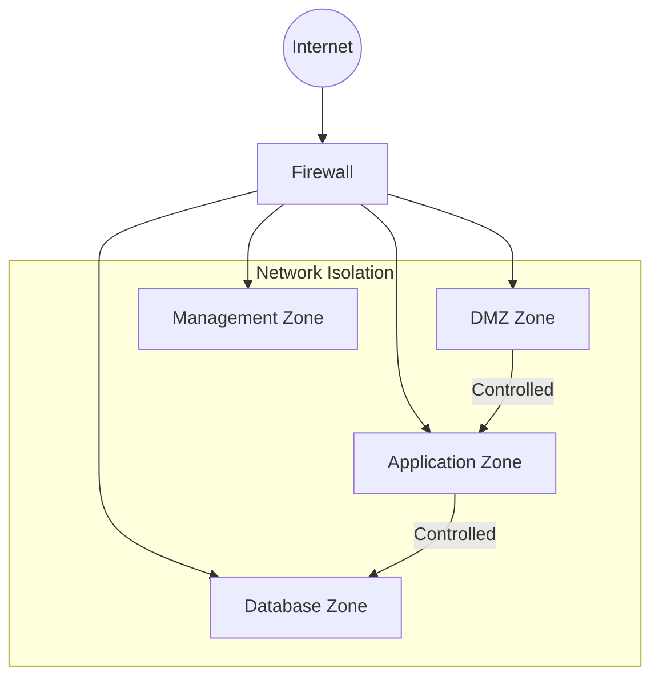

# How to Configure Network Segmentation

Author: [nawazdhandala](https://www.github.com/nawazdhandala)

Tags: Network Segmentation, Security, VLANs, Firewall, Kubernetes, DevOps

Description: A practical guide to implementing network segmentation for security and compliance, covering VLAN configuration, firewall rules, Kubernetes network policies, and zero-trust microsegmentation.

---

Network segmentation divides your network into isolated zones, limiting the blast radius of security breaches and making compliance easier. This guide covers practical implementations from traditional VLANs to modern microsegmentation in Kubernetes.

## Segmentation Architecture



## Traditional VLAN Segmentation

### Linux VLAN Configuration

```bash
#!/bin/bash
# setup-vlans.sh - Configure VLANs on Linux

# Load 8021q module
modprobe 8021q
echo "8021q" >> /etc/modules

# Create VLANs on interface eth0
# VLAN 10 - DMZ (10.10.10.0/24)
ip link add link eth0 name eth0.10 type vlan id 10
ip addr add 10.10.10.1/24 dev eth0.10
ip link set dev eth0.10 up

# VLAN 20 - Application (10.10.20.0/24)
ip link add link eth0 name eth0.20 type vlan id 20
ip addr add 10.10.20.1/24 dev eth0.20
ip link set dev eth0.20 up

# VLAN 30 - Database (10.10.30.0/24)
ip link add link eth0 name eth0.30 type vlan id 30
ip addr add 10.10.30.1/24 dev eth0.30
ip link set dev eth0.30 up

# VLAN 100 - Management (10.10.100.0/24)
ip link add link eth0 name eth0.100 type vlan id 100
ip addr add 10.10.100.1/24 dev eth0.100
ip link set dev eth0.100 up
```

### Netplan VLAN Configuration

```yaml
# /etc/netplan/01-vlans.yaml
network:
  version: 2
  ethernets:
    eth0:
      dhcp4: no

  vlans:
    vlan10:
      id: 10
      link: eth0
      addresses:
        - 10.10.10.1/24
      routes:
        - to: 0.0.0.0/0
          via: 10.10.10.254

    vlan20:
      id: 20
      link: eth0
      addresses:
        - 10.10.20.1/24

    vlan30:
      id: 30
      link: eth0
      addresses:
        - 10.10.30.1/24

    vlan100:
      id: 100
      link: eth0
      addresses:
        - 10.10.100.1/24
```

## iptables Firewall Rules

### Inter-VLAN Routing Rules

```bash
#!/bin/bash
# firewall-rules.sh - Network segmentation firewall rules

# Enable IP forwarding
echo 1 > /proc/sys/net/ipv4/ip_forward

# Flush existing rules
iptables -F
iptables -t nat -F
iptables -X

# Default policies - deny all
iptables -P INPUT DROP
iptables -P FORWARD DROP
iptables -P OUTPUT ACCEPT

# Allow established connections
iptables -A INPUT -m state --state ESTABLISHED,RELATED -j ACCEPT
iptables -A FORWARD -m state --state ESTABLISHED,RELATED -j ACCEPT

# Allow loopback
iptables -A INPUT -i lo -j ACCEPT

# DMZ (VLAN 10) Rules
# Allow incoming HTTP/HTTPS from Internet
iptables -A INPUT -i eth0 -p tcp --dport 80 -j ACCEPT
iptables -A INPUT -i eth0 -p tcp --dport 443 -j ACCEPT

# DMZ can talk to Application zone on specific ports
iptables -A FORWARD -i eth0.10 -o eth0.20 -p tcp --dport 8080 -j ACCEPT
iptables -A FORWARD -i eth0.10 -o eth0.20 -p tcp --dport 8443 -j ACCEPT

# Application (VLAN 20) Rules
# Can talk to Database zone
iptables -A FORWARD -i eth0.20 -o eth0.30 -p tcp --dport 5432 -j ACCEPT
iptables -A FORWARD -i eth0.20 -o eth0.30 -p tcp --dport 6379 -j ACCEPT

# Can talk to external APIs (restricted)
iptables -A FORWARD -i eth0.20 -o eth0 -p tcp --dport 443 -j ACCEPT

# Database (VLAN 30) Rules
# Only accepts connections from Application zone (handled above)
# No outbound Internet access
iptables -A FORWARD -i eth0.30 -o eth0 -j DROP

# Management (VLAN 100) Rules
# Can SSH to all zones
iptables -A FORWARD -i eth0.100 -p tcp --dport 22 -j ACCEPT
# Can access monitoring ports
iptables -A FORWARD -i eth0.100 -p tcp --dport 9090 -j ACCEPT
iptables -A FORWARD -i eth0.100 -p tcp --dport 3000 -j ACCEPT

# Log dropped packets
iptables -A FORWARD -j LOG --log-prefix "DROPPED: "

# Save rules
iptables-save > /etc/iptables/rules.v4
```

## nftables Configuration

```bash
# /etc/nftables.conf
#!/usr/sbin/nft -f

flush ruleset

table inet filter {
    chain input {
        type filter hook input priority 0; policy drop;

        ct state established,related accept
        iif lo accept

        # Management zone can access SSH
        iifname "eth0.100" tcp dport 22 accept

        # DMZ accepts HTTP/HTTPS
        iifname "eth0.10" tcp dport { 80, 443 } accept
    }

    chain forward {
        type filter hook forward priority 0; policy drop;

        ct state established,related accept

        # DMZ to Application
        iifname "eth0.10" oifname "eth0.20" tcp dport { 8080, 8443 } accept

        # Application to Database
        iifname "eth0.20" oifname "eth0.30" tcp dport { 5432, 6379, 27017 } accept

        # Application to Internet (HTTPS only)
        iifname "eth0.20" oifname "eth0" tcp dport 443 accept

        # Management to all zones (SSH and monitoring)
        iifname "eth0.100" tcp dport { 22, 9090, 3000 } accept

        # Block database from Internet
        iifname "eth0.30" oifname "eth0" drop

        # Log everything else
        log prefix "nft-dropped: "
    }

    chain output {
        type filter hook output priority 0; policy accept;
    }
}

table inet nat {
    chain postrouting {
        type nat hook postrouting priority 100;

        # NAT for outbound traffic
        oifname "eth0" masquerade
    }
}
```

## Kubernetes Network Segmentation

### Namespace-Based Isolation

```yaml
# namespace-isolation.yaml
apiVersion: v1
kind: Namespace
metadata:
  name: frontend
  labels:
    environment: production
    zone: dmz

---
apiVersion: v1
kind: Namespace
metadata:
  name: backend
  labels:
    environment: production
    zone: application

---
apiVersion: v1
kind: Namespace
metadata:
  name: database
  labels:
    environment: production
    zone: data

---
# Default deny all traffic in each namespace
apiVersion: networking.k8s.io/v1
kind: NetworkPolicy
metadata:
  name: default-deny
  namespace: frontend
spec:
  podSelector: {}
  policyTypes:
    - Ingress
    - Egress

---
apiVersion: networking.k8s.io/v1
kind: NetworkPolicy
metadata:
  name: default-deny
  namespace: backend
spec:
  podSelector: {}
  policyTypes:
    - Ingress
    - Egress

---
apiVersion: networking.k8s.io/v1
kind: NetworkPolicy
metadata:
  name: default-deny
  namespace: database
spec:
  podSelector: {}
  policyTypes:
    - Ingress
    - Egress
```

### Zone-Based Network Policies

```yaml
# network-policies.yaml

# Frontend zone - accepts traffic from ingress, talks to backend
apiVersion: networking.k8s.io/v1
kind: NetworkPolicy
metadata:
  name: frontend-policy
  namespace: frontend
spec:
  podSelector:
    matchLabels:
      app: web
  policyTypes:
    - Ingress
    - Egress
  ingress:
    - from:
        - namespaceSelector:
            matchLabels:
              kubernetes.io/metadata.name: ingress-nginx
      ports:
        - protocol: TCP
          port: 80
  egress:
    # To backend services
    - to:
        - namespaceSelector:
            matchLabels:
              zone: application
      ports:
        - protocol: TCP
          port: 8080
    # DNS
    - to:
        - namespaceSelector:
            matchLabels:
              kubernetes.io/metadata.name: kube-system
          podSelector:
            matchLabels:
              k8s-app: kube-dns
      ports:
        - protocol: UDP
          port: 53

---
# Backend zone - accepts from frontend, talks to database
apiVersion: networking.k8s.io/v1
kind: NetworkPolicy
metadata:
  name: backend-policy
  namespace: backend
spec:
  podSelector:
    matchLabels:
      app: api
  policyTypes:
    - Ingress
    - Egress
  ingress:
    - from:
        - namespaceSelector:
            matchLabels:
              zone: dmz
      ports:
        - protocol: TCP
          port: 8080
  egress:
    # To database
    - to:
        - namespaceSelector:
            matchLabels:
              zone: data
      ports:
        - protocol: TCP
          port: 5432
        - protocol: TCP
          port: 6379
    # DNS
    - to:
        - namespaceSelector:
            matchLabels:
              kubernetes.io/metadata.name: kube-system
          podSelector:
            matchLabels:
              k8s-app: kube-dns
      ports:
        - protocol: UDP
          port: 53

---
# Database zone - accepts only from backend
apiVersion: networking.k8s.io/v1
kind: NetworkPolicy
metadata:
  name: database-policy
  namespace: database
spec:
  podSelector:
    matchLabels:
      app: postgres
  policyTypes:
    - Ingress
    - Egress
  ingress:
    - from:
        - namespaceSelector:
            matchLabels:
              zone: application
      ports:
        - protocol: TCP
          port: 5432
  egress:
    # Only DNS - no external access
    - to:
        - namespaceSelector:
            matchLabels:
              kubernetes.io/metadata.name: kube-system
          podSelector:
            matchLabels:
              k8s-app: kube-dns
      ports:
        - protocol: UDP
          port: 53
```

## Cilium Microsegmentation

```yaml
# cilium-network-policy.yaml
apiVersion: cilium.io/v2
kind: CiliumNetworkPolicy
metadata:
  name: backend-microsegmentation
  namespace: backend
spec:
  endpointSelector:
    matchLabels:
      app: api
  ingress:
    - fromEndpoints:
        - matchLabels:
            app: web
            zone: dmz
      toPorts:
        - ports:
            - port: "8080"
              protocol: TCP
          rules:
            http:
              - method: "GET"
                path: "/api/.*"
              - method: "POST"
                path: "/api/orders"
  egress:
    - toEndpoints:
        - matchLabels:
            app: postgres
      toPorts:
        - ports:
            - port: "5432"
              protocol: TCP
    - toFQDNs:
        - matchName: "api.stripe.com"
      toPorts:
        - ports:
            - port: "443"
              protocol: TCP
```

## AWS VPC Segmentation

```hcl
# terraform/vpc-segmentation.tf

# VPC with multiple subnets for segmentation
resource "aws_vpc" "main" {
  cidr_block           = "10.0.0.0/16"
  enable_dns_hostnames = true
  enable_dns_support   = true

  tags = {
    Name = "segmented-vpc"
  }
}

# DMZ Subnet (Public)
resource "aws_subnet" "dmz" {
  vpc_id                  = aws_vpc.main.id
  cidr_block              = "10.0.1.0/24"
  availability_zone       = "us-east-1a"
  map_public_ip_on_launch = true

  tags = {
    Name = "dmz-subnet"
    Zone = "dmz"
  }
}

# Application Subnet (Private)
resource "aws_subnet" "application" {
  vpc_id            = aws_vpc.main.id
  cidr_block        = "10.0.2.0/24"
  availability_zone = "us-east-1a"

  tags = {
    Name = "application-subnet"
    Zone = "application"
  }
}

# Database Subnet (Private, Isolated)
resource "aws_subnet" "database" {
  vpc_id            = aws_vpc.main.id
  cidr_block        = "10.0.3.0/24"
  availability_zone = "us-east-1a"

  tags = {
    Name = "database-subnet"
    Zone = "database"
  }
}

# Security Groups for each zone
resource "aws_security_group" "dmz" {
  name        = "dmz-sg"
  description = "DMZ security group"
  vpc_id      = aws_vpc.main.id

  ingress {
    from_port   = 443
    to_port     = 443
    protocol    = "tcp"
    cidr_blocks = ["0.0.0.0/0"]
  }

  ingress {
    from_port   = 80
    to_port     = 80
    protocol    = "tcp"
    cidr_blocks = ["0.0.0.0/0"]
  }

  egress {
    from_port       = 8080
    to_port         = 8080
    protocol        = "tcp"
    security_groups = [aws_security_group.application.id]
  }
}

resource "aws_security_group" "application" {
  name        = "application-sg"
  description = "Application security group"
  vpc_id      = aws_vpc.main.id

  ingress {
    from_port       = 8080
    to_port         = 8080
    protocol        = "tcp"
    security_groups = [aws_security_group.dmz.id]
  }

  egress {
    from_port       = 5432
    to_port         = 5432
    protocol        = "tcp"
    security_groups = [aws_security_group.database.id]
  }

  egress {
    from_port   = 443
    to_port     = 443
    protocol    = "tcp"
    cidr_blocks = ["0.0.0.0/0"]
  }
}

resource "aws_security_group" "database" {
  name        = "database-sg"
  description = "Database security group"
  vpc_id      = aws_vpc.main.id

  ingress {
    from_port       = 5432
    to_port         = 5432
    protocol        = "tcp"
    security_groups = [aws_security_group.application.id]
  }

  # No egress to internet
  egress {
    from_port   = 0
    to_port     = 0
    protocol    = "-1"
    cidr_blocks = ["10.0.0.0/16"]
  }
}
```

## Verification and Monitoring

```bash
#!/bin/bash
# verify-segmentation.sh

echo "=== Testing Network Segmentation ==="

# Test DMZ to Application (should work)
echo "Testing DMZ -> Application on port 8080:"
kubectl exec -n frontend deploy/web -- curl -s -o /dev/null -w "%{http_code}" http://api.backend.svc:8080/health

# Test DMZ to Database (should fail)
echo "Testing DMZ -> Database on port 5432 (should fail):"
kubectl exec -n frontend deploy/web -- nc -zv postgres.database.svc 5432 2>&1

# Test Application to Database (should work)
echo "Testing Application -> Database on port 5432:"
kubectl exec -n backend deploy/api -- nc -zv postgres.database.svc 5432 2>&1

# Test Database to Internet (should fail)
echo "Testing Database -> Internet (should fail):"
kubectl exec -n database deploy/postgres -- curl -s --max-time 5 https://google.com 2>&1

echo -e "\n=== Network Policy Status ==="
kubectl get networkpolicies -A
```

---

Network segmentation is fundamental to defense in depth. Start with broad zones (DMZ, application, data), then progressively implement microsegmentation as your security requirements mature. The key is making the rules as specific as possible while remaining maintainable.
