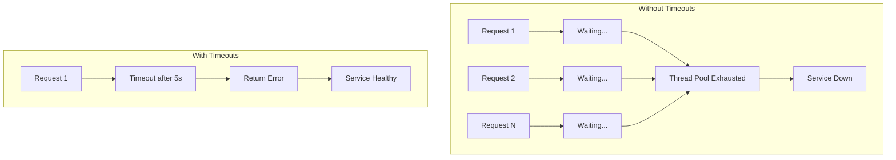

# How to Configure Network Timeout Strategies

Author: [nawazdhandala](https://www.github.com/nawazdhandala)

Tags: Networking, Timeouts, Reliability, Performance, TCP, HTTP, Microservices, Fault Tolerance

Description: Learn how to configure network timeouts effectively to prevent hung connections and cascading failures. This guide covers connection, read, write, and idle timeouts with practical examples across different layers.

---

Timeouts are your defense against hung connections, unresponsive services, and cascading failures. Without proper timeouts, a single slow dependency can exhaust your connection pools and bring down your entire system. This guide shows you how to configure timeouts at every layer of your stack.

## Why Timeouts Matter

Consider what happens without timeouts:

1. Service A calls Service B
2. Service B hangs (database lock, infinite loop, network issue)
3. Service A's thread blocks forever waiting
4. More requests come in, more threads block
5. Service A runs out of threads/connections
6. Service A becomes unresponsive
7. Services calling A also hang

Proper timeouts break this chain.



## Types of Timeouts

Different timeouts protect against different failure modes:

| Timeout Type | Purpose | Typical Value |
|--------------|---------|---------------|
| Connection Timeout | Time to establish TCP connection | 1-5 seconds |
| Read Timeout | Time to receive response data | 5-30 seconds |
| Write Timeout | Time to send request data | 5-30 seconds |
| Idle Timeout | Time a connection can be idle | 60-300 seconds |
| Request Timeout | Total time for entire request | 10-60 seconds |

## HTTP Client Timeouts

### Python requests

```python
# python_timeouts.py - Configure timeouts in Python HTTP clients
import requests
from requests.adapters import HTTPAdapter
from urllib3.util.retry import Retry

# Basic timeout configuration
def make_request_simple():
    # timeout=(connect_timeout, read_timeout)
    response = requests.get(
        'https://api.example.com/data',
        timeout=(3.05, 10)  # 3s connect, 10s read
    )
    return response.json()

# Production-ready client with comprehensive timeouts
class ResilientHTTPClient:
    def __init__(self):
        self.session = requests.Session()

        # Configure retry strategy
        retry_strategy = Retry(
            total=3,
            backoff_factor=1,
            status_forcelist=[500, 502, 503, 504]
        )

        adapter = HTTPAdapter(
            max_retries=retry_strategy,
            pool_connections=10,
            pool_maxsize=20
        )

        self.session.mount("http://", adapter)
        self.session.mount("https://", adapter)

    def get(self, url, **kwargs):
        # Set default timeouts if not provided
        kwargs.setdefault('timeout', (5, 30))
        return self.session.get(url, **kwargs)

    def post(self, url, **kwargs):
        kwargs.setdefault('timeout', (5, 30))
        return self.session.post(url, **kwargs)

# Usage
client = ResilientHTTPClient()
response = client.get('https://api.example.com/users')
```

### Go HTTP client

```go
// go_timeouts.go - Configure timeouts in Go HTTP client
package main

import (
    "context"
    "net"
    "net/http"
    "time"
)

func createHTTPClient() *http.Client {
    // Custom transport with granular timeouts
    transport := &http.Transport{
        // Connection timeout
        DialContext: (&net.Dialer{
            Timeout:   5 * time.Second,  // TCP connect timeout
            KeepAlive: 30 * time.Second, // TCP keepalive interval
        }).DialContext,

        // TLS handshake timeout
        TLSHandshakeTimeout: 5 * time.Second,

        // Connection pool settings
        MaxIdleConns:        100,
        MaxIdleConnsPerHost: 10,
        IdleConnTimeout:     90 * time.Second,

        // Response header timeout (time to receive headers)
        ResponseHeaderTimeout: 10 * time.Second,

        // Expect continue timeout
        ExpectContinueTimeout: 1 * time.Second,
    }

    client := &http.Client{
        Transport: transport,
        // Total request timeout (overrides individual timeouts)
        Timeout: 30 * time.Second,
    }

    return client
}

// Request with context timeout (recommended)
func makeRequestWithContext() error {
    client := createHTTPClient()

    // Context timeout gives you more control
    ctx, cancel := context.WithTimeout(context.Background(), 10*time.Second)
    defer cancel()

    req, err := http.NewRequestWithContext(ctx, "GET", "https://api.example.com/data", nil)
    if err != nil {
        return err
    }

    resp, err := client.Do(req)
    if err != nil {
        return err
    }
    defer resp.Body.Close()

    return nil
}
```

## Database Connection Timeouts

### PostgreSQL

```python
# postgres_timeouts.py - PostgreSQL timeout configuration
import psycopg2
from psycopg2 import pool

# Connection string with timeouts
conn_params = {
    'host': 'db.example.com',
    'database': 'myapp',
    'user': 'appuser',
    'password': 'secret',
    # Connection timeout in seconds
    'connect_timeout': 5,
    # Statement timeout (query execution limit)
    'options': '-c statement_timeout=30000',  # 30 seconds in ms
}

# Create connection
conn = psycopg2.connect(**conn_params)

# Set session-level timeouts
with conn.cursor() as cur:
    # Lock wait timeout
    cur.execute("SET lock_timeout = '10s'")
    # Idle transaction timeout
    cur.execute("SET idle_in_transaction_session_timeout = '60s'")

# Connection pool with timeouts
connection_pool = pool.ThreadedConnectionPool(
    minconn=5,
    maxconn=20,
    **conn_params
)

def get_connection_with_timeout(timeout_seconds=5):
    """Get connection from pool with timeout"""
    import time
    start = time.time()

    while time.time() - start < timeout_seconds:
        try:
            conn = connection_pool.getconn()
            return conn
        except pool.PoolError:
            time.sleep(0.1)

    raise TimeoutError("Could not get connection from pool")
```

### Redis

```python
# redis_timeouts.py - Redis timeout configuration
import redis

# Single connection with timeouts
client = redis.Redis(
    host='redis.example.com',
    port=6379,
    db=0,
    # Socket connect timeout
    socket_connect_timeout=5,
    # Socket read/write timeout
    socket_timeout=5,
    # Retry configuration
    retry_on_timeout=True,
    # Health check interval for connection pool
    health_check_interval=30
)

# Connection pool with timeouts
pool = redis.ConnectionPool(
    host='redis.example.com',
    port=6379,
    db=0,
    max_connections=50,
    socket_connect_timeout=5,
    socket_timeout=5,
    # Timeout waiting for connection from pool
    timeout=10
)

client_with_pool = redis.Redis(connection_pool=pool)

# Blocking operations need separate timeouts
def get_from_queue_with_timeout():
    # BLPOP with explicit timeout (returns None if timeout)
    result = client.blpop('my_queue', timeout=30)
    return result
```

## Load Balancer Timeouts

### NGINX

```nginx
# nginx_timeouts.conf - NGINX timeout configuration

http {
    # Client-facing timeouts
    client_header_timeout 10s;    # Time to receive request headers
    client_body_timeout 30s;      # Time to receive request body
    send_timeout 30s;             # Time to send response to client
    keepalive_timeout 65s;        # Keep connection open for this long

    # Upstream (backend) timeouts
    upstream backend {
        server 10.0.1.10:8080;
        server 10.0.1.11:8080;

        # Connection keepalive
        keepalive 32;
        keepalive_timeout 60s;
    }

    server {
        listen 80;

        location / {
            proxy_pass http://backend;

            # Connection timeout to upstream
            proxy_connect_timeout 5s;

            # Time to receive response headers
            proxy_read_timeout 30s;

            # Time to send request to upstream
            proxy_send_timeout 30s;

            # Keepalive to upstream
            proxy_http_version 1.1;
            proxy_set_header Connection "";
        }

        # Different timeouts for slow endpoints
        location /reports {
            proxy_pass http://backend;
            proxy_connect_timeout 5s;
            proxy_read_timeout 120s;  # Reports can take longer
            proxy_send_timeout 30s;
        }

        # File uploads need longer timeouts
        location /upload {
            proxy_pass http://backend;
            proxy_connect_timeout 5s;
            proxy_read_timeout 300s;
            proxy_send_timeout 300s;
            client_max_body_size 100M;
        }
    }
}
```

### HAProxy

```haproxy
# haproxy_timeouts.cfg - HAProxy timeout configuration

global
    maxconn 50000

defaults
    mode http

    # Client-side timeouts
    timeout client 30s        # Max time to wait for client data
    timeout client-fin 10s    # Max time to wait for client FIN

    # Server-side timeouts
    timeout connect 5s        # Max time to establish connection
    timeout server 30s        # Max time to wait for server response
    timeout server-fin 10s    # Max time to wait for server FIN

    # HTTP-specific timeouts
    timeout http-request 10s  # Max time to wait for complete HTTP request
    timeout http-keep-alive 10s  # Max time to wait for new request on keepalive

    # Queue timeout (waiting for a server)
    timeout queue 30s

    # Tunnel timeout (websockets, etc)
    timeout tunnel 1h

frontend http_front
    bind *:80
    default_backend http_back

backend http_back
    balance roundrobin

    # Override timeout for this specific backend
    timeout server 60s

    # Health check with timeout
    option httpchk GET /health
    timeout check 5s

    server web1 10.0.1.10:8080 check inter 5s fall 3 rise 2
    server web2 10.0.1.11:8080 check inter 5s fall 3 rise 2

# Backend with different timeout profile
backend slow_backend
    timeout connect 10s
    timeout server 300s

    server slow1 10.0.2.10:8080 check
```

## Kubernetes Timeouts

```yaml
# kubernetes_timeouts.yaml - Timeout configuration in Kubernetes

# Service with session affinity timeout
apiVersion: v1
kind: Service
metadata:
  name: web-service
spec:
  selector:
    app: web
  ports:
    - port: 80
      targetPort: 8080
  sessionAffinity: ClientIP
  sessionAffinityConfig:
    clientIP:
      timeoutSeconds: 3600  # Session stickiness timeout

---
# Ingress with timeouts (nginx-ingress)
apiVersion: networking.k8s.io/v1
kind: Ingress
metadata:
  name: web-ingress
  annotations:
    # Proxy timeouts
    nginx.ingress.kubernetes.io/proxy-connect-timeout: "5"
    nginx.ingress.kubernetes.io/proxy-read-timeout: "60"
    nginx.ingress.kubernetes.io/proxy-send-timeout: "60"

    # For long-running connections
    nginx.ingress.kubernetes.io/proxy-body-size: "100m"

    # Keepalive
    nginx.ingress.kubernetes.io/upstream-keepalive-connections: "32"
    nginx.ingress.kubernetes.io/upstream-keepalive-timeout: "60"
spec:
  rules:
    - host: api.example.com
      http:
        paths:
          - path: /
            pathType: Prefix
            backend:
              service:
                name: web-service
                port:
                  number: 80

---
# Pod with probes (timeout in probes)
apiVersion: v1
kind: Pod
metadata:
  name: web-pod
spec:
  containers:
    - name: app
      image: myapp:latest
      ports:
        - containerPort: 8080
      livenessProbe:
        httpGet:
          path: /health
          port: 8080
        initialDelaySeconds: 10
        periodSeconds: 10
        timeoutSeconds: 5      # Probe timeout
        failureThreshold: 3
      readinessProbe:
        httpGet:
          path: /ready
          port: 8080
        initialDelaySeconds: 5
        periodSeconds: 5
        timeoutSeconds: 3
        failureThreshold: 3
```

## Timeout Strategy by Use Case

### External API Calls

```python
# external_api_timeouts.py - Timeouts for external services
import httpx
import asyncio

async def call_payment_api(payment_data: dict):
    """
    Payment APIs need careful timeout handling:
    - Short connect timeout (server should be up)
    - Longer read timeout (processing takes time)
    - Must handle timeouts gracefully (payment may have succeeded)
    """
    async with httpx.AsyncClient(
        timeout=httpx.Timeout(
            connect=5.0,      # Fast connect or fail
            read=30.0,        # Payment processing
            write=10.0,       # Request is small
            pool=5.0          # Wait for connection from pool
        )
    ) as client:
        try:
            response = await client.post(
                'https://payments.example.com/charge',
                json=payment_data
            )
            return response.json()
        except httpx.TimeoutException:
            # CRITICAL: Payment may have succeeded!
            # Check payment status before retrying
            return await check_payment_status(payment_data['idempotency_key'])

async def call_fast_lookup_api(query: str):
    """
    Lookup APIs should be fast. Short timeouts, fail quickly.
    """
    async with httpx.AsyncClient(
        timeout=httpx.Timeout(
            connect=2.0,
            read=5.0,
            write=2.0,
            pool=2.0
        )
    ) as client:
        response = await client.get(
            f'https://lookup.example.com/search?q={query}'
        )
        return response.json()
```

### Microservice Communication

```python
# microservice_timeouts.py - Timeouts for internal services
from dataclasses import dataclass
from enum import Enum

class ServiceTier(Enum):
    CRITICAL = "critical"    # Auth, payments
    STANDARD = "standard"    # Business logic
    BACKGROUND = "background"  # Analytics, logging

@dataclass
class TimeoutConfig:
    connect: float
    read: float
    write: float
    total: float

def get_timeout_for_service(tier: ServiceTier) -> TimeoutConfig:
    """Get appropriate timeouts based on service tier"""
    configs = {
        ServiceTier.CRITICAL: TimeoutConfig(
            connect=2.0,
            read=10.0,
            write=5.0,
            total=15.0
        ),
        ServiceTier.STANDARD: TimeoutConfig(
            connect=3.0,
            read=30.0,
            write=10.0,
            total=45.0
        ),
        ServiceTier.BACKGROUND: TimeoutConfig(
            connect=5.0,
            read=60.0,
            write=30.0,
            total=120.0
        ),
    }
    return configs[tier]
```

## Monitoring Timeout Metrics

Track timeouts to identify problems:

```python
# timeout_metrics.py - Prometheus metrics for timeout observability
from prometheus_client import Counter, Histogram

# Count timeouts by type
timeout_total = Counter(
    'http_client_timeout_total',
    'Total timeout errors',
    ['service', 'timeout_type']  # connect, read, write, total
)

# Track request duration to tune timeouts
request_duration = Histogram(
    'http_client_request_duration_seconds',
    'Request duration in seconds',
    ['service', 'method', 'endpoint'],
    buckets=[0.1, 0.5, 1, 2, 5, 10, 30, 60, 120]
)

# Alert rules
ALERT_RULES = """
groups:
  - name: timeout_alerts
    rules:
      - alert: HighTimeoutRate
        expr: rate(http_client_timeout_total[5m]) > 0.1
        for: 2m
        labels:
          severity: warning
        annotations:
          summary: "High timeout rate for {{ $labels.service }}"

      - alert: P99LatencyNearTimeout
        expr: histogram_quantile(0.99, rate(http_client_request_duration_seconds_bucket[5m])) > 25
        for: 5m
        labels:
          severity: warning
        annotations:
          summary: "P99 latency approaching timeout threshold"
"""
```

## Best Practices

1. **Set explicit timeouts everywhere** - Never rely on defaults. Defaults vary and are often too long.

2. **Use defense in depth** - Set timeouts at multiple layers (application, load balancer, database).

3. **Make timeouts configurable** - Allow adjustment without code changes for different environments.

4. **Differentiate by endpoint** - Slow operations (reports, uploads) need different timeouts than fast operations.

5. **Monitor p99 latency** - Set timeouts above p99 to avoid cutting off legitimate slow requests.

6. **Include buffer for retries** - Total timeout should allow time for retry attempts.

7. **Test timeout behavior** - Verify your application handles timeouts gracefully.

## Conclusion

Network timeouts are essential for building resilient systems. Configure timeouts at every layer, from HTTP clients to databases to load balancers. Set appropriate values based on expected latency plus buffer, monitor timeout rates to detect issues, and ensure your application gracefully handles timeout errors. Without proper timeouts, a single slow dependency can cascade into a complete system failure.
