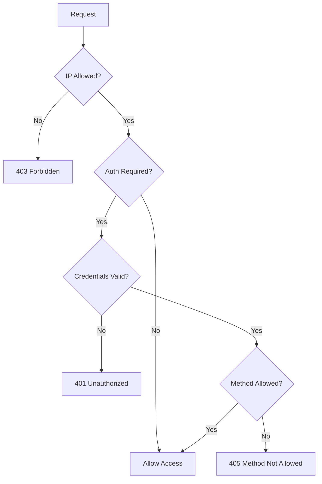

# How to Implement Access Control in Nginx

Author: [nawazdhandala](https://www.github.com/nawazdhandala)

Tags: Nginx, Security, Access Control, Authentication, IP Filtering

Description: Learn how to implement access control in Nginx using IP-based restrictions, basic authentication, and geographic filtering to secure your web applications.

---

Access control restricts who can access your web resources. Nginx provides multiple mechanisms for controlling access: IP-based allow/deny rules, HTTP basic authentication, and integration with external authentication systems. This guide covers practical configurations for securing different parts of your application.

## IP-Based Access Control

The simplest form of access control restricts access by IP address:

```nginx
server {
    listen 80;
    server_name admin.example.com;

    # Allow specific IPs, deny everyone else
    allow 192.168.1.0/24;    # Office network
    allow 10.0.0.0/8;        # VPN range
    allow 203.0.113.50;      # Specific IP
    deny all;                # Deny everyone else

    location / {
        proxy_pass http://127.0.0.1:3000;
    }
}
```

Rules are processed in order. The first matching rule applies.

## Location-Specific Access Control

Apply different rules to different paths:

```nginx
server {
    listen 80;
    server_name example.com;

    # Public access to main site
    location / {
        proxy_pass http://127.0.0.1:3000;
    }

    # Restricted admin area
    location /admin/ {
        allow 192.168.1.0/24;
        deny all;

        proxy_pass http://127.0.0.1:3000;
    }

    # API with specific IP whitelist
    location /api/internal/ {
        allow 10.0.0.5;      # Service A
        allow 10.0.0.6;      # Service B
        deny all;

        proxy_pass http://127.0.0.1:3000;
    }

    # Block access to sensitive files
    location ~ /\.(git|env|htaccess) {
        deny all;
        return 404;
    }
}
```

## HTTP Basic Authentication

Protect resources with username/password authentication:

```bash
# Create password file (first user)
sudo htpasswd -c /etc/nginx/.htpasswd admin

# Add additional users
sudo htpasswd /etc/nginx/.htpasswd developer

# Set proper permissions
sudo chmod 640 /etc/nginx/.htpasswd
sudo chown root:www-data /etc/nginx/.htpasswd
```

Configure Nginx to use the password file:

```nginx
server {
    listen 80;
    server_name staging.example.com;

    # Protect entire site
    auth_basic "Staging Environment";
    auth_basic_user_file /etc/nginx/.htpasswd;

    location / {
        proxy_pass http://127.0.0.1:3000;
    }

    # Exclude health checks from authentication
    location /health {
        auth_basic off;
        proxy_pass http://127.0.0.1:3000;
    }
}
```

## Combining IP and Password Authentication

Require both IP restriction and authentication, or allow either:

```nginx
server {
    listen 80;
    server_name secure.example.com;

    location /admin/ {
        # Satisfy ALL conditions (both IP and password)
        satisfy all;

        allow 192.168.1.0/24;
        deny all;

        auth_basic "Admin Area";
        auth_basic_user_file /etc/nginx/.htpasswd;

        proxy_pass http://127.0.0.1:3000;
    }

    location /internal/ {
        # Satisfy ANY condition (IP or password)
        satisfy any;

        allow 192.168.1.0/24;
        deny all;

        auth_basic "Internal Access";
        auth_basic_user_file /etc/nginx/.htpasswd;

        proxy_pass http://127.0.0.1:3000;
    }
}
```

## Geographic Access Control with GeoIP

Block or allow access based on country using the GeoIP module:

```nginx
# /etc/nginx/nginx.conf

http {
    # Load GeoIP database
    geoip_country /usr/share/GeoIP/GeoIP.dat;

    # Map country codes to access decisions
    map $geoip_country_code $allowed_country {
        default no;
        US yes;
        CA yes;
        GB yes;
        DE yes;
    }

    include /etc/nginx/conf.d/*.conf;
}
```

Apply geographic restrictions:

```nginx
server {
    listen 80;
    server_name app.example.com;

    # Block countries
    if ($allowed_country = no) {
        return 403;
    }

    location / {
        proxy_pass http://127.0.0.1:3000;
    }
}
```

## Request Method Restrictions

Limit allowed HTTP methods:

```nginx
server {
    listen 80;
    server_name api.example.com;

    location /api/ {
        # Only allow specific methods
        limit_except GET POST PUT DELETE {
            deny all;
        }

        proxy_pass http://127.0.0.1:3000;
    }

    location /readonly/ {
        # Only allow GET and HEAD
        limit_except GET HEAD {
            deny all;
        }

        proxy_pass http://127.0.0.1:3000;
    }
}
```

## Referrer-Based Access Control

Restrict access based on the referrer header (useful for hotlink protection):

```nginx
server {
    listen 80;
    server_name cdn.example.com;

    location /images/ {
        # Block hotlinking from other sites
        valid_referers none blocked server_names
                      *.example.com example.com;

        if ($invalid_referer) {
            return 403;
        }

        alias /var/www/images/;
    }
}
```

## User-Agent Filtering

Block specific user agents (bots, scrapers):

```nginx
http {
    # Map user agents to block status
    map $http_user_agent $bad_bot {
        default 0;
        ~*bot 1;
        ~*spider 1;
        ~*crawler 1;
        ~*scraper 1;
        "~*curl" 0;  # Allow curl for testing
    }
}
```

```nginx
server {
    listen 80;
    server_name example.com;

    # Block bad bots
    if ($bad_bot) {
        return 403;
    }

    location / {
        proxy_pass http://127.0.0.1:3000;
    }
}
```

## External Authentication (Auth Request)

Delegate authentication to an external service:

```nginx
server {
    listen 80;
    server_name app.example.com;

    # Internal authentication endpoint
    location = /auth {
        internal;
        proxy_pass http://127.0.0.1:4000/validate;

        # Pass original request info
        proxy_pass_request_body off;
        proxy_set_header Content-Length "";
        proxy_set_header X-Original-URI $request_uri;
        proxy_set_header X-Original-Method $request_method;
    }

    location /protected/ {
        # Check with auth service before allowing access
        auth_request /auth;

        # Pass auth service headers to backend
        auth_request_set $auth_user $upstream_http_x_auth_user;
        proxy_set_header X-Auth-User $auth_user;

        proxy_pass http://127.0.0.1:3000;
    }

    location / {
        # Public access
        proxy_pass http://127.0.0.1:3000;
    }
}
```

## Complete Access Control Configuration

A comprehensive configuration combining multiple access control methods:

```nginx
# /etc/nginx/conf.d/secure-app.conf

# Bad bot detection
map $http_user_agent $bad_bot {
    default 0;
    ~*malicious 1;
    ~*scanner 1;
}

# Maintenance mode
map $remote_addr $maintenance_mode {
    default 1;                # Everyone sees maintenance
    192.168.1.0/24 0;        # Office can access
    10.0.0.5 0;              # Admin can access
}

server {
    listen 443 ssl http2;
    server_name secure.example.com;

    ssl_certificate /etc/ssl/certs/secure.example.com.crt;
    ssl_certificate_key /etc/ssl/private/secure.example.com.key;

    # Block bad bots globally
    if ($bad_bot) {
        return 403;
    }

    # Maintenance mode
    # if ($maintenance_mode) {
    #     return 503;
    # }

    # Public pages
    location / {
        proxy_pass http://127.0.0.1:3000;
        proxy_set_header Host $host;
        proxy_set_header X-Real-IP $remote_addr;
    }

    # Login with rate limiting
    location /login {
        limit_req zone=login burst=5 nodelay;

        proxy_pass http://127.0.0.1:3000;
        proxy_set_header Host $host;
        proxy_set_header X-Real-IP $remote_addr;
    }

    # Admin area: IP + password
    location /admin/ {
        satisfy all;

        allow 192.168.1.0/24;
        allow 10.0.0.0/8;
        deny all;

        auth_basic "Admin Access";
        auth_basic_user_file /etc/nginx/.htpasswd;

        proxy_pass http://127.0.0.1:3000;
        proxy_set_header Host $host;
        proxy_set_header X-Real-IP $remote_addr;
    }

    # API with key validation
    location /api/v1/ {
        # Require API key header
        if ($http_x_api_key = "") {
            return 401;
        }

        proxy_pass http://127.0.0.1:3000;
        proxy_set_header Host $host;
        proxy_set_header X-Real-IP $remote_addr;
    }

    # Internal services: IP only
    location /internal/ {
        allow 10.0.0.0/8;
        deny all;

        proxy_pass http://127.0.0.1:3000;
    }

    # Health check: no restrictions
    location /health {
        access_log off;
        proxy_pass http://127.0.0.1:3000;
    }

    # Block sensitive paths
    location ~ /\.(git|env|htaccess|htpasswd) {
        deny all;
        return 404;
    }
}
```

## Access Control Decision Flow



## Testing Access Control

Verify your rules work correctly:

```bash
# Test IP restriction
curl -I http://example.com/admin/
# Should return 403 from non-allowed IP

# Test basic auth
curl -u admin:password http://example.com/protected/
# Should return 200 with valid credentials

# Test from specific IP (via proxy)
curl --header "X-Forwarded-For: 192.168.1.100" http://example.com/admin/

# Test blocked user agent
curl -A "malicious-bot" http://example.com/
# Should return 403
```

## Logging Access Denials

Track blocked requests for security monitoring:

```nginx
log_format security '$remote_addr - [$time_local] '
                    '"$request" $status '
                    '"$http_user_agent" "$http_referer"';

server {
    # Log all requests
    access_log /var/log/nginx/access.log;

    # Separate log for security events
    access_log /var/log/nginx/security.log security if=$access_denied;

    set $access_denied 0;
    if ($status = 403) {
        set $access_denied 1;
    }
    if ($status = 401) {
        set $access_denied 1;
    }
}
```

---

Access control in Nginx layers multiple protection mechanisms. Start with IP restrictions for internal resources, add authentication for sensitive areas, and use external auth services for complex requirements. Always test your rules thoroughly and monitor blocked requests to catch legitimate users affected by overly strict rules or attackers probing your defenses.
