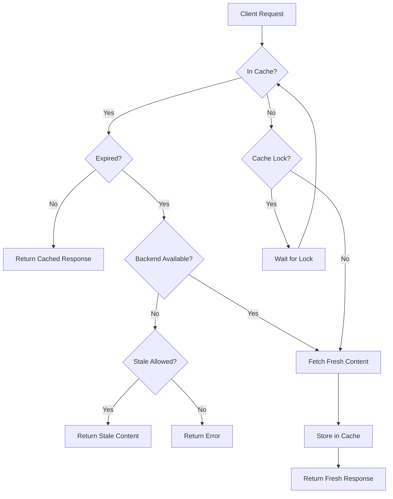

# How to Configure Caching in Nginx

Author: [nawazdhandala](https://www.github.com/nawazdhandala)

Tags: Nginx, Caching, Performance, Optimization, Web Server

Description: A complete guide to configuring Nginx caching for static assets and proxy responses, including cache zones, purging strategies, and performance tuning.

---

Caching stores frequently requested content closer to clients, reducing backend load and improving response times. Nginx supports two types of caching: static file caching with browser cache headers, and proxy caching where Nginx stores backend responses on disk. This guide covers both approaches with practical configurations.

## Browser Caching for Static Files

The simplest form of caching tells browsers to store static files locally:

```nginx
server {
    listen 80;
    server_name example.com;

    # Static files with long cache duration
    location /static/ {
        alias /var/www/static/;

        # Cache for 30 days
        expires 30d;

        # Add cache control header
        add_header Cache-Control "public, immutable";
    }

    # Images
    location ~* \.(jpg|jpeg|png|gif|ico|svg|webp)$ {
        root /var/www;
        expires 1y;  # Cache images for 1 year
        add_header Cache-Control "public, immutable";
        access_log off;  # Don't log static file requests
    }

    # CSS and JavaScript
    location ~* \.(css|js)$ {
        root /var/www;
        expires 7d;  # Cache for 1 week
        add_header Cache-Control "public";
    }
}
```

The `immutable` directive tells browsers the file will never change, preventing revalidation requests.

## Proxy Cache Configuration

For dynamic content, Nginx can cache backend responses:

```nginx
# /etc/nginx/nginx.conf (http block)

http {
    # Define cache zone
    # levels: directory structure (2:2 = two levels, two characters each)
    # keys_zone: name and size for storing cache keys in memory
    # max_size: maximum disk space for cached content
    # inactive: remove items not accessed for this duration
    proxy_cache_path /var/cache/nginx/proxy
                     levels=1:2
                     keys_zone=api_cache:10m
                     max_size=1g
                     inactive=60m
                     use_temp_path=off;

    include /etc/nginx/conf.d/*.conf;
}
```

Apply caching in your server block:

```nginx
# /etc/nginx/conf.d/api.conf

upstream backend {
    server 127.0.0.1:3000;
    keepalive 32;
}

server {
    listen 80;
    server_name api.example.com;

    location /api/ {
        proxy_pass http://backend;

        # Enable caching
        proxy_cache api_cache;

        # Cache successful responses for 10 minutes
        proxy_cache_valid 200 10m;

        # Cache 404 responses briefly
        proxy_cache_valid 404 1m;

        # Cache key (determines what makes a unique cached item)
        proxy_cache_key $scheme$request_method$host$request_uri;

        # Add header to show cache status (HIT, MISS, BYPASS)
        add_header X-Cache-Status $upstream_cache_status;

        proxy_set_header Host $host;
        proxy_set_header X-Real-IP $remote_addr;
    }
}
```

## Understanding Cache Status

The `$upstream_cache_status` variable shows what happened with each request:

| Status | Meaning |
|--------|---------|
| MISS | Response not in cache, fetched from backend |
| HIT | Response served from cache |
| EXPIRED | Cache entry expired, fetched fresh response |
| STALE | Served stale content (backend unavailable) |
| BYPASS | Cache bypassed due to configuration |
| REVALIDATED | Cache entry revalidated with backend |

## Cache Bypass Conditions

Skip the cache for certain requests:

```nginx
location /api/ {
    proxy_pass http://backend;
    proxy_cache api_cache;

    # Bypass cache for requests with Authorization header
    proxy_cache_bypass $http_authorization;

    # Bypass cache for requests with specific cookie
    proxy_cache_bypass $cookie_nocache;

    # Don't cache POST requests
    proxy_cache_methods GET HEAD;

    # Don't cache responses with Set-Cookie header
    proxy_no_cache $http_set_cookie;

    proxy_cache_valid 200 10m;
    add_header X-Cache-Status $upstream_cache_status;
}
```

## Conditional Caching with Maps

Use map blocks for complex bypass logic:

```nginx
http {
    # Don't cache authenticated users
    map $http_authorization $skip_cache {
        default 0;
        "~*Bearer" 1;  # Skip if Bearer token present
    }

    # Don't cache admin paths
    map $request_uri $skip_cache_uri {
        default 0;
        "~*/admin" 1;
        "~*/dashboard" 1;
    }

    proxy_cache_path /var/cache/nginx levels=1:2
                     keys_zone=app_cache:10m max_size=1g;
}
```

```nginx
server {
    listen 80;
    server_name app.example.com;

    location / {
        proxy_pass http://backend;
        proxy_cache app_cache;

        # Apply bypass conditions
        proxy_cache_bypass $skip_cache $skip_cache_uri;
        proxy_no_cache $skip_cache $skip_cache_uri;

        proxy_cache_valid 200 5m;
        add_header X-Cache-Status $upstream_cache_status;
    }
}
```

## Stale Content Serving

Serve stale content when the backend is unavailable:

```nginx
location /api/ {
    proxy_pass http://backend;
    proxy_cache api_cache;

    # Serve stale content in these error situations
    proxy_cache_use_stale error timeout updating http_500 http_502 http_503 http_504;

    # Background update while serving stale
    proxy_cache_background_update on;

    # Only one request updates the cache (others get stale)
    proxy_cache_lock on;
    proxy_cache_lock_timeout 5s;

    proxy_cache_valid 200 10m;
    add_header X-Cache-Status $upstream_cache_status;
}
```

## Cache Purging

Remove specific items from the cache. This requires the ngx_cache_purge module or manual deletion:

```nginx
# With ngx_cache_purge module
location ~ /purge(/.*) {
    allow 127.0.0.1;  # Only allow from localhost
    deny all;
    proxy_cache_purge api_cache $scheme$request_method$host$1;
}
```

Without the module, delete files manually:

```bash
# Find and delete cached item by URL
grep -r "KEY: GEThttp://api.example.com/api/users" /var/cache/nginx/proxy/ | \
    cut -d: -f1 | xargs rm -f

# Or clear entire cache
rm -rf /var/cache/nginx/proxy/*
```

## Microcaching for Dynamic Content

Cache dynamic responses for very short periods to absorb traffic spikes:

```nginx
http {
    proxy_cache_path /var/cache/nginx/micro
                     levels=1:2
                     keys_zone=micro_cache:5m
                     max_size=100m
                     inactive=1m;
}
```

```nginx
server {
    listen 80;
    server_name api.example.com;

    location /api/ {
        proxy_pass http://backend;
        proxy_cache micro_cache;

        # Cache for just 1 second
        proxy_cache_valid 200 1s;

        # Lock prevents thundering herd
        proxy_cache_lock on;
        proxy_cache_lock_age 1s;
        proxy_cache_lock_timeout 1s;

        # Serve stale while updating
        proxy_cache_use_stale updating;

        add_header X-Cache-Status $upstream_cache_status;
    }
}
```

This 1-second cache dramatically reduces backend load during traffic spikes while keeping content fresh.

## Complete Production Configuration

A comprehensive caching setup for a production application:

```nginx
# /etc/nginx/nginx.conf

http {
    # Static asset cache (browser caching)
    map $sent_http_content_type $cache_control {
        default                    "public, max-age=3600";
        text/html                  "no-cache";
        text/css                   "public, max-age=604800, immutable";
        application/javascript     "public, max-age=604800, immutable";
        ~image/                    "public, max-age=31536000, immutable";
    }

    # Proxy cache zones
    proxy_cache_path /var/cache/nginx/api
                     levels=1:2
                     keys_zone=api_cache:20m
                     max_size=2g
                     inactive=60m
                     use_temp_path=off;

    proxy_cache_path /var/cache/nginx/static
                     levels=1:2
                     keys_zone=static_cache:10m
                     max_size=5g
                     inactive=7d
                     use_temp_path=off;

    include /etc/nginx/conf.d/*.conf;
}
```

```nginx
# /etc/nginx/conf.d/app.conf

upstream app_backend {
    server 127.0.0.1:3000;
    keepalive 32;
}

server {
    listen 443 ssl http2;
    server_name app.example.com;

    ssl_certificate /etc/ssl/certs/app.example.com.crt;
    ssl_certificate_key /etc/ssl/private/app.example.com.key;

    # Apply dynamic cache control header
    add_header Cache-Control $cache_control;

    # Static files (served directly, browser cached)
    location /static/ {
        alias /var/www/app/static/;
        expires 1y;
        add_header Cache-Control "public, immutable";
        access_log off;
    }

    # API with proxy caching
    location /api/ {
        proxy_pass http://app_backend;

        proxy_cache api_cache;
        proxy_cache_valid 200 5m;
        proxy_cache_valid 404 1m;
        proxy_cache_key $scheme$request_method$host$request_uri;

        proxy_cache_bypass $http_authorization $cookie_session;
        proxy_no_cache $http_authorization $cookie_session;

        proxy_cache_use_stale error timeout updating http_500 http_502 http_503;
        proxy_cache_background_update on;
        proxy_cache_lock on;

        add_header X-Cache-Status $upstream_cache_status always;

        proxy_http_version 1.1;
        proxy_set_header Connection "";
        proxy_set_header Host $host;
        proxy_set_header X-Real-IP $remote_addr;
    }

    # Application (no caching)
    location / {
        proxy_pass http://app_backend;
        add_header Cache-Control "no-store";

        proxy_set_header Host $host;
        proxy_set_header X-Real-IP $remote_addr;
    }
}
```

## Caching Flow Diagram



## Monitoring Cache Performance

Check cache effectiveness:

```bash
# View cache status from logs
grep -o "X-Cache-Status: [A-Z]*" /var/log/nginx/access.log | sort | uniq -c

# Check cache directory size
du -sh /var/cache/nginx/*

# Monitor cache in real time
watch -n 1 'du -sh /var/cache/nginx/api'
```

---

Effective caching reduces backend load, improves response times, and helps your infrastructure handle traffic spikes. Start with browser caching for static assets, add proxy caching for API responses, and use microcaching for dynamic content that changes frequently. Monitor cache hit rates and adjust TTLs based on your content update patterns.
