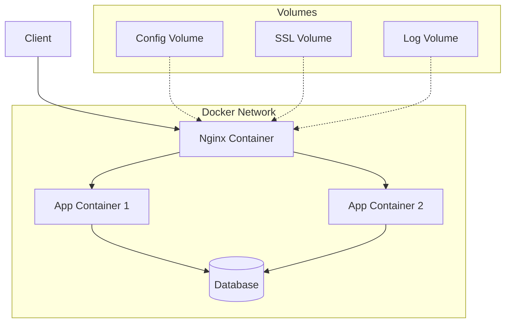

# How to Run Nginx in Docker

Author: [nawazdhandala](https://www.github.com/nawazdhandala)

Tags: Nginx, Docker, Containers, DevOps, Deployment

Description: Learn how to run Nginx in Docker containers, including configuration management, SSL certificates, logging, and production deployment patterns.

---

Running Nginx in Docker containers provides consistent deployments, easy scaling, and simplified configuration management. This guide covers everything from basic container setup to production-ready configurations with SSL, custom configs, and Docker Compose orchestration.

## Quick Start

Run Nginx with a single command:

```bash
# Run Nginx on port 80
docker run -d -p 80:80 nginx

# Run with a name
docker run -d --name my-nginx -p 80:80 nginx

# Run specific version
docker run -d --name my-nginx -p 80:80 nginx:1.25
```

## Serving Static Content

Mount a local directory to serve static files:

```bash
# Create content directory
mkdir -p /var/www/html
echo "<h1>Hello from Nginx in Docker</h1>" > /var/www/html/index.html

# Run with volume mount
docker run -d \
    --name nginx-static \
    -p 80:80 \
    -v /var/www/html:/usr/share/nginx/html:ro \
    nginx
```

The `:ro` flag mounts the volume as read-only for security.

## Custom Configuration

Mount a custom nginx.conf:

```bash
# Create custom config directory
mkdir -p ~/nginx/conf.d

# Create configuration file
cat > ~/nginx/nginx.conf << 'EOF'
user nginx;
worker_processes auto;
error_log /var/log/nginx/error.log warn;
pid /var/run/nginx.pid;

events {
    worker_connections 1024;
}

http {
    include /etc/nginx/mime.types;
    default_type application/octet-stream;

    log_format main '$remote_addr - $remote_user [$time_local] '
                    '"$request" $status $body_bytes_sent '
                    '"$http_referer" "$http_user_agent"';

    access_log /var/log/nginx/access.log main;
    sendfile on;
    keepalive_timeout 65;

    include /etc/nginx/conf.d/*.conf;
}
EOF

# Run with custom config
docker run -d \
    --name nginx-custom \
    -p 80:80 \
    -v ~/nginx/nginx.conf:/etc/nginx/nginx.conf:ro \
    -v ~/nginx/conf.d:/etc/nginx/conf.d:ro \
    nginx
```

## Reverse Proxy Configuration

Configure Nginx as a reverse proxy in Docker:

```nginx
# ~/nginx/conf.d/proxy.conf

upstream app_backend {
    server app:3000;  # Docker network service name
}

server {
    listen 80;
    server_name example.com;

    location / {
        proxy_pass http://app_backend;
        proxy_http_version 1.1;
        proxy_set_header Host $host;
        proxy_set_header X-Real-IP $remote_addr;
        proxy_set_header X-Forwarded-For $proxy_add_x_forwarded_for;
        proxy_set_header X-Forwarded-Proto $scheme;
    }
}
```

Run on a Docker network:

```bash
# Create network
docker network create app-network

# Run backend app
docker run -d --name app --network app-network my-app:latest

# Run Nginx
docker run -d \
    --name nginx-proxy \
    --network app-network \
    -p 80:80 \
    -v ~/nginx/conf.d:/etc/nginx/conf.d:ro \
    nginx
```

## Docker Compose Setup

Define multi-container deployments with Docker Compose:

```yaml
# docker-compose.yml

version: '3.8'

services:
  nginx:
    image: nginx:1.25
    container_name: nginx
    ports:
      - "80:80"
      - "443:443"
    volumes:
      - ./nginx/nginx.conf:/etc/nginx/nginx.conf:ro
      - ./nginx/conf.d:/etc/nginx/conf.d:ro
      - ./nginx/ssl:/etc/nginx/ssl:ro
      - ./nginx/logs:/var/log/nginx
      - ./static:/var/www/static:ro
    depends_on:
      - app
    networks:
      - app-network
    restart: unless-stopped

  app:
    image: my-app:latest
    container_name: app
    expose:
      - "3000"
    environment:
      - NODE_ENV=production
    networks:
      - app-network
    restart: unless-stopped

networks:
  app-network:
    driver: bridge
```

## SSL/TLS Configuration

Configure SSL with certificates mounted from host:

```yaml
# docker-compose.yml with SSL

services:
  nginx:
    image: nginx:1.25
    ports:
      - "80:80"
      - "443:443"
    volumes:
      - ./nginx/conf.d:/etc/nginx/conf.d:ro
      - ./nginx/ssl:/etc/nginx/ssl:ro
      - /etc/letsencrypt:/etc/letsencrypt:ro
    restart: unless-stopped
```

```nginx
# nginx/conf.d/ssl.conf

server {
    listen 80;
    server_name example.com;
    return 301 https://$server_name$request_uri;
}

server {
    listen 443 ssl http2;
    server_name example.com;

    ssl_certificate /etc/letsencrypt/live/example.com/fullchain.pem;
    ssl_certificate_key /etc/letsencrypt/live/example.com/privkey.pem;

    ssl_protocols TLSv1.2 TLSv1.3;
    ssl_prefer_server_ciphers off;

    location / {
        proxy_pass http://app:3000;
        proxy_set_header Host $host;
        proxy_set_header X-Real-IP $remote_addr;
        proxy_set_header X-Forwarded-For $proxy_add_x_forwarded_for;
        proxy_set_header X-Forwarded-Proto $scheme;
    }
}
```

## Custom Dockerfile

Build a custom Nginx image with your configuration baked in:

```dockerfile
# Dockerfile

FROM nginx:1.25

# Remove default configuration
RUN rm /etc/nginx/conf.d/default.conf

# Copy custom configuration
COPY nginx.conf /etc/nginx/nginx.conf
COPY conf.d/ /etc/nginx/conf.d/

# Copy static files
COPY static/ /var/www/static/

# Set proper permissions
RUN chown -R nginx:nginx /var/www/static

# Health check
HEALTHCHECK --interval=30s --timeout=3s --start-period=5s --retries=3 \
    CMD curl -f http://localhost/health || exit 1

EXPOSE 80 443

CMD ["nginx", "-g", "daemon off;"]
```

Build and run:

```bash
# Build image
docker build -t my-nginx:latest .

# Run container
docker run -d --name nginx -p 80:80 my-nginx:latest
```

## Environment Variables in Configuration

Use environment variables in Nginx config with envsubst:

```nginx
# nginx/templates/default.conf.template

upstream backend {
    server ${BACKEND_HOST}:${BACKEND_PORT};
}

server {
    listen 80;
    server_name ${SERVER_NAME};

    location / {
        proxy_pass http://backend;
        proxy_set_header Host $host;
    }
}
```

```yaml
# docker-compose.yml

services:
  nginx:
    image: nginx:1.25
    ports:
      - "80:80"
    volumes:
      - ./nginx/templates:/etc/nginx/templates:ro
    environment:
      - BACKEND_HOST=app
      - BACKEND_PORT=3000
      - SERVER_NAME=example.com
```

The official Nginx image automatically processes templates in `/etc/nginx/templates/`.

## Logging Configuration

Configure logging with Docker:

```yaml
# docker-compose.yml with logging

services:
  nginx:
    image: nginx:1.25
    ports:
      - "80:80"
    volumes:
      - ./nginx/conf.d:/etc/nginx/conf.d:ro
      - nginx-logs:/var/log/nginx
    logging:
      driver: "json-file"
      options:
        max-size: "10m"
        max-file: "3"

volumes:
  nginx-logs:
```

Or send logs to stdout/stderr:

```nginx
# nginx.conf

http {
    access_log /dev/stdout main;
    error_log /dev/stderr warn;
}
```

## Health Checks

Add health checking to your container:

```dockerfile
# Dockerfile with health check

FROM nginx:1.25

COPY conf.d/ /etc/nginx/conf.d/

HEALTHCHECK --interval=30s --timeout=3s --start-period=5s --retries=3 \
    CMD curl -f http://localhost/health || exit 1
```

```nginx
# conf.d/health.conf

server {
    listen 80;

    location /health {
        access_log off;
        return 200 "OK\n";
        add_header Content-Type text/plain;
    }
}
```

```yaml
# docker-compose.yml with health check

services:
  nginx:
    image: nginx:1.25
    healthcheck:
      test: ["CMD", "curl", "-f", "http://localhost/health"]
      interval: 30s
      timeout: 3s
      retries: 3
      start_period: 10s
```

## Production Docker Compose

A complete production configuration:

```yaml
# docker-compose.prod.yml

version: '3.8'

services:
  nginx:
    image: nginx:1.25-alpine
    container_name: nginx
    ports:
      - "80:80"
      - "443:443"
    volumes:
      - ./nginx/nginx.conf:/etc/nginx/nginx.conf:ro
      - ./nginx/conf.d:/etc/nginx/conf.d:ro
      - ./nginx/ssl:/etc/nginx/ssl:ro
      - /etc/letsencrypt:/etc/letsencrypt:ro
      - static-files:/var/www/static:ro
    depends_on:
      app:
        condition: service_healthy
    networks:
      - frontend
      - backend
    healthcheck:
      test: ["CMD", "curl", "-f", "http://localhost/health"]
      interval: 30s
      timeout: 5s
      retries: 3
    restart: always
    deploy:
      resources:
        limits:
          cpus: '1'
          memory: 256M
    logging:
      driver: "json-file"
      options:
        max-size: "50m"
        max-file: "5"

  app:
    image: my-app:${APP_VERSION:-latest}
    container_name: app
    expose:
      - "3000"
    environment:
      - NODE_ENV=production
      - DATABASE_URL=${DATABASE_URL}
    networks:
      - backend
    healthcheck:
      test: ["CMD", "curl", "-f", "http://localhost:3000/health"]
      interval: 30s
      timeout: 5s
      retries: 3
    restart: always
    deploy:
      resources:
        limits:
          cpus: '2'
          memory: 512M

networks:
  frontend:
  backend:

volumes:
  static-files:
```

## Multi-Stage Build for Static Sites

Build and serve static sites efficiently:

```dockerfile
# Dockerfile for React app with Nginx

# Build stage
FROM node:18-alpine AS builder
WORKDIR /app
COPY package*.json ./
RUN npm ci
COPY . .
RUN npm run build

# Production stage
FROM nginx:1.25-alpine
COPY --from=builder /app/build /usr/share/nginx/html
COPY nginx.conf /etc/nginx/nginx.conf
EXPOSE 80
CMD ["nginx", "-g", "daemon off;"]
```

## Container Architecture



## Useful Commands

Common Docker commands for Nginx:

```bash
# View logs
docker logs nginx
docker logs -f nginx  # Follow logs

# Reload configuration (without restart)
docker exec nginx nginx -s reload

# Test configuration
docker exec nginx nginx -t

# Enter container shell
docker exec -it nginx /bin/sh

# Check running config
docker exec nginx nginx -T

# View container stats
docker stats nginx

# Inspect container
docker inspect nginx
```

---

Running Nginx in Docker provides portable, reproducible deployments. Use volume mounts for configuration flexibility, Docker networks for secure container communication, and health checks for reliability. For production, use Docker Compose with proper logging, resource limits, and restart policies to ensure your Nginx containers run reliably.
