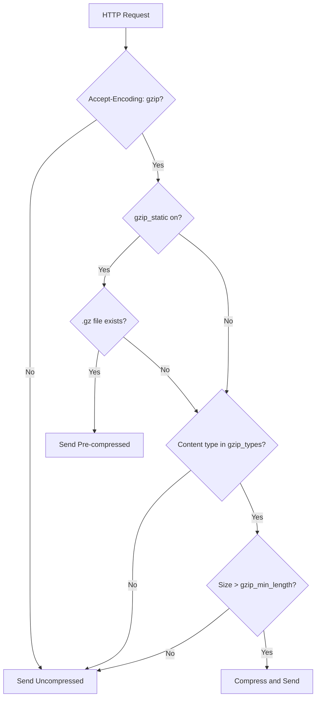

# How to Configure Gzip Compression in Nginx

Author: [nawazdhandala](https://www.github.com/nawazdhandala)

Tags: Nginx, Gzip, Compression, Performance, Optimization

Description: Learn how to configure Gzip compression in Nginx to reduce bandwidth usage and improve page load times, with practical examples and performance tuning tips.

---

Gzip compression reduces the size of HTTP responses before sending them to clients, resulting in faster page loads and lower bandwidth costs. Nginx handles compression efficiently, compressing responses on-the-fly without affecting backend servers. This guide covers configuring Gzip for optimal performance across different content types.

## Why Use Gzip Compression?

Compression benefits are significant for text-based content:

| Content Type | Typical Compression Ratio |
|--------------|--------------------------|
| HTML | 70-90% reduction |
| CSS | 80-90% reduction |
| JavaScript | 70-85% reduction |
| JSON | 75-90% reduction |
| XML | 80-90% reduction |

A 100KB JavaScript file might compress to 20KB, dramatically reducing transfer time on slower connections.

## Basic Gzip Configuration

Enable Gzip compression in your Nginx configuration:

```nginx
# /etc/nginx/nginx.conf (http block)

http {
    # Enable gzip compression
    gzip on;

    # Minimum file size to compress (smaller files aren't worth it)
    gzip_min_length 1000;

    # Compression level (1-9, higher = more compression, more CPU)
    gzip_comp_level 5;

    # MIME types to compress
    gzip_types
        text/plain
        text/css
        text/javascript
        application/javascript
        application/json
        application/xml
        text/xml
        application/xml+rss
        image/svg+xml;

    include /etc/nginx/conf.d/*.conf;
}
```

## Understanding Gzip Directives

Each directive controls a specific aspect of compression:

```nginx
http {
    # Master switch for compression
    gzip on;

    # Compression level: 1 (fastest) to 9 (smallest)
    # 5-6 offers best balance of speed and compression
    gzip_comp_level 5;

    # Skip files smaller than this (bytes)
    gzip_min_length 256;

    # Number and size of compression buffers
    gzip_buffers 16 8k;

    # Add Vary: Accept-Encoding header for proper caching
    gzip_vary on;

    # Compress responses for proxied requests
    gzip_proxied any;

    # Disable for old browsers (IE6)
    gzip_disable "msie6";

    # MIME types to compress
    gzip_types
        text/plain
        text/css
        text/javascript
        application/javascript
        application/json
        application/xml
        text/xml;
}
```

## Complete MIME Type List

Include all compressible content types:

```nginx
gzip_types
    # Text formats
    text/plain
    text/css
    text/csv
    text/javascript
    text/xml

    # Application formats
    application/javascript
    application/x-javascript
    application/json
    application/xml
    application/xml+rss
    application/atom+xml
    application/rss+xml

    # Fonts
    font/opentype
    font/ttf
    font/eot
    font/otf
    application/font-woff
    application/font-woff2
    application/vnd.ms-fontobject

    # Images (text-based only)
    image/svg+xml
    image/x-icon

    # Other
    application/xhtml+xml
    application/manifest+json
    application/x-web-app-manifest+json;
```

Note: Binary formats like JPEG, PNG, and GIF are already compressed. Gzip adds overhead without benefit for these types.

## Proxied Request Compression

When Nginx acts as a reverse proxy, control compression for proxied responses:

```nginx
http {
    gzip on;
    gzip_comp_level 5;

    # Compress proxied responses based on these conditions
    # "any" compresses all proxied requests
    # Specific options allow fine-grained control
    gzip_proxied any;

    # Alternative: specify which proxied responses to compress
    # gzip_proxied expired no-cache no-store private auth;

    gzip_types text/plain text/css application/javascript application/json;
}
```

The `gzip_proxied` directive options:

| Option | Compresses when |
|--------|-----------------|
| off | Never compress proxied |
| expired | Expires header allows caching |
| no-cache | Cache-Control: no-cache |
| no-store | Cache-Control: no-store |
| private | Cache-Control: private |
| no_last_modified | No Last-Modified header |
| no_etag | No ETag header |
| auth | Authorization header present |
| any | Always compress |

## Pre-Compressed Files with gzip_static

For maximum performance, serve pre-compressed files:

```nginx
http {
    # Serve pre-compressed .gz files if they exist
    gzip_static on;

    # Fall back to on-the-fly compression
    gzip on;
    gzip_comp_level 5;
    gzip_types text/plain text/css application/javascript;
}
```

Create compressed versions during your build process:

```bash
# Compress static files at maximum level
find /var/www/static -type f \( -name "*.js" -o -name "*.css" -o -name "*.html" \) \
    -exec gzip -9 -k {} \;
```

This creates `.gz` files alongside originals. Nginx serves the pre-compressed version when clients support it.

## Server Block Configuration

Apply compression settings per server or location:

```nginx
server {
    listen 80;
    server_name example.com;

    # Enable gzip for this server
    gzip on;
    gzip_comp_level 6;
    gzip_min_length 256;
    gzip_types text/plain text/css application/javascript application/json;

    # Static files with pre-compression
    location /static/ {
        alias /var/www/static/;
        gzip_static on;
        expires 1y;
    }

    # API responses compressed on-the-fly
    location /api/ {
        proxy_pass http://127.0.0.1:3000;

        # Compress even if backend doesn't
        gzip on;
        gzip_proxied any;
        gzip_types application/json;
    }

    # Disable compression for already-compressed downloads
    location /downloads/ {
        alias /var/www/downloads/;
        gzip off;
    }
}
```

## Testing Compression

Verify compression is working:

```bash
# Check if response is compressed
curl -H "Accept-Encoding: gzip" -I https://example.com/

# Look for: Content-Encoding: gzip

# Compare compressed vs uncompressed size
curl -so /dev/null -w '%{size_download}' https://example.com/style.css
curl -so /dev/null -w '%{size_download}' -H "Accept-Encoding: gzip" https://example.com/style.css

# Download and check actual compression
curl -H "Accept-Encoding: gzip" https://example.com/style.css | gunzip | wc -c
```

## Performance Tuning

Balance compression ratio against CPU usage:

```nginx
http {
    gzip on;

    # Compression levels and their characteristics:
    # 1: Fastest, least compression (~50-60% reduction)
    # 5: Good balance (~70-80% reduction)
    # 9: Best compression, slowest (~80-85% reduction)

    # For high-traffic sites, use lower levels
    gzip_comp_level 4;

    # Skip tiny files (not worth the CPU)
    gzip_min_length 1000;

    # Allocate compression buffers
    gzip_buffers 32 4k;

    gzip_types text/plain text/css application/javascript application/json;
}
```

## Complete Production Configuration

A production-ready Gzip configuration:

```nginx
# /etc/nginx/conf.d/gzip.conf

# Enable compression
gzip on;

# Compression level (4-6 recommended for production)
gzip_comp_level 5;

# Minimum size to compress
gzip_min_length 256;

# Compress for proxied requests
gzip_proxied any;

# Add Vary header for proper proxy caching
gzip_vary on;

# Compression buffers
gzip_buffers 16 8k;

# Enable for HTTP/1.0 clients
gzip_http_version 1.0;

# Don't compress for old IE
gzip_disable "MSIE [1-6]\.";

# Comprehensive type list
gzip_types
    text/plain
    text/css
    text/csv
    text/xml
    text/javascript
    application/javascript
    application/x-javascript
    application/json
    application/xml
    application/xml+rss
    application/atom+xml
    application/xhtml+xml
    application/manifest+json
    font/opentype
    font/ttf
    font/otf
    image/svg+xml
    image/x-icon;
```

Include this file in your main configuration:

```nginx
# /etc/nginx/nginx.conf

http {
    include /etc/nginx/mime.types;
    include /etc/nginx/conf.d/gzip.conf;
    include /etc/nginx/conf.d/*.conf;
}
```

## Compression Decision Flow



## Monitoring Compression

Track compression effectiveness in your logs:

```nginx
# Custom log format showing compression
log_format compression '$remote_addr - [$time_local] '
                       '"$request" $status '
                       '$body_bytes_sent/$gzip_ratio '
                       '"$http_accept_encoding"';

server {
    access_log /var/log/nginx/access.log compression;
}
```

Analyze compression ratios:

```bash
# Calculate average compression ratio
awk '{split($5,a,"/"); if(a[2]>0) sum+=a[2]; count++} END {print sum/count}' \
    /var/log/nginx/access.log
```

---

Gzip compression significantly reduces bandwidth usage and improves load times for text-based content. Use compression level 4-6 for the best balance of CPU usage and compression ratio. Enable `gzip_static` and pre-compress files during build for maximum performance on static assets. Always test that compression is active and monitor the impact on your server resources.
