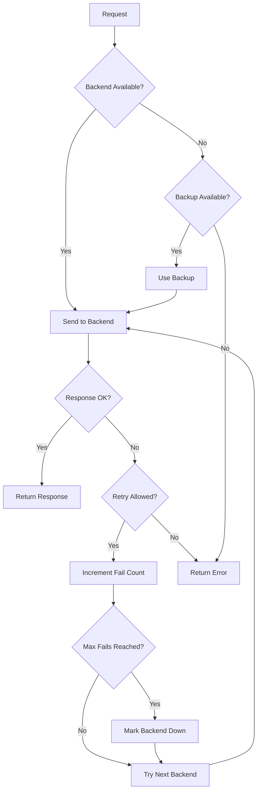

# How to Implement Health Checks in Nginx

Author: [nawazdhandala](https://www.github.com/nawazdhandala)

Tags: Nginx, Health Checks, Load Balancing, High Availability, Monitoring

Description: Learn how to implement health checks in Nginx to automatically detect and route around failed backend servers, ensuring high availability for your applications.

---

Health checks monitor the availability of backend servers and automatically remove unhealthy instances from the load balancing pool. Nginx Open Source provides passive health checks that detect failures during normal request processing. This guide covers configuring health checks for reliable load balancing and high availability.

## Passive vs Active Health Checks

Nginx supports two approaches to health checking:

| Type | Description | Availability |
|------|-------------|--------------|
| Passive | Monitors responses during normal traffic | Nginx Open Source |
| Active | Sends probe requests independent of traffic | Nginx Plus (commercial) |

This guide focuses on passive health checks available in the open-source version, with workarounds to achieve active-like behavior.

## Basic Passive Health Checks

Configure failure detection thresholds for upstream servers:

```nginx
upstream backend {
    # Server marked unhealthy after 3 failures within 30 seconds
    server 192.168.1.10:8080 max_fails=3 fail_timeout=30s;
    server 192.168.1.11:8080 max_fails=3 fail_timeout=30s;
    server 192.168.1.12:8080 max_fails=3 fail_timeout=30s;
}

server {
    listen 80;
    server_name app.example.com;

    location / {
        proxy_pass http://backend;
        proxy_set_header Host $host;
        proxy_set_header X-Real-IP $remote_addr;
    }
}
```

Parameters explained:
- `max_fails`: Number of failed requests before server is marked down
- `fail_timeout`: Time window for counting failures AND recovery wait time

## Defining What Counts as Failure

By default, Nginx considers connection errors and timeouts as failures. Expand this to include HTTP error codes:

```nginx
upstream backend {
    server 192.168.1.10:8080 max_fails=3 fail_timeout=30s;
    server 192.168.1.11:8080 max_fails=3 fail_timeout=30s;
}

server {
    listen 80;
    server_name app.example.com;

    location / {
        proxy_pass http://backend;

        # Define what triggers failover to next server
        proxy_next_upstream error timeout http_500 http_502 http_503 http_504;

        # Limit retry attempts
        proxy_next_upstream_tries 3;

        # Timeout for trying next upstream
        proxy_next_upstream_timeout 10s;

        proxy_set_header Host $host;
        proxy_set_header X-Real-IP $remote_addr;
    }
}
```

The `proxy_next_upstream` directive specifies which conditions trigger a retry on another server.

## Connection and Timeout Settings

Fine-tune timeouts to detect failures quickly without false positives:

```nginx
upstream backend {
    server 192.168.1.10:8080 max_fails=3 fail_timeout=30s;
    server 192.168.1.11:8080 max_fails=3 fail_timeout=30s;
}

server {
    listen 80;
    server_name app.example.com;

    location / {
        proxy_pass http://backend;

        # How long to wait for connection
        proxy_connect_timeout 5s;

        # How long to wait for response
        proxy_read_timeout 30s;

        # How long to wait when sending request
        proxy_send_timeout 30s;

        # Failover conditions
        proxy_next_upstream error timeout http_500 http_502 http_503;

        proxy_set_header Host $host;
        proxy_set_header X-Real-IP $remote_addr;
    }
}
```

Shorter timeouts detect failures faster but may cause false positives on slow endpoints.

## Backup Servers

Configure backup servers that only receive traffic when primary servers fail:

```nginx
upstream backend {
    # Primary servers
    server 192.168.1.10:8080 max_fails=3 fail_timeout=30s;
    server 192.168.1.11:8080 max_fails=3 fail_timeout=30s;

    # Backup server (only used when all primaries are down)
    server 192.168.1.20:8080 backup;

    # Maintenance server (never receives traffic automatically)
    server 192.168.1.30:8080 down;
}
```

Backup servers provide failover capacity without participating in normal load balancing.

## Implementing Active-Like Health Checks

Work around the lack of active health checks using external monitoring:

```bash
#!/bin/bash
# health_check.sh - External health checker

SERVERS=("192.168.1.10:8080" "192.168.1.11:8080" "192.168.1.12:8080")
HEALTH_ENDPOINT="/health"
CONFIG_DIR="/etc/nginx/conf.d/upstreams"

for server in "${SERVERS[@]}"; do
    # Check server health
    if curl -sf "http://${server}${HEALTH_ENDPOINT}" > /dev/null 2>&1; then
        # Server healthy - ensure it's in the upstream
        echo "server ${server};" > "${CONFIG_DIR}/${server//[:.]/}.conf"
    else
        # Server unhealthy - remove from upstream
        rm -f "${CONFIG_DIR}/${server//[:.]/}.conf"
    fi
done

# Reload Nginx if config changed
nginx -t && nginx -s reload
```

Use dynamic upstream configuration:

```nginx
upstream backend {
    include /etc/nginx/conf.d/upstreams/*.conf;
}
```

Run the health check script periodically with cron or systemd timer.

## Health Check Endpoint in Your Application

Create a dedicated health endpoint in your backend application:

```python
# Python Flask example
from flask import Flask, jsonify
import psycopg2

app = Flask(__name__)

@app.route('/health')
def health_check():
    checks = {
        'database': check_database(),
        'cache': check_cache(),
        'status': 'healthy'
    }

    if all(checks.values()):
        return jsonify(checks), 200
    else:
        checks['status'] = 'unhealthy'
        return jsonify(checks), 503

def check_database():
    try:
        conn = psycopg2.connect("postgresql://localhost/app")
        conn.close()
        return True
    except:
        return False

def check_cache():
    # Check Redis connectivity
    try:
        import redis
        r = redis.Redis()
        r.ping()
        return True
    except:
        return False
```

## Nginx Health Endpoint

Expose a health endpoint at the Nginx layer for external monitoring:

```nginx
server {
    listen 80;
    server_name app.example.com;

    # Health endpoint for external monitors (Kubernetes, load balancers)
    location /nginx-health {
        access_log off;
        return 200 "healthy\n";
        add_header Content-Type text/plain;
    }

    # Proxy to backend with health checking
    location / {
        proxy_pass http://backend;
        proxy_next_upstream error timeout http_500 http_502 http_503;
        proxy_set_header Host $host;
    }
}
```

## Complete Production Configuration

A comprehensive health check configuration:

```nginx
# /etc/nginx/conf.d/healthcheck.conf

upstream app_backend {
    # Primary servers with health parameters
    server 10.0.1.10:8080 weight=5 max_fails=3 fail_timeout=30s;
    server 10.0.1.11:8080 weight=5 max_fails=3 fail_timeout=30s;
    server 10.0.1.12:8080 weight=3 max_fails=3 fail_timeout=30s;

    # Backup server
    server 10.0.1.20:8080 backup max_fails=2 fail_timeout=60s;

    # Connection pooling
    keepalive 32;
}

server {
    listen 443 ssl http2;
    server_name app.example.com;

    ssl_certificate /etc/ssl/certs/app.example.com.crt;
    ssl_certificate_key /etc/ssl/private/app.example.com.key;

    # Logging
    access_log /var/log/nginx/app_access.log;
    error_log /var/log/nginx/app_error.log;

    # Nginx health endpoint (for external monitoring)
    location = /nginx-health {
        access_log off;
        return 200 "OK";
        add_header Content-Type text/plain;
    }

    # Backend health endpoint (proxy to application)
    location = /health {
        proxy_pass http://app_backend;
        proxy_connect_timeout 5s;
        proxy_read_timeout 5s;

        # Don't count health check failures toward upstream health
        proxy_next_upstream off;

        access_log off;
    }

    # Application routes
    location / {
        proxy_pass http://app_backend;

        # HTTP/1.1 for keepalive
        proxy_http_version 1.1;
        proxy_set_header Connection "";

        # Timeouts
        proxy_connect_timeout 10s;
        proxy_send_timeout 60s;
        proxy_read_timeout 60s;

        # Failover conditions
        proxy_next_upstream error timeout http_500 http_502 http_503 http_504;
        proxy_next_upstream_tries 3;
        proxy_next_upstream_timeout 30s;

        # Headers
        proxy_set_header Host $host;
        proxy_set_header X-Real-IP $remote_addr;
        proxy_set_header X-Forwarded-For $proxy_add_x_forwarded_for;
        proxy_set_header X-Forwarded-Proto $scheme;
    }
}
```

## Health Check Flow



## Monitoring Upstream Health

Track server health status through logs and metrics:

```nginx
# Log format with upstream status
log_format upstream_health '$remote_addr - [$time_local] '
                           '"$request" $status '
                           'upstream: $upstream_addr '
                           'response_time: $upstream_response_time '
                           'status: $upstream_status';

server {
    access_log /var/log/nginx/upstream_health.log upstream_health;
}
```

Analyze health patterns:

```bash
# Count requests per upstream server
awk '{print $6}' /var/log/nginx/upstream_health.log | sort | uniq -c

# Find failed upstream responses
grep -E 'status: (500|502|503|504)' /var/log/nginx/upstream_health.log

# Calculate average response time per server
awk '{print $6, $8}' /var/log/nginx/upstream_health.log | \
    awk -F'[: ]' '{sum[$1]+=$3; count[$1]++} END {for(s in sum) print s, sum[s]/count[s]}'
```

## Integration with External Monitoring

Report Nginx health to monitoring systems like OneUptime:

```bash
#!/bin/bash
# Send health metrics to monitoring

NGINX_STATUS=$(curl -s http://localhost/nginx-health)
ACTIVE_UPSTREAMS=$(curl -s http://localhost/upstream-status | grep -c "up")

# Send to monitoring API
curl -X POST https://oneuptime.example.com/metrics \
    -H "Content-Type: application/json" \
    -d "{\"nginx_status\": \"${NGINX_STATUS}\", \"active_upstreams\": ${ACTIVE_UPSTREAMS}}"
```

---

Passive health checks in Nginx automatically detect and route around failed servers during normal operation. Configure appropriate failure thresholds, define what constitutes a failure, and use backup servers for failover capacity. Combine with external health checking scripts for proactive monitoring. This layered approach ensures your application remains available even when individual backend servers fail.
