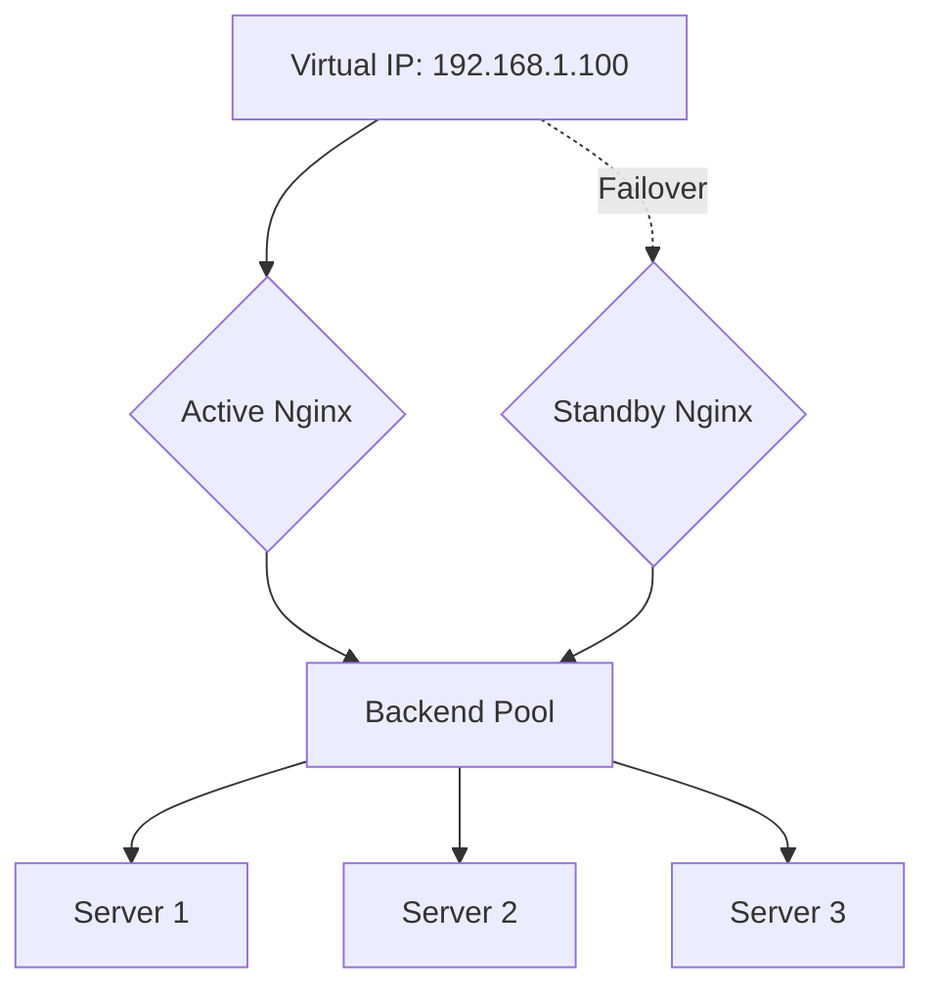
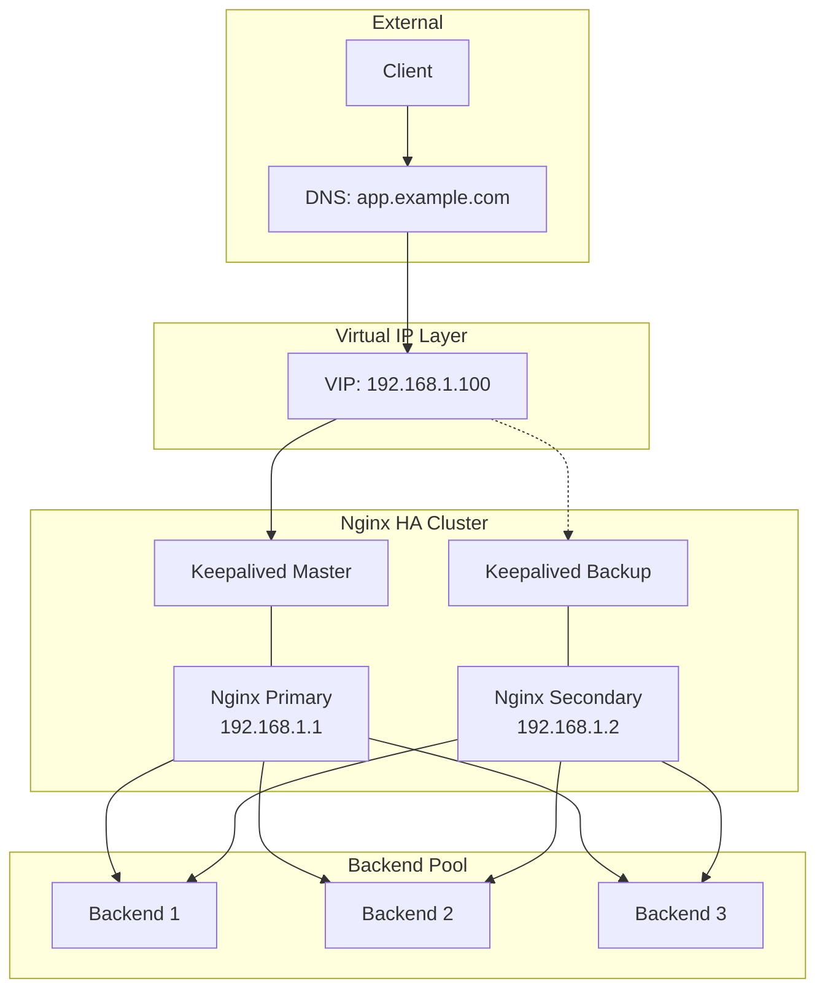

# How to Configure High Availability with Nginx

Author: [nawazdhandala](https://www.github.com/nawazdhandala)

Tags: Nginx, High Availability, Failover, Load Balancing, Reliability

Description: Learn how to configure high availability for Nginx deployments using active-passive failover with Keepalived, shared configuration, and health monitoring.

---

High availability ensures your web infrastructure remains accessible even when individual components fail. A single Nginx instance creates a single point of failure. This guide covers setting up redundant Nginx instances with automatic failover using Keepalived and virtual IPs.

## High Availability Architecture

A basic HA setup uses two Nginx servers sharing a virtual IP address:



## Installing Keepalived

Keepalived manages the virtual IP and handles failover. Install on both Nginx servers:

```bash
# Ubuntu/Debian
sudo apt update
sudo apt install keepalived

# CentOS/RHEL
sudo yum install keepalived
```

## Keepalived Configuration - Master

Configure the primary Nginx server:

```bash
# /etc/keepalived/keepalived.conf on nginx-primary

global_defs {
    router_id nginx_primary
    script_user root
    enable_script_security
}

# Health check script
vrrp_script check_nginx {
    script "/usr/local/bin/check_nginx.sh"
    interval 2              # Check every 2 seconds
    weight -20              # Reduce priority if check fails
    fall 3                  # Require 3 failures to fail
    rise 2                  # Require 2 successes to recover
}

vrrp_instance VI_1 {
    state MASTER            # Primary server
    interface eth0          # Network interface
    virtual_router_id 51    # Must match on both servers
    priority 100            # Higher priority = preferred master
    advert_int 1            # Advertisement interval

    authentication {
        auth_type PASS
        auth_pass secretpass  # Same on both servers
    }

    virtual_ipaddress {
        192.168.1.100/24    # Virtual IP address
    }

    track_script {
        check_nginx
    }

    notify_master "/usr/local/bin/notify_master.sh"
    notify_backup "/usr/local/bin/notify_backup.sh"
    notify_fault "/usr/local/bin/notify_fault.sh"
}
```

## Keepalived Configuration - Backup

Configure the secondary Nginx server:

```bash
# /etc/keepalived/keepalived.conf on nginx-backup

global_defs {
    router_id nginx_backup
    script_user root
    enable_script_security
}

vrrp_script check_nginx {
    script "/usr/local/bin/check_nginx.sh"
    interval 2
    weight -20
    fall 3
    rise 2
}

vrrp_instance VI_1 {
    state BACKUP            # Backup server
    interface eth0
    virtual_router_id 51    # Must match master
    priority 90             # Lower than master
    advert_int 1

    authentication {
        auth_type PASS
        auth_pass secretpass  # Same as master
    }

    virtual_ipaddress {
        192.168.1.100/24
    }

    track_script {
        check_nginx
    }

    notify_master "/usr/local/bin/notify_master.sh"
    notify_backup "/usr/local/bin/notify_backup.sh"
    notify_fault "/usr/local/bin/notify_fault.sh"
}
```

## Health Check Script

Create a script to verify Nginx is healthy:

```bash
#!/bin/bash
# /usr/local/bin/check_nginx.sh

# Check if Nginx process is running
if ! pgrep -x "nginx" > /dev/null; then
    exit 1
fi

# Check if Nginx responds to requests
if ! curl -sf http://127.0.0.1/health > /dev/null 2>&1; then
    exit 1
fi

# All checks passed
exit 0
```

Make it executable:

```bash
sudo chmod +x /usr/local/bin/check_nginx.sh
```

## Notification Scripts

Create scripts to handle state changes:

```bash
#!/bin/bash
# /usr/local/bin/notify_master.sh

echo "$(date): Becoming MASTER" >> /var/log/keepalived_state.log

# Optional: Send alert
curl -X POST https://alerts.example.com/webhook \
    -d '{"message": "Nginx failover: server became MASTER"}'
```

```bash
#!/bin/bash
# /usr/local/bin/notify_backup.sh

echo "$(date): Becoming BACKUP" >> /var/log/keepalived_state.log
```

```bash
#!/bin/bash
# /usr/local/bin/notify_fault.sh

echo "$(date): Entering FAULT state" >> /var/log/keepalived_state.log

# Send critical alert
curl -X POST https://alerts.example.com/webhook \
    -d '{"message": "CRITICAL: Nginx entered FAULT state"}'
```

## Nginx Configuration for HA

Configure Nginx to work with the virtual IP:

```nginx
# /etc/nginx/nginx.conf

user nginx;
worker_processes auto;
error_log /var/log/nginx/error.log warn;
pid /run/nginx.pid;

events {
    worker_connections 4096;
    multi_accept on;
    use epoll;
}

http {
    include /etc/nginx/mime.types;
    default_type application/octet-stream;

    # Logging
    log_format main '$remote_addr - $remote_user [$time_local] '
                    '"$request" $status $body_bytes_sent '
                    '"$http_referer" "$http_user_agent"';

    access_log /var/log/nginx/access.log main;

    # Performance settings
    sendfile on;
    tcp_nopush on;
    tcp_nodelay on;
    keepalive_timeout 65;

    # Include server configurations
    include /etc/nginx/conf.d/*.conf;
}
```

```nginx
# /etc/nginx/conf.d/app.conf

upstream backend {
    server 192.168.1.10:8080 max_fails=3 fail_timeout=30s;
    server 192.168.1.11:8080 max_fails=3 fail_timeout=30s;
    server 192.168.1.12:8080 max_fails=3 fail_timeout=30s;
    keepalive 32;
}

server {
    listen 80;
    server_name app.example.com;

    location / {
        proxy_pass http://backend;
        proxy_http_version 1.1;
        proxy_set_header Connection "";
        proxy_set_header Host $host;
        proxy_set_header X-Real-IP $remote_addr;
        proxy_set_header X-Forwarded-For $proxy_add_x_forwarded_for;
    }

    # Health check endpoint for Keepalived
    location /health {
        access_log off;
        return 200 "OK\n";
        add_header Content-Type text/plain;
    }
}
```

## Configuration Synchronization

Keep Nginx configuration identical on both servers:

### Option 1: Rsync with Cron

```bash
#!/bin/bash
# /usr/local/bin/sync_nginx_config.sh

# Run on master to sync to backup
rsync -avz --delete \
    /etc/nginx/ \
    nginx-backup:/etc/nginx/

# Test and reload on backup
ssh nginx-backup 'nginx -t && systemctl reload nginx'
```

### Option 2: Git-Based Configuration

```bash
# On both servers
cd /etc/nginx
git init
git remote add origin git@github.com:company/nginx-config.git

# Pull configuration
git pull origin main

# Test and reload
nginx -t && systemctl reload nginx
```

### Option 3: Configuration Management

Using Ansible playbook:

```yaml
# nginx-ha.yml
---
- hosts: nginx_servers
  become: yes
  tasks:
    - name: Copy Nginx configuration
      template:
        src: nginx.conf.j2
        dest: /etc/nginx/nginx.conf
      notify: Reload Nginx

    - name: Copy site configurations
      copy:
        src: conf.d/
        dest: /etc/nginx/conf.d/
      notify: Reload Nginx

  handlers:
    - name: Reload Nginx
      service:
        name: nginx
        state: reloaded
```

## Starting the HA Cluster

Start services on both servers:

```bash
# On both servers
sudo systemctl enable keepalived
sudo systemctl start keepalived
sudo systemctl enable nginx
sudo systemctl start nginx

# Verify virtual IP on master
ip addr show eth0
# Should show 192.168.1.100 on the active server
```

## Testing Failover

Verify failover works correctly:

```bash
# Check current state
sudo systemctl status keepalived

# View Keepalived logs
journalctl -u keepalived -f

# Test failover by stopping Nginx on master
sudo systemctl stop nginx
# Virtual IP should move to backup within seconds

# Verify on backup
ip addr show eth0

# Restore master
sudo systemctl start nginx
# VIP should return to master (preempt mode)
```

## Complete HA Architecture



## Monitoring HA Status

Create a monitoring script:

```bash
#!/bin/bash
# /usr/local/bin/monitor_ha.sh

# Check Keepalived state
STATE=$(cat /var/run/keepalived.state 2>/dev/null || echo "UNKNOWN")

# Check if we have the VIP
if ip addr show | grep -q "192.168.1.100"; then
    HAS_VIP="yes"
else
    HAS_VIP="no"
fi

# Check Nginx status
if systemctl is-active --quiet nginx; then
    NGINX_STATUS="running"
else
    NGINX_STATUS="stopped"
fi

# Output status
echo "Keepalived State: $STATE"
echo "Has Virtual IP: $HAS_VIP"
echo "Nginx Status: $NGINX_STATUS"

# Send to monitoring system
curl -X POST https://monitoring.example.com/metrics \
    -d "{\"state\": \"$STATE\", \"has_vip\": \"$HAS_VIP\", \"nginx\": \"$NGINX_STATUS\"}"
```

## Preventing Split-Brain

Split-brain occurs when both servers think they are master. Prevent it with:

```bash
# /etc/keepalived/keepalived.conf

vrrp_instance VI_1 {
    # ... other config ...

    # Require unicast communication (more reliable than multicast)
    unicast_src_ip 192.168.1.1  # This server's IP

    unicast_peer {
        192.168.1.2              # Peer server's IP
    }

    # Prevent both becoming master
    nopreempt                    # On backup only
}
```

## Session Persistence Considerations

When using HA with session-based applications:

```nginx
upstream backend {
    # IP hash for session persistence
    ip_hash;

    server 192.168.1.10:8080;
    server 192.168.1.11:8080;
}
```

Or use shared session storage (Redis, Memcached) so sessions work regardless of which Nginx handles the request.

---

High availability with Nginx and Keepalived eliminates single points of failure in your infrastructure. Configure both servers identically, use health checks to trigger failover, and monitor the cluster state. Test failover regularly to ensure it works when you need it. Combine with proper backend load balancing for a fully resilient architecture.
