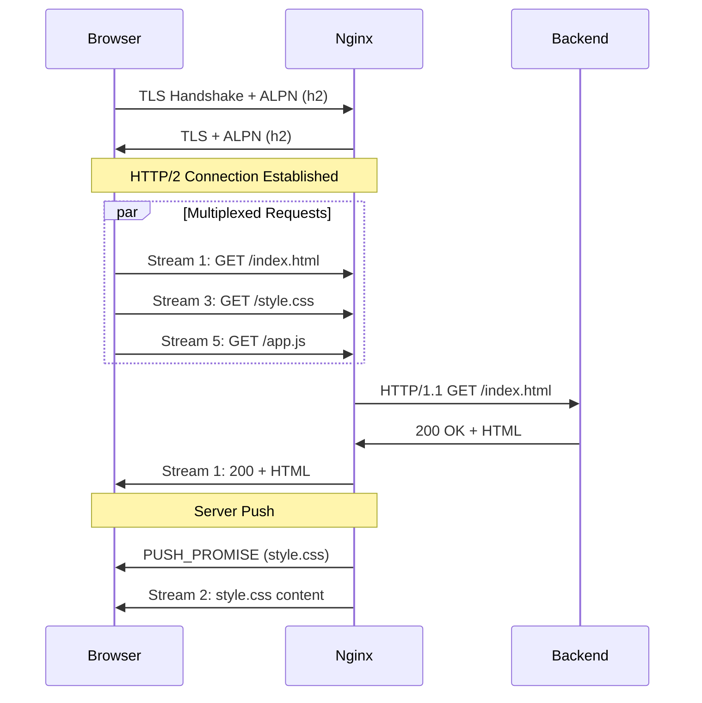

# How to Configure HTTP/2 in Nginx

Author: [nawazdhandala](https://www.github.com/nawazdhandala)

Tags: Nginx, HTTP/2, Performance, SSL, Web Server

Description: Learn how to enable and configure HTTP/2 in Nginx for improved performance through multiplexing, header compression, and server push capabilities.

---

HTTP/2 brings significant performance improvements over HTTP/1.1 through multiplexing, header compression, and binary framing. Nginx supports HTTP/2 out of the box, requiring minimal configuration changes to enable. This guide covers enabling HTTP/2, understanding its benefits, and tuning Nginx for optimal HTTP/2 performance.

## HTTP/2 Benefits

HTTP/2 improves performance in several ways:

| Feature | Benefit |
|---------|---------|
| Multiplexing | Multiple requests over single connection |
| Header Compression | Reduces overhead for repeated headers |
| Binary Protocol | More efficient parsing than text-based HTTP/1.1 |
| Stream Prioritization | Important resources load first |
| Server Push | Send resources before browser requests them |

## Enabling HTTP/2

Add the `http2` parameter to your listen directive:

```nginx
server {
    # Enable HTTP/2 with SSL
    listen 443 ssl http2;
    listen [::]:443 ssl http2;  # IPv6

    server_name example.com www.example.com;

    ssl_certificate /etc/ssl/certs/example.com.crt;
    ssl_certificate_key /etc/ssl/private/example.com.key;

    location / {
        proxy_pass http://127.0.0.1:3000;
        proxy_set_header Host $host;
        proxy_set_header X-Real-IP $remote_addr;
    }
}
```

Note: HTTP/2 in Nginx requires SSL/TLS. While the HTTP/2 spec allows unencrypted connections, browsers only support HTTP/2 over HTTPS.

## Complete HTTP/2 Configuration

A full configuration with HTTP/2 and optimized settings:

```nginx
# /etc/nginx/conf.d/http2-app.conf

upstream backend {
    server 127.0.0.1:3000;
    keepalive 32;
}

# Redirect HTTP to HTTPS
server {
    listen 80;
    listen [::]:80;
    server_name example.com www.example.com;

    return 301 https://$server_name$request_uri;
}

# HTTPS with HTTP/2
server {
    listen 443 ssl http2;
    listen [::]:443 ssl http2;
    server_name example.com www.example.com;

    # SSL certificates
    ssl_certificate /etc/letsencrypt/live/example.com/fullchain.pem;
    ssl_certificate_key /etc/letsencrypt/live/example.com/privkey.pem;

    # SSL optimization
    ssl_session_cache shared:SSL:10m;
    ssl_session_timeout 1d;
    ssl_session_tickets off;

    # Modern TLS only
    ssl_protocols TLSv1.2 TLSv1.3;
    ssl_ciphers ECDHE-ECDSA-AES128-GCM-SHA256:ECDHE-RSA-AES128-GCM-SHA256:ECDHE-ECDSA-AES256-GCM-SHA384:ECDHE-RSA-AES256-GCM-SHA384;
    ssl_prefer_server_ciphers off;

    # HTTP/2 settings
    http2_push_preload on;  # Enable server push via Link headers

    # Security headers
    add_header Strict-Transport-Security "max-age=31536000; includeSubDomains" always;

    location / {
        proxy_pass http://backend;

        proxy_http_version 1.1;
        proxy_set_header Connection "";

        proxy_set_header Host $host;
        proxy_set_header X-Real-IP $remote_addr;
        proxy_set_header X-Forwarded-For $proxy_add_x_forwarded_for;
        proxy_set_header X-Forwarded-Proto $scheme;
    }

    # Static files
    location /static/ {
        alias /var/www/static/;
        expires 1y;
        add_header Cache-Control "public, immutable";
    }
}
```

## HTTP/2 Server Push

Server push sends resources to the client before they are requested. Enable via Link headers:

```nginx
server {
    listen 443 ssl http2;
    server_name example.com;

    # Enable server push from Link headers
    http2_push_preload on;

    location / {
        proxy_pass http://backend;

        # Add Link headers for resources to push
        add_header Link "</css/style.css>; rel=preload; as=style";
        add_header Link "</js/app.js>; rel=preload; as=script";
    }
}
```

Your application can also set Link headers to trigger push:

```python
# Python Flask example
@app.route('/')
def index():
    response = make_response(render_template('index.html'))
    response.headers['Link'] = '</css/main.css>; rel=preload; as=style, </js/app.js>; rel=preload; as=script'
    return response
```

## HTTP/2 Push with nginx.conf Directives

Push specific resources directly in Nginx:

```nginx
server {
    listen 443 ssl http2;
    server_name example.com;

    location = / {
        # Push CSS and JS when homepage is requested
        http2_push /css/style.css;
        http2_push /js/app.js;
        http2_push /images/logo.png;

        proxy_pass http://backend;
    }

    # Serve pushed resources
    location /css/ {
        alias /var/www/css/;
    }

    location /js/ {
        alias /var/www/js/;
    }

    location /images/ {
        alias /var/www/images/;
    }
}
```

## HTTP/2 Specific Settings

Tune HTTP/2 behavior with these directives:

```nginx
http {
    # Maximum number of concurrent streams per connection
    http2_max_concurrent_streams 128;

    # Size of the per-request buffer
    http2_chunk_size 8k;

    # Maximum size of request body
    http2_body_preread_size 64k;

    # Timeout for idle connections
    http2_idle_timeout 3m;

    # Maximum number of requests per connection
    http2_max_requests 1000;
}
```

## ALPN Protocol Negotiation

HTTP/2 uses ALPN (Application-Layer Protocol Negotiation) to upgrade connections. Verify your OpenSSL supports it:

```bash
# Check OpenSSL version (needs 1.0.2+)
openssl version

# Test ALPN negotiation
echo | openssl s_client -alpn h2 -connect example.com:443 2>/dev/null | grep ALPN

# Should show: ALPN protocol: h2
```

## Backend Communication

While clients connect via HTTP/2, Nginx typically speaks HTTP/1.1 to backends:

```nginx
upstream backend {
    server 127.0.0.1:3000;
    keepalive 32;  # Reuse connections to backend
}

server {
    listen 443 ssl http2;  # HTTP/2 from clients
    server_name example.com;

    location / {
        proxy_pass http://backend;

        # HTTP/1.1 to backend (required for keepalive)
        proxy_http_version 1.1;
        proxy_set_header Connection "";
    }
}
```

This is normal and efficient. HTTP/2 benefits primarily apply to the client-to-proxy connection where latency matters most.

## gRPC over HTTP/2

gRPC requires HTTP/2. Configure Nginx to proxy gRPC traffic:

```nginx
upstream grpc_backend {
    server 127.0.0.1:50051;
}

server {
    listen 443 ssl http2;
    server_name grpc.example.com;

    ssl_certificate /etc/ssl/certs/grpc.example.com.crt;
    ssl_certificate_key /etc/ssl/private/grpc.example.com.key;

    location / {
        # Use grpc_pass for gRPC backends
        grpc_pass grpc://grpc_backend;

        # Error handling
        error_page 502 = /error502grpc;
    }

    location = /error502grpc {
        internal;
        default_type application/grpc;
        add_header grpc-status 14;
        add_header content-length 0;
        return 204;
    }
}
```

## Testing HTTP/2

Verify HTTP/2 is working:

```bash
# Test with curl (requires curl 7.43.0+)
curl -I --http2 https://example.com
# Look for: HTTP/2 200

# Detailed HTTP/2 info
curl -v --http2 https://example.com 2>&1 | grep -E 'ALPN|HTTP/2'

# Test with nghttp client
nghttp -v https://example.com

# Browser developer tools
# Network tab shows "h2" in Protocol column
```

## HTTP/2 Connection Diagram



## Performance Comparison

HTTP/2 improves performance significantly for sites with many resources:

| Scenario | HTTP/1.1 | HTTP/2 |
|----------|----------|--------|
| 6 requests | 6 connections or queued | 1 connection, parallel |
| Repeated headers | Sent each request | Compressed/cached |
| Resource priority | No control | Stream weights |
| Critical CSS | Waits for request | Server push |

## Migration Checklist

Before enabling HTTP/2:

1. Ensure SSL/TLS is properly configured
2. Verify OpenSSL version supports ALPN (1.0.2+)
3. Update Nginx to version 1.9.5+ (1.25.1+ for HTTP/3)
4. Test with staging environment first
5. Remove domain sharding (no longer needed)
6. Consider server push for critical resources

---

HTTP/2 in Nginx requires just adding `http2` to your listen directive. The protocol's multiplexing eliminates the need for multiple connections, header compression reduces overhead, and server push lets you send resources proactively. Combined with proper SSL configuration, HTTP/2 delivers noticeable performance improvements with minimal configuration effort.
