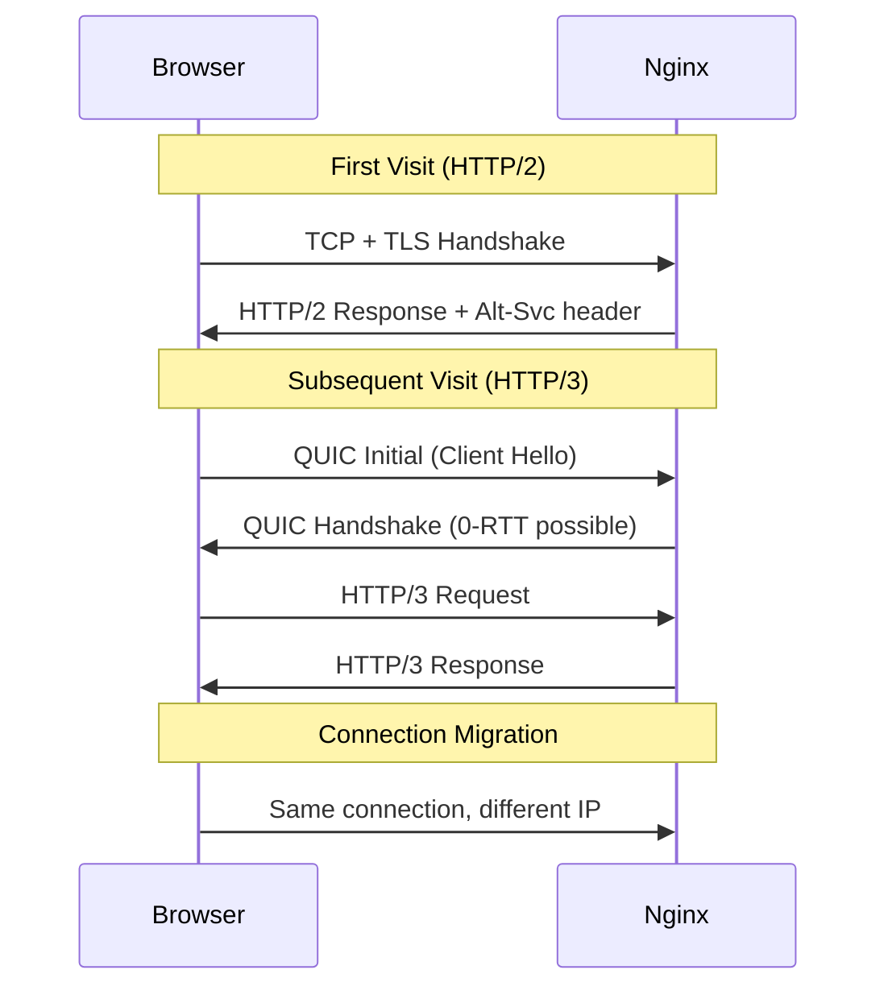

# How to Implement HTTP/3 (QUIC) in Nginx

Author: [nawazdhandala](https://www.github.com/nawazdhandala)

Tags: Nginx, HTTP/3, QUIC, Performance, UDP

Description: Learn how to enable HTTP/3 with QUIC protocol in Nginx for faster connections, reduced latency, and improved performance on unreliable networks.

---

HTTP/3 uses QUIC as its transport protocol instead of TCP, providing faster connection establishment, better handling of packet loss, and improved performance on mobile networks. Nginx added experimental HTTP/3 support in version 1.25.0. This guide covers enabling and configuring HTTP/3 for your Nginx deployment.

## HTTP/3 and QUIC Benefits

| Feature | HTTP/2 over TCP | HTTP/3 over QUIC |
|---------|-----------------|------------------|
| Connection setup | TCP + TLS (2-3 RTT) | 0-1 RTT |
| Head-of-line blocking | Per connection | Per stream |
| Connection migration | New connection needed | Seamless |
| Packet loss handling | Blocks all streams | Affects only lost stream |

## Prerequisites

HTTP/3 support requires:

- Nginx 1.25.0 or later
- OpenSSL 3.0+ or BoringSSL
- UDP port access (usually 443)

Check your Nginx version and modules:

```bash
# Check version
nginx -v

# Check build configuration
nginx -V 2>&1 | grep -o 'http_v3_module'
```

## Basic HTTP/3 Configuration

Enable HTTP/3 alongside HTTP/2:

```nginx
server {
    # HTTP/2 over TCP
    listen 443 ssl;

    # HTTP/3 over QUIC
    listen 443 quic reuseport;

    server_name example.com;

    # SSL certificate (required for both HTTP/2 and HTTP/3)
    ssl_certificate /etc/letsencrypt/live/example.com/fullchain.pem;
    ssl_certificate_key /etc/letsencrypt/live/example.com/privkey.pem;

    # Advertise HTTP/3 support
    add_header Alt-Svc 'h3=":443"; ma=86400' always;

    location / {
        proxy_pass http://127.0.0.1:3000;
        proxy_set_header Host $host;
        proxy_set_header X-Real-IP $remote_addr;
    }
}
```

The `Alt-Svc` header tells browsers that HTTP/3 is available, allowing them to upgrade on subsequent requests.

## Complete HTTP/3 Server Configuration

A production-ready configuration with HTTP/3:

```nginx
# /etc/nginx/conf.d/http3-app.conf

upstream backend {
    server 127.0.0.1:3000;
    keepalive 32;
}

# Redirect HTTP to HTTPS
server {
    listen 80;
    listen [::]:80;
    server_name example.com www.example.com;

    return 301 https://$server_name$request_uri;
}

# HTTPS with HTTP/2 and HTTP/3
server {
    # HTTP/2 over TCP (IPv4 and IPv6)
    listen 443 ssl;
    listen [::]:443 ssl;

    # HTTP/3 over QUIC (IPv4 and IPv6)
    listen 443 quic reuseport;
    listen [::]:443 quic reuseport;

    server_name example.com www.example.com;

    # SSL Configuration
    ssl_certificate /etc/letsencrypt/live/example.com/fullchain.pem;
    ssl_certificate_key /etc/letsencrypt/live/example.com/privkey.pem;

    # TLS 1.3 required for HTTP/3
    ssl_protocols TLSv1.2 TLSv1.3;
    ssl_prefer_server_ciphers off;

    # Session resumption (important for 0-RTT)
    ssl_session_cache shared:SSL:10m;
    ssl_session_timeout 1d;
    ssl_session_tickets on;

    # Enable 0-RTT (early data)
    ssl_early_data on;

    # Advertise HTTP/3 availability
    add_header Alt-Svc 'h3=":443"; ma=86400' always;

    # QUIC-specific settings
    quic_retry on;
    quic_gso on;

    # Security headers
    add_header Strict-Transport-Security "max-age=31536000; includeSubDomains" always;

    location / {
        proxy_pass http://backend;

        proxy_http_version 1.1;
        proxy_set_header Connection "";

        proxy_set_header Host $host;
        proxy_set_header X-Real-IP $remote_addr;
        proxy_set_header X-Forwarded-For $proxy_add_x_forwarded_for;
        proxy_set_header X-Forwarded-Proto $scheme;

        # Pass early data header to backend
        proxy_set_header Early-Data $ssl_early_data;
    }

    # Static files
    location /static/ {
        alias /var/www/static/;
        expires 1y;
        add_header Cache-Control "public, immutable";
        add_header Alt-Svc 'h3=":443"; ma=86400' always;
    }
}
```

## QUIC-Specific Directives

Configure QUIC behavior:

```nginx
http {
    # QUIC settings
    quic_retry on;              # Enable address validation
    quic_gso on;                # Enable Generic Segmentation Offload

    server {
        listen 443 quic reuseport;
        listen 443 ssl;

        # Connection idle timeout
        quic_active_connection_id_limit 2;

        # ... rest of configuration
    }
}
```

## Handling 0-RTT Early Data

0-RTT allows data transmission before the handshake completes, but requires careful handling to prevent replay attacks:

```nginx
server {
    listen 443 ssl;
    listen 443 quic reuseport;

    ssl_early_data on;

    location / {
        # Check if request came via early data
        if ($ssl_early_data) {
            # For safe operations, allow early data
            # For unsafe operations (POST, PUT, DELETE), you may want
            # to reject or handle specially
        }

        proxy_pass http://backend;

        # Tell backend about early data
        proxy_set_header Early-Data $ssl_early_data;
    }

    # Reject early data for sensitive operations
    location /api/sensitive/ {
        if ($ssl_early_data) {
            return 425;  # Too Early
        }

        proxy_pass http://backend;
    }
}
```

## Firewall Configuration

Allow UDP traffic for QUIC:

```bash
# iptables
sudo iptables -A INPUT -p udp --dport 443 -j ACCEPT

# UFW
sudo ufw allow 443/udp

# firewalld
sudo firewall-cmd --permanent --add-port=443/udp
sudo firewall-cmd --reload
```

## Testing HTTP/3

Verify HTTP/3 is working:

```bash
# Using curl with HTTP/3 support (requires curl 7.66+ with HTTP/3)
curl --http3 -I https://example.com

# Check Alt-Svc header
curl -sI https://example.com | grep -i alt-svc

# Using Chrome DevTools
# Open Network tab, right-click headers, enable "Protocol" column
# Look for "h3" protocol
```

Browser testing:

1. Open Chrome DevTools (F12)
2. Go to Network tab
3. Enable Protocol column
4. Load your site
5. Look for "h3" in the Protocol column

## HTTP/3 Connection Flow



## Performance Tuning

Optimize HTTP/3 performance:

```nginx
http {
    # Enable GSO for better performance
    quic_gso on;

    # Buffer settings for QUIC
    quic_bpf on;  # Enable BPF (Linux 5.7+)

    server {
        listen 443 quic reuseport;
        listen 443 ssl;

        # Increase receive buffer
        # System setting: sysctl -w net.core.rmem_max=2500000

        # Enable early data for faster connections
        ssl_early_data on;

        # Session tickets for 0-RTT resumption
        ssl_session_tickets on;
        ssl_session_timeout 1d;
    }
}
```

Kernel tuning for QUIC:

```bash
# Increase UDP buffer sizes
sudo sysctl -w net.core.rmem_max=2500000
sudo sysctl -w net.core.wmem_max=2500000

# Make persistent
echo "net.core.rmem_max=2500000" | sudo tee -a /etc/sysctl.conf
echo "net.core.wmem_max=2500000" | sudo tee -a /etc/sysctl.conf
```

## Multiple Servers with HTTP/3

When running multiple virtual hosts:

```nginx
# First server gets reuseport
server {
    listen 443 quic reuseport;
    listen 443 ssl;
    server_name site1.example.com;

    # ... configuration
}

# Additional servers without reuseport
server {
    listen 443 quic;
    listen 443 ssl;
    server_name site2.example.com;

    # ... configuration
}

server {
    listen 443 quic;
    listen 443 ssl;
    server_name site3.example.com;

    # ... configuration
}
```

Only the first server block should use `reuseport` for HTTP/3.

## Monitoring HTTP/3

Log protocol information:

```nginx
http {
    log_format detailed '$remote_addr - [$time_local] '
                        '"$request" $status '
                        'protocol=$server_protocol '
                        'quic=$quic '
                        'ssl_early_data=$ssl_early_data';

    server {
        access_log /var/log/nginx/access.log detailed;

        listen 443 quic reuseport;
        listen 443 ssl;

        # ... rest of configuration
    }
}
```

Analyze protocol usage:

```bash
# Count HTTP/3 vs HTTP/2 requests
awk -F'protocol=' '{print $2}' /var/log/nginx/access.log | \
    cut -d' ' -f1 | sort | uniq -c

# Check early data usage
grep "ssl_early_data=1" /var/log/nginx/access.log | wc -l
```

## Fallback Configuration

Ensure graceful fallback when HTTP/3 is not available:

```nginx
server {
    # Always provide HTTP/2 fallback
    listen 443 ssl;
    listen [::]:443 ssl;

    # HTTP/3 when available
    listen 443 quic reuseport;
    listen [::]:443 quic reuseport;

    server_name example.com;

    ssl_certificate /etc/ssl/certs/example.com.crt;
    ssl_certificate_key /etc/ssl/private/example.com.key;

    # Advertise HTTP/3 with fallback time
    # Clients will try HTTP/3, fall back to HTTP/2 if it fails
    add_header Alt-Svc 'h3=":443"; ma=86400, h2=":443"; ma=86400' always;

    location / {
        proxy_pass http://backend;
    }
}
```

## Common Issues

| Issue | Cause | Solution |
|-------|-------|----------|
| HTTP/3 not used | Firewall blocking UDP | Allow UDP 443 |
| Alt-Svc not sent | Header overwritten | Use `always` parameter |
| 0-RTT not working | Session tickets disabled | Enable ssl_session_tickets |
| Performance worse | Network not QUIC-friendly | Check for UDP throttling |

Debug HTTP/3 issues:

```bash
# Check if UDP port is open
nc -vzu example.com 443

# Test with curl verbose output
curl -v --http3 https://example.com 2>&1 | grep -E 'QUIC|h3|Alt-Svc'

# Check Nginx error log
tail -f /var/log/nginx/error.log | grep -i quic
```

---

HTTP/3 with QUIC provides significant performance improvements, especially for users on mobile or unreliable networks. Enable it alongside HTTP/2 for graceful fallback, configure proper TLS settings for 0-RTT, and ensure UDP traffic can reach your server. Monitor protocol adoption through logging to understand the impact on your users.
