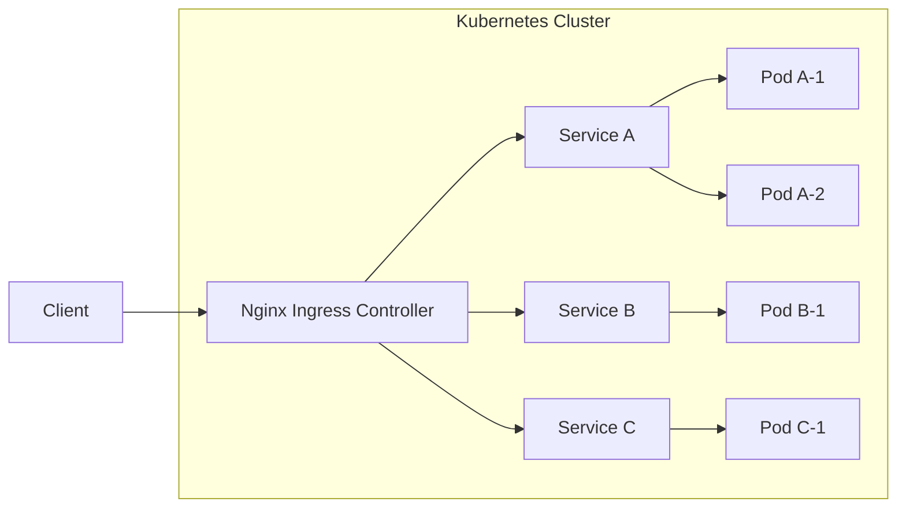

# How to Deploy Nginx Ingress Controller in Kubernetes

Author: [nawazdhandala](https://www.github.com/nawazdhandala)

Tags: Nginx, Kubernetes, Ingress, DevOps, Cloud Native

Description: Learn how to deploy and configure the Nginx Ingress Controller in Kubernetes to manage external access to your services with routing, SSL termination, and load balancing.

---

The Nginx Ingress Controller manages external access to services in a Kubernetes cluster. It provides HTTP/HTTPS routing, SSL termination, and load balancing based on Ingress resources you define. This guide covers deploying the controller and configuring Ingress rules for your applications.

## Understanding Kubernetes Ingress

Ingress exposes HTTP and HTTPS routes from outside the cluster to services within:



## Installing Nginx Ingress Controller

Install using Helm (recommended):

```bash
# Add the ingress-nginx repository
helm repo add ingress-nginx https://kubernetes.github.io/ingress-nginx
helm repo update

# Install the ingress controller
helm install ingress-nginx ingress-nginx/ingress-nginx \
    --namespace ingress-nginx \
    --create-namespace

# Verify installation
kubectl get pods -n ingress-nginx
kubectl get svc -n ingress-nginx
```

Or install with kubectl:

```bash
# Apply the manifest
kubectl apply -f https://raw.githubusercontent.com/kubernetes/ingress-nginx/controller-v1.9.4/deploy/static/provider/cloud/deploy.yaml

# Wait for the controller to be ready
kubectl wait --namespace ingress-nginx \
    --for=condition=ready pod \
    --selector=app.kubernetes.io/component=controller \
    --timeout=120s
```

## Basic Ingress Resource

Create an Ingress to route traffic to your service:

```yaml
# ingress.yaml

apiVersion: networking.k8s.io/v1
kind: Ingress
metadata:
  name: app-ingress
  namespace: default
  annotations:
    nginx.ingress.kubernetes.io/rewrite-target: /
spec:
  ingressClassName: nginx
  rules:
    - host: app.example.com
      http:
        paths:
          - path: /
            pathType: Prefix
            backend:
              service:
                name: app-service
                port:
                  number: 80
```

Apply the Ingress:

```bash
kubectl apply -f ingress.yaml

# Verify
kubectl get ingress
kubectl describe ingress app-ingress
```

## Path-Based Routing

Route different paths to different services:

```yaml
# multi-path-ingress.yaml

apiVersion: networking.k8s.io/v1
kind: Ingress
metadata:
  name: multi-path-ingress
  annotations:
    nginx.ingress.kubernetes.io/use-regex: "true"
spec:
  ingressClassName: nginx
  rules:
    - host: api.example.com
      http:
        paths:
          - path: /api/users
            pathType: Prefix
            backend:
              service:
                name: users-service
                port:
                  number: 80
          - path: /api/orders
            pathType: Prefix
            backend:
              service:
                name: orders-service
                port:
                  number: 80
          - path: /api/products
            pathType: Prefix
            backend:
              service:
                name: products-service
                port:
                  number: 80
          - path: /
            pathType: Prefix
            backend:
              service:
                name: frontend-service
                port:
                  number: 80
```

## Host-Based Routing

Route different hostnames to different services:

```yaml
# multi-host-ingress.yaml

apiVersion: networking.k8s.io/v1
kind: Ingress
metadata:
  name: multi-host-ingress
spec:
  ingressClassName: nginx
  rules:
    - host: app.example.com
      http:
        paths:
          - path: /
            pathType: Prefix
            backend:
              service:
                name: app-service
                port:
                  number: 80
    - host: api.example.com
      http:
        paths:
          - path: /
            pathType: Prefix
            backend:
              service:
                name: api-service
                port:
                  number: 80
    - host: admin.example.com
      http:
        paths:
          - path: /
            pathType: Prefix
            backend:
              service:
                name: admin-service
                port:
                  number: 80
```

## TLS/SSL Configuration

Configure HTTPS with a TLS certificate:

```yaml
# Create a TLS secret
apiVersion: v1
kind: Secret
metadata:
  name: app-tls-secret
  namespace: default
type: kubernetes.io/tls
data:
  tls.crt: <base64-encoded-cert>
  tls.key: <base64-encoded-key>
```

Or create from files:

```bash
kubectl create secret tls app-tls-secret \
    --cert=path/to/cert.pem \
    --key=path/to/key.pem
```

Reference in Ingress:

```yaml
# tls-ingress.yaml

apiVersion: networking.k8s.io/v1
kind: Ingress
metadata:
  name: tls-ingress
  annotations:
    nginx.ingress.kubernetes.io/ssl-redirect: "true"
spec:
  ingressClassName: nginx
  tls:
    - hosts:
        - app.example.com
      secretName: app-tls-secret
  rules:
    - host: app.example.com
      http:
        paths:
          - path: /
            pathType: Prefix
            backend:
              service:
                name: app-service
                port:
                  number: 80
```

## Let's Encrypt with Cert-Manager

Automate certificate management with cert-manager:

```bash
# Install cert-manager
kubectl apply -f https://github.com/cert-manager/cert-manager/releases/download/v1.13.0/cert-manager.yaml
```

Create a ClusterIssuer:

```yaml
# cluster-issuer.yaml

apiVersion: cert-manager.io/v1
kind: ClusterIssuer
metadata:
  name: letsencrypt-prod
spec:
  acme:
    server: https://acme-v02.api.letsencrypt.org/directory
    email: admin@example.com
    privateKeySecretRef:
      name: letsencrypt-prod
    solvers:
      - http01:
          ingress:
            class: nginx
```

Use automatic TLS in Ingress:

```yaml
# auto-tls-ingress.yaml

apiVersion: networking.k8s.io/v1
kind: Ingress
metadata:
  name: auto-tls-ingress
  annotations:
    cert-manager.io/cluster-issuer: letsencrypt-prod
    nginx.ingress.kubernetes.io/ssl-redirect: "true"
spec:
  ingressClassName: nginx
  tls:
    - hosts:
        - app.example.com
      secretName: app-tls-auto  # cert-manager creates this
  rules:
    - host: app.example.com
      http:
        paths:
          - path: /
            pathType: Prefix
            backend:
              service:
                name: app-service
                port:
                  number: 80
```

## Common Annotations

Configure Nginx behavior through annotations:

```yaml
apiVersion: networking.k8s.io/v1
kind: Ingress
metadata:
  name: configured-ingress
  annotations:
    # SSL/TLS
    nginx.ingress.kubernetes.io/ssl-redirect: "true"
    nginx.ingress.kubernetes.io/force-ssl-redirect: "true"

    # Proxy settings
    nginx.ingress.kubernetes.io/proxy-body-size: "50m"
    nginx.ingress.kubernetes.io/proxy-connect-timeout: "60"
    nginx.ingress.kubernetes.io/proxy-read-timeout: "60"
    nginx.ingress.kubernetes.io/proxy-send-timeout: "60"

    # Rate limiting
    nginx.ingress.kubernetes.io/limit-rps: "100"
    nginx.ingress.kubernetes.io/limit-connections: "10"

    # CORS
    nginx.ingress.kubernetes.io/enable-cors: "true"
    nginx.ingress.kubernetes.io/cors-allow-origin: "https://app.example.com"

    # URL rewriting
    nginx.ingress.kubernetes.io/rewrite-target: /$1

    # Authentication
    nginx.ingress.kubernetes.io/auth-type: basic
    nginx.ingress.kubernetes.io/auth-secret: basic-auth
    nginx.ingress.kubernetes.io/auth-realm: "Authentication Required"
spec:
  ingressClassName: nginx
  rules:
    - host: app.example.com
      http:
        paths:
          - path: /
            pathType: Prefix
            backend:
              service:
                name: app-service
                port:
                  number: 80
```

## WebSocket Support

Enable WebSocket proxying:

```yaml
apiVersion: networking.k8s.io/v1
kind: Ingress
metadata:
  name: websocket-ingress
  annotations:
    nginx.ingress.kubernetes.io/proxy-read-timeout: "3600"
    nginx.ingress.kubernetes.io/proxy-send-timeout: "3600"
    nginx.ingress.kubernetes.io/upstream-hash-by: "$request_uri"
spec:
  ingressClassName: nginx
  rules:
    - host: ws.example.com
      http:
        paths:
          - path: /ws
            pathType: Prefix
            backend:
              service:
                name: websocket-service
                port:
                  number: 80
```

## Custom Configuration

Use ConfigMap for global Nginx settings:

```yaml
# nginx-config.yaml

apiVersion: v1
kind: ConfigMap
metadata:
  name: ingress-nginx-controller
  namespace: ingress-nginx
data:
  # Worker settings
  worker-processes: "auto"
  worker-connections: "65536"

  # Timeouts
  keep-alive: "75"
  proxy-connect-timeout: "60"
  proxy-read-timeout: "60"

  # Buffer settings
  proxy-buffer-size: "4k"
  proxy-buffers-number: "8"

  # Logging
  log-format-upstream: '$remote_addr - [$time_local] "$request" $status $body_bytes_sent "$http_referer" "$http_user_agent" $request_time $upstream_response_time'

  # Security
  ssl-protocols: "TLSv1.2 TLSv1.3"
  ssl-ciphers: "ECDHE-ECDSA-AES128-GCM-SHA256:ECDHE-RSA-AES128-GCM-SHA256"

  # Compression
  use-gzip: "true"
  gzip-level: "5"
  gzip-types: "application/javascript application/json text/css text/plain"
```

## Basic Authentication

Protect endpoints with basic auth:

```bash
# Create htpasswd secret
htpasswd -c auth admin
kubectl create secret generic basic-auth --from-file=auth
```

```yaml
apiVersion: networking.k8s.io/v1
kind: Ingress
metadata:
  name: auth-ingress
  annotations:
    nginx.ingress.kubernetes.io/auth-type: basic
    nginx.ingress.kubernetes.io/auth-secret: basic-auth
    nginx.ingress.kubernetes.io/auth-realm: "Protected Area"
spec:
  ingressClassName: nginx
  rules:
    - host: admin.example.com
      http:
        paths:
          - path: /
            pathType: Prefix
            backend:
              service:
                name: admin-service
                port:
                  number: 80
```

## Complete Production Example

A full production Ingress configuration:

```yaml
# production-ingress.yaml

apiVersion: networking.k8s.io/v1
kind: Ingress
metadata:
  name: production-ingress
  namespace: production
  annotations:
    # TLS
    cert-manager.io/cluster-issuer: letsencrypt-prod
    nginx.ingress.kubernetes.io/ssl-redirect: "true"

    # Security
    nginx.ingress.kubernetes.io/configuration-snippet: |
      more_set_headers "X-Frame-Options: SAMEORIGIN";
      more_set_headers "X-Content-Type-Options: nosniff";
      more_set_headers "X-XSS-Protection: 1; mode=block";
      more_set_headers "Strict-Transport-Security: max-age=31536000; includeSubDomains";

    # Performance
    nginx.ingress.kubernetes.io/proxy-body-size: "100m"
    nginx.ingress.kubernetes.io/proxy-buffer-size: "8k"
    nginx.ingress.kubernetes.io/proxy-connect-timeout: "30"
    nginx.ingress.kubernetes.io/proxy-read-timeout: "120"

    # Rate limiting
    nginx.ingress.kubernetes.io/limit-rps: "100"
    nginx.ingress.kubernetes.io/limit-burst-multiplier: "5"

    # CORS
    nginx.ingress.kubernetes.io/enable-cors: "true"
    nginx.ingress.kubernetes.io/cors-allow-origin: "https://app.example.com"
    nginx.ingress.kubernetes.io/cors-allow-methods: "GET, POST, PUT, DELETE, OPTIONS"
    nginx.ingress.kubernetes.io/cors-allow-headers: "Authorization, Content-Type"

spec:
  ingressClassName: nginx
  tls:
    - hosts:
        - app.example.com
        - api.example.com
      secretName: production-tls

  rules:
    # Frontend
    - host: app.example.com
      http:
        paths:
          - path: /
            pathType: Prefix
            backend:
              service:
                name: frontend
                port:
                  number: 80

    # API
    - host: api.example.com
      http:
        paths:
          - path: /v1/auth
            pathType: Prefix
            backend:
              service:
                name: auth-service
                port:
                  number: 80
          - path: /v1/users
            pathType: Prefix
            backend:
              service:
                name: users-service
                port:
                  number: 80
          - path: /v1/orders
            pathType: Prefix
            backend:
              service:
                name: orders-service
                port:
                  number: 80
          - path: /
            pathType: Prefix
            backend:
              service:
                name: api-gateway
                port:
                  number: 80
```

## Monitoring and Troubleshooting

Check Ingress controller logs:

```bash
# View controller logs
kubectl logs -n ingress-nginx -l app.kubernetes.io/component=controller

# Follow logs
kubectl logs -n ingress-nginx -l app.kubernetes.io/component=controller -f

# Check Ingress status
kubectl describe ingress production-ingress

# Test DNS resolution
kubectl run tmp --image=busybox --restart=Never --rm -it -- nslookup app.example.com

# Test connectivity
kubectl run tmp --image=curlimages/curl --restart=Never --rm -it -- \
    curl -v http://app-service.default.svc.cluster.local
```

## High Availability Setup

Deploy multiple controller replicas:

```bash
helm upgrade ingress-nginx ingress-nginx/ingress-nginx \
    --namespace ingress-nginx \
    --set controller.replicaCount=3 \
    --set controller.podAntiAffinity.type=hard
```

Or with values file:

```yaml
# values.yaml

controller:
  replicaCount: 3

  affinity:
    podAntiAffinity:
      requiredDuringSchedulingIgnoredDuringExecution:
        - labelSelector:
            matchExpressions:
              - key: app.kubernetes.io/component
                operator: In
                values:
                  - controller
          topologyKey: kubernetes.io/hostname

  resources:
    requests:
      cpu: 100m
      memory: 128Mi
    limits:
      cpu: 500m
      memory: 512Mi

  autoscaling:
    enabled: true
    minReplicas: 2
    maxReplicas: 10
    targetCPUUtilizationPercentage: 80
```

---

The Nginx Ingress Controller provides powerful routing capabilities for Kubernetes services. Define Ingress resources for path-based and host-based routing, configure TLS with cert-manager for automatic certificates, and use annotations for fine-grained control. Monitor the controller and use multiple replicas for high availability in production environments.
