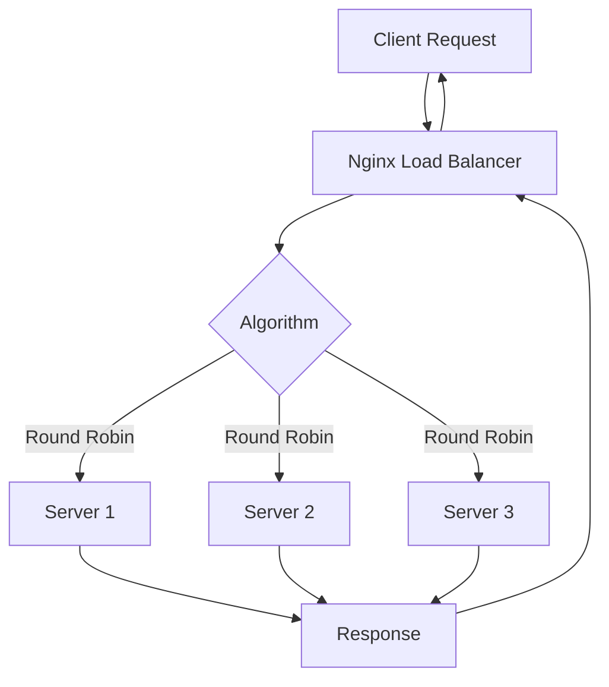

# How to Implement Load Balancing with Nginx

Author: [nawazdhandala](https://www.github.com/nawazdhandala)

Tags: Nginx, Load Balancing, High Availability, DevOps, Scalability

Description: A practical guide to implementing load balancing with Nginx, covering round-robin, weighted, least connections, and IP hash algorithms with production-ready configurations.

---

Load balancing distributes incoming traffic across multiple backend servers to prevent any single server from becoming overwhelmed. Nginx handles this efficiently using its upstream module, which supports multiple load balancing algorithms and health checking. This guide walks through configuring Nginx for various load balancing scenarios.

## Load Balancing Algorithms

Nginx supports several load balancing methods out of the box. Each has specific use cases:

| Algorithm | Use Case |
|-----------|----------|
| Round Robin | Default; distributes requests sequentially |
| Weighted | Servers with different capacities |
| Least Connections | When request processing times vary |
| IP Hash | Session persistence without cookies |
| Generic Hash | Custom keys for distribution |

## Round Robin (Default)

The simplest configuration distributes requests evenly across all servers:

```nginx
# /etc/nginx/conf.d/load-balancer.conf

# Define backend servers
upstream backend {
    server 192.168.1.10:8080;  # Backend server 1
    server 192.168.1.11:8080;  # Backend server 2
    server 192.168.1.12:8080;  # Backend server 3
}

server {
    listen 80;
    server_name app.example.com;

    location / {
        proxy_pass http://backend;
        proxy_set_header Host $host;
        proxy_set_header X-Real-IP $remote_addr;
        proxy_set_header X-Forwarded-For $proxy_add_x_forwarded_for;
    }
}
```

With this configuration, Nginx sends the first request to server 1, the second to server 2, the third to server 3, then starts over.

## Weighted Load Balancing

When servers have different capacities, assign weights to route more traffic to stronger servers:

```nginx
upstream backend {
    # Powerful server gets 5x the traffic
    server 192.168.1.10:8080 weight=5;

    # Standard servers
    server 192.168.1.11:8080 weight=3;
    server 192.168.1.12:8080 weight=2;
}

server {
    listen 80;
    server_name app.example.com;

    location / {
        proxy_pass http://backend;
        proxy_set_header Host $host;
        proxy_set_header X-Real-IP $remote_addr;
    }
}
```

In this example, for every 10 requests, server 1 receives 5, server 2 receives 3, and server 3 receives 2.

## Least Connections

When backend processing times vary significantly, route new requests to the server with the fewest active connections:

```nginx
upstream backend {
    least_conn;  # Use least connections algorithm

    server 192.168.1.10:8080;
    server 192.168.1.11:8080;
    server 192.168.1.12:8080;
}

server {
    listen 80;
    server_name app.example.com;

    location / {
        proxy_pass http://backend;
        proxy_set_header Host $host;
        proxy_set_header X-Real-IP $remote_addr;
    }
}
```

This method works well for applications with unpredictable response times, such as video processing or complex database queries.

## IP Hash for Session Persistence

When your application stores session data locally (not in a shared store), you need requests from the same client to reach the same server:

```nginx
upstream backend {
    ip_hash;  # Route based on client IP

    server 192.168.1.10:8080;
    server 192.168.1.11:8080;
    server 192.168.1.12:8080;
}

server {
    listen 80;
    server_name app.example.com;

    location / {
        proxy_pass http://backend;
        proxy_set_header Host $host;
        proxy_set_header X-Real-IP $remote_addr;
    }
}
```

The IP hash algorithm ensures clients consistently reach the same backend server, maintaining session continuity without shared session storage.

## Server Parameters

Each server in an upstream block accepts parameters that control its behavior:

```nginx
upstream backend {
    # Main servers
    server 192.168.1.10:8080 weight=5 max_fails=3 fail_timeout=30s;
    server 192.168.1.11:8080 weight=3 max_fails=3 fail_timeout=30s;

    # Backup server (only used when all main servers are down)
    server 192.168.1.12:8080 backup;

    # Server temporarily removed from rotation
    server 192.168.1.13:8080 down;
}
```

Parameter meanings:

- `weight`: Traffic proportion (default: 1)
- `max_fails`: Failed attempts before marking server unavailable (default: 1)
- `fail_timeout`: Time a failed server stays out of rotation (default: 10s)
- `backup`: Only receives traffic when primary servers fail
- `down`: Marks server as permanently unavailable

## Keepalive Connections

Reusing connections to backend servers reduces latency and resource usage:

```nginx
upstream backend {
    server 192.168.1.10:8080;
    server 192.168.1.11:8080;
    server 192.168.1.12:8080;

    # Maintain up to 32 idle connections per worker
    keepalive 32;
}

server {
    listen 80;
    server_name app.example.com;

    location / {
        proxy_pass http://backend;

        # Required for keepalive
        proxy_http_version 1.1;
        proxy_set_header Connection "";

        proxy_set_header Host $host;
        proxy_set_header X-Real-IP $remote_addr;
    }
}
```

The `keepalive` directive specifies the maximum number of idle connections to keep open to backend servers. Setting `Connection` header to empty string prevents closing connections after each request.

## Health Checks (Passive)

Nginx Open Source performs passive health checks by monitoring responses:

```nginx
upstream backend {
    server 192.168.1.10:8080 max_fails=3 fail_timeout=30s;
    server 192.168.1.11:8080 max_fails=3 fail_timeout=30s;
    server 192.168.1.12:8080 max_fails=3 fail_timeout=30s;
}

server {
    listen 80;
    server_name app.example.com;

    location / {
        proxy_pass http://backend;

        # Define what constitutes a failure
        proxy_next_upstream error timeout http_500 http_502 http_503;

        # Limit retries
        proxy_next_upstream_tries 3;
        proxy_next_upstream_timeout 30s;

        proxy_set_header Host $host;
        proxy_set_header X-Real-IP $remote_addr;
    }
}
```

When a backend returns an error or times out, Nginx automatically tries the next server and tracks failures.

## Complete Production Example

Here is a production-ready load balancer configuration combining multiple concepts:

```nginx
# /etc/nginx/conf.d/production-lb.conf

# Application servers
upstream app_backend {
    least_conn;  # Route to least busy server

    # Production servers with health tracking
    server 10.0.1.10:8080 weight=5 max_fails=3 fail_timeout=30s;
    server 10.0.1.11:8080 weight=5 max_fails=3 fail_timeout=30s;
    server 10.0.1.12:8080 weight=3 max_fails=3 fail_timeout=30s;

    # Standby server
    server 10.0.1.20:8080 backup;

    # Connection pooling
    keepalive 64;
}

server {
    listen 80;
    server_name app.example.com;
    return 301 https://$server_name$request_uri;
}

server {
    listen 443 ssl http2;
    server_name app.example.com;

    # SSL certificates
    ssl_certificate /etc/ssl/certs/app.example.com.crt;
    ssl_certificate_key /etc/ssl/private/app.example.com.key;

    # Request size limits
    client_max_body_size 50M;

    # Logging
    access_log /var/log/nginx/app_access.log;
    error_log /var/log/nginx/app_error.log;

    location / {
        proxy_pass http://app_backend;

        # HTTP version for keepalive
        proxy_http_version 1.1;
        proxy_set_header Connection "";

        # Timeouts
        proxy_connect_timeout 10s;
        proxy_send_timeout 60s;
        proxy_read_timeout 60s;

        # Retry configuration
        proxy_next_upstream error timeout http_500 http_502 http_503;
        proxy_next_upstream_tries 3;

        # Headers
        proxy_set_header Host $host;
        proxy_set_header X-Real-IP $remote_addr;
        proxy_set_header X-Forwarded-For $proxy_add_x_forwarded_for;
        proxy_set_header X-Forwarded-Proto $scheme;

        # Response buffering
        proxy_buffering on;
        proxy_buffer_size 4k;
        proxy_buffers 8 32k;
    }

    # Health endpoint (no logging, no buffering)
    location /health {
        access_log off;
        proxy_pass http://app_backend;
        proxy_buffering off;
    }
}
```

## Load Balancing Flow



## Testing Your Configuration

Verify load balancing works correctly:

```bash
# Check configuration syntax
sudo nginx -t

# Reload configuration
sudo systemctl reload nginx

# Test distribution with multiple requests
for i in {1..10}; do
    curl -s http://app.example.com/health | grep server
done
```

Your backend application should return which server handled each request, showing distribution across the pool.

## Monitoring Connections

Track upstream connection status using the stub_status module:

```nginx
server {
    listen 8080;
    server_name localhost;

    location /nginx_status {
        stub_status on;
        allow 127.0.0.1;  # Only allow local access
        deny all;
    }
}
```

Access this endpoint to see active connections, accepts, and handled requests.

---

Nginx load balancing scales your application horizontally while providing fault tolerance when servers fail. Start with round-robin for simple cases, switch to least connections when processing times vary, and use IP hash when you need session affinity. Combine these algorithms with proper health checking and connection pooling for a production-ready setup that handles traffic spikes gracefully.
