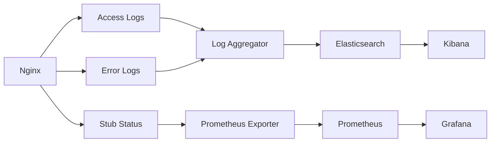

# How to Configure Logging and Monitoring in Nginx

Author: [nawazdhandala](https://www.github.com/nawazdhandala)

Tags: Nginx, Logging, Monitoring, Observability, Metrics

Description: Learn how to configure comprehensive logging and monitoring in Nginx, including custom log formats, real-time metrics, and integration with monitoring systems.

---

Effective logging and monitoring reveal how your Nginx server performs and help diagnose problems quickly. Nginx provides flexible logging capabilities and a status module for real-time metrics. This guide covers configuring logs for observability and exposing metrics for monitoring systems.

## Understanding Nginx Logs

Nginx produces two types of logs:

| Log Type | Purpose | Default Location |
|----------|---------|------------------|
| Access Log | Records all client requests | /var/log/nginx/access.log |
| Error Log | Records errors and warnings | /var/log/nginx/error.log |

## Custom Access Log Format

Define log formats that capture the information you need:

```nginx
# /etc/nginx/nginx.conf

http {
    # Standard combined format with response time
    log_format main '$remote_addr - $remote_user [$time_local] '
                    '"$request" $status $body_bytes_sent '
                    '"$http_referer" "$http_user_agent" '
                    'rt=$request_time uct=$upstream_connect_time '
                    'uht=$upstream_header_time urt=$upstream_response_time';

    # JSON format for log aggregation systems
    log_format json_combined escape=json '{'
        '"time": "$time_iso8601",'
        '"remote_addr": "$remote_addr",'
        '"remote_user": "$remote_user",'
        '"request": "$request",'
        '"status": $status,'
        '"body_bytes_sent": $body_bytes_sent,'
        '"request_time": $request_time,'
        '"http_referrer": "$http_referer",'
        '"http_user_agent": "$http_user_agent",'
        '"request_id": "$request_id",'
        '"upstream_addr": "$upstream_addr",'
        '"upstream_response_time": "$upstream_response_time"'
    '}';

    access_log /var/log/nginx/access.log main;
}
```

## Log Variables Reference

Common variables for log formats:

| Variable | Description |
|----------|-------------|
| $remote_addr | Client IP address |
| $time_local | Local time in common log format |
| $time_iso8601 | ISO 8601 timestamp |
| $request | Full request line |
| $status | Response status code |
| $body_bytes_sent | Bytes sent to client |
| $request_time | Total request processing time |
| $upstream_response_time | Time from upstream server |
| $upstream_addr | Upstream server address |
| $http_user_agent | User-Agent header |
| $request_id | Unique request identifier |

## Per-Location Logging

Configure different logging for different parts of your application:

```nginx
server {
    listen 80;
    server_name example.com;

    # Default access log
    access_log /var/log/nginx/example_access.log main;
    error_log /var/log/nginx/example_error.log warn;

    location / {
        proxy_pass http://127.0.0.1:3000;
    }

    # API with detailed logging
    location /api/ {
        access_log /var/log/nginx/api_access.log json_combined;
        proxy_pass http://127.0.0.1:3000;
    }

    # Health checks without logging
    location /health {
        access_log off;
        proxy_pass http://127.0.0.1:3000;
    }

    # Static files with separate log
    location /static/ {
        access_log /var/log/nginx/static_access.log main buffer=32k flush=5s;
        alias /var/www/static/;
    }
}
```

## Error Log Levels

Configure error log verbosity:

```nginx
# Error log levels (from most to least verbose)
# debug, info, notice, warn, error, crit, alert, emerg

# Development: verbose logging
error_log /var/log/nginx/error.log info;

# Production: only warnings and above
error_log /var/log/nginx/error.log warn;

# Per-server error logs
server {
    listen 80;
    server_name staging.example.com;
    error_log /var/log/nginx/staging_error.log debug;
}
```

## Conditional Logging

Log only specific requests:

```nginx
http {
    # Map to identify slow requests
    map $request_time $loggable {
        default 0;
        "~^[1-9]" 1;  # Log if request_time >= 1 second
    }

    # Map for status-based logging
    map $status $error_loggable {
        default 0;
        ~^[45] 1;  # Log 4xx and 5xx errors
    }

    log_format slow_requests '$time_iso8601 $remote_addr '
                             '"$request" $status $request_time';
}
```

```nginx
server {
    listen 80;
    server_name example.com;

    # Log all requests
    access_log /var/log/nginx/access.log main;

    # Also log slow requests separately
    access_log /var/log/nginx/slow.log slow_requests if=$loggable;

    # Log errors separately
    access_log /var/log/nginx/errors.log main if=$error_loggable;
}
```

## Buffered Logging

Improve performance with log buffering:

```nginx
server {
    listen 80;
    server_name example.com;

    # Buffer logs and flush every 5 seconds or when buffer is full
    access_log /var/log/nginx/access.log main buffer=64k flush=5s;

    # Gzip compressed logs
    access_log /var/log/nginx/access.log.gz main gzip flush=5s;
}
```

## Syslog Integration

Send logs to a syslog server:

```nginx
http {
    # Send to local syslog
    access_log syslog:server=unix:/dev/log main;

    # Send to remote syslog server
    access_log syslog:server=192.168.1.100:514,facility=local7,tag=nginx main;
}

server {
    listen 80;
    server_name example.com;

    # Error log to syslog
    error_log syslog:server=192.168.1.100:514,facility=local7,tag=nginx_error warn;
}
```

## Stub Status Module

Enable real-time metrics endpoint:

```nginx
server {
    listen 8080;
    server_name localhost;

    location /nginx_status {
        stub_status on;
        allow 127.0.0.1;
        allow 10.0.0.0/8;
        deny all;
    }
}
```

Access the status page:

```bash
curl http://localhost:8080/nginx_status
```

Output:
```
Active connections: 43
server accepts handled requests
 7368 7368 10993
Reading: 0 Writing: 5 Waiting: 38
```

Metrics explained:
- **Active connections**: Current client connections
- **accepts**: Total accepted connections
- **handled**: Successfully handled connections
- **requests**: Total client requests
- **Reading**: Connections reading request
- **Writing**: Connections writing response
- **Waiting**: Keep-alive connections waiting

## Prometheus Metrics Export

Use nginx-prometheus-exporter to expose metrics:

```bash
# Run the exporter
./nginx-prometheus-exporter -nginx.scrape-uri=http://localhost:8080/nginx_status
```

Or configure Nginx with the VTS module for detailed metrics:

```nginx
http {
    vhost_traffic_status_zone;

    server {
        listen 80;
        server_name example.com;

        location /metrics {
            vhost_traffic_status_display;
            vhost_traffic_status_display_format prometheus;
            allow 127.0.0.1;
            deny all;
        }
    }
}
```

## Request Tracing

Add request IDs for distributed tracing:

```nginx
http {
    # Generate unique request ID
    map $request_id $req_id {
        default $request_id;
        ""      $pid-$msec-$remote_addr-$connection;
    }

    log_format traced '$time_iso8601 [$req_id] $remote_addr '
                      '"$request" $status $request_time';
}

server {
    listen 80;
    server_name example.com;

    access_log /var/log/nginx/traced.log traced;

    location / {
        proxy_pass http://127.0.0.1:3000;

        # Pass request ID to backend
        proxy_set_header X-Request-ID $req_id;
    }
}
```

## Complete Logging Configuration

A production-ready logging setup:

```nginx
# /etc/nginx/conf.d/logging.conf

# Log formats
log_format main '$remote_addr - $remote_user [$time_local] '
                '"$request" $status $body_bytes_sent '
                '"$http_referer" "$http_user_agent" '
                'rt=$request_time';

log_format json escape=json '{'
    '"timestamp": "$time_iso8601",'
    '"request_id": "$request_id",'
    '"remote_addr": "$remote_addr",'
    '"method": "$request_method",'
    '"uri": "$uri",'
    '"status": $status,'
    '"bytes_sent": $body_bytes_sent,'
    '"request_time": $request_time,'
    '"upstream_time": "$upstream_response_time",'
    '"upstream_addr": "$upstream_addr",'
    '"user_agent": "$http_user_agent",'
    '"referer": "$http_referer"'
'}';

# Conditional logging maps
map $request_time $slow_request {
    default 0;
    "~^[2-9]" 1;
}

map $status $is_error {
    default 0;
    ~^[45] 1;
}
```

```nginx
# /etc/nginx/conf.d/app.conf

upstream backend {
    server 127.0.0.1:3000;
    keepalive 32;
}

server {
    listen 443 ssl http2;
    server_name app.example.com;

    ssl_certificate /etc/ssl/certs/app.example.com.crt;
    ssl_certificate_key /etc/ssl/private/app.example.com.key;

    # Main access log
    access_log /var/log/nginx/app_access.log json buffer=32k flush=5s;

    # Slow request log
    access_log /var/log/nginx/app_slow.log main if=$slow_request;

    # Error log
    error_log /var/log/nginx/app_error.log warn;

    location / {
        proxy_pass http://backend;

        proxy_http_version 1.1;
        proxy_set_header Connection "";
        proxy_set_header Host $host;
        proxy_set_header X-Real-IP $remote_addr;
        proxy_set_header X-Request-ID $request_id;
    }

    location /health {
        access_log off;
        proxy_pass http://backend;
    }
}

# Metrics server
server {
    listen 8080;
    server_name localhost;

    location /nginx_status {
        stub_status on;
        allow 127.0.0.1;
        allow 10.0.0.0/8;
        deny all;
    }

    location /metrics {
        # For Prometheus exporter
        stub_status on;
        allow 127.0.0.1;
        deny all;
    }
}
```

## Log Analysis Commands

Useful commands for analyzing Nginx logs:

```bash
# Top 10 IP addresses
awk '{print $1}' /var/log/nginx/access.log | sort | uniq -c | sort -rn | head

# Top 10 requested URLs
awk '{print $7}' /var/log/nginx/access.log | sort | uniq -c | sort -rn | head

# Response codes distribution
awk '{print $9}' /var/log/nginx/access.log | sort | uniq -c | sort -rn

# Average response time
awk -F'rt=' '{sum+=$2; count++} END {print sum/count}' /var/log/nginx/access.log

# Requests per minute
awk '{print $4}' /var/log/nginx/access.log | cut -d: -f1-2 | uniq -c

# Find slow requests (> 2 seconds)
awk -F'rt=' '$2 > 2 {print}' /var/log/nginx/access.log
```

## Monitoring Dashboard Flow



---

Comprehensive logging and monitoring provide visibility into Nginx performance and help diagnose issues quickly. Configure structured JSON logs for easy parsing, enable the stub status module for real-time metrics, and use conditional logging to capture slow requests and errors. Integrate with monitoring systems like Prometheus and log aggregators like Elasticsearch for a complete observability solution.
