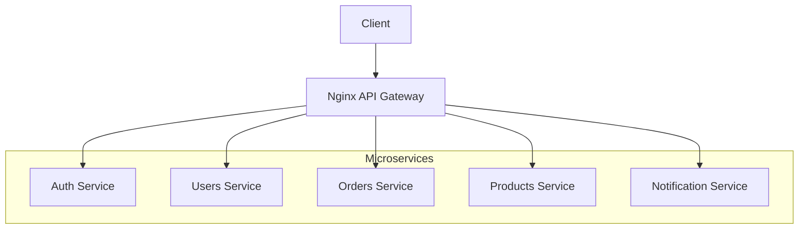

# How to Configure Nginx for Microservices

Author: [nawazdhandala](https://www.github.com/nawazdhandala)

Tags: Nginx, Microservices, API Gateway, Routing, Service Mesh

Description: Learn how to configure Nginx as an API gateway for microservices, including service routing, authentication, rate limiting, and request transformation.

---

Nginx serves as an excellent API gateway for microservices architectures. It provides a single entry point for clients while routing requests to appropriate services, handling authentication, rate limiting, and protocol transformation. This guide covers configuring Nginx to manage microservices effectively.

## Microservices Architecture with Nginx



## Basic Service Routing

Route requests to different services based on path:

```nginx
# /etc/nginx/conf.d/api-gateway.conf

# Define service upstreams
upstream auth_service {
    server auth-service:3000;
    keepalive 16;
}

upstream users_service {
    server users-service:3001;
    keepalive 16;
}

upstream orders_service {
    server orders-service:3002;
    keepalive 16;
}

upstream products_service {
    server products-service:3003;
    keepalive 16;
}

server {
    listen 80;
    server_name api.example.com;

    # Authentication service
    location /api/v1/auth/ {
        proxy_pass http://auth_service/;
        include /etc/nginx/proxy_params;
    }

    # Users service
    location /api/v1/users/ {
        proxy_pass http://users_service/;
        include /etc/nginx/proxy_params;
    }

    # Orders service
    location /api/v1/orders/ {
        proxy_pass http://orders_service/;
        include /etc/nginx/proxy_params;
    }

    # Products service
    location /api/v1/products/ {
        proxy_pass http://products_service/;
        include /etc/nginx/proxy_params;
    }
}
```

Create shared proxy parameters:

```nginx
# /etc/nginx/proxy_params

proxy_http_version 1.1;
proxy_set_header Connection "";
proxy_set_header Host $host;
proxy_set_header X-Real-IP $remote_addr;
proxy_set_header X-Forwarded-For $proxy_add_x_forwarded_for;
proxy_set_header X-Forwarded-Proto $scheme;
proxy_set_header X-Request-ID $request_id;

proxy_connect_timeout 5s;
proxy_send_timeout 60s;
proxy_read_timeout 60s;
```

## Authentication at the Gateway

Validate authentication before routing to services:

```nginx
# Authentication subrequest
location = /auth/validate {
    internal;
    proxy_pass http://auth_service/validate;

    proxy_pass_request_body off;
    proxy_set_header Content-Length "";
    proxy_set_header X-Original-URI $request_uri;
    proxy_set_header X-Original-Method $request_method;
    proxy_set_header Authorization $http_authorization;
}

# Protected endpoints
location /api/v1/orders/ {
    auth_request /auth/validate;

    # Pass auth response headers to backend
    auth_request_set $user_id $upstream_http_x_user_id;
    auth_request_set $user_role $upstream_http_x_user_role;

    proxy_set_header X-User-ID $user_id;
    proxy_set_header X-User-Role $user_role;

    proxy_pass http://orders_service/;
    include /etc/nginx/proxy_params;
}

# Public endpoints (no auth required)
location /api/v1/products/ {
    proxy_pass http://products_service/;
    include /etc/nginx/proxy_params;
}
```

## Rate Limiting Per Service

Apply different rate limits to different services:

```nginx
http {
    # Rate limit zones
    limit_req_zone $binary_remote_addr zone=auth_limit:10m rate=5r/s;
    limit_req_zone $binary_remote_addr zone=api_limit:10m rate=50r/s;
    limit_req_zone $http_x_api_key zone=api_key_limit:10m rate=100r/s;

    server {
        listen 80;
        server_name api.example.com;

        # Strict limit on auth endpoints
        location /api/v1/auth/ {
            limit_req zone=auth_limit burst=10 nodelay;
            limit_req_status 429;

            proxy_pass http://auth_service/;
            include /etc/nginx/proxy_params;
        }

        # Standard API limit
        location /api/v1/ {
            limit_req zone=api_limit burst=100 nodelay;
            limit_req_status 429;

            proxy_pass http://api_backend/;
            include /etc/nginx/proxy_params;
        }

        # Higher limit for authenticated API keys
        location /api/v1/batch/ {
            limit_req zone=api_key_limit burst=200 nodelay;

            proxy_pass http://batch_service/;
            include /etc/nginx/proxy_params;
        }
    }
}
```

## Request Transformation

Modify requests before forwarding to services:

```nginx
server {
    listen 80;
    server_name api.example.com;

    # Add correlation ID to all requests
    set $correlation_id $request_id;

    location /api/v1/users/ {
        # Strip API version from path
        rewrite ^/api/v1/users/(.*)$ /$1 break;

        # Add custom headers
        proxy_set_header X-Correlation-ID $correlation_id;
        proxy_set_header X-Gateway-Timestamp $msec;

        proxy_pass http://users_service;
        include /etc/nginx/proxy_params;
    }

    # URL rewriting for legacy compatibility
    location /v1/ {
        rewrite ^/v1/(.*)$ /api/v1/$1 last;
    }
}
```

## Service Health Checks

Monitor service health and route around failures:

```nginx
upstream orders_service {
    server orders-1:3002 max_fails=3 fail_timeout=30s;
    server orders-2:3002 max_fails=3 fail_timeout=30s;
    server orders-backup:3002 backup;

    keepalive 16;
}

server {
    listen 80;
    server_name api.example.com;

    location /api/v1/orders/ {
        proxy_pass http://orders_service/;

        # Failover conditions
        proxy_next_upstream error timeout http_500 http_502 http_503;
        proxy_next_upstream_tries 3;
        proxy_next_upstream_timeout 10s;

        include /etc/nginx/proxy_params;
    }

    # Health check endpoint
    location /health {
        access_log off;
        return 200 '{"status": "healthy"}';
        add_header Content-Type application/json;
    }
}
```

## Circuit Breaker Pattern

Implement basic circuit breaker behavior:

```nginx
http {
    # Track backend errors
    map $upstream_status $backend_error {
        default 0;
        ~^5 1;
    }

    # Limit connections to struggling backends
    upstream fragile_service {
        server fragile-service:3000 max_conns=50;
        queue 100 timeout=30s;  # Nginx Plus only
    }

    server {
        listen 80;

        location /api/v1/fragile/ {
            proxy_pass http://fragile_service/;

            # Short timeouts for fast failure
            proxy_connect_timeout 2s;
            proxy_read_timeout 5s;

            # Custom error handling
            error_page 502 503 504 = @service_unavailable;

            include /etc/nginx/proxy_params;
        }

        location @service_unavailable {
            default_type application/json;
            return 503 '{"error": "Service temporarily unavailable", "retry_after": 30}';
        }
    }
}
```

## API Versioning

Handle multiple API versions:

```nginx
upstream users_v1 {
    server users-v1:3001;
}

upstream users_v2 {
    server users-v2:3001;
}

server {
    listen 80;
    server_name api.example.com;

    # Version in URL path
    location /api/v1/users/ {
        proxy_pass http://users_v1/;
        include /etc/nginx/proxy_params;
    }

    location /api/v2/users/ {
        proxy_pass http://users_v2/;
        include /etc/nginx/proxy_params;
    }

    # Version in header
    location /api/users/ {
        set $backend users_v1;

        if ($http_api_version = "2") {
            set $backend users_v2;
        }

        proxy_pass http://$backend/;
        include /etc/nginx/proxy_params;
    }
}
```

## CORS Handling

Handle CORS at the gateway level:

```nginx
server {
    listen 80;
    server_name api.example.com;

    # CORS headers for all responses
    add_header Access-Control-Allow-Origin $http_origin always;
    add_header Access-Control-Allow-Methods "GET, POST, PUT, DELETE, OPTIONS" always;
    add_header Access-Control-Allow-Headers "Authorization, Content-Type, X-Requested-With" always;
    add_header Access-Control-Allow-Credentials "true" always;
    add_header Access-Control-Max-Age 86400 always;

    # Handle preflight requests
    location / {
        if ($request_method = OPTIONS) {
            return 204;
        }

        proxy_pass http://api_backend/;
        include /etc/nginx/proxy_params;
    }
}
```

## Complete Microservices Gateway

A production-ready API gateway configuration:

```nginx
# /etc/nginx/nginx.conf

http {
    # Rate limiting
    limit_req_zone $binary_remote_addr zone=auth:10m rate=5r/s;
    limit_req_zone $binary_remote_addr zone=api:10m rate=100r/s;
    limit_conn_zone $binary_remote_addr zone=conn:10m;

    # Logging
    log_format api_gateway '$remote_addr - [$time_iso8601] '
                           '"$request" $status $body_bytes_sent '
                           'rt=$request_time uct=$upstream_connect_time '
                           'uht=$upstream_header_time urt=$upstream_response_time '
                           'upstream=$upstream_addr '
                           'req_id=$request_id';

    include /etc/nginx/conf.d/*.conf;
}
```

```nginx
# /etc/nginx/conf.d/upstreams.conf

upstream auth_service {
    server auth-service:3000 max_fails=3 fail_timeout=30s;
    keepalive 32;
}

upstream users_service {
    least_conn;
    server users-service-1:3001 weight=5 max_fails=3 fail_timeout=30s;
    server users-service-2:3001 weight=5 max_fails=3 fail_timeout=30s;
    keepalive 32;
}

upstream orders_service {
    least_conn;
    server orders-service-1:3002 max_fails=3 fail_timeout=30s;
    server orders-service-2:3002 max_fails=3 fail_timeout=30s;
    server orders-service-backup:3002 backup;
    keepalive 32;
}

upstream products_service {
    server products-service:3003 max_fails=3 fail_timeout=30s;
    keepalive 16;
}

upstream notifications_service {
    server notifications-service:3004 max_fails=3 fail_timeout=30s;
    keepalive 16;
}
```

```nginx
# /etc/nginx/conf.d/api-gateway.conf

server {
    listen 443 ssl http2;
    server_name api.example.com;

    ssl_certificate /etc/ssl/certs/api.example.com.crt;
    ssl_certificate_key /etc/ssl/private/api.example.com.key;

    # Logging
    access_log /var/log/nginx/api_access.log api_gateway;
    error_log /var/log/nginx/api_error.log warn;

    # Connection limit
    limit_conn conn 100;

    # CORS
    add_header Access-Control-Allow-Origin $http_origin always;
    add_header Access-Control-Allow-Methods "GET, POST, PUT, DELETE, OPTIONS" always;
    add_header Access-Control-Allow-Headers "Authorization, Content-Type" always;

    # Auth validation endpoint
    location = /_auth {
        internal;
        proxy_pass http://auth_service/validate;
        proxy_pass_request_body off;
        proxy_set_header Content-Length "";
        proxy_set_header X-Original-URI $request_uri;
        proxy_set_header Authorization $http_authorization;
    }

    # Public: Auth endpoints
    location /api/v1/auth/ {
        limit_req zone=auth burst=10 nodelay;

        proxy_pass http://auth_service/;
        include /etc/nginx/proxy_params;
    }

    # Public: Products (read only)
    location /api/v1/products {
        limit_req zone=api burst=50 nodelay;

        proxy_pass http://products_service/;
        include /etc/nginx/proxy_params;
    }

    # Protected: Users
    location /api/v1/users/ {
        auth_request /_auth;
        auth_request_set $user_id $upstream_http_x_user_id;

        limit_req zone=api burst=50 nodelay;

        proxy_set_header X-User-ID $user_id;
        proxy_pass http://users_service/;
        include /etc/nginx/proxy_params;
    }

    # Protected: Orders
    location /api/v1/orders/ {
        auth_request /_auth;
        auth_request_set $user_id $upstream_http_x_user_id;

        limit_req zone=api burst=50 nodelay;

        proxy_set_header X-User-ID $user_id;
        proxy_pass http://orders_service/;

        proxy_next_upstream error timeout http_500 http_502 http_503;
        include /etc/nginx/proxy_params;
    }

    # Health check
    location /health {
        access_log off;
        return 200 '{"status":"healthy","timestamp":"$time_iso8601"}';
        add_header Content-Type application/json;
    }

    # Handle OPTIONS preflight
    if ($request_method = OPTIONS) {
        return 204;
    }

    # Default 404
    location / {
        return 404 '{"error":"Not Found"}';
        add_header Content-Type application/json;
    }
}
```

## Tracing and Observability

Add request tracing headers:

```nginx
server {
    listen 80;

    # Generate trace ID if not provided
    map $http_x_trace_id $trace_id {
        default $http_x_trace_id;
        ""      $request_id;
    }

    location /api/ {
        proxy_set_header X-Trace-ID $trace_id;
        proxy_set_header X-Span-ID $request_id;
        proxy_set_header X-Request-Start "t=$msec";

        proxy_pass http://api_backend/;
    }
}
```

---

Nginx excels as an API gateway for microservices, providing routing, authentication, rate limiting, and observability in a single layer. Configure separate upstreams for each service, implement authentication at the gateway, and use health checking for resilience. This approach simplifies client interaction while allowing services to focus on business logic.
