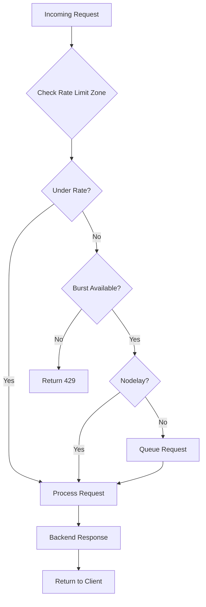

# How to Implement Rate Limiting in Nginx

Author: [nawazdhandala](https://www.github.com/nawazdhandala)

Tags: Nginx, Rate Limiting, Security, API Protection, DoS Prevention

Description: Learn how to implement rate limiting in Nginx to protect your applications from abuse, prevent DoS attacks, and ensure fair resource allocation across users.

---

Rate limiting controls how many requests a client can make within a given time period. Nginx implements this using a leaky bucket algorithm, which smooths out traffic bursts while maintaining a consistent request rate. This technique protects your backend servers from overload and ensures fair access for all users.

## Understanding Rate Limiting Concepts

Before configuring rate limiting, understand these key concepts:

- **Rate**: Number of requests allowed per time unit (e.g., 10 requests per second)
- **Burst**: Number of excess requests allowed during traffic spikes
- **Zone**: Shared memory area that tracks request counts by key (usually client IP)
- **Delay**: Whether to delay excess requests or reject them immediately

## Basic Rate Limiting

A simple rate limit configuration that restricts requests by IP address:

```nginx
# /etc/nginx/nginx.conf (http block)

http {
    # Define rate limit zone: 10MB storage, 10 requests/second per IP
    limit_req_zone $binary_remote_addr zone=api_limit:10m rate=10r/s;

    # Include server configurations
    include /etc/nginx/conf.d/*.conf;
}
```

Apply the rate limit in your server configuration:

```nginx
# /etc/nginx/conf.d/app.conf

server {
    listen 80;
    server_name api.example.com;

    location /api/ {
        # Apply rate limit
        limit_req zone=api_limit;

        proxy_pass http://127.0.0.1:3000;
        proxy_set_header Host $host;
        proxy_set_header X-Real-IP $remote_addr;
    }
}
```

With this configuration, each IP address can make 10 requests per second. Excess requests receive a 503 Service Unavailable response.

## Adding Burst Capacity

Real traffic comes in bursts. Allow temporary spikes while maintaining the average rate:

```nginx
http {
    # 10 requests/second with 20 request burst
    limit_req_zone $binary_remote_addr zone=api_limit:10m rate=10r/s;
}
```

```nginx
server {
    listen 80;
    server_name api.example.com;

    location /api/ {
        # Allow burst of 20 requests
        limit_req zone=api_limit burst=20;

        proxy_pass http://127.0.0.1:3000;
    }
}
```

The burst queue holds up to 20 excess requests, processing them at the base rate (10/s). Once the queue fills, additional requests get rejected.

## Nodelay Option

By default, burst requests are delayed to match the rate limit. Use `nodelay` to process burst requests immediately:

```nginx
location /api/ {
    # Process burst requests immediately, don't queue them
    limit_req zone=api_limit burst=20 nodelay;

    proxy_pass http://127.0.0.1:3000;
}
```

With `nodelay`, all 20 burst requests process immediately, but the client must wait for the bucket to refill before sending more.

## Delay Option for Gradual Throttling

The `delay` parameter provides a middle ground between immediate rejection and full delay:

```nginx
location /api/ {
    # First 10 requests instant, next 10 delayed, rest rejected
    limit_req zone=api_limit burst=20 delay=10;

    proxy_pass http://127.0.0.1:3000;
}
```

This processes the first 10 excess requests immediately, delays the next 10, and rejects anything beyond that.

## Multiple Rate Limits

Apply different limits based on location or request type:

```nginx
http {
    # General API limit: 10 req/s
    limit_req_zone $binary_remote_addr zone=api_general:10m rate=10r/s;

    # Login endpoint: 5 req/minute (stricter)
    limit_req_zone $binary_remote_addr zone=api_login:10m rate=5r/m;

    # Search endpoint: 30 req/s (more permissive)
    limit_req_zone $binary_remote_addr zone=api_search:10m rate=30r/s;
}
```

```nginx
server {
    listen 80;
    server_name api.example.com;

    # Strict rate limit for authentication
    location /api/auth/ {
        limit_req zone=api_login burst=5 nodelay;
        proxy_pass http://127.0.0.1:3000;
    }

    # Higher limit for search
    location /api/search/ {
        limit_req zone=api_search burst=50 nodelay;
        proxy_pass http://127.0.0.1:3000;
    }

    # Default limit for other API endpoints
    location /api/ {
        limit_req zone=api_general burst=20 nodelay;
        proxy_pass http://127.0.0.1:3000;
    }
}
```

## Rate Limiting by API Key

For APIs with authentication, rate limit by API key instead of IP:

```nginx
http {
    # Use API key from header as the rate limit key
    map $http_x_api_key $api_key {
        default $http_x_api_key;
        ""      $binary_remote_addr;  # Fall back to IP if no key
    }

    limit_req_zone $api_key zone=api_by_key:10m rate=100r/s;
}
```

```nginx
server {
    listen 80;
    server_name api.example.com;

    location /api/ {
        limit_req zone=api_by_key burst=50 nodelay;
        proxy_pass http://127.0.0.1:3000;
    }
}
```

## Custom Error Responses

Change the default 503 response for rate-limited requests:

```nginx
server {
    listen 80;
    server_name api.example.com;

    # Return 429 Too Many Requests instead of 503
    limit_req_status 429;

    # Custom error page
    error_page 429 /rate_limit.json;

    location = /rate_limit.json {
        internal;
        default_type application/json;
        return 429 '{"error": "Rate limit exceeded", "retry_after": 60}';
    }

    location /api/ {
        limit_req zone=api_limit burst=20 nodelay;
        proxy_pass http://127.0.0.1:3000;
    }
}
```

## Connection Limiting

Rate limiting controls request rate. Connection limiting controls simultaneous connections:

```nginx
http {
    # Limit connections per IP
    limit_conn_zone $binary_remote_addr zone=conn_limit:10m;
}
```

```nginx
server {
    listen 80;
    server_name api.example.com;

    # Max 10 simultaneous connections per IP
    limit_conn conn_limit 10;

    # Connection limit error code
    limit_conn_status 429;

    location /api/ {
        limit_req zone=api_limit burst=20 nodelay;
        proxy_pass http://127.0.0.1:3000;
    }
}
```

## Complete Production Example

A comprehensive rate limiting configuration for a production API:

```nginx
# /etc/nginx/nginx.conf

http {
    # Rate limit zones
    limit_req_zone $binary_remote_addr zone=general:10m rate=10r/s;
    limit_req_zone $binary_remote_addr zone=login:10m rate=1r/s;
    limit_req_zone $binary_remote_addr zone=api:10m rate=50r/s;

    # Connection limit zone
    limit_conn_zone $binary_remote_addr zone=conn:10m;

    # Logging for rate-limited requests
    log_format rate_limit '$remote_addr - [$time_local] '
                          '"$request" $status $body_bytes_sent '
                          'limit_req_status=$limit_req_status';

    include /etc/nginx/conf.d/*.conf;
}
```

```nginx
# /etc/nginx/conf.d/api.conf

server {
    listen 443 ssl http2;
    server_name api.example.com;

    ssl_certificate /etc/ssl/certs/api.example.com.crt;
    ssl_certificate_key /etc/ssl/private/api.example.com.key;

    # Global connection limit
    limit_conn conn 20;
    limit_conn_status 429;

    # Rate limit response code
    limit_req_status 429;

    # Rate limit logging
    access_log /var/log/nginx/api_access.log rate_limit;

    # Strict limit for login/auth endpoints
    location /api/v1/auth/ {
        limit_req zone=login burst=5 nodelay;

        proxy_pass http://127.0.0.1:3000;
        proxy_set_header Host $host;
        proxy_set_header X-Real-IP $remote_addr;
        proxy_set_header X-Forwarded-For $proxy_add_x_forwarded_for;
    }

    # Standard API endpoints
    location /api/ {
        limit_req zone=api burst=100 delay=50;

        proxy_pass http://127.0.0.1:3000;
        proxy_set_header Host $host;
        proxy_set_header X-Real-IP $remote_addr;
        proxy_set_header X-Forwarded-For $proxy_add_x_forwarded_for;
    }

    # Health check (no rate limit)
    location /health {
        access_log off;
        proxy_pass http://127.0.0.1:3000;
    }

    # Error response for rate limiting
    error_page 429 @rate_limited;
    location @rate_limited {
        default_type application/json;
        return 429 '{"error":"too_many_requests","message":"Rate limit exceeded. Please retry later."}';
    }
}
```

## Rate Limiting Flow



## Monitoring Rate Limits

Track rate limiting effectiveness:

```bash
# Count rate-limited requests
grep "limit_req_status=REJECTED" /var/log/nginx/api_access.log | wc -l

# Watch rate limiting in real time
tail -f /var/log/nginx/error.log | grep "limiting requests"
```

Enable the stub status module for connection monitoring:

```nginx
location /nginx_status {
    stub_status on;
    allow 127.0.0.1;
    deny all;
}
```

---

Rate limiting protects your infrastructure from abuse while ensuring fair resource distribution. Start with conservative limits, monitor rejection rates, and adjust based on legitimate traffic patterns. Combine request rate limiting with connection limits for comprehensive protection against both rapid-fire requests and slow connection attacks.
