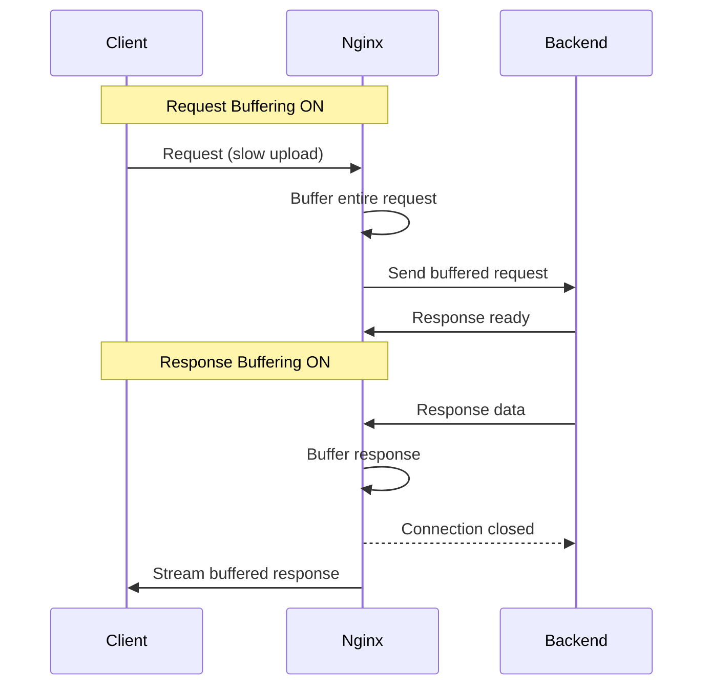

# How to Implement Request Buffering in Nginx

Author: [nawazdhandala](https://www.github.com/nawazdhandala)

Tags: Nginx, Buffering, Performance, Proxy, Optimization

Description: Learn how to configure request and response buffering in Nginx to optimize performance, handle slow clients, and protect backend servers from resource exhaustion.

---

Buffering in Nginx stores request bodies and response data temporarily, allowing the proxy to handle slow clients without tying up backend connections. This protects your application servers and improves overall throughput. This guide covers configuring request buffering, response buffering, and when to disable buffering for specific use cases.

## Why Buffering Matters

Without buffering, Nginx maintains a connection to your backend for the entire duration of data transfer. This causes problems:

| Scenario | Without Buffering | With Buffering |
|----------|-------------------|----------------|
| Slow client upload | Backend waits | Nginx buffers, backend freed |
| Large response | Backend tied until sent | Nginx buffers and streams |
| Many slow clients | Backend connection exhaustion | Nginx handles efficiently |

## Request Body Buffering

Configure how Nginx handles incoming request bodies:

```nginx
http {
    # Maximum request body size
    client_max_body_size 100M;

    # Buffer for request body in memory
    client_body_buffer_size 16k;

    # Directory for temporary files when body exceeds buffer
    client_body_temp_path /var/cache/nginx/client_temp 1 2;

    # Wait for entire body before proxying (default)
    proxy_request_buffering on;
}
```

## Detailed Request Buffering Configuration

Fine-tune request handling per location:

```nginx
server {
    listen 80;
    server_name example.com;

    # Global settings
    client_max_body_size 50M;
    client_body_buffer_size 128k;

    # Standard API endpoints
    location /api/ {
        proxy_pass http://127.0.0.1:3000;

        # Buffer entire request before sending to backend
        proxy_request_buffering on;

        # Request timeouts
        client_body_timeout 60s;

        proxy_set_header Host $host;
        proxy_set_header X-Real-IP $remote_addr;
    }

    # File upload endpoint with larger limits
    location /upload/ {
        proxy_pass http://127.0.0.1:3000;

        # Allow larger files
        client_max_body_size 500M;

        # Larger buffer for file uploads
        client_body_buffer_size 1M;

        # Longer timeout for large uploads
        client_body_timeout 300s;

        proxy_set_header Host $host;
        proxy_set_header X-Real-IP $remote_addr;
    }
}
```

## Disabling Request Buffering

For streaming uploads or real-time data, disable request buffering:

```nginx
location /stream-upload/ {
    proxy_pass http://127.0.0.1:3000;

    # Stream request body directly to backend
    proxy_request_buffering off;

    # Required for chunked transfer encoding
    proxy_http_version 1.1;

    # Don't limit body size for streaming
    client_max_body_size 0;

    proxy_set_header Host $host;
    proxy_set_header X-Real-IP $remote_addr;
}
```

Use cases for disabled request buffering:
- Live video/audio uploads
- Real-time data streaming
- Very large file uploads where memory is limited
- WebSocket-like protocols over HTTP

## Response Buffering

Configure how Nginx buffers responses from upstream servers:

```nginx
server {
    listen 80;
    server_name example.com;

    location / {
        proxy_pass http://127.0.0.1:3000;

        # Enable response buffering (default)
        proxy_buffering on;

        # Size of buffer for response header
        proxy_buffer_size 4k;

        # Number and size of buffers for response body
        proxy_buffers 8 16k;

        # Size that can be busy sending to client
        proxy_busy_buffers_size 32k;

        # Temporary files for large responses
        proxy_temp_file_write_size 64k;
        proxy_max_temp_file_size 1024M;
        proxy_temp_path /var/cache/nginx/proxy_temp 1 2;

        proxy_set_header Host $host;
        proxy_set_header X-Real-IP $remote_addr;
    }
}
```

## Understanding Buffer Settings

Here is what each buffer setting controls:

```nginx
location / {
    proxy_pass http://backend;

    # Buffer for response headers (first response data)
    # Should fit all headers in single buffer
    proxy_buffer_size 4k;

    # Total buffers for response body
    # 8 buffers x 16k = 128k max in memory
    proxy_buffers 8 16k;

    # Subset of buffers that can send to client
    # While these send, others fill from upstream
    proxy_busy_buffers_size 32k;  # Must be >= proxy_buffer_size

    # Chunk size when writing to temp file
    proxy_temp_file_write_size 64k;

    # Maximum temp file size (0 = unlimited)
    proxy_max_temp_file_size 1024M;
}
```

## Buffering for Different Content Types

Optimize buffering based on response type:

```nginx
server {
    listen 80;
    server_name example.com;

    # Default buffering for most responses
    proxy_buffering on;
    proxy_buffer_size 4k;
    proxy_buffers 8 16k;

    # API responses (usually small JSON)
    location /api/ {
        proxy_pass http://127.0.0.1:3000;

        # Smaller buffers for small responses
        proxy_buffer_size 4k;
        proxy_buffers 4 8k;
    }

    # File downloads (large responses)
    location /downloads/ {
        proxy_pass http://127.0.0.1:3000;

        # Larger buffers for file content
        proxy_buffer_size 8k;
        proxy_buffers 16 64k;
        proxy_busy_buffers_size 128k;
    }

    # Event streaming (disable buffering)
    location /events/ {
        proxy_pass http://127.0.0.1:3000;

        # Disable buffering for SSE
        proxy_buffering off;

        # Required for chunked responses
        proxy_http_version 1.1;
        chunked_transfer_encoding on;
    }
}
```

## Disabling Response Buffering

Disable buffering for real-time streaming:

```nginx
location /sse/ {
    proxy_pass http://127.0.0.1:3000;

    # Disable response buffering
    proxy_buffering off;

    # Also disable at application level if needed
    proxy_set_header X-Accel-Buffering no;

    # Required for streaming
    proxy_http_version 1.1;
    proxy_set_header Connection "";

    # Long timeout for persistent connections
    proxy_read_timeout 3600s;

    proxy_set_header Host $host;
    proxy_set_header X-Real-IP $remote_addr;
}
```

Applications can also control buffering via response header:

```python
# Python Flask example
@app.route('/stream')
def stream():
    def generate():
        for i in range(100):
            yield f"data: {i}\n\n"
            time.sleep(1)

    response = Response(generate(), mimetype='text/event-stream')
    response.headers['X-Accel-Buffering'] = 'no'
    return response
```

## Buffering Flow Diagram



## Memory vs Disk Buffering

Configure when responses spill to disk:

```nginx
http {
    # Memory buffers first
    proxy_buffers 8 32k;

    # Write to temp file when memory full
    proxy_max_temp_file_size 1024M;

    # Write chunk size to disk
    proxy_temp_file_write_size 64k;

    # Temp file location with directory hashing
    proxy_temp_path /var/cache/nginx/proxy_temp 1 2;
}
```

Monitor temp file usage:

```bash
# Check temp directory size
du -sh /var/cache/nginx/proxy_temp

# Watch for temp file creation
inotifywait -m /var/cache/nginx/proxy_temp -e create -e delete
```

## Complete Production Configuration

A comprehensive buffering configuration:

```nginx
# /etc/nginx/conf.d/buffering.conf

upstream app_backend {
    server 127.0.0.1:3000;
    keepalive 32;
}

server {
    listen 443 ssl http2;
    server_name app.example.com;

    ssl_certificate /etc/ssl/certs/app.example.com.crt;
    ssl_certificate_key /etc/ssl/private/app.example.com.key;

    # Global request settings
    client_max_body_size 100M;
    client_body_buffer_size 128k;
    client_body_timeout 60s;

    # Global response buffer settings
    proxy_buffering on;
    proxy_buffer_size 4k;
    proxy_buffers 8 32k;
    proxy_busy_buffers_size 64k;

    # Standard application routes
    location / {
        proxy_pass http://app_backend;

        proxy_http_version 1.1;
        proxy_set_header Connection "";
        proxy_set_header Host $host;
        proxy_set_header X-Real-IP $remote_addr;
        proxy_set_header X-Forwarded-For $proxy_add_x_forwarded_for;
    }

    # File upload endpoint
    location /api/upload {
        proxy_pass http://app_backend;

        # Larger limits for uploads
        client_max_body_size 1G;
        client_body_buffer_size 1M;
        client_body_timeout 600s;

        # Stream to backend for huge files
        proxy_request_buffering off;

        proxy_http_version 1.1;
        proxy_set_header Connection "";
        proxy_set_header Host $host;
        proxy_set_header X-Real-IP $remote_addr;
    }

    # Server-Sent Events
    location /events {
        proxy_pass http://app_backend;

        # Disable buffering for streaming
        proxy_buffering off;
        proxy_cache off;

        # SSE specific settings
        proxy_http_version 1.1;
        proxy_set_header Connection "";
        proxy_read_timeout 86400s;

        proxy_set_header Host $host;
        proxy_set_header X-Real-IP $remote_addr;
    }

    # WebSocket endpoint
    location /ws {
        proxy_pass http://app_backend;

        # Disable all buffering
        proxy_buffering off;
        proxy_request_buffering off;

        # WebSocket upgrade
        proxy_http_version 1.1;
        proxy_set_header Upgrade $http_upgrade;
        proxy_set_header Connection "upgrade";

        proxy_read_timeout 86400s;
        proxy_send_timeout 86400s;

        proxy_set_header Host $host;
        proxy_set_header X-Real-IP $remote_addr;
    }

    # Large file downloads
    location /downloads {
        proxy_pass http://app_backend;

        # Large buffers for file content
        proxy_buffer_size 8k;
        proxy_buffers 32 64k;
        proxy_busy_buffers_size 128k;

        # Allow large temp files
        proxy_max_temp_file_size 2048M;

        proxy_set_header Host $host;
        proxy_set_header X-Real-IP $remote_addr;
    }
}
```

## Troubleshooting Buffer Issues

Common problems and solutions:

| Issue | Symptom | Solution |
|-------|---------|----------|
| 413 Request Entity Too Large | Upload rejected | Increase client_max_body_size |
| Slow uploads blocking backends | Connection exhaustion | Enable proxy_request_buffering |
| Streaming not working | Data arrives in chunks | Disable proxy_buffering |
| Memory usage high | Nginx consuming RAM | Reduce buffer sizes, use temp files |
| Slow large downloads | Timeouts | Increase buffers, check temp path |

Check buffer status in error log:

```bash
# Look for buffer warnings
grep -E 'buffer|temp' /var/log/nginx/error.log
```

---

Request and response buffering in Nginx protects your backend servers from slow clients and optimizes resource usage. Enable buffering for standard requests, configure larger buffers for file operations, and disable buffering for real-time streaming. Monitor temp file usage and adjust buffer sizes based on your traffic patterns.
