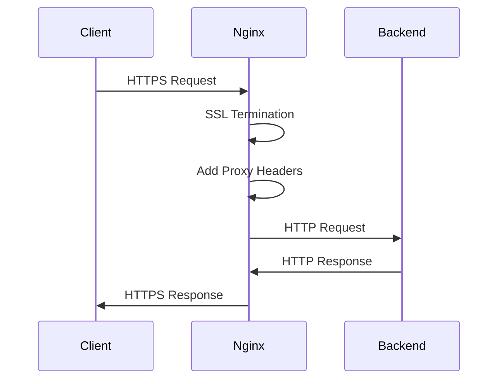

# How to Configure Nginx as a Reverse Proxy

Author: [nawazdhandala](https://www.github.com/nawazdhandala)

Tags: Nginx, Reverse Proxy, DevOps, Web Server, Load Balancing

Description: Learn how to configure Nginx as a reverse proxy to route traffic to backend servers, handle SSL termination, and improve your application architecture.

---

A reverse proxy sits between clients and your backend servers, forwarding requests and returning responses. Nginx excels at this role due to its event-driven architecture, low memory footprint, and battle-tested stability. Whether you are running a single application server or a fleet of microservices, placing Nginx in front brings benefits like centralized SSL termination, request buffering, and simplified routing.

## Why Use a Reverse Proxy?

Before diving into configuration, let us understand what problems a reverse proxy solves:

1. **Single entry point**: Clients connect to one address while multiple backend servers handle the actual work.
2. **SSL termination**: Handle HTTPS at the proxy layer, letting backends communicate over plain HTTP internally.
3. **Load distribution**: Spread requests across multiple backend instances.
4. **Caching**: Store frequently requested content closer to clients.
5. **Security**: Hide backend server details and filter malicious requests.

## Basic Reverse Proxy Configuration

Here is the simplest Nginx reverse proxy configuration. This example forwards all requests to a backend application running on port 3000.

```nginx
# /etc/nginx/conf.d/app.conf

# Define the backend server
upstream backend_app {
    server 127.0.0.1:3000;  # Your application server
}

server {
    listen 80;
    server_name example.com www.example.com;

    location / {
        # Forward requests to the backend
        proxy_pass http://backend_app;

        # Pass the original host header to the backend
        proxy_set_header Host $host;

        # Pass the real client IP address
        proxy_set_header X-Real-IP $remote_addr;

        # Append to X-Forwarded-For for proxy chains
        proxy_set_header X-Forwarded-For $proxy_add_x_forwarded_for;

        # Tell backend the original protocol (http or https)
        proxy_set_header X-Forwarded-Proto $scheme;
    }
}
```

After creating this file, test the configuration and reload Nginx:

```bash
# Check configuration syntax
sudo nginx -t

# Reload Nginx to apply changes
sudo systemctl reload nginx
```

## Understanding Proxy Headers

The headers you pass to your backend matter. Here is what each one does:

| Header | Purpose |
|--------|---------|
| `Host` | Original hostname from the client request |
| `X-Real-IP` | Actual client IP address |
| `X-Forwarded-For` | Chain of proxy IPs the request passed through |
| `X-Forwarded-Proto` | Original protocol (http or https) |

Your backend application can use these headers to generate correct URLs, log accurate client IPs, and make security decisions.

## Proxying to Multiple Backend Paths

Real applications often need different paths routed to different services. Here is how to configure path-based routing:

```nginx
server {
    listen 80;
    server_name api.example.com;

    # Route API requests to the main application
    location /api/ {
        proxy_pass http://127.0.0.1:3000/;  # Trailing slash removes /api prefix
        proxy_set_header Host $host;
        proxy_set_header X-Real-IP $remote_addr;
        proxy_set_header X-Forwarded-For $proxy_add_x_forwarded_for;
    }

    # Route authentication requests to a separate service
    location /auth/ {
        proxy_pass http://127.0.0.1:4000/;  # Auth service on different port
        proxy_set_header Host $host;
        proxy_set_header X-Real-IP $remote_addr;
        proxy_set_header X-Forwarded-For $proxy_add_x_forwarded_for;
    }

    # Serve static files directly from Nginx
    location /static/ {
        alias /var/www/static/;  # Serve files from this directory
        expires 30d;             # Cache static files for 30 days
    }
}
```

Note the trailing slash in `proxy_pass`. When present, Nginx strips the matched location prefix. Without it, the full URI passes through unchanged.

## Connection and Timeout Settings

Production deployments need proper timeout configuration to handle slow backends and prevent resource exhaustion:

```nginx
location / {
    proxy_pass http://backend_app;

    # Connection timeout (how long to wait for a connection)
    proxy_connect_timeout 30s;

    # Send timeout (how long between successive writes)
    proxy_send_timeout 60s;

    # Read timeout (how long to wait for backend response)
    proxy_read_timeout 60s;

    # Buffer settings for proxy responses
    proxy_buffering on;
    proxy_buffer_size 4k;         # Buffer for response headers
    proxy_buffers 8 16k;          # Number and size of buffers
    proxy_busy_buffers_size 32k;  # Max size when buffers are busy

    # Pass headers as-is (useful for certain applications)
    proxy_set_header Host $host;
    proxy_set_header X-Real-IP $remote_addr;
    proxy_set_header X-Forwarded-For $proxy_add_x_forwarded_for;
}
```

## Handling WebSocket Connections

WebSocket connections require special handling because they upgrade from HTTP to a persistent connection:

```nginx
location /ws/ {
    proxy_pass http://127.0.0.1:3000;

    # Required for WebSocket upgrade
    proxy_http_version 1.1;
    proxy_set_header Upgrade $http_upgrade;
    proxy_set_header Connection "upgrade";

    # Increase timeouts for long-lived connections
    proxy_read_timeout 3600s;
    proxy_send_timeout 3600s;

    # Standard proxy headers
    proxy_set_header Host $host;
    proxy_set_header X-Real-IP $remote_addr;
    proxy_set_header X-Forwarded-For $proxy_add_x_forwarded_for;
}
```

## Complete Production Configuration

Here is a complete configuration combining all the concepts above, suitable for a production deployment:

```nginx
# /etc/nginx/conf.d/production-app.conf

upstream app_servers {
    server 127.0.0.1:3000 weight=5;   # Primary server
    server 127.0.0.1:3001 weight=3;   # Secondary server
    keepalive 32;                      # Persistent connections to backends
}

server {
    listen 80;
    server_name example.com www.example.com;

    # Redirect HTTP to HTTPS
    return 301 https://$server_name$request_uri;
}

server {
    listen 443 ssl http2;
    server_name example.com www.example.com;

    # SSL configuration (certificates managed separately)
    ssl_certificate /etc/letsencrypt/live/example.com/fullchain.pem;
    ssl_certificate_key /etc/letsencrypt/live/example.com/privkey.pem;

    # Security headers
    add_header X-Frame-Options "SAMEORIGIN" always;
    add_header X-Content-Type-Options "nosniff" always;

    # Logging
    access_log /var/log/nginx/app_access.log;
    error_log /var/log/nginx/app_error.log;

    location / {
        proxy_pass http://app_servers;

        # Use HTTP/1.1 for keepalive connections
        proxy_http_version 1.1;
        proxy_set_header Connection "";

        # Timeouts
        proxy_connect_timeout 30s;
        proxy_send_timeout 60s;
        proxy_read_timeout 60s;

        # Headers
        proxy_set_header Host $host;
        proxy_set_header X-Real-IP $remote_addr;
        proxy_set_header X-Forwarded-For $proxy_add_x_forwarded_for;
        proxy_set_header X-Forwarded-Proto $scheme;

        # Buffering
        proxy_buffering on;
        proxy_buffer_size 4k;
        proxy_buffers 8 16k;
    }

    # Health check endpoint (no logging)
    location /health {
        access_log off;
        proxy_pass http://app_servers;
        proxy_set_header Host $host;
    }
}
```

## Debugging Proxy Issues

When things go wrong, Nginx error logs are your first stop:

```bash
# Watch error logs in real time
sudo tail -f /var/log/nginx/error.log

# Check for configuration errors
sudo nginx -t

# View upstream connection status
sudo nginx -V 2>&1 | grep -o with-http_stub_status_module
```

Common issues include:

- **502 Bad Gateway**: Backend server not running or unreachable
- **504 Gateway Timeout**: Backend too slow; increase `proxy_read_timeout`
- **Incorrect URLs**: Check trailing slashes in `proxy_pass` directives

## Request Flow Diagram



---

Nginx reverse proxy configuration forms the foundation for modern web architectures. Start with the basic setup, add SSL termination, configure proper headers, and tune timeouts based on your application requirements. With these building blocks in place, you can scale to handle millions of requests while keeping your backend servers focused on application logic.
