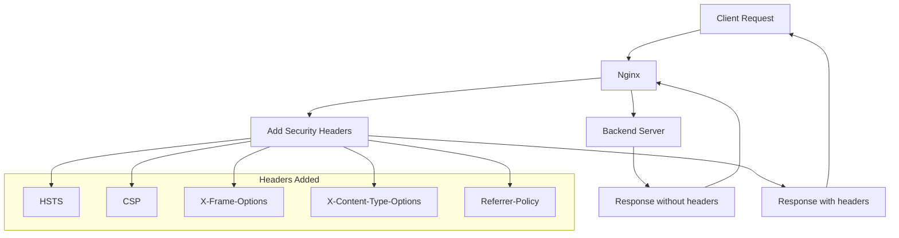

# How to Configure Security Headers in Nginx

Author: [nawazdhandala](https://www.github.com/nawazdhandala)

Tags: Nginx, Security, Headers, HTTPS, XSS Protection

Description: Learn how to configure security headers in Nginx to protect your web applications from common attacks like XSS, clickjacking, and content sniffing.

---

Security headers instruct browsers to enable protective features that defend against common web attacks. Nginx can add these headers to all responses, providing a security layer independent of your application code. This guide covers essential security headers and how to configure them properly.

## Essential Security Headers

Here are the most important security headers and what they protect against:

| Header | Protection |
|--------|------------|
| Strict-Transport-Security | Forces HTTPS connections |
| X-Content-Type-Options | Prevents MIME sniffing |
| X-Frame-Options | Prevents clickjacking |
| X-XSS-Protection | Legacy XSS filter |
| Content-Security-Policy | Controls resource loading |
| Referrer-Policy | Controls referrer information |
| Permissions-Policy | Controls browser features |

## Basic Security Headers Configuration

Add essential headers to your Nginx configuration:

```nginx
server {
    listen 443 ssl http2;
    server_name example.com;

    # Force HTTPS for 1 year, include subdomains
    add_header Strict-Transport-Security "max-age=31536000; includeSubDomains" always;

    # Prevent MIME type sniffing
    add_header X-Content-Type-Options "nosniff" always;

    # Prevent clickjacking
    add_header X-Frame-Options "SAMEORIGIN" always;

    # Enable XSS filter (legacy, but still useful)
    add_header X-XSS-Protection "1; mode=block" always;

    # Control referrer information
    add_header Referrer-Policy "strict-origin-when-cross-origin" always;

    location / {
        proxy_pass http://127.0.0.1:3000;
    }
}
```

Note the `always` parameter: it ensures headers are added to all responses, including error pages.

## HTTP Strict Transport Security (HSTS)

HSTS tells browsers to always use HTTPS:

```nginx
# Basic HSTS (1 year)
add_header Strict-Transport-Security "max-age=31536000" always;

# Include subdomains
add_header Strict-Transport-Security "max-age=31536000; includeSubDomains" always;

# Preload (submit to browser preload lists)
add_header Strict-Transport-Security "max-age=31536000; includeSubDomains; preload" always;
```

Warning: Only enable `preload` if you are certain all subdomains support HTTPS. Once preloaded, removing HSTS is difficult.

## Content Security Policy (CSP)

CSP controls which resources can load on your pages:

```nginx
# Basic CSP - scripts and styles from same origin only
add_header Content-Security-Policy "default-src 'self'" always;

# More permissive CSP with specific sources
add_header Content-Security-Policy "
    default-src 'self';
    script-src 'self' https://cdn.example.com;
    style-src 'self' 'unsafe-inline' https://fonts.googleapis.com;
    font-src 'self' https://fonts.gstatic.com;
    img-src 'self' data: https:;
    connect-src 'self' https://api.example.com;
    frame-ancestors 'self';
    base-uri 'self';
    form-action 'self';
" always;
```

Start with a report-only header to test without breaking functionality:

```nginx
# Report violations without blocking
add_header Content-Security-Policy-Report-Only "
    default-src 'self';
    report-uri /csp-violation-report;
" always;
```

## CSP Directives Reference

| Directive | Controls |
|-----------|----------|
| default-src | Fallback for other directives |
| script-src | JavaScript sources |
| style-src | CSS sources |
| img-src | Image sources |
| font-src | Font file sources |
| connect-src | AJAX, WebSocket, fetch sources |
| frame-src | iframe sources |
| frame-ancestors | Who can embed this page |
| object-src | Plugin sources (Flash, etc.) |
| media-src | Audio/video sources |
| base-uri | Allowed base URLs |
| form-action | Form submission targets |

## X-Frame-Options

Prevent your site from being embedded in iframes:

```nginx
# Allow same origin only
add_header X-Frame-Options "SAMEORIGIN" always;

# Deny all framing
add_header X-Frame-Options "DENY" always;

# Allow specific origin (deprecated, use CSP instead)
add_header X-Frame-Options "ALLOW-FROM https://trusted.com" always;
```

For modern browsers, use CSP frame-ancestors instead:

```nginx
add_header Content-Security-Policy "frame-ancestors 'self' https://trusted.com" always;
```

## Referrer Policy

Control how much referrer information is sent:

```nginx
# Send full referrer to same origin, origin only to cross-origin
add_header Referrer-Policy "strict-origin-when-cross-origin" always;

# Never send referrer
add_header Referrer-Policy "no-referrer" always;

# Send full referrer to same origin only
add_header Referrer-Policy "same-origin" always;

# Send origin only (no path)
add_header Referrer-Policy "origin" always;
```

## Permissions Policy

Control browser features and APIs:

```nginx
# Disable various browser features
add_header Permissions-Policy "
    accelerometer=(),
    camera=(),
    geolocation=(),
    gyroscope=(),
    magnetometer=(),
    microphone=(),
    payment=(),
    usb=()
" always;

# Allow specific features for self only
add_header Permissions-Policy "
    geolocation=(self),
    camera=(self),
    microphone=()
" always;
```

## Cache Control for Security

Prevent caching of sensitive responses:

```nginx
# Prevent caching of authenticated content
location /dashboard/ {
    add_header Cache-Control "no-store, no-cache, must-revalidate, proxy-revalidate" always;
    add_header Pragma "no-cache" always;
    add_header Expires "0" always;

    proxy_pass http://127.0.0.1:3000;
}
```

## Complete Security Headers Configuration

A comprehensive security headers setup:

```nginx
# /etc/nginx/conf.d/security-headers.conf

# Security headers (include in server blocks)
# HSTS
add_header Strict-Transport-Security "max-age=31536000; includeSubDomains" always;

# Prevent MIME sniffing
add_header X-Content-Type-Options "nosniff" always;

# Clickjacking protection
add_header X-Frame-Options "SAMEORIGIN" always;

# XSS filter
add_header X-XSS-Protection "1; mode=block" always;

# Referrer policy
add_header Referrer-Policy "strict-origin-when-cross-origin" always;

# Permissions policy
add_header Permissions-Policy "accelerometer=(), camera=(), geolocation=(), gyroscope=(), magnetometer=(), microphone=(), payment=(), usb=()" always;
```

```nginx
# /etc/nginx/conf.d/app.conf

server {
    listen 80;
    server_name example.com www.example.com;
    return 301 https://$server_name$request_uri;
}

server {
    listen 443 ssl http2;
    server_name example.com www.example.com;

    ssl_certificate /etc/letsencrypt/live/example.com/fullchain.pem;
    ssl_certificate_key /etc/letsencrypt/live/example.com/privkey.pem;

    # Include security headers
    include /etc/nginx/conf.d/security-headers.conf;

    # Content Security Policy (site-specific)
    add_header Content-Security-Policy "
        default-src 'self';
        script-src 'self' 'unsafe-inline' https://cdn.example.com;
        style-src 'self' 'unsafe-inline' https://fonts.googleapis.com;
        font-src 'self' https://fonts.gstatic.com;
        img-src 'self' data: https:;
        connect-src 'self' https://api.example.com wss://ws.example.com;
        frame-ancestors 'self';
        base-uri 'self';
        form-action 'self';
        upgrade-insecure-requests;
    " always;

    location / {
        proxy_pass http://127.0.0.1:3000;
        proxy_set_header Host $host;
        proxy_set_header X-Real-IP $remote_addr;
        proxy_set_header X-Forwarded-For $proxy_add_x_forwarded_for;
        proxy_set_header X-Forwarded-Proto $scheme;
    }

    # API endpoints might need different CSP
    location /api/ {
        proxy_pass http://127.0.0.1:3000;

        # API-specific CSP (more restrictive)
        add_header Content-Security-Policy "default-src 'none'; frame-ancestors 'none'" always;

        # Re-add other security headers (add_header in location replaces parent)
        include /etc/nginx/conf.d/security-headers.conf;
    }

    # Static files
    location /static/ {
        alias /var/www/static/;

        # Cache headers for static files
        add_header Cache-Control "public, max-age=31536000, immutable" always;

        # Security headers still apply
        include /etc/nginx/conf.d/security-headers.conf;
    }
}
```

## Header Inheritance Warning

Nginx headers do not inherit into nested locations. When you use `add_header` in a location block, it replaces all headers from the parent:

```nginx
server {
    # These headers apply to locations without their own add_header
    add_header X-Frame-Options "SAMEORIGIN" always;
    add_header X-Content-Type-Options "nosniff" always;

    location / {
        # This location inherits the server headers
        proxy_pass http://backend;
    }

    location /api/ {
        # Adding any header removes inheritance
        add_header X-Custom "value" always;

        # Must re-add all security headers
        add_header X-Frame-Options "SAMEORIGIN" always;
        add_header X-Content-Type-Options "nosniff" always;

        proxy_pass http://backend;
    }
}
```

Solution: Use include files for consistent header management.

## Testing Security Headers

Verify your headers are working:

```bash
# Check headers with curl
curl -I https://example.com

# Detailed header view
curl -sD - https://example.com -o /dev/null

# Check specific header
curl -sI https://example.com | grep -i strict-transport
```

Use online tools:
- securityheaders.com
- observatory.mozilla.org
- SSL Labs (ssllabs.com)

## Security Headers Flow



## Common Issues

| Issue | Cause | Solution |
|-------|-------|----------|
| Headers missing | Location override | Use include files |
| CSP blocking resources | Policy too strict | Add sources or use nonce |
| HSTS locked out | Enabled too early | Start with short max-age |
| Site breaks in iframe | X-Frame-Options DENY | Use SAMEORIGIN or CSP |

---

Security headers add defense-in-depth to your web applications with minimal performance impact. Start with essential headers like HSTS and X-Content-Type-Options, then gradually implement CSP starting in report-only mode. Test thoroughly with online scanners and monitor for CSP violations. Remember that headers in nested locations override parent headers, so use include files for consistent application.
