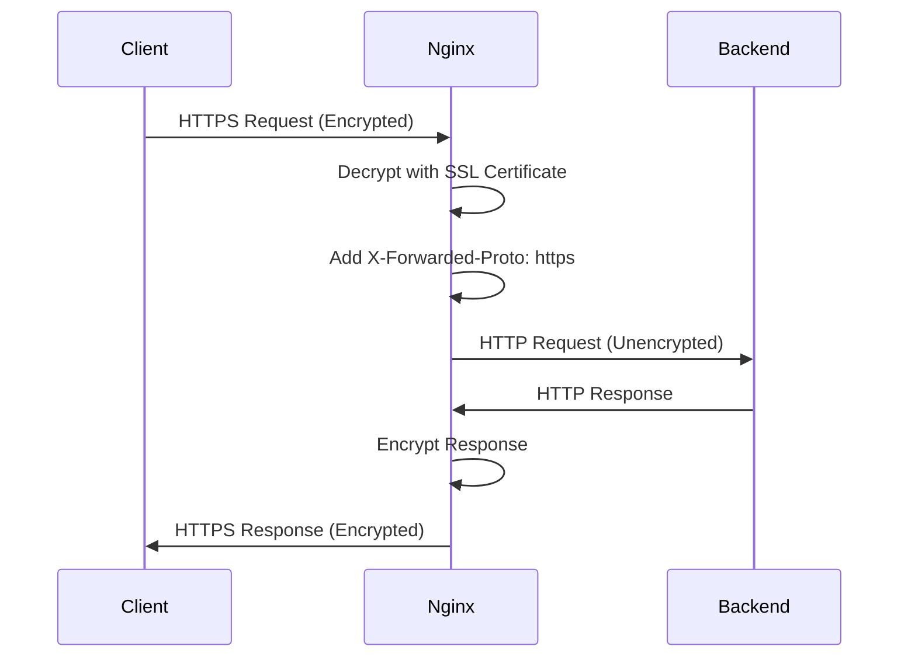

# How to Configure SSL/TLS Termination in Nginx

Author: [nawazdhandala](https://www.github.com/nawazdhandala)

Tags: Nginx, SSL, TLS, HTTPS, Security, Let's Encrypt

Description: Learn how to configure SSL/TLS termination in Nginx, including certificate setup, cipher configuration, OCSP stapling, and automated renewal with Let's Encrypt.

---

SSL/TLS termination at the proxy layer centralizes certificate management and offloads encryption overhead from backend servers. Nginx handles this efficiently, terminating HTTPS connections at the edge and forwarding plain HTTP to your application servers. This guide covers everything from basic setup to production-hardened configurations.

## Why Terminate SSL at Nginx?

Handling SSL/TLS at the reverse proxy provides several benefits:

1. **Centralized certificate management**: Update certificates in one place instead of every backend server
2. **Reduced backend load**: Encryption/decryption happens at the proxy layer
3. **Simpler backend configuration**: Applications work with plain HTTP internally
4. **Better performance**: Nginx is optimized for SSL operations

## Basic SSL Configuration

Start with a simple HTTPS configuration:

```nginx
# /etc/nginx/conf.d/secure-app.conf

server {
    listen 443 ssl;
    server_name example.com www.example.com;

    # Certificate and private key
    ssl_certificate /etc/ssl/certs/example.com.crt;
    ssl_certificate_key /etc/ssl/private/example.com.key;

    location / {
        proxy_pass http://127.0.0.1:3000;
        proxy_set_header Host $host;
        proxy_set_header X-Real-IP $remote_addr;
        proxy_set_header X-Forwarded-For $proxy_add_x_forwarded_for;
        proxy_set_header X-Forwarded-Proto $scheme;
    }
}

# Redirect HTTP to HTTPS
server {
    listen 80;
    server_name example.com www.example.com;
    return 301 https://$server_name$request_uri;
}
```

## Setting Up Let's Encrypt with Certbot

Let's Encrypt provides free certificates. Install Certbot and obtain certificates:

```bash
# Install Certbot on Ubuntu/Debian
sudo apt update
sudo apt install certbot python3-certbot-nginx

# Obtain certificate (Certbot modifies Nginx config automatically)
sudo certbot --nginx -d example.com -d www.example.com

# Or obtain certificate only (manual configuration)
sudo certbot certonly --webroot -w /var/www/html -d example.com -d www.example.com
```

Certbot stores certificates in `/etc/letsencrypt/live/example.com/`:

- `fullchain.pem`: Certificate plus intermediate certificates
- `privkey.pem`: Private key

## Production SSL Configuration

A hardened SSL configuration with modern security practices:

```nginx
# /etc/nginx/conf.d/ssl-settings.conf

# SSL session caching (shared across workers)
ssl_session_cache shared:SSL:10m;
ssl_session_timeout 1d;
ssl_session_tickets off;  # Disable for better security

# Modern TLS versions only
ssl_protocols TLSv1.2 TLSv1.3;

# Secure cipher suite
ssl_ciphers ECDHE-ECDSA-AES128-GCM-SHA256:ECDHE-RSA-AES128-GCM-SHA256:ECDHE-ECDSA-AES256-GCM-SHA384:ECDHE-RSA-AES256-GCM-SHA384:ECDHE-ECDSA-CHACHA20-POLY1305:ECDHE-RSA-CHACHA20-POLY1305:DHE-RSA-AES128-GCM-SHA256:DHE-RSA-AES256-GCM-SHA384;

# Server chooses cipher order
ssl_prefer_server_ciphers off;

# Diffie-Hellman parameters for DHE ciphers
ssl_dhparam /etc/nginx/dhparam.pem;

# OCSP Stapling
ssl_stapling on;
ssl_stapling_verify on;
resolver 8.8.8.8 8.8.4.4 valid=300s;
resolver_timeout 5s;
```

Generate Diffie-Hellman parameters (do this once):

```bash
# Generate 2048-bit DH parameters (takes a few minutes)
sudo openssl dhparam -out /etc/nginx/dhparam.pem 2048
```

## Complete Server Block

Combine SSL settings with a full server configuration:

```nginx
# /etc/nginx/conf.d/secure-app.conf

upstream app_backend {
    server 127.0.0.1:3000;
    keepalive 32;
}

# Redirect HTTP to HTTPS
server {
    listen 80;
    listen [::]:80;
    server_name example.com www.example.com;

    # Allow Let's Encrypt verification
    location /.well-known/acme-challenge/ {
        root /var/www/certbot;
    }

    # Redirect everything else to HTTPS
    location / {
        return 301 https://$server_name$request_uri;
    }
}

# HTTPS server
server {
    listen 443 ssl http2;
    listen [::]:443 ssl http2;
    server_name example.com www.example.com;

    # Certificates
    ssl_certificate /etc/letsencrypt/live/example.com/fullchain.pem;
    ssl_certificate_key /etc/letsencrypt/live/example.com/privkey.pem;

    # Include shared SSL settings
    include /etc/nginx/conf.d/ssl-settings.conf;

    # Security headers
    add_header Strict-Transport-Security "max-age=31536000; includeSubDomains" always;
    add_header X-Frame-Options "SAMEORIGIN" always;
    add_header X-Content-Type-Options "nosniff" always;
    add_header X-XSS-Protection "1; mode=block" always;

    # Logging
    access_log /var/log/nginx/example_access.log;
    error_log /var/log/nginx/example_error.log;

    location / {
        proxy_pass http://app_backend;

        proxy_http_version 1.1;
        proxy_set_header Connection "";

        proxy_set_header Host $host;
        proxy_set_header X-Real-IP $remote_addr;
        proxy_set_header X-Forwarded-For $proxy_add_x_forwarded_for;
        proxy_set_header X-Forwarded-Proto $scheme;

        proxy_connect_timeout 30s;
        proxy_send_timeout 60s;
        proxy_read_timeout 60s;
    }
}
```

## Automated Certificate Renewal

Let's Encrypt certificates expire after 90 days. Set up automatic renewal:

```bash
# Test renewal (dry run)
sudo certbot renew --dry-run

# Add renewal to crontab
sudo crontab -e
```

Add this line to renew certificates twice daily:

```
0 0,12 * * * certbot renew --quiet --post-hook "systemctl reload nginx"
```

Or use systemd timer (usually configured by default):

```bash
# Check certbot timer status
sudo systemctl status certbot.timer

# View timer schedule
sudo systemctl list-timers certbot.timer
```

## Certificate Chain Verification

Verify your SSL configuration is correct:

```bash
# Check certificate chain
openssl s_client -connect example.com:443 -servername example.com < /dev/null 2>/dev/null | openssl x509 -noout -dates

# Verify certificate matches private key
openssl x509 -noout -modulus -in /path/to/cert.crt | openssl md5
openssl rsa -noout -modulus -in /path/to/key.key | openssl md5
# Both commands should output the same hash
```

## Multiple Domains with SNI

Server Name Indication (SNI) allows multiple SSL sites on one IP address:

```nginx
# First site
server {
    listen 443 ssl http2;
    server_name site1.example.com;

    ssl_certificate /etc/letsencrypt/live/site1.example.com/fullchain.pem;
    ssl_certificate_key /etc/letsencrypt/live/site1.example.com/privkey.pem;

    location / {
        proxy_pass http://127.0.0.1:3001;
    }
}

# Second site
server {
    listen 443 ssl http2;
    server_name site2.example.com;

    ssl_certificate /etc/letsencrypt/live/site2.example.com/fullchain.pem;
    ssl_certificate_key /etc/letsencrypt/live/site2.example.com/privkey.pem;

    location / {
        proxy_pass http://127.0.0.1:3002;
    }
}
```

## Wildcard Certificates

For multiple subdomains, use a wildcard certificate:

```bash
# Obtain wildcard certificate (requires DNS validation)
sudo certbot certonly --manual --preferred-challenges dns \
    -d example.com -d '*.example.com'
```

Configure Nginx to use it:

```nginx
server {
    listen 443 ssl http2;
    server_name *.example.com;

    ssl_certificate /etc/letsencrypt/live/example.com/fullchain.pem;
    ssl_certificate_key /etc/letsencrypt/live/example.com/privkey.pem;

    # Handle all subdomains
    location / {
        proxy_pass http://app_backend;
    }
}
```

## SSL Termination Flow



## Testing SSL Configuration

Use online tools and command line to verify your setup:

```bash
# Test SSL configuration with OpenSSL
openssl s_client -connect example.com:443 -tls1_2

# Check supported protocols
nmap --script ssl-enum-ciphers -p 443 example.com

# Test with curl
curl -vI https://example.com 2>&1 | grep -E 'SSL|TLS|subject|expire'
```

Online tools like SSL Labs Server Test (ssllabs.com) provide comprehensive analysis and grading of your SSL configuration.

## Common Issues and Solutions

| Problem | Solution |
|---------|----------|
| Certificate not trusted | Ensure fullchain.pem includes intermediate certificates |
| Mixed content warnings | Update application to use HTTPS URLs or relative paths |
| Slow SSL handshake | Enable SSL session caching |
| Certificate expired | Check certbot timer and renewal hooks |

---

SSL/TLS termination at Nginx simplifies certificate management and secures your applications with minimal backend changes. Use Let's Encrypt for free automated certificates, configure modern cipher suites, enable HSTS for additional security, and set up automatic renewal. Test your configuration regularly to maintain a strong security posture.
