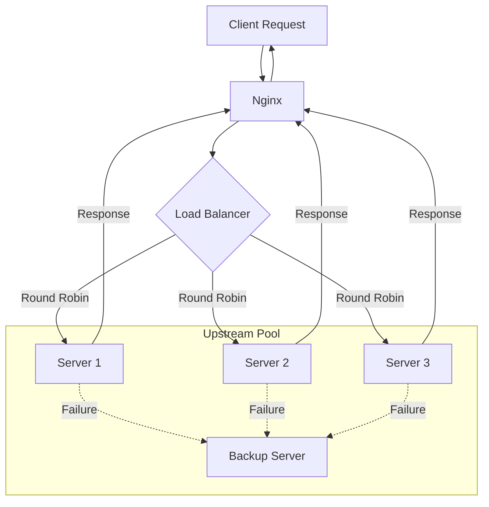

# How to Configure Upstream Servers in Nginx

Author: [nawazdhandala](https://www.github.com/nawazdhandala)

Tags: Nginx, Upstream, Load Balancing, Backend, Proxy

Description: Learn how to configure upstream server groups in Nginx for load balancing, failover, and efficient connection management to your backend servers.

---

Upstream blocks in Nginx define groups of backend servers that handle proxied requests. This powerful feature enables load balancing, failover, and connection pooling. This guide covers upstream configuration from basic setups to advanced scenarios with health checking and connection management.

## Basic Upstream Configuration

Define an upstream group and reference it in proxy_pass:

```nginx
# Define upstream servers
upstream backend {
    server 192.168.1.10:8080;
    server 192.168.1.11:8080;
    server 192.168.1.12:8080;
}

server {
    listen 80;
    server_name example.com;

    location / {
        proxy_pass http://backend;
        proxy_set_header Host $host;
        proxy_set_header X-Real-IP $remote_addr;
    }
}
```

## Server Parameters

Each upstream server accepts parameters that control its behavior:

```nginx
upstream backend {
    # Basic server with all parameters
    server 192.168.1.10:8080 weight=5 max_fails=3 fail_timeout=30s;

    # Server with specific options
    server 192.168.1.11:8080 weight=3 max_conns=100;

    # Backup server (only used when primary servers fail)
    server 192.168.1.12:8080 backup;

    # Server temporarily disabled
    server 192.168.1.13:8080 down;
}
```

Parameter reference:

| Parameter | Description | Default |
|-----------|-------------|---------|
| weight | Load balancing weight | 1 |
| max_fails | Failures before marking unavailable | 1 |
| fail_timeout | Time to wait before retrying failed server | 10s |
| max_conns | Maximum concurrent connections | 0 (unlimited) |
| backup | Use only when primary servers unavailable | - |
| down | Permanently marks server unavailable | - |

## Load Balancing Methods

Nginx supports several load balancing algorithms:

### Round Robin (Default)

```nginx
upstream backend {
    server 192.168.1.10:8080;
    server 192.168.1.11:8080;
    server 192.168.1.12:8080;
}
```

### Weighted Round Robin

```nginx
upstream backend {
    server 192.168.1.10:8080 weight=5;  # Receives 50% of requests
    server 192.168.1.11:8080 weight=3;  # Receives 30%
    server 192.168.1.12:8080 weight=2;  # Receives 20%
}
```

### Least Connections

```nginx
upstream backend {
    least_conn;
    server 192.168.1.10:8080;
    server 192.168.1.11:8080;
    server 192.168.1.12:8080;
}
```

### IP Hash (Session Persistence)

```nginx
upstream backend {
    ip_hash;
    server 192.168.1.10:8080;
    server 192.168.1.11:8080;
    server 192.168.1.12:8080;
}
```

### Generic Hash

```nginx
upstream backend {
    hash $request_uri consistent;  # Hash based on URI
    server 192.168.1.10:8080;
    server 192.168.1.11:8080;
    server 192.168.1.12:8080;
}
```

## Connection Keepalive

Maintain persistent connections to upstream servers:

```nginx
upstream backend {
    server 192.168.1.10:8080;
    server 192.168.1.11:8080;
    server 192.168.1.12:8080;

    # Keep up to 32 idle connections per worker
    keepalive 32;

    # Maximum time a connection can be idle
    keepalive_timeout 60s;

    # Maximum requests per keepalive connection
    keepalive_requests 100;
}

server {
    listen 80;
    server_name example.com;

    location / {
        proxy_pass http://backend;

        # Required for keepalive
        proxy_http_version 1.1;
        proxy_set_header Connection "";
    }
}
```

## Unix Socket Upstreams

Connect to backends via Unix sockets:

```nginx
upstream php_backend {
    server unix:/var/run/php/php-fpm.sock;
}

upstream app_backend {
    server unix:/var/run/app.sock weight=2;
    server unix:/var/run/app2.sock weight=1;
}

server {
    listen 80;
    server_name example.com;

    location ~ \.php$ {
        fastcgi_pass php_backend;
        include fastcgi_params;
    }

    location / {
        proxy_pass http://app_backend;
    }
}
```

## Failover Configuration

Configure automatic failover when servers fail:

```nginx
upstream backend {
    server 192.168.1.10:8080 max_fails=3 fail_timeout=30s;
    server 192.168.1.11:8080 max_fails=3 fail_timeout=30s;

    # Backup servers
    server 192.168.1.20:8080 backup;
    server 192.168.1.21:8080 backup;
}

server {
    listen 80;
    server_name example.com;

    location / {
        proxy_pass http://backend;

        # Conditions that trigger failover
        proxy_next_upstream error timeout http_500 http_502 http_503 http_504;

        # Limit failover attempts
        proxy_next_upstream_tries 3;
        proxy_next_upstream_timeout 10s;

        proxy_connect_timeout 5s;
        proxy_read_timeout 30s;
    }
}
```

## Slow Start

Gradually increase traffic to recovering servers:

```nginx
upstream backend {
    server 192.168.1.10:8080 slow_start=30s;
    server 192.168.1.11:8080 slow_start=30s;
    server 192.168.1.12:8080;
}
```

Note: slow_start is available in Nginx Plus only.

## Queue Configuration

Queue requests when all servers are at max_conns:

```nginx
upstream backend {
    server 192.168.1.10:8080 max_conns=100;
    server 192.168.1.11:8080 max_conns=100;

    queue 100 timeout=30s;  # Queue up to 100 requests
}
```

Note: queue is available in Nginx Plus only.

## Multiple Upstream Groups

Define separate upstreams for different services:

```nginx
# API backend
upstream api_servers {
    least_conn;
    server 192.168.1.10:3000;
    server 192.168.1.11:3000;
    keepalive 16;
}

# Static content servers
upstream static_servers {
    server 192.168.1.20:80 weight=3;
    server 192.168.1.21:80 weight=1;
    keepalive 8;
}

# WebSocket servers
upstream ws_servers {
    ip_hash;  # Sticky sessions for WebSocket
    server 192.168.1.30:8080;
    server 192.168.1.31:8080;
}

server {
    listen 80;
    server_name example.com;

    location /api/ {
        proxy_pass http://api_servers;
        proxy_http_version 1.1;
        proxy_set_header Connection "";
    }

    location /static/ {
        proxy_pass http://static_servers;
        proxy_cache_valid 200 1d;
    }

    location /ws/ {
        proxy_pass http://ws_servers;
        proxy_http_version 1.1;
        proxy_set_header Upgrade $http_upgrade;
        proxy_set_header Connection "upgrade";
    }
}
```

## Dynamic Upstream Resolution

Resolve upstream servers via DNS at runtime:

```nginx
http {
    resolver 8.8.8.8 valid=30s;

    upstream backend {
        server backend.internal.example.com:8080 resolve;
    }

    server {
        listen 80;
        server_name example.com;

        location / {
            proxy_pass http://backend;
        }
    }
}
```

For variable upstreams:

```nginx
server {
    listen 80;
    server_name example.com;

    resolver 8.8.8.8;

    location / {
        set $backend "backend.internal.example.com";
        proxy_pass http://$backend:8080;
    }
}
```

## Complete Production Configuration

A comprehensive upstream configuration:

```nginx
# /etc/nginx/conf.d/upstreams.conf

# Application API servers
upstream app_api {
    least_conn;

    # Primary servers
    server 10.0.1.10:8080 weight=5 max_fails=3 fail_timeout=30s max_conns=200;
    server 10.0.1.11:8080 weight=5 max_fails=3 fail_timeout=30s max_conns=200;
    server 10.0.1.12:8080 weight=3 max_fails=3 fail_timeout=30s max_conns=150;

    # Backup servers
    server 10.0.1.20:8080 backup max_fails=2 fail_timeout=60s;

    # Connection pooling
    keepalive 64;
    keepalive_timeout 60s;
    keepalive_requests 1000;
}

# Authentication service
upstream auth_service {
    server 10.0.2.10:4000 max_fails=2 fail_timeout=10s;
    server 10.0.2.11:4000 max_fails=2 fail_timeout=10s;

    keepalive 16;
}

# WebSocket handlers
upstream websocket_handlers {
    ip_hash;  # Session affinity

    server 10.0.3.10:3000;
    server 10.0.3.11:3000;
    server 10.0.3.12:3000;
}
```

```nginx
# /etc/nginx/conf.d/app.conf

server {
    listen 443 ssl http2;
    server_name api.example.com;

    ssl_certificate /etc/ssl/certs/api.example.com.crt;
    ssl_certificate_key /etc/ssl/private/api.example.com.key;

    # API endpoints
    location /api/ {
        proxy_pass http://app_api;

        proxy_http_version 1.1;
        proxy_set_header Connection "";

        proxy_connect_timeout 5s;
        proxy_send_timeout 60s;
        proxy_read_timeout 60s;

        proxy_next_upstream error timeout http_500 http_502 http_503 http_504;
        proxy_next_upstream_tries 3;
        proxy_next_upstream_timeout 10s;

        proxy_set_header Host $host;
        proxy_set_header X-Real-IP $remote_addr;
        proxy_set_header X-Forwarded-For $proxy_add_x_forwarded_for;
        proxy_set_header X-Forwarded-Proto $scheme;
    }

    # Authentication
    location /auth/ {
        proxy_pass http://auth_service;

        proxy_connect_timeout 3s;
        proxy_read_timeout 10s;

        proxy_set_header Host $host;
        proxy_set_header X-Real-IP $remote_addr;
    }

    # WebSocket
    location /ws/ {
        proxy_pass http://websocket_handlers;

        proxy_http_version 1.1;
        proxy_set_header Upgrade $http_upgrade;
        proxy_set_header Connection "upgrade";

        proxy_read_timeout 86400s;

        proxy_set_header Host $host;
        proxy_set_header X-Real-IP $remote_addr;
    }

    # Health check endpoint
    location /health {
        access_log off;
        return 200 "OK";
        add_header Content-Type text/plain;
    }
}
```

## Upstream Connection Flow



## Monitoring Upstream Status

Check upstream server status:

```nginx
server {
    listen 8080;

    location /upstream_status {
        stub_status on;
        allow 127.0.0.1;
        deny all;
    }
}
```

Custom logging for upstream monitoring:

```nginx
log_format upstream_log '$remote_addr - [$time_local] '
                        '"$request" $status '
                        'upstream: $upstream_addr '
                        'response_time: $upstream_response_time '
                        'connect_time: $upstream_connect_time '
                        'header_time: $upstream_header_time';

access_log /var/log/nginx/upstream.log upstream_log;
```

---

Upstream configuration in Nginx provides flexible load balancing and failover for your backend servers. Use appropriate load balancing algorithms, configure health checking parameters, and enable connection keepalive for efficiency. Monitor upstream health through logging and adjust weights and limits based on observed performance.
