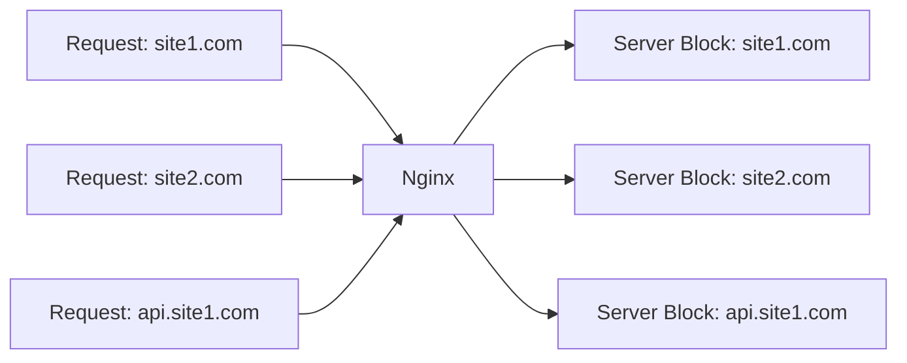

# How to Implement Virtual Hosts in Nginx

Author: [nawazdhandala](https://www.github.com/nawazdhandala)

Tags: Nginx, Virtual Hosts, Server Blocks, Hosting, Multi-Site

Description: Learn how to configure virtual hosts in Nginx to serve multiple websites from a single server, including name-based and IP-based virtual hosting.

---

Virtual hosts allow a single Nginx server to host multiple websites, each with its own domain name, configuration, and content. Nginx calls these server blocks. This guide covers setting up virtual hosts for different scenarios, from simple static sites to complex applications.

## Understanding Virtual Hosts

Nginx uses the `server_name` directive to route requests to the appropriate server block:



## Basic Virtual Host Configuration

Create separate configuration files for each site:

```nginx
# /etc/nginx/conf.d/site1.conf

server {
    listen 80;
    server_name site1.com www.site1.com;

    root /var/www/site1;
    index index.html;

    location / {
        try_files $uri $uri/ =404;
    }

    access_log /var/log/nginx/site1_access.log;
    error_log /var/log/nginx/site1_error.log;
}
```

```nginx
# /etc/nginx/conf.d/site2.conf

server {
    listen 80;
    server_name site2.com www.site2.com;

    root /var/www/site2;
    index index.html;

    location / {
        try_files $uri $uri/ =404;
    }

    access_log /var/log/nginx/site2_access.log;
    error_log /var/log/nginx/site2_error.log;
}
```

## Directory Structure

Organize files for multiple sites:

```bash
# Create site directories
sudo mkdir -p /var/www/site1
sudo mkdir -p /var/www/site2

# Set ownership
sudo chown -R www-data:www-data /var/www

# Create test pages
echo "<h1>Site 1</h1>" | sudo tee /var/www/site1/index.html
echo "<h1>Site 2</h1>" | sudo tee /var/www/site2/index.html
```

## Server Name Matching

Nginx matches server names in this order:

1. Exact name match
2. Wildcard starting with asterisk (*.example.com)
3. Wildcard ending with asterisk (mail.*)
4. Regular expression match

```nginx
# Exact match (highest priority)
server {
    server_name example.com www.example.com;
}

# Wildcard prefix
server {
    server_name *.example.com;
}

# Wildcard suffix
server {
    server_name www.*;
}

# Regular expression (lowest priority)
server {
    server_name ~^www\d+\.example\.com$;
}
```

## Default Server

Define a default server for unmatched requests:

```nginx
# /etc/nginx/conf.d/default.conf

server {
    listen 80 default_server;
    server_name _;  # Catch-all

    # Return 444 to close connection without response
    return 444;

    # Or show a default page
    # root /var/www/default;
    # return 404;
}
```

## Virtual Hosts with SSL

Configure HTTPS for each virtual host:

```nginx
# /etc/nginx/conf.d/site1-ssl.conf

# Redirect HTTP to HTTPS
server {
    listen 80;
    server_name site1.com www.site1.com;
    return 301 https://$server_name$request_uri;
}

# HTTPS server
server {
    listen 443 ssl http2;
    server_name site1.com www.site1.com;

    ssl_certificate /etc/letsencrypt/live/site1.com/fullchain.pem;
    ssl_certificate_key /etc/letsencrypt/live/site1.com/privkey.pem;

    root /var/www/site1;
    index index.html;

    location / {
        try_files $uri $uri/ =404;
    }
}
```

## Subdomain Virtual Hosts

Configure subdomains as separate sites:

```nginx
# /etc/nginx/conf.d/example-sites.conf

# Main site
server {
    listen 80;
    server_name example.com www.example.com;
    root /var/www/example/main;
}

# Blog subdomain
server {
    listen 80;
    server_name blog.example.com;
    root /var/www/example/blog;
}

# API subdomain (proxy to backend)
server {
    listen 80;
    server_name api.example.com;

    location / {
        proxy_pass http://127.0.0.1:3000;
        proxy_set_header Host $host;
        proxy_set_header X-Real-IP $remote_addr;
    }
}

# Admin subdomain (restricted access)
server {
    listen 80;
    server_name admin.example.com;

    allow 192.168.1.0/24;
    deny all;

    location / {
        proxy_pass http://127.0.0.1:4000;
        proxy_set_header Host $host;
    }
}
```

## Wildcard Subdomains

Handle all subdomains with one server block:

```nginx
# /etc/nginx/conf.d/wildcard.conf

server {
    listen 80;
    server_name *.example.com;

    # Extract subdomain from host
    set $subdomain "";
    if ($host ~* ^([^.]+)\.example\.com$) {
        set $subdomain $1;
    }

    # Route based on subdomain
    root /var/www/subdomains/$subdomain;
    index index.html;

    location / {
        try_files $uri $uri/ =404;
    }
}
```

## Virtual Hosts with Different Applications

Host different application types:

```nginx
# /etc/nginx/conf.d/apps.conf

# Static site
server {
    listen 80;
    server_name static.example.com;
    root /var/www/static-site;

    location / {
        try_files $uri $uri/ =404;
    }

    # Cache static assets
    location ~* \.(css|js|jpg|png|gif|ico)$ {
        expires 30d;
    }
}

# Node.js application
server {
    listen 80;
    server_name node.example.com;

    location / {
        proxy_pass http://127.0.0.1:3000;
        proxy_http_version 1.1;
        proxy_set_header Upgrade $http_upgrade;
        proxy_set_header Connection "upgrade";
        proxy_set_header Host $host;
        proxy_set_header X-Real-IP $remote_addr;
    }
}

# Python/Flask application
server {
    listen 80;
    server_name flask.example.com;

    location / {
        proxy_pass http://unix:/var/run/flask.sock;
        proxy_set_header Host $host;
        proxy_set_header X-Real-IP $remote_addr;
    }

    location /static/ {
        alias /var/www/flask/static/;
    }
}

# PHP application
server {
    listen 80;
    server_name php.example.com;
    root /var/www/php-site;
    index index.php index.html;

    location / {
        try_files $uri $uri/ /index.php?$query_string;
    }

    location ~ \.php$ {
        fastcgi_pass unix:/var/run/php/php-fpm.sock;
        fastcgi_param SCRIPT_FILENAME $document_root$fastcgi_script_name;
        include fastcgi_params;
    }
}
```

## IP-Based Virtual Hosts

Use different IPs for different sites:

```nginx
# Site 1 on IP 192.168.1.10
server {
    listen 192.168.1.10:80;
    server_name site1.com;
    root /var/www/site1;
}

# Site 2 on IP 192.168.1.11
server {
    listen 192.168.1.11:80;
    server_name site2.com;
    root /var/www/site2;
}
```

## Port-Based Virtual Hosts

Run different sites on different ports:

```nginx
# Main site on port 80
server {
    listen 80;
    server_name example.com;
    root /var/www/main;
}

# Admin on port 8080
server {
    listen 8080;
    server_name example.com;
    root /var/www/admin;

    auth_basic "Admin Area";
    auth_basic_user_file /etc/nginx/.htpasswd;
}

# API on port 3000
server {
    listen 3000;
    server_name example.com;

    location / {
        proxy_pass http://127.0.0.1:8000;
    }
}
```

## Complete Multi-Site Configuration

A production setup for multiple sites:

```nginx
# /etc/nginx/conf.d/multi-site.conf

# Default server (catch unknown hosts)
server {
    listen 80 default_server;
    listen 443 ssl http2 default_server;
    server_name _;

    ssl_certificate /etc/ssl/certs/default.crt;
    ssl_certificate_key /etc/ssl/private/default.key;

    return 444;
}

# Site 1 - Main company site
server {
    listen 80;
    server_name company.com www.company.com;
    return 301 https://$server_name$request_uri;
}

server {
    listen 443 ssl http2;
    server_name company.com www.company.com;

    ssl_certificate /etc/letsencrypt/live/company.com/fullchain.pem;
    ssl_certificate_key /etc/letsencrypt/live/company.com/privkey.pem;

    root /var/www/company;
    index index.html;

    location / {
        try_files $uri $uri/ =404;
    }

    location /api/ {
        proxy_pass http://127.0.0.1:3000;
        proxy_set_header Host $host;
        proxy_set_header X-Real-IP $remote_addr;
    }

    access_log /var/log/nginx/company_access.log;
    error_log /var/log/nginx/company_error.log;
}

# Site 2 - Customer portal
server {
    listen 80;
    server_name portal.company.com;
    return 301 https://$server_name$request_uri;
}

server {
    listen 443 ssl http2;
    server_name portal.company.com;

    ssl_certificate /etc/letsencrypt/live/portal.company.com/fullchain.pem;
    ssl_certificate_key /etc/letsencrypt/live/portal.company.com/privkey.pem;

    location / {
        proxy_pass http://127.0.0.1:4000;
        proxy_http_version 1.1;
        proxy_set_header Host $host;
        proxy_set_header X-Real-IP $remote_addr;
        proxy_set_header X-Forwarded-For $proxy_add_x_forwarded_for;
        proxy_set_header X-Forwarded-Proto $scheme;
    }

    access_log /var/log/nginx/portal_access.log;
    error_log /var/log/nginx/portal_error.log;
}

# Site 3 - Documentation
server {
    listen 80;
    server_name docs.company.com;
    return 301 https://$server_name$request_uri;
}

server {
    listen 443 ssl http2;
    server_name docs.company.com;

    ssl_certificate /etc/letsencrypt/live/docs.company.com/fullchain.pem;
    ssl_certificate_key /etc/letsencrypt/live/docs.company.com/privkey.pem;

    root /var/www/docs;
    index index.html;

    location / {
        try_files $uri $uri/ /index.html;
    }

    access_log /var/log/nginx/docs_access.log;
    error_log /var/log/nginx/docs_error.log;
}
```

## Testing Virtual Hosts

Verify configuration and test each site:

```bash
# Test configuration syntax
sudo nginx -t

# Reload configuration
sudo systemctl reload nginx

# Test locally with Host header
curl -H "Host: site1.com" http://localhost/
curl -H "Host: site2.com" http://localhost/

# Add to /etc/hosts for local testing
echo "127.0.0.1 site1.com site2.com" | sudo tee -a /etc/hosts
```

## Troubleshooting

Common issues and solutions:

| Issue | Cause | Solution |
|-------|-------|----------|
| Wrong site served | Server name mismatch | Check server_name directive |
| 404 on all requests | Incorrect root path | Verify directory exists |
| Default server catches all | Missing server_name | Add correct domain |
| SSL errors | Certificate mismatch | Ensure cert matches domain |

Check which server block handles a request:

```bash
# View request routing
curl -I -H "Host: example.com" http://localhost/

# Check error log for routing issues
tail -f /var/log/nginx/error.log
```

---

Virtual hosts in Nginx enable efficient multi-site hosting on a single server. Use server_name for routing, organize configurations in separate files, and configure SSL for each domain. Test each virtual host individually and use a default server to catch misconfigured requests. This setup scales from a few sites to dozens while maintaining clear separation between them.
