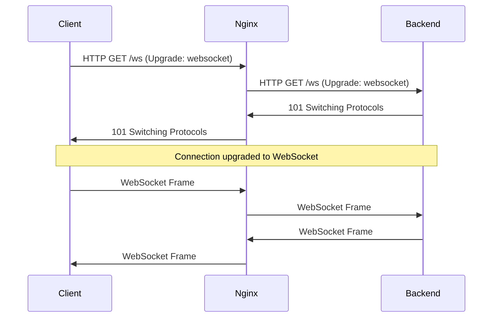

# How to Proxy WebSocket Connections with Nginx

Author: [nawazdhandala](https://www.github.com/nawazdhandala)

Tags: Nginx, WebSocket, Real-time, Proxy, Socket.IO

Description: Learn how to configure Nginx to proxy WebSocket connections, handle the HTTP upgrade handshake, and maintain persistent connections for real-time applications.

---

WebSocket provides full-duplex communication over a single TCP connection, enabling real-time features like chat, live updates, and collaborative editing. Unlike regular HTTP requests, WebSocket connections persist after the initial handshake, requiring special Nginx configuration. This guide covers proxying WebSocket connections through Nginx to your backend servers.

## How WebSocket Connections Work

A WebSocket connection starts as an HTTP request with special upgrade headers:

```
GET /ws HTTP/1.1
Host: example.com
Upgrade: websocket
Connection: Upgrade
Sec-WebSocket-Key: dGhlIHNhbXBsZSBub25jZQ==
Sec-WebSocket-Version: 13
```

The server responds with a 101 status code, and the connection upgrades from HTTP to WebSocket. Nginx must pass these upgrade headers to the backend for the handshake to succeed.

## Basic WebSocket Proxy Configuration

Here is the minimum configuration needed to proxy WebSocket connections:

```nginx
# /etc/nginx/conf.d/websocket.conf

upstream websocket_backend {
    server 127.0.0.1:3000;
}

server {
    listen 80;
    server_name ws.example.com;

    location /ws {
        proxy_pass http://websocket_backend;

        # Required for WebSocket upgrade
        proxy_http_version 1.1;
        proxy_set_header Upgrade $http_upgrade;
        proxy_set_header Connection "upgrade";

        # Pass host and client info
        proxy_set_header Host $host;
        proxy_set_header X-Real-IP $remote_addr;
        proxy_set_header X-Forwarded-For $proxy_add_x_forwarded_for;
    }
}
```

The critical settings are:
- `proxy_http_version 1.1`: WebSocket requires HTTP/1.1
- `proxy_set_header Upgrade`: Pass the upgrade header
- `proxy_set_header Connection "upgrade"`: Signal connection upgrade

## Timeout Configuration

WebSocket connections are long-lived. Default timeouts will close idle connections:

```nginx
location /ws {
    proxy_pass http://websocket_backend;

    proxy_http_version 1.1;
    proxy_set_header Upgrade $http_upgrade;
    proxy_set_header Connection "upgrade";

    # Increase read timeout for idle connections
    proxy_read_timeout 3600s;  # 1 hour

    # Increase send timeout
    proxy_send_timeout 3600s;

    # Increase connection timeout
    proxy_connect_timeout 60s;

    proxy_set_header Host $host;
    proxy_set_header X-Real-IP $remote_addr;
}
```

Set these timeouts based on your application requirements. Some applications send periodic pings to keep connections alive.

## Handling Both HTTP and WebSocket

Many applications serve HTTP requests and WebSocket connections on the same path. Use a map to set the connection header dynamically:

```nginx
http {
    # Map to handle both regular HTTP and WebSocket
    map $http_upgrade $connection_upgrade {
        default upgrade;
        ''      close;
    }

    upstream backend {
        server 127.0.0.1:3000;
        keepalive 32;
    }

    server {
        listen 80;
        server_name app.example.com;

        location / {
            proxy_pass http://backend;

            proxy_http_version 1.1;
            proxy_set_header Upgrade $http_upgrade;
            proxy_set_header Connection $connection_upgrade;

            proxy_read_timeout 86400s;  # 24 hours for WebSocket
            proxy_send_timeout 86400s;

            proxy_set_header Host $host;
            proxy_set_header X-Real-IP $remote_addr;
            proxy_set_header X-Forwarded-For $proxy_add_x_forwarded_for;
            proxy_set_header X-Forwarded-Proto $scheme;
        }
    }
}
```

This configuration handles regular HTTP requests with `Connection: close` and WebSocket connections with `Connection: upgrade`.

## WebSocket with SSL/TLS (WSS)

Secure WebSocket connections use the `wss://` protocol. Configure SSL termination at Nginx:

```nginx
server {
    listen 443 ssl http2;
    server_name ws.example.com;

    ssl_certificate /etc/ssl/certs/ws.example.com.crt;
    ssl_certificate_key /etc/ssl/private/ws.example.com.key;

    location /ws {
        proxy_pass http://websocket_backend;

        proxy_http_version 1.1;
        proxy_set_header Upgrade $http_upgrade;
        proxy_set_header Connection "upgrade";

        proxy_read_timeout 3600s;
        proxy_send_timeout 3600s;

        # Tell backend the original protocol
        proxy_set_header X-Forwarded-Proto $scheme;

        proxy_set_header Host $host;
        proxy_set_header X-Real-IP $remote_addr;
    }
}

# Redirect HTTP to HTTPS
server {
    listen 80;
    server_name ws.example.com;
    return 301 https://$server_name$request_uri;
}
```

## Socket.IO Configuration

Socket.IO uses both WebSocket and HTTP long-polling as transports. Configure Nginx to handle both:

```nginx
upstream socketio_backend {
    # Socket.IO requires sticky sessions for HTTP polling
    ip_hash;

    server 127.0.0.1:3000;
    server 127.0.0.1:3001;
}

server {
    listen 80;
    server_name chat.example.com;

    # Socket.IO endpoint
    location /socket.io/ {
        proxy_pass http://socketio_backend;

        proxy_http_version 1.1;
        proxy_set_header Upgrade $http_upgrade;
        proxy_set_header Connection "upgrade";

        # Socket.IO specific settings
        proxy_buffering off;
        proxy_cache off;

        # Longer timeouts for persistent connections
        proxy_read_timeout 86400s;
        proxy_send_timeout 86400s;

        proxy_set_header Host $host;
        proxy_set_header X-Real-IP $remote_addr;
        proxy_set_header X-Forwarded-For $proxy_add_x_forwarded_for;
        proxy_set_header X-Forwarded-Proto $scheme;
    }

    # Regular application routes
    location / {
        proxy_pass http://socketio_backend;
        proxy_set_header Host $host;
        proxy_set_header X-Real-IP $remote_addr;
    }
}
```

Note the `ip_hash` directive. Socket.IO may use HTTP long-polling before upgrading to WebSocket, and all requests from a client must reach the same backend server.

## Load Balancing WebSocket Connections

When load balancing WebSocket connections, use `ip_hash` or a sticky session method:

```nginx
upstream websocket_servers {
    ip_hash;  # Sticky sessions by client IP

    server 192.168.1.10:3000;
    server 192.168.1.11:3000;
    server 192.168.1.12:3000;
}

server {
    listen 80;
    server_name ws.example.com;

    location /ws {
        proxy_pass http://websocket_servers;

        proxy_http_version 1.1;
        proxy_set_header Upgrade $http_upgrade;
        proxy_set_header Connection "upgrade";

        proxy_read_timeout 3600s;

        proxy_set_header Host $host;
        proxy_set_header X-Real-IP $remote_addr;
    }
}
```

Without sticky sessions, a client might establish a WebSocket with one server but have subsequent HTTP requests routed to another server.

## Complete Production Configuration

A full WebSocket proxy configuration with SSL, timeouts, and proper headers:

```nginx
# /etc/nginx/conf.d/websocket-production.conf

map $http_upgrade $connection_upgrade {
    default upgrade;
    ''      close;
}

upstream ws_backend {
    ip_hash;
    server 127.0.0.1:3000 max_fails=3 fail_timeout=30s;
    server 127.0.0.1:3001 max_fails=3 fail_timeout=30s;
    keepalive 32;
}

# Redirect HTTP to HTTPS
server {
    listen 80;
    server_name realtime.example.com;
    return 301 https://$server_name$request_uri;
}

server {
    listen 443 ssl http2;
    server_name realtime.example.com;

    # SSL configuration
    ssl_certificate /etc/letsencrypt/live/realtime.example.com/fullchain.pem;
    ssl_certificate_key /etc/letsencrypt/live/realtime.example.com/privkey.pem;
    ssl_protocols TLSv1.2 TLSv1.3;

    # Logging
    access_log /var/log/nginx/websocket_access.log;
    error_log /var/log/nginx/websocket_error.log;

    # WebSocket endpoint
    location /ws {
        proxy_pass http://ws_backend;

        # WebSocket upgrade handling
        proxy_http_version 1.1;
        proxy_set_header Upgrade $http_upgrade;
        proxy_set_header Connection $connection_upgrade;

        # Long timeouts for persistent connections
        proxy_read_timeout 86400s;
        proxy_send_timeout 86400s;
        proxy_connect_timeout 60s;

        # Disable buffering for real-time data
        proxy_buffering off;
        proxy_cache off;

        # Pass client information
        proxy_set_header Host $host;
        proxy_set_header X-Real-IP $remote_addr;
        proxy_set_header X-Forwarded-For $proxy_add_x_forwarded_for;
        proxy_set_header X-Forwarded-Proto $scheme;
        proxy_set_header X-Forwarded-Host $host;
    }

    # Health check endpoint
    location /health {
        access_log off;
        proxy_pass http://ws_backend;
        proxy_read_timeout 5s;
    }

    # Application routes
    location / {
        proxy_pass http://ws_backend;

        proxy_http_version 1.1;
        proxy_set_header Connection "";

        proxy_set_header Host $host;
        proxy_set_header X-Real-IP $remote_addr;
        proxy_set_header X-Forwarded-For $proxy_add_x_forwarded_for;
        proxy_set_header X-Forwarded-Proto $scheme;
    }
}
```

## WebSocket Connection Flow



## Debugging WebSocket Issues

Common problems and how to diagnose them:

```bash
# Check if upgrade headers are passed
curl -v -H "Upgrade: websocket" -H "Connection: Upgrade" \
     http://ws.example.com/ws

# Test WebSocket connection
websocat ws://ws.example.com/ws

# Check Nginx error log
tail -f /var/log/nginx/error.log

# Verify backend is receiving upgrade headers
tcpdump -i lo port 3000 -A | grep -i upgrade
```

Common issues:

| Problem | Solution |
|---------|----------|
| 400 Bad Request | Check Upgrade and Connection headers |
| Connection drops immediately | Increase proxy_read_timeout |
| Intermittent disconnects | Check for proxy timeout settings |
| Load balancing issues | Use ip_hash or sticky sessions |

---

WebSocket proxying through Nginx requires proper header handling for the upgrade handshake and extended timeouts for persistent connections. Configure the upgrade headers, set appropriate timeouts, and use sticky sessions when load balancing. With these settings in place, Nginx efficiently proxies real-time WebSocket traffic alongside your regular HTTP requests.
