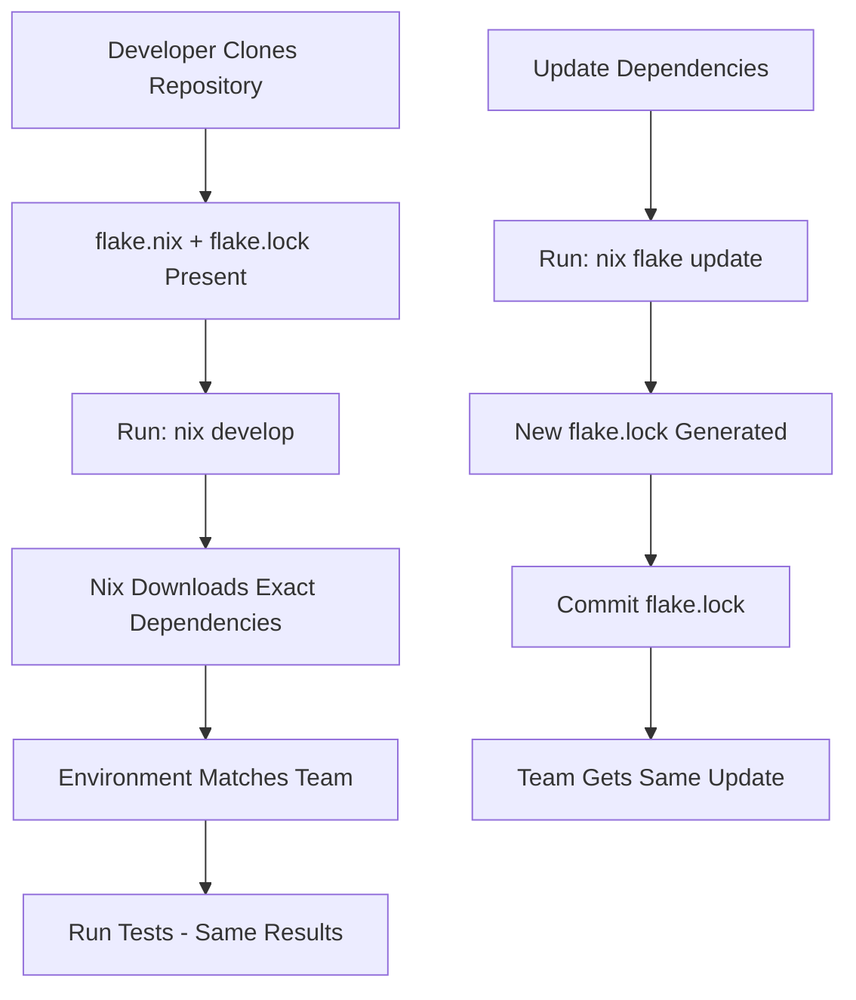

# How to Configure Nix for Reproducible Environments

Author: [nawazdhandala](https://www.github.com/nawazdhandala)

Tags: Nix, Reproducible Builds, Developer Experience, DevOps, Package Management

Description: Learn how to use Nix and Nix Flakes to create perfectly reproducible development environments that work identically across machines, eliminating dependency conflicts forever.

---

Package managers like npm, pip, and Homebrew try to give you reproducible environments, but they often fall short. Version ranges, transitive dependencies, and system library differences lead to the dreaded "works on my machine" syndrome. Nix solves this problem by treating packages as pure functions of their inputs, guaranteeing that the same inputs always produce the same outputs.

## Why Nix?

Consider a typical development setup: Node.js 18.17.0, PostgreSQL 15.3, and Redis 7.0.12. With traditional tools, you might install these through brew or apt, but six months later a new team member installs different patch versions. Tests pass on your machine but fail on theirs.

Nix eliminates this by creating isolated, reproducible environments. Every package includes its exact dependencies, down to the C library version. Two developers running the same Nix configuration get bit-for-bit identical environments.

## Installing Nix

Install Nix with the official installer:

```bash
# Install Nix with flakes enabled
# This script works on Linux and macOS
sh <(curl -L https://nixos.org/nix/install) --daemon

# Verify installation
nix --version
```

Enable flakes (the modern Nix interface) by adding to `~/.config/nix/nix.conf`:

```
experimental-features = nix-command flakes
```

## Basic Nix Shell

Create a `shell.nix` for a simple development environment:

```nix
# shell.nix - Traditional Nix shell configuration
{ pkgs ? import <nixpkgs> {} }:

pkgs.mkShell {
  # Packages available in the shell
  buildInputs = with pkgs; [
    # Node.js with specific version
    nodejs_20
    # Package managers
    yarn
    # Database tools
    postgresql_15
    redis
    # Development utilities
    git
    jq
    curl
  ];

  # Environment variables
  DATABASE_URL = "postgresql://localhost/devdb";
  NODE_ENV = "development";

  # Commands run when entering the shell
  shellHook = ''
    echo "Development environment loaded!"
    echo "Node version: $(node --version)"
    echo "PostgreSQL version: $(psql --version)"
  '';
}
```

Enter the environment:

```bash
# Start a shell with these packages
nix-shell

# Or run a single command
nix-shell --run "node --version"
```

## Nix Flakes for Better Reproducibility

Flakes provide locked dependencies and better composability. Create a `flake.nix`:

```nix
# flake.nix - Modern Nix configuration with locked dependencies
{
  description = "Development environment for web application";

  # Input sources - these are locked to specific commits
  inputs = {
    # Main package repository
    nixpkgs.url = "github:NixOS/nixpkgs/nixos-24.05";
    # Utility for easier flake configuration
    flake-utils.url = "github:numtide/flake-utils";
  };

  outputs = { self, nixpkgs, flake-utils }:
    flake-utils.lib.eachDefaultSystem (system:
      let
        pkgs = nixpkgs.legacyPackages.${system};
      in
      {
        # Development shell configuration
        devShells.default = pkgs.mkShell {
          buildInputs = with pkgs; [
            # Exact versions pinned via flake.lock
            nodejs_20
            yarn
            postgresql_15
            redis

            # Python for scripts
            python311
            python311Packages.pip
            python311Packages.virtualenv

            # Infrastructure tools
            terraform
            awscli2
            kubectl
          ];

          shellHook = ''
            # Set up local data directories
            export PGDATA="$PWD/.nix-data/postgres"
            export REDIS_DIR="$PWD/.nix-data/redis"

            # Initialize PostgreSQL if needed
            if [ ! -d "$PGDATA" ]; then
              mkdir -p "$PGDATA"
              initdb --auth=trust
            fi

            echo "Environment ready. Run 'pg_ctl start' to start PostgreSQL."
          '';
        };
      });
}
```

Generate the lock file and enter the environment:

```bash
# Generate flake.lock with exact versions
nix flake update

# Enter the development shell
nix develop

# Or run a command directly
nix develop --command npm test
```

The `flake.lock` file pins every dependency:

```json
{
  "nodes": {
    "nixpkgs": {
      "locked": {
        "lastModified": 1706091285,
        "narHash": "sha256-...",
        "owner": "NixOS",
        "repo": "nixpkgs",
        "rev": "abc123...",
        "type": "github"
      }
    }
  }
}
```

## Project-Specific Environments

Here is a complete setup for a full-stack project:

```nix
# flake.nix for a TypeScript + Python + PostgreSQL project
{
  description = "Full-stack application development";

  inputs = {
    nixpkgs.url = "github:NixOS/nixpkgs/nixos-24.05";
    flake-utils.url = "github:numtide/flake-utils";
  };

  outputs = { self, nixpkgs, flake-utils }:
    flake-utils.lib.eachDefaultSystem (system:
      let
        pkgs = nixpkgs.legacyPackages.${system};

        # Custom Python environment with specific packages
        pythonEnv = pkgs.python311.withPackages (ps: with ps; [
          fastapi
          uvicorn
          sqlalchemy
          psycopg2
          pytest
          black
          mypy
        ]);

      in
      {
        devShells.default = pkgs.mkShell {
          buildInputs = [
            # JavaScript/TypeScript
            pkgs.nodejs_20
            pkgs.yarn
            pkgs.nodePackages.typescript
            pkgs.nodePackages.typescript-language-server

            # Python with packages
            pythonEnv

            # Databases
            pkgs.postgresql_15
            pkgs.redis

            # Development tools
            pkgs.git
            pkgs.gh
            pkgs.jq
            pkgs.httpie
            pkgs.lazygit

            # Code quality
            pkgs.nodePackages.eslint
            pkgs.nodePackages.prettier
            pkgs.shellcheck
          ];

          # Set environment variables
          DATABASE_URL = "postgresql://localhost:5432/devdb";
          REDIS_URL = "redis://localhost:6379";

          shellHook = ''
            # Create local directories for services
            mkdir -p .nix-data/{postgres,redis}

            # Add local node_modules binaries to PATH
            export PATH="$PWD/node_modules/.bin:$PATH"

            # Python virtual env for project-specific packages
            if [ ! -d .venv ]; then
              python -m venv .venv
            fi
            source .venv/bin/activate

            echo "================================================"
            echo "Development environment loaded!"
            echo "  Node:     $(node --version)"
            echo "  Python:   $(python --version)"
            echo "  Postgres: $(psql --version | head -1)"
            echo "================================================"
          '';
        };

        # Additional shells for specific tasks
        devShells.ci = pkgs.mkShell {
          buildInputs = [
            pkgs.nodejs_20
            pkgs.yarn
            pythonEnv
          ];
        };
      });
}
```

## direnv Integration

Automatically activate Nix environments when entering directories:

```bash
# Install direnv
nix profile install nixpkgs#direnv

# Add to your shell config (~/.bashrc or ~/.zshrc)
eval "$(direnv hook bash)"  # or zsh
```

Create `.envrc` in your project:

```bash
# .envrc - direnv configuration
# Automatically enters the Nix development shell
use flake

# Additional environment variables
export DEBUG=true
export LOG_LEVEL=debug

# Load local secrets if present
if [ -f .env.local ]; then
  source .env.local
fi
```

Allow direnv for this directory:

```bash
direnv allow
```

Now the environment activates automatically when you `cd` into the project.

## Multi-Language Projects

Nix excels at managing projects with multiple languages:

```nix
{
  description = "Polyglot microservices";

  inputs = {
    nixpkgs.url = "github:NixOS/nixpkgs/nixos-24.05";
    flake-utils.url = "github:numtide/flake-utils";
    rust-overlay.url = "github:oxalica/rust-overlay";
  };

  outputs = { self, nixpkgs, flake-utils, rust-overlay }:
    flake-utils.lib.eachDefaultSystem (system:
      let
        overlays = [ (import rust-overlay) ];
        pkgs = import nixpkgs {
          inherit system overlays;
        };

        rustToolchain = pkgs.rust-bin.stable.latest.default.override {
          extensions = [ "rust-src" "rust-analyzer" ];
        };

      in
      {
        devShells = {
          # Default shell with all languages
          default = pkgs.mkShell {
            buildInputs = [
              # Rust
              rustToolchain
              pkgs.cargo-watch
              pkgs.cargo-audit

              # Go
              pkgs.go_1_22
              pkgs.gopls
              pkgs.golangci-lint

              # Node
              pkgs.nodejs_20
              pkgs.yarn

              # Shared tools
              pkgs.protobuf
              pkgs.grpcurl
              pkgs.docker-compose
            ];
          };

          # Rust-only shell for focused work
          rust = pkgs.mkShell {
            buildInputs = [ rustToolchain pkgs.cargo-watch ];
          };

          # Go-only shell
          go = pkgs.mkShell {
            buildInputs = [ pkgs.go_1_22 pkgs.gopls ];
          };
        };
      });
}
```

## Workflow Diagram

Here is how Nix fits into team development:



## CI/CD Integration

Use the same Nix environment in CI:

```yaml
# .github/workflows/test.yml
name: Tests

on: [push, pull_request]

jobs:
  test:
    runs-on: ubuntu-latest
    steps:
      - uses: actions/checkout@v4

      - name: Install Nix
        uses: cachix/install-nix-action@v26
        with:
          nix_path: nixpkgs=channel:nixos-24.05

      - name: Setup Cachix
        uses: cachix/cachix-action@v14
        with:
          name: your-cache-name
          authToken: '${{ secrets.CACHIX_AUTH_TOKEN }}'

      - name: Run Tests
        run: |
          nix develop --command npm ci
          nix develop --command npm test
```

## Best Practices

1. **Commit flake.lock**: This file ensures everyone gets identical dependencies. Treat it like package-lock.json.

2. **Use direnv**: Automatic environment activation reduces friction and ensures developers always use the correct environment.

3. **Pin nixpkgs**: Always specify a nixpkgs version in your flake inputs. Using `nixpkgs-unstable` can cause surprise breakages.

4. **Leverage Cachix**: Binary caching dramatically speeds up environment setup. Set up a team cache for custom packages.

5. **Document shell commands**: Include common commands in your shellHook or README so developers know how to start services.

Nix requires an initial learning investment, but the payoff is substantial. Teams spend zero time debugging environment issues, new developers onboard in minutes, and CI environments match development exactly. For projects where reproducibility matters, Nix is the most reliable solution available.
