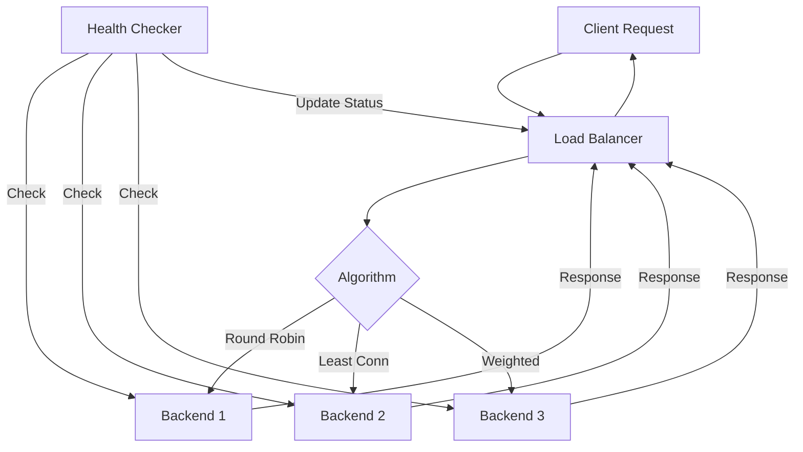

# How to Build a Load Balancer with Health Checks in Node.js

Author: [nawazdhandala](https://www.github.com/nawazdhandala)

Tags: NodeJS, Load Balancing, Health Checks, DevOps, Reliability, Backend

Description: Learn how to build a production-ready load balancer in Node.js with active health checking, multiple load balancing algorithms, and graceful failover.

---

When your application grows beyond a single server, you need a way to distribute traffic across multiple instances. While production systems typically use dedicated load balancers like nginx or HAProxy, understanding how load balancing works by building one yourself is invaluable. You will also find this useful for service mesh scenarios where you need application-layer routing decisions.

This guide walks through building a load balancer in Node.js that supports multiple algorithms, performs active health checks, and handles backend failures gracefully.

## Basic Load Balancer Structure

The foundation is a reverse proxy that receives requests and forwards them to one of several backend servers:

```typescript
// load-balancer.ts
import http from 'http';
import httpProxy from 'http-proxy';

interface Backend {
  host: string;
  port: number;
  healthy: boolean;
  activeConnections: number;
  lastChecked: Date | null;
  consecutiveFailures: number;
}

class LoadBalancer {
  private backends: Backend[];
  private proxy: httpProxy;
  private currentIndex: number = 0;

  constructor(backends: { host: string; port: number }[]) {
    // Initialize backend list with health metadata
    this.backends = backends.map(b => ({
      ...b,
      healthy: true, // Assume healthy until proven otherwise
      activeConnections: 0,
      lastChecked: null,
      consecutiveFailures: 0,
    }));

    // Create the proxy instance
    this.proxy = httpProxy.createProxyServer({});

    // Handle proxy errors to prevent crashing
    this.proxy.on('error', (err, req, res) => {
      console.error('Proxy error:', err.message);
      if (!res.headersSent) {
        (res as http.ServerResponse).writeHead(502, { 'Content-Type': 'text/plain' });
      }
      (res as http.ServerResponse).end('Bad Gateway');
    });
  }

  // Get healthy backends only
  private getHealthyBackends(): Backend[] {
    return this.backends.filter(b => b.healthy);
  }

  // Round-robin selection among healthy backends
  private selectBackend(): Backend | null {
    const healthy = this.getHealthyBackends();
    if (healthy.length === 0) return null;

    this.currentIndex = (this.currentIndex + 1) % healthy.length;
    return healthy[this.currentIndex];
  }

  // Handle incoming request
  handleRequest(req: http.IncomingMessage, res: http.ServerResponse) {
    const backend = this.selectBackend();

    if (!backend) {
      res.writeHead(503, { 'Content-Type': 'text/plain' });
      res.end('Service Unavailable - No healthy backends');
      return;
    }

    // Track active connections for least-connections algorithm
    backend.activeConnections++;

    // Forward the request
    this.proxy.web(req, res, {
      target: `http://${backend.host}:${backend.port}`,
    });

    // Decrement on response completion
    res.on('finish', () => {
      backend.activeConnections--;
    });
  }

  start(port: number) {
    const server = http.createServer((req, res) => {
      this.handleRequest(req, res);
    });

    server.listen(port, () => {
      console.log(`Load balancer listening on port ${port}`);
      console.log(`Backends: ${this.backends.map(b => `${b.host}:${b.port}`).join(', ')}`);
    });

    return server;
  }
}

// Usage
const lb = new LoadBalancer([
  { host: '127.0.0.1', port: 3001 },
  { host: '127.0.0.1', port: 3002 },
  { host: '127.0.0.1', port: 3003 },
]);

lb.start(3000);
```

## Adding Active Health Checks

Passive health detection waits for requests to fail. Active health checking proactively tests backend health on a schedule. This catches problems before users hit them:

```typescript
// health-checker.ts
import http from 'http';

interface HealthCheckConfig {
  path: string;           // Endpoint to check (e.g., /health)
  interval: number;       // Milliseconds between checks
  timeout: number;        // Milliseconds to wait for response
  unhealthyThreshold: number;  // Failures before marking unhealthy
  healthyThreshold: number;    // Successes before marking healthy
}

class HealthChecker {
  private config: HealthCheckConfig;
  private timers: Map<string, NodeJS.Timeout> = new Map();

  constructor(config: Partial<HealthCheckConfig> = {}) {
    this.config = {
      path: '/health',
      interval: 5000,
      timeout: 3000,
      unhealthyThreshold: 3,
      healthyThreshold: 2,
      ...config,
    };
  }

  // Check a single backend's health
  private checkBackend(backend: Backend): Promise<boolean> {
    return new Promise((resolve) => {
      const req = http.request(
        {
          hostname: backend.host,
          port: backend.port,
          path: this.config.path,
          method: 'GET',
          timeout: this.config.timeout,
        },
        (res) => {
          // Consider 2xx status codes as healthy
          resolve(res.statusCode !== undefined && res.statusCode >= 200 && res.statusCode < 300);
        }
      );

      req.on('error', () => resolve(false));
      req.on('timeout', () => {
        req.destroy();
        resolve(false);
      });

      req.end();
    });
  }

  // Update backend health status based on check result
  private async performCheck(backend: Backend, onStatusChange: (backend: Backend) => void) {
    const isHealthy = await this.checkBackend(backend);
    backend.lastChecked = new Date();

    if (isHealthy) {
      backend.consecutiveFailures = 0;

      // Mark as healthy after threshold successes
      if (!backend.healthy) {
        // Track consecutive successes (reusing consecutiveFailures logic inverted)
        const consecutiveSuccesses = (backend as any).consecutiveSuccesses || 0;
        (backend as any).consecutiveSuccesses = consecutiveSuccesses + 1;

        if ((backend as any).consecutiveSuccesses >= this.config.healthyThreshold) {
          backend.healthy = true;
          (backend as any).consecutiveSuccesses = 0;
          console.log(`Backend ${backend.host}:${backend.port} is now HEALTHY`);
          onStatusChange(backend);
        }
      }
    } else {
      backend.consecutiveFailures++;
      (backend as any).consecutiveSuccesses = 0;

      // Mark as unhealthy after threshold failures
      if (backend.healthy && backend.consecutiveFailures >= this.config.unhealthyThreshold) {
        backend.healthy = false;
        console.log(`Backend ${backend.host}:${backend.port} is now UNHEALTHY`);
        onStatusChange(backend);
      }
    }
  }

  // Start checking all backends
  startChecking(backends: Backend[], onStatusChange: (backend: Backend) => void) {
    for (const backend of backends) {
      const key = `${backend.host}:${backend.port}`;

      // Perform initial check immediately
      this.performCheck(backend, onStatusChange);

      // Schedule periodic checks
      const timer = setInterval(
        () => this.performCheck(backend, onStatusChange),
        this.config.interval
      );

      this.timers.set(key, timer);
    }
  }

  stopChecking() {
    for (const timer of this.timers.values()) {
      clearInterval(timer);
    }
    this.timers.clear();
  }
}
```

## Multiple Load Balancing Algorithms

Different algorithms suit different workloads. Here are the most common ones:

```typescript
// algorithms.ts

type Algorithm = 'round-robin' | 'least-connections' | 'weighted' | 'ip-hash';

interface WeightedBackend extends Backend {
  weight: number;
  currentWeight: number;
}

class LoadBalancingAlgorithms {
  private roundRobinIndex: number = 0;

  // Simple round-robin: each backend gets requests in turn
  roundRobin(backends: Backend[]): Backend | null {
    const healthy = backends.filter(b => b.healthy);
    if (healthy.length === 0) return null;

    this.roundRobinIndex = (this.roundRobinIndex + 1) % healthy.length;
    return healthy[this.roundRobinIndex];
  }

  // Least connections: send to the backend with fewest active requests
  leastConnections(backends: Backend[]): Backend | null {
    const healthy = backends.filter(b => b.healthy);
    if (healthy.length === 0) return null;

    return healthy.reduce((min, current) =>
      current.activeConnections < min.activeConnections ? current : min
    );
  }

  // Weighted round-robin: backends with higher weights get more traffic
  // Uses smooth weighted round-robin for even distribution
  weightedRoundRobin(backends: WeightedBackend[]): WeightedBackend | null {
    const healthy = backends.filter(b => b.healthy);
    if (healthy.length === 0) return null;

    // Calculate total weight
    const totalWeight = healthy.reduce((sum, b) => sum + b.weight, 0);

    // Find backend with highest current weight
    let best: WeightedBackend | null = null;
    for (const backend of healthy) {
      backend.currentWeight += backend.weight;
      if (best === null || backend.currentWeight > best.currentWeight) {
        best = backend;
      }
    }

    if (best) {
      // Reduce chosen backend's current weight
      best.currentWeight -= totalWeight;
    }

    return best;
  }

  // IP hash: same client IP always goes to same backend (session affinity)
  ipHash(backends: Backend[], clientIp: string): Backend | null {
    const healthy = backends.filter(b => b.healthy);
    if (healthy.length === 0) return null;

    // Simple hash function for IP
    let hash = 0;
    for (let i = 0; i < clientIp.length; i++) {
      hash = ((hash << 5) - hash) + clientIp.charCodeAt(i);
      hash = hash & hash; // Convert to 32-bit integer
    }

    const index = Math.abs(hash) % healthy.length;
    return healthy[index];
  }
}
```

## Complete Load Balancer Implementation

Putting it all together with health checks, multiple algorithms, and proper error handling:

```typescript
// complete-load-balancer.ts
import http from 'http';
import httpProxy from 'http-proxy';

interface Backend {
  host: string;
  port: number;
  weight: number;
  healthy: boolean;
  activeConnections: number;
  lastChecked: Date | null;
  consecutiveFailures: number;
  currentWeight: number;
}

interface LoadBalancerConfig {
  algorithm: 'round-robin' | 'least-connections' | 'weighted' | 'ip-hash';
  healthCheck: {
    enabled: boolean;
    path: string;
    interval: number;
    timeout: number;
    unhealthyThreshold: number;
    healthyThreshold: number;
  };
  retryOnError: boolean;
  maxRetries: number;
}

class ProductionLoadBalancer {
  private backends: Backend[];
  private proxy: httpProxy;
  private config: LoadBalancerConfig;
  private roundRobinIndex: number = 0;
  private healthCheckTimers: NodeJS.Timeout[] = [];

  constructor(
    backends: { host: string; port: number; weight?: number }[],
    config: Partial<LoadBalancerConfig> = {}
  ) {
    this.config = {
      algorithm: 'round-robin',
      healthCheck: {
        enabled: true,
        path: '/health',
        interval: 5000,
        timeout: 3000,
        unhealthyThreshold: 3,
        healthyThreshold: 2,
      },
      retryOnError: true,
      maxRetries: 2,
      ...config,
    };

    this.backends = backends.map(b => ({
      host: b.host,
      port: b.port,
      weight: b.weight || 1,
      healthy: true,
      activeConnections: 0,
      lastChecked: null,
      consecutiveFailures: 0,
      currentWeight: 0,
    }));

    this.proxy = httpProxy.createProxyServer({
      xfwd: true, // Add X-Forwarded headers
    });

    this.setupProxyEvents();
  }

  private setupProxyEvents() {
    // Log proxy errors but do not crash
    this.proxy.on('error', (err, req, res) => {
      console.error(`Proxy error for ${req.url}: ${err.message}`);
    });

    // Track successful responses
    this.proxy.on('proxyRes', (proxyRes, req) => {
      const backend = (req as any).__backend as Backend;
      if (backend) {
        // Reset failure count on successful response
        backend.consecutiveFailures = 0;
      }
    });
  }

  // Select backend based on configured algorithm
  private selectBackend(req: http.IncomingMessage): Backend | null {
    const healthy = this.backends.filter(b => b.healthy);
    if (healthy.length === 0) return null;

    switch (this.config.algorithm) {
      case 'least-connections':
        return healthy.reduce((min, b) =>
          b.activeConnections < min.activeConnections ? b : min
        );

      case 'weighted':
        return this.weightedSelect(healthy);

      case 'ip-hash':
        const clientIp = req.socket.remoteAddress || '127.0.0.1';
        return this.hashSelect(healthy, clientIp);

      case 'round-robin':
      default:
        this.roundRobinIndex = (this.roundRobinIndex + 1) % healthy.length;
        return healthy[this.roundRobinIndex];
    }
  }

  private weightedSelect(backends: Backend[]): Backend {
    const totalWeight = backends.reduce((sum, b) => sum + b.weight, 0);

    let best: Backend = backends[0];
    for (const backend of backends) {
      backend.currentWeight += backend.weight;
      if (backend.currentWeight > best.currentWeight) {
        best = backend;
      }
    }

    best.currentWeight -= totalWeight;
    return best;
  }

  private hashSelect(backends: Backend[], key: string): Backend {
    let hash = 0;
    for (let i = 0; i < key.length; i++) {
      hash = ((hash << 5) - hash) + key.charCodeAt(i);
      hash = hash & hash;
    }
    return backends[Math.abs(hash) % backends.length];
  }

  // Forward request with retry support
  private forwardRequest(
    req: http.IncomingMessage,
    res: http.ServerResponse,
    excludeBackends: Set<Backend> = new Set(),
    attempt: number = 0
  ) {
    // Filter out excluded backends (ones that already failed)
    const available = this.backends.filter(
      b => b.healthy && !excludeBackends.has(b)
    );

    if (available.length === 0) {
      res.writeHead(503, { 'Content-Type': 'application/json' });
      res.end(JSON.stringify({ error: 'Service Unavailable', message: 'No healthy backends' }));
      return;
    }

    const backend = this.selectBackend(req);
    if (!backend) {
      res.writeHead(503);
      res.end('No backend available');
      return;
    }

    backend.activeConnections++;
    (req as any).__backend = backend;

    const target = `http://${backend.host}:${backend.port}`;

    // Add custom headers for debugging
    req.headers['x-forwarded-backend'] = `${backend.host}:${backend.port}`;
    req.headers['x-request-attempt'] = String(attempt + 1);

    this.proxy.web(req, res, { target }, (err) => {
      backend.activeConnections--;
      backend.consecutiveFailures++;

      // Mark unhealthy after threshold
      if (backend.consecutiveFailures >= this.config.healthCheck.unhealthyThreshold) {
        backend.healthy = false;
        console.log(`Backend ${backend.host}:${backend.port} marked unhealthy after ${backend.consecutiveFailures} failures`);
      }

      // Retry on different backend if enabled
      if (this.config.retryOnError && attempt < this.config.maxRetries) {
        excludeBackends.add(backend);
        console.log(`Retrying request on different backend (attempt ${attempt + 2})`);
        this.forwardRequest(req, res, excludeBackends, attempt + 1);
      } else {
        if (!res.headersSent) {
          res.writeHead(502, { 'Content-Type': 'application/json' });
        }
        res.end(JSON.stringify({ error: 'Bad Gateway', message: err?.message }));
      }
    });

    res.on('finish', () => {
      if ((req as any).__backend) {
        (req as any).__backend.activeConnections--;
      }
    });
  }

  // Active health checking
  private startHealthChecks() {
    if (!this.config.healthCheck.enabled) return;

    for (const backend of this.backends) {
      const checkHealth = async () => {
        try {
          const healthy = await this.checkBackendHealth(backend);

          if (healthy) {
            backend.consecutiveFailures = 0;
            if (!backend.healthy) {
              console.log(`Backend ${backend.host}:${backend.port} recovered`);
              backend.healthy = true;
            }
          } else {
            backend.consecutiveFailures++;
            if (backend.healthy &&
                backend.consecutiveFailures >= this.config.healthCheck.unhealthyThreshold) {
              console.log(`Backend ${backend.host}:${backend.port} failed health check`);
              backend.healthy = false;
            }
          }

          backend.lastChecked = new Date();
        } catch (err) {
          backend.consecutiveFailures++;
        }
      };

      // Initial check
      checkHealth();

      // Periodic checks
      const timer = setInterval(checkHealth, this.config.healthCheck.interval);
      this.healthCheckTimers.push(timer);
    }
  }

  private checkBackendHealth(backend: Backend): Promise<boolean> {
    return new Promise((resolve) => {
      const req = http.request(
        {
          hostname: backend.host,
          port: backend.port,
          path: this.config.healthCheck.path,
          method: 'GET',
          timeout: this.config.healthCheck.timeout,
        },
        (res) => {
          resolve(res.statusCode !== undefined && res.statusCode >= 200 && res.statusCode < 300);
        }
      );

      req.on('error', () => resolve(false));
      req.on('timeout', () => {
        req.destroy();
        resolve(false);
      });
      req.end();
    });
  }

  // Status endpoint for monitoring
  private handleStatusRequest(res: http.ServerResponse) {
    const status = {
      algorithm: this.config.algorithm,
      backends: this.backends.map(b => ({
        address: `${b.host}:${b.port}`,
        healthy: b.healthy,
        weight: b.weight,
        activeConnections: b.activeConnections,
        lastChecked: b.lastChecked,
        consecutiveFailures: b.consecutiveFailures,
      })),
      healthyCount: this.backends.filter(b => b.healthy).length,
      totalCount: this.backends.length,
    };

    res.writeHead(200, { 'Content-Type': 'application/json' });
    res.end(JSON.stringify(status, null, 2));
  }

  start(port: number) {
    const server = http.createServer((req, res) => {
      // Built-in status endpoint
      if (req.url === '/_lb/status') {
        this.handleStatusRequest(res);
        return;
      }

      this.forwardRequest(req, res);
    });

    // Handle WebSocket upgrades
    server.on('upgrade', (req, socket, head) => {
      const backend = this.selectBackend(req);
      if (backend) {
        this.proxy.ws(req, socket, head, {
          target: `ws://${backend.host}:${backend.port}`,
        });
      } else {
        socket.destroy();
      }
    });

    server.listen(port, () => {
      console.log(`Load balancer started on port ${port}`);
      console.log(`Algorithm: ${this.config.algorithm}`);
      console.log(`Backends: ${this.backends.length}`);
      this.startHealthChecks();
    });

    return server;
  }

  stop() {
    for (const timer of this.healthCheckTimers) {
      clearInterval(timer);
    }
  }
}

// Usage example
const lb = new ProductionLoadBalancer(
  [
    { host: '127.0.0.1', port: 3001, weight: 3 },
    { host: '127.0.0.1', port: 3002, weight: 2 },
    { host: '127.0.0.1', port: 3003, weight: 1 },
  ],
  {
    algorithm: 'weighted',
    healthCheck: {
      enabled: true,
      path: '/health',
      interval: 10000,
      timeout: 5000,
      unhealthyThreshold: 3,
      healthyThreshold: 2,
    },
    retryOnError: true,
    maxRetries: 2,
  }
);

lb.start(3000);
```

## Architecture Overview

Here is how the components interact:



## Summary

Building a load balancer teaches you the fundamentals of traffic distribution and failure handling. The key components are:

| Component | Purpose |
|-----------|---------|
| Proxy | Forwards requests to backends |
| Algorithm | Selects which backend receives traffic |
| Health Checker | Monitors backend availability |
| Retry Logic | Handles transient failures |
| Status Endpoint | Enables monitoring and debugging |

For production use, consider dedicated load balancers like nginx, HAProxy, or cloud provider solutions. They offer better performance and additional features like SSL termination, connection pooling, and advanced routing. But understanding how load balancing works at the application level helps you make better architectural decisions and debug problems when they arise.
