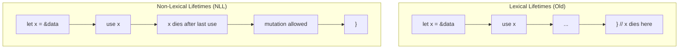

# How to Understand Non-Lexical Lifetimes in Rust

Author: [nawazdhandala](https://www.github.com/nawazdhandala)

Tags: Rust, Lifetimes, Borrow Checker, NLL, Memory Safety

Description: Learn how Non-Lexical Lifetimes (NLL) in Rust make the borrow checker smarter by tracking when references are actually used rather than when they go out of scope.

---

Non-Lexical Lifetimes (NLL) is a significant improvement to Rust's borrow checker introduced in Rust 2018. Before NLL, lifetimes extended to the end of their lexical scope (the closing brace). With NLL, the compiler tracks where references are actually used and ends their lifetimes earlier when possible. This allows code patterns that were previously rejected.

## The Problem NLL Solves

In early Rust, the borrow checker was overly conservative. It would reject code that was actually safe because it assumed references lived until the end of their scope.

```rust
// Before NLL, this would fail to compile
fn process_data(data: &mut Vec<i32>) {
    let first = data.get(0);  // Immutable borrow
    println!("First element: {:?}", first);
    // Before NLL: immutable borrow extends to end of function

    data.push(42);  // Mutable borrow - would conflict!
    // But 'first' is not used after println!
}

fn main() {
    let mut numbers = vec![1, 2, 3];
    process_data(&mut numbers);
}
```

Without NLL, the compiler would complain that you cannot mutably borrow `data` while an immutable borrow exists. But logically, the immutable borrow `first` is not used after the `println!`, so there is no conflict.

## How NLL Works

NLL analyzes the control flow graph of your code to determine where each reference is actually used. A borrow ends at its last use point, not at the end of its scope.

```rust
fn demonstrate_nll() {
    let mut data = vec![1, 2, 3, 4, 5];

    // Immutable borrow starts here
    let slice = &data[..];
    println!("Slice: {:?}", slice);
    // NLL: immutable borrow ends here (last use of slice)

    // Mutable borrow is now allowed
    data.push(6);
    println!("Updated: {:?}", data);
}
```

The compiler recognizes that `slice` is not used after the first `println!`, so the mutable borrow for `push` does not conflict.

## Practical Examples

### Example 1: HashMap Entry Pattern

This common pattern would fail without NLL:

```rust
use std::collections::HashMap;

fn update_or_insert(map: &mut HashMap<String, i32>, key: &str) {
    // First, check if the key exists
    if let Some(value) = map.get(key) {
        println!("Existing value: {}", value);
        // Before NLL: borrow of map through 'value' extends further
    }
    // NLL: 'value' borrow ends at the if block

    // Now we can mutably borrow
    map.insert(key.to_string(), 100);
}

fn main() {
    let mut scores = HashMap::new();
    scores.insert("Alice".to_string(), 50);

    update_or_insert(&mut scores, "Alice");
    update_or_insert(&mut scores, "Bob");

    println!("Final: {:?}", scores);
}
```

### Example 2: Conditional Mutation

```rust
struct Database {
    records: Vec<String>,
    cache: Option<String>,
}

impl Database {
    fn get_or_compute(&mut self, index: usize) -> &str {
        // Check cache first
        if let Some(ref cached) = self.cache {
            if !cached.is_empty() {
                return cached;
            }
        }
        // NLL: the borrow from cache check ends here

        // Now we can mutate
        let value = self.records.get(index)
            .cloned()
            .unwrap_or_else(|| "default".to_string());

        self.cache = Some(value);
        self.cache.as_ref().unwrap()
    }
}
```

### Example 3: Loop with Conditional Borrow

```rust
fn process_items(items: &mut Vec<String>) {
    let mut i = 0;

    while i < items.len() {
        // Borrow for the condition check
        let should_remove = {
            let item = &items[i];  // Immutable borrow
            item.starts_with("temp_")
            // NLL: borrow ends here
        };

        if should_remove {
            items.remove(i);  // Mutable operation allowed
        } else {
            i += 1;
        }
    }
}

fn main() {
    let mut items = vec![
        "temp_file".to_string(),
        "important".to_string(),
        "temp_data".to_string(),
        "config".to_string(),
    ];

    process_items(&mut items);
    println!("Remaining: {:?}", items);
}
```

## NLL and Match Expressions

NLL significantly improves working with match expressions:

```rust
enum Message {
    Text(String),
    Number(i32),
    Empty,
}

fn handle_message(msg: &mut Message) {
    // The borrow in match arms ends when the arm completes
    match msg {
        Message::Text(s) => {
            println!("Text: {}", s);
            // NLL: borrow of 's' ends here
        }
        Message::Number(n) => {
            println!("Number: {}", n);
        }
        Message::Empty => {
            println!("Empty message");
        }
    }
    // NLL: all borrows from match ended

    // Now we can mutate
    *msg = Message::Empty;
}

fn process_option(opt: &mut Option<String>) {
    // Extract and process in one match
    if let Some(value) = opt.as_ref() {
        if value.len() < 3 {
            println!("Short value: {}", value);
            // Return early - borrow ends
            return;
        }
    }
    // NLL: immutable borrow ended

    // Safe to mutate
    *opt = Some("replaced".to_string());
}
```

## Understanding Flow-Sensitive Analysis

NLL uses flow-sensitive analysis, meaning it tracks borrows through control flow:

```rust
fn flow_sensitive_example(condition: bool) {
    let mut data = vec![1, 2, 3];

    let reference = &data[0];  // Immutable borrow starts

    if condition {
        println!("Value: {}", reference);  // Used here
        // NLL: borrow ends if this branch taken
    } else {
        println!("Not printing reference");
        // NLL: borrow never used in this branch
    }

    // Either way, borrow has ended
    data.push(4);  // Mutation allowed

    // This would fail - reference used after push
    // println!("{}", reference);  // Error: borrow used after mutation
}
```

## Limitations of NLL

NLL is smart but not perfect. Some patterns still require explicit scoping:

```rust
use std::cell::RefCell;

fn nll_limitation() {
    let data = RefCell::new(vec![1, 2, 3]);

    // RefCell borrows are runtime-checked, not compile-time
    // NLL cannot help here
    let borrow1 = data.borrow();
    println!("{:?}", borrow1);
    drop(borrow1);  // Must explicitly drop

    let mut borrow2 = data.borrow_mut();
    borrow2.push(4);
}

fn scope_still_needed() {
    let mut data = vec![1, 2, 3];

    // When the borrow is stored in a variable used later
    let reference;
    {
        reference = &data[0];
        // If we need mutation before using reference,
        // we need explicit scoping
    }

    // This pattern requires careful handling
    println!("{}", reference);
}
```

## NLL vs Lexical Lifetimes Visualization



## Best Practices with NLL

1. **Trust the compiler**: Write natural code first. NLL often accepts what seems logical.

2. **Use explicit scopes sparingly**: Only add blocks when NLL cannot determine safety.

3. **Prefer smaller borrows**: Even with NLL, keeping borrows short improves readability.

4. **Understand error messages**: When NLL rejects code, it explains exactly where the conflict is.

```rust
// Good: natural code flow
fn good_pattern(data: &mut Vec<i32>) {
    if let Some(first) = data.first() {
        println!("First: {}", first);
    }
    data.push(1);  // NLL allows this
}

// Unnecessary: explicit scoping when NLL handles it
fn unnecessary_scoping(data: &mut Vec<i32>) {
    {
        let first = data.first();
        println!("First: {:?}", first);
    }  // This block is not needed with NLL
    data.push(1);
}
```

## Summary

Non-Lexical Lifetimes make Rust's borrow checker significantly more ergonomic by ending borrows at their last use rather than at scope boundaries. This allows natural code patterns that were previously rejected. NLL analyzes control flow to determine exactly where borrows are live, enabling patterns like checking then mutating, conditional borrows, and cleaner match expressions. While NLL handles most cases automatically, understanding how it works helps you write cleaner Rust code and debug borrow checker errors when they occur.
