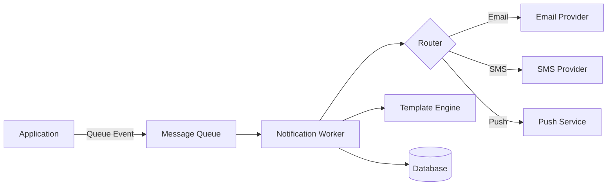

# How to Build a Notification Service in Python

Author: [nawazdhandala](https://www.github.com/nawazdhandala)

Tags: Python, Notifications, Email, SMS, Push Notifications, Async, FastAPI, Celery

Description: Learn how to build a scalable notification service in Python that handles email, SMS, and push notifications. This guide covers architecture patterns, delivery guarantees, and template management.

---

> A notification service is a critical piece of infrastructure for most applications. Users expect to receive timely updates about their orders, account activity, and important events. Building a notification service that is reliable, scalable, and easy to extend requires careful planning.

When I first built a notification system, I made the mistake of sending notifications synchronously within API requests. That worked fine until a slow email provider caused our entire checkout flow to hang. The lesson: notifications should always be decoupled from your main application flow.

---

## Architecture Overview

A well-designed notification service has several key components:



The core idea is to decouple notification sending from your main application. Events go into a queue, workers process them asynchronously, and delivery status is tracked in a database.

---

## Core Models and Types

First, let's define the data structures that represent notifications in our system.

```python
# models.py
# Core notification models and types
from dataclasses import dataclass, field
from enum import Enum
from typing import Optional, Dict, Any, List
from datetime import datetime
import uuid

class NotificationType(Enum):
    """Supported notification channels"""
    EMAIL = "email"
    SMS = "sms"
    PUSH = "push"
    SLACK = "slack"
    WEBHOOK = "webhook"

class NotificationStatus(Enum):
    """Notification delivery states"""
    PENDING = "pending"      # Queued but not processed
    SENDING = "sending"      # Currently being sent
    SENT = "sent"           # Successfully delivered
    FAILED = "failed"       # Delivery failed
    RETRYING = "retrying"   # Failed, will retry

class Priority(Enum):
    """Message priority levels"""
    LOW = 1      # Marketing, newsletters
    NORMAL = 2   # Standard notifications
    HIGH = 3     # Important updates
    URGENT = 4   # Security alerts, OTPs

@dataclass
class Recipient:
    """Represents a notification recipient"""
    user_id: str
    email: Optional[str] = None
    phone: Optional[str] = None
    device_tokens: List[str] = field(default_factory=list)
    preferences: Dict[str, bool] = field(default_factory=dict)

    def can_receive(self, channel: NotificationType) -> bool:
        """Check if recipient can receive notifications on this channel"""
        # Check if user has opted out of this channel
        pref_key = f"{channel.value}_enabled"
        if not self.preferences.get(pref_key, True):
            return False

        # Check if we have the required contact info
        if channel == NotificationType.EMAIL:
            return bool(self.email)
        elif channel == NotificationType.SMS:
            return bool(self.phone)
        elif channel == NotificationType.PUSH:
            return len(self.device_tokens) > 0

        return True

@dataclass
class Notification:
    """Represents a notification to be sent"""
    id: str
    type: NotificationType
    recipient: Recipient
    template_id: str
    context: Dict[str, Any]  # Data for template rendering
    priority: Priority = Priority.NORMAL
    status: NotificationStatus = NotificationStatus.PENDING
    created_at: datetime = field(default_factory=datetime.utcnow)
    sent_at: Optional[datetime] = None
    error_message: Optional[str] = None
    retry_count: int = 0
    max_retries: int = 3

    @classmethod
    def create(
        cls,
        notification_type: NotificationType,
        recipient: Recipient,
        template_id: str,
        context: Dict[str, Any],
        priority: Priority = Priority.NORMAL
    ) -> 'Notification':
        """Factory method to create a new notification"""
        return cls(
            id=str(uuid.uuid4()),
            type=notification_type,
            recipient=recipient,
            template_id=template_id,
            context=context,
            priority=priority
        )

    def can_retry(self) -> bool:
        """Check if notification can be retried"""
        return self.retry_count < self.max_retries
```

---

## Template Management

A template engine allows non-developers to modify notification content without code changes.

```python
# templates.py
# Notification template management with Jinja2
from jinja2 import Environment, FileSystemLoader, select_autoescape
from typing import Dict, Any, Optional
from dataclasses import dataclass
from pathlib import Path
import json

@dataclass
class NotificationTemplate:
    """Represents a notification template"""
    id: str
    name: str
    channel: str  # email, sms, push
    subject: Optional[str]  # For email
    body: str
    metadata: Dict[str, Any]

class TemplateEngine:
    """
    Manages notification templates with Jinja2.
    Templates can include variables, conditionals, and loops.
    """

    def __init__(self, templates_dir: str = "templates"):
        self.templates_dir = Path(templates_dir)

        # Set up Jinja2 environment
        self.env = Environment(
            loader=FileSystemLoader(str(self.templates_dir)),
            autoescape=select_autoescape(['html', 'xml']),
            trim_blocks=True,
            lstrip_blocks=True
        )

        # Register custom filters
        self.env.filters['currency'] = self._format_currency
        self.env.filters['datetime'] = self._format_datetime

        # Cache for loaded templates
        self._template_cache: Dict[str, NotificationTemplate] = {}

    def _format_currency(self, value: float, currency: str = 'USD') -> str:
        """Format a number as currency"""
        symbols = {'USD': '$', 'EUR': '€', 'GBP': '£'}
        symbol = symbols.get(currency, currency)
        return f"{symbol}{value:,.2f}"

    def _format_datetime(self, value, format: str = '%B %d, %Y') -> str:
        """Format a datetime object"""
        if hasattr(value, 'strftime'):
            return value.strftime(format)
        return str(value)

    def load_template(self, template_id: str) -> NotificationTemplate:
        """Load a template by ID from the filesystem"""
        if template_id in self._template_cache:
            return self._template_cache[template_id]

        # Load template metadata
        meta_path = self.templates_dir / template_id / "meta.json"
        with open(meta_path) as f:
            meta = json.load(f)

        # Load template body
        body_path = self.templates_dir / template_id / "body.txt"
        if not body_path.exists():
            body_path = self.templates_dir / template_id / "body.html"

        with open(body_path) as f:
            body = f.read()

        # Load subject for emails
        subject = None
        subject_path = self.templates_dir / template_id / "subject.txt"
        if subject_path.exists():
            with open(subject_path) as f:
                subject = f.read().strip()

        template = NotificationTemplate(
            id=template_id,
            name=meta.get('name', template_id),
            channel=meta.get('channel', 'email'),
            subject=subject,
            body=body,
            metadata=meta
        )

        self._template_cache[template_id] = template
        return template

    def render(
        self,
        template_id: str,
        context: Dict[str, Any]
    ) -> Dict[str, str]:
        """
        Render a template with the given context.
        Returns dict with 'subject' and 'body' keys.
        """
        template = self.load_template(template_id)

        # Render the body
        body_template = self.env.from_string(template.body)
        rendered_body = body_template.render(**context)

        result = {'body': rendered_body}

        # Render subject if present (for emails)
        if template.subject:
            subject_template = self.env.from_string(template.subject)
            result['subject'] = subject_template.render(**context)

        return result


# Example template file structure:
# templates/
#   order_confirmation/
#     meta.json       # {"name": "Order Confirmation", "channel": "email"}
#     subject.txt     # Your order #{{ order.id }} is confirmed
#     body.html       # Full HTML email template
#   shipping_update/
#     meta.json
#     body.txt        # SMS template (plain text)
```

---

## Provider Implementations

Each notification channel needs a provider that handles the actual delivery.

```python
# providers.py
# Notification delivery providers for different channels
from abc import ABC, abstractmethod
from dataclasses import dataclass
from typing import Optional
import httpx
import logging

logger = logging.getLogger(__name__)

@dataclass
class DeliveryResult:
    """Result of a notification delivery attempt"""
    success: bool
    provider_id: Optional[str] = None  # External message ID
    error_message: Optional[str] = None

class NotificationProvider(ABC):
    """Base class for notification providers"""

    @abstractmethod
    async def send(
        self,
        recipient: str,
        subject: Optional[str],
        body: str,
        **kwargs
    ) -> DeliveryResult:
        """Send a notification and return the result"""
        pass

class EmailProvider(NotificationProvider):
    """
    Email provider using SendGrid API.
    Replace with your preferred email service.
    """

    def __init__(self, api_key: str, from_email: str):
        self.api_key = api_key
        self.from_email = from_email
        self.base_url = "https://api.sendgrid.com/v3"

    async def send(
        self,
        recipient: str,
        subject: Optional[str],
        body: str,
        **kwargs
    ) -> DeliveryResult:
        """Send an email via SendGrid"""
        is_html = kwargs.get('is_html', True)

        payload = {
            "personalizations": [{"to": [{"email": recipient}]}],
            "from": {"email": self.from_email},
            "subject": subject or "Notification",
            "content": [{
                "type": "text/html" if is_html else "text/plain",
                "value": body
            }]
        }

        try:
            async with httpx.AsyncClient() as client:
                response = await client.post(
                    f"{self.base_url}/mail/send",
                    json=payload,
                    headers={
                        "Authorization": f"Bearer {self.api_key}",
                        "Content-Type": "application/json"
                    },
                    timeout=30.0
                )

            if response.status_code in (200, 202):
                # Get message ID from response headers
                message_id = response.headers.get('X-Message-Id')
                return DeliveryResult(success=True, provider_id=message_id)
            else:
                return DeliveryResult(
                    success=False,
                    error_message=f"SendGrid error: {response.status_code}"
                )

        except httpx.TimeoutException:
            return DeliveryResult(success=False, error_message="Request timeout")
        except Exception as e:
            logger.exception(f"Email delivery failed: {e}")
            return DeliveryResult(success=False, error_message=str(e))

class SMSProvider(NotificationProvider):
    """
    SMS provider using Twilio API.
    Replace with your preferred SMS service.
    """

    def __init__(self, account_sid: str, auth_token: str, from_number: str):
        self.account_sid = account_sid
        self.auth_token = auth_token
        self.from_number = from_number

    async def send(
        self,
        recipient: str,
        subject: Optional[str],  # Ignored for SMS
        body: str,
        **kwargs
    ) -> DeliveryResult:
        """Send an SMS via Twilio"""
        url = f"https://api.twilio.com/2010-04-01/Accounts/{self.account_sid}/Messages.json"

        payload = {
            "To": recipient,
            "From": self.from_number,
            "Body": body[:1600]  # SMS character limit
        }

        try:
            async with httpx.AsyncClient() as client:
                response = await client.post(
                    url,
                    data=payload,
                    auth=(self.account_sid, self.auth_token),
                    timeout=30.0
                )

            if response.status_code == 201:
                data = response.json()
                return DeliveryResult(success=True, provider_id=data.get('sid'))
            else:
                data = response.json()
                return DeliveryResult(
                    success=False,
                    error_message=data.get('message', 'Unknown error')
                )

        except Exception as e:
            logger.exception(f"SMS delivery failed: {e}")
            return DeliveryResult(success=False, error_message=str(e))

class PushProvider(NotificationProvider):
    """
    Push notification provider using Firebase Cloud Messaging.
    Handles sending to multiple device tokens.
    """

    def __init__(self, server_key: str):
        self.server_key = server_key
        self.fcm_url = "https://fcm.googleapis.com/fcm/send"

    async def send(
        self,
        recipient: str,  # Device token
        subject: Optional[str],
        body: str,
        **kwargs
    ) -> DeliveryResult:
        """Send a push notification via FCM"""
        payload = {
            "to": recipient,
            "notification": {
                "title": subject or "Notification",
                "body": body
            },
            "data": kwargs.get('data', {})
        }

        try:
            async with httpx.AsyncClient() as client:
                response = await client.post(
                    self.fcm_url,
                    json=payload,
                    headers={
                        "Authorization": f"key={self.server_key}",
                        "Content-Type": "application/json"
                    },
                    timeout=30.0
                )

            data = response.json()

            if data.get('success', 0) > 0:
                return DeliveryResult(
                    success=True,
                    provider_id=data.get('multicast_id')
                )
            else:
                # Extract error from results
                results = data.get('results', [{}])
                error = results[0].get('error', 'Unknown error')
                return DeliveryResult(success=False, error_message=error)

        except Exception as e:
            logger.exception(f"Push delivery failed: {e}")
            return DeliveryResult(success=False, error_message=str(e))
```

---

## Notification Service

The main service ties everything together and handles routing notifications to the right providers.

```python
# notification_service.py
# Main notification service with routing and retry logic
from typing import Dict, Optional
from datetime import datetime
import asyncio
import logging

from models import (
    Notification, NotificationType, NotificationStatus,
    Recipient, Priority
)
from templates import TemplateEngine
from providers import (
    NotificationProvider, EmailProvider, SMSProvider, PushProvider,
    DeliveryResult
)

logger = logging.getLogger(__name__)

class NotificationService:
    """
    Central notification service that handles:
    - Template rendering
    - Provider routing
    - Delivery tracking
    - Retry logic
    """

    def __init__(
        self,
        template_engine: TemplateEngine,
        db_connection,  # Your database connection
        email_provider: Optional[EmailProvider] = None,
        sms_provider: Optional[SMSProvider] = None,
        push_provider: Optional[PushProvider] = None
    ):
        self.template_engine = template_engine
        self.db = db_connection

        # Map notification types to providers
        self.providers: Dict[NotificationType, NotificationProvider] = {}

        if email_provider:
            self.providers[NotificationType.EMAIL] = email_provider
        if sms_provider:
            self.providers[NotificationType.SMS] = sms_provider
        if push_provider:
            self.providers[NotificationType.PUSH] = push_provider

    async def send(self, notification: Notification) -> DeliveryResult:
        """
        Send a single notification.
        Handles template rendering, provider selection, and status updates.
        """
        # Check recipient preferences
        if not notification.recipient.can_receive(notification.type):
            logger.info(
                f"Recipient {notification.recipient.user_id} "
                f"cannot receive {notification.type.value} notifications"
            )
            return DeliveryResult(
                success=False,
                error_message="Recipient cannot receive this notification type"
            )

        # Get the appropriate provider
        provider = self.providers.get(notification.type)
        if not provider:
            return DeliveryResult(
                success=False,
                error_message=f"No provider for {notification.type.value}"
            )

        # Render the template
        try:
            rendered = self.template_engine.render(
                notification.template_id,
                notification.context
            )
        except Exception as e:
            logger.exception(f"Template rendering failed: {e}")
            return DeliveryResult(success=False, error_message=f"Template error: {e}")

        # Get recipient address for this channel
        recipient_address = self._get_recipient_address(notification)
        if not recipient_address:
            return DeliveryResult(
                success=False,
                error_message="No recipient address for this channel"
            )

        # Update status to sending
        notification.status = NotificationStatus.SENDING
        await self._update_notification(notification)

        # Send via provider
        result = await provider.send(
            recipient=recipient_address,
            subject=rendered.get('subject'),
            body=rendered['body']
        )

        # Update notification based on result
        if result.success:
            notification.status = NotificationStatus.SENT
            notification.sent_at = datetime.utcnow()
        else:
            notification.status = NotificationStatus.FAILED
            notification.error_message = result.error_message

        await self._update_notification(notification)

        return result

    def _get_recipient_address(self, notification: Notification) -> Optional[str]:
        """Get the recipient address for the notification channel"""
        recipient = notification.recipient

        if notification.type == NotificationType.EMAIL:
            return recipient.email
        elif notification.type == NotificationType.SMS:
            return recipient.phone
        elif notification.type == NotificationType.PUSH:
            # Return first device token (or handle multiple separately)
            return recipient.device_tokens[0] if recipient.device_tokens else None

        return None

    async def send_with_retry(
        self,
        notification: Notification,
        delay_seconds: int = 60
    ) -> DeliveryResult:
        """
        Send notification with automatic retry on failure.
        Uses exponential backoff between retries.
        """
        while True:
            result = await self.send(notification)

            if result.success:
                return result

            if not notification.can_retry():
                logger.error(
                    f"Notification {notification.id} failed after "
                    f"{notification.retry_count} retries"
                )
                return result

            # Exponential backoff: 60s, 120s, 240s
            wait_time = delay_seconds * (2 ** notification.retry_count)
            notification.retry_count += 1
            notification.status = NotificationStatus.RETRYING

            await self._update_notification(notification)

            logger.info(
                f"Retrying notification {notification.id} in {wait_time}s "
                f"(attempt {notification.retry_count})"
            )

            await asyncio.sleep(wait_time)

    async def send_bulk(
        self,
        notifications: list[Notification],
        concurrency: int = 10
    ) -> list[DeliveryResult]:
        """
        Send multiple notifications concurrently.
        Limits concurrency to avoid overwhelming providers.
        """
        semaphore = asyncio.Semaphore(concurrency)

        async def send_with_limit(notif: Notification) -> DeliveryResult:
            async with semaphore:
                return await self.send(notif)

        # Send all notifications concurrently (with limit)
        tasks = [send_with_limit(n) for n in notifications]
        results = await asyncio.gather(*tasks, return_exceptions=True)

        # Convert exceptions to DeliveryResult
        processed_results = []
        for result in results:
            if isinstance(result, Exception):
                processed_results.append(
                    DeliveryResult(success=False, error_message=str(result))
                )
            else:
                processed_results.append(result)

        return processed_results

    async def _update_notification(self, notification: Notification):
        """Persist notification status to database"""
        await self.db.execute(
            """
            UPDATE notifications
            SET status = $1, sent_at = $2, error_message = $3, retry_count = $4
            WHERE id = $5
            """,
            notification.status.value,
            notification.sent_at,
            notification.error_message,
            notification.retry_count,
            notification.id
        )
```

---

## Queue Integration with Celery

For production systems, notifications should be processed by background workers.

```python
# tasks.py
# Celery tasks for async notification processing
from celery import Celery
from typing import Dict, Any
import asyncio

from models import Notification, NotificationType, Recipient, Priority
from notification_service import NotificationService

# Initialize Celery
app = Celery('notifications')
app.config_from_object('celeryconfig')

# Helper to run async code in Celery tasks
def run_async(coro):
    """Run an async coroutine in a sync context"""
    loop = asyncio.new_event_loop()
    try:
        return loop.run_until_complete(coro)
    finally:
        loop.close()

@app.task(
    bind=True,
    max_retries=3,
    default_retry_delay=60,
    autoretry_for=(Exception,),
    retry_backoff=True
)
def send_notification_task(
    self,
    notification_type: str,
    recipient_data: Dict[str, Any],
    template_id: str,
    context: Dict[str, Any],
    priority: int = 2
):
    """
    Celery task to send a single notification.
    Uses Celery's built-in retry mechanism.
    """
    # Reconstruct objects from serialized data
    recipient = Recipient(**recipient_data)

    notification = Notification.create(
        notification_type=NotificationType(notification_type),
        recipient=recipient,
        template_id=template_id,
        context=context,
        priority=Priority(priority)
    )

    # Get notification service (usually from app context)
    service = get_notification_service()

    # Run async send
    result = run_async(service.send(notification))

    if not result.success:
        # Raise to trigger Celery retry
        raise Exception(result.error_message)

    return {'notification_id': notification.id, 'status': 'sent'}

@app.task
def send_bulk_notifications_task(notifications_data: list[Dict[str, Any]]):
    """
    Celery task to send multiple notifications.
    Splits into individual tasks for better tracking.
    """
    for data in notifications_data:
        # Queue each notification as a separate task
        send_notification_task.delay(
            notification_type=data['type'],
            recipient_data=data['recipient'],
            template_id=data['template_id'],
            context=data['context'],
            priority=data.get('priority', 2)
        )


# Example usage from your application
def queue_order_confirmation(order, user):
    """Queue an order confirmation email"""
    send_notification_task.delay(
        notification_type='email',
        recipient_data={
            'user_id': user.id,
            'email': user.email,
            'preferences': user.notification_preferences
        },
        template_id='order_confirmation',
        context={
            'order': {
                'id': order.id,
                'total': order.total,
                'items': [item.to_dict() for item in order.items]
            },
            'user': {'name': user.name}
        },
        priority=3  # High priority
    )
```

---

## API Endpoints

Expose the notification service through REST endpoints.

```python
# api.py
# FastAPI endpoints for notification management
from fastapi import FastAPI, HTTPException, BackgroundTasks
from pydantic import BaseModel
from typing import List, Optional, Dict, Any
from enum import Enum

app = FastAPI()

class NotificationRequest(BaseModel):
    """Request model for sending a notification"""
    type: str  # email, sms, push
    recipient_id: str
    template_id: str
    context: Dict[str, Any]
    priority: Optional[int] = 2

class BulkNotificationRequest(BaseModel):
    """Request model for bulk notifications"""
    notifications: List[NotificationRequest]

@app.post("/notifications/send")
async def send_notification(
    request: NotificationRequest,
    background_tasks: BackgroundTasks
):
    """
    Queue a notification for delivery.
    Returns immediately with a tracking ID.
    """
    # Look up recipient from database
    recipient = await get_recipient(request.recipient_id)
    if not recipient:
        raise HTTPException(status_code=404, detail="Recipient not found")

    # Queue the notification
    from tasks import send_notification_task

    task = send_notification_task.delay(
        notification_type=request.type,
        recipient_data=recipient.to_dict(),
        template_id=request.template_id,
        context=request.context,
        priority=request.priority
    )

    return {
        "status": "queued",
        "task_id": task.id,
        "message": "Notification queued for delivery"
    }

@app.post("/notifications/bulk")
async def send_bulk_notifications(request: BulkNotificationRequest):
    """Queue multiple notifications for delivery"""
    from tasks import send_bulk_notifications_task

    # Convert to serializable format
    notifications_data = []
    for notif in request.notifications:
        recipient = await get_recipient(notif.recipient_id)
        if recipient:
            notifications_data.append({
                'type': notif.type,
                'recipient': recipient.to_dict(),
                'template_id': notif.template_id,
                'context': notif.context,
                'priority': notif.priority
            })

    # Queue all notifications
    send_bulk_notifications_task.delay(notifications_data)

    return {
        "status": "queued",
        "count": len(notifications_data),
        "message": f"Queued {len(notifications_data)} notifications"
    }

@app.get("/notifications/{notification_id}")
async def get_notification_status(notification_id: str):
    """Get the delivery status of a notification"""
    notification = await db.fetch_one(
        "SELECT * FROM notifications WHERE id = $1",
        notification_id
    )

    if not notification:
        raise HTTPException(status_code=404, detail="Notification not found")

    return {
        "id": notification['id'],
        "status": notification['status'],
        "type": notification['type'],
        "created_at": notification['created_at'],
        "sent_at": notification['sent_at'],
        "error_message": notification['error_message']
    }
```

---

## Best Practices

1. **Always process notifications asynchronously** - Never block user requests waiting for email delivery
2. **Implement retry with exponential backoff** - Providers have temporary failures; retries help
3. **Track delivery status** - Store notification history for debugging and audit
4. **Respect user preferences** - Always check opt-out settings before sending
5. **Use templates** - Separate content from code for easier updates
6. **Monitor delivery rates** - Track success/failure rates to catch provider issues early

---

## Conclusion

A notification service is more than just sending emails. It involves template management, provider abstraction, delivery guarantees, and user preference handling. The architecture shown here provides a solid foundation that you can extend based on your needs.

The key insight is decoupling: your application queues notification requests, and background workers handle the actual delivery. This keeps your API responsive and allows you to scale notification throughput independently.

---

*Need to monitor your notification delivery rates? [OneUptime](https://oneuptime.com) provides comprehensive monitoring with custom metrics tracking for notification services.*

**Related Reading:**
- [How to Build a Graceful Shutdown Handler in Python](https://oneuptime.com/blog/post/2025-01-06-python-graceful-shutdown-kubernetes/view)
- [How to Mock External APIs in Python Tests](https://oneuptime.com/blog/post/2025-01-06-python-mock-external-apis/view)
