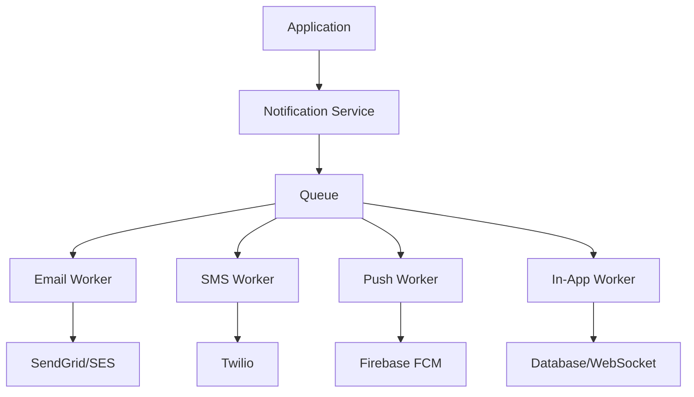

# How to Create Notification System with Node.js

Author: [nawazdhandala](https://www.github.com/nawazdhandala)

Tags: NodeJS, Notifications, Email, SMS, Push Notifications, Backend

Description: Build a comprehensive notification system in Node.js supporting email, SMS, push notifications, and in-app notifications with queuing and delivery tracking.

---

Modern applications need to notify users through multiple channels: email, SMS, push notifications, and in-app messages. Building a robust notification system requires proper abstraction, queuing, delivery tracking, and user preferences management. Here is how to build one.

## Architecture Overview



## Core Notification Service

```javascript
// src/services/NotificationService.js
const EventEmitter = require('events');

class NotificationService extends EventEmitter {
    constructor() {
        super();
        this.providers = new Map();
        this.templates = new Map();
    }

    // Register notification providers
    registerProvider(channel, provider) {
        this.providers.set(channel, provider);
    }

    // Register notification templates
    registerTemplate(name, template) {
        this.templates.set(name, template);
    }

    // Send notification
    async send(notification) {
        const {
            userId,
            channel,      // 'email', 'sms', 'push', 'in-app'
            template,
            data,
            options = {}
        } = notification;

        // Get user preferences
        const user = await this.getUserWithPreferences(userId);

        // Check if user wants this type of notification
        if (!this.shouldSendToChannel(user, channel, options)) {
            return { sent: false, reason: 'User preference' };
        }

        // Get provider for channel
        const provider = this.providers.get(channel);
        if (!provider) {
            throw new Error(`No provider registered for channel: ${channel}`);
        }

        // Render template
        const templateFn = this.templates.get(template);
        const content = templateFn ? templateFn(data) : data;

        // Send notification
        try {
            const result = await provider.send(user, content, options);

            // Log delivery
            await this.logNotification({
                userId,
                channel,
                template,
                status: 'sent',
                providerId: result.id
            });

            this.emit('sent', { userId, channel, template });
            return { sent: true, id: result.id };
        } catch (error) {
            await this.logNotification({
                userId,
                channel,
                template,
                status: 'failed',
                error: error.message
            });

            this.emit('failed', { userId, channel, template, error });
            throw error;
        }
    }

    // Send to multiple channels
    async sendMultiChannel(notification) {
        const { userId, channels, template, data, options } = notification;

        const results = await Promise.allSettled(
            channels.map(channel =>
                this.send({ userId, channel, template, data, options })
            )
        );

        return channels.map((channel, index) => ({
            channel,
            ...results[index].status === 'fulfilled'
                ? results[index].value
                : { sent: false, error: results[index].reason.message }
        }));
    }

    shouldSendToChannel(user, channel, options) {
        if (options.force) return true;

        const prefs = user.notificationPreferences || {};
        return prefs[channel] !== false;
    }

    async getUserWithPreferences(userId) {
        // Implement based on your user model
        return await User.findById(userId);
    }

    async logNotification(log) {
        // Store in database for tracking
        return await NotificationLog.create(log);
    }
}

module.exports = new NotificationService();
```

## Email Provider

```javascript
// src/providers/EmailProvider.js
const nodemailer = require('nodemailer');

class EmailProvider {
    constructor(config) {
        this.transporter = nodemailer.createTransport({
            host: config.host || 'smtp.sendgrid.net',
            port: config.port || 587,
            auth: {
                user: config.user || 'apikey',
                pass: config.apiKey
            }
        });

        this.from = config.from || 'noreply@example.com';
    }

    async send(user, content, options = {}) {
        const mailOptions = {
            from: options.from || this.from,
            to: user.email,
            subject: content.subject,
            text: content.text,
            html: content.html
        };

        if (options.attachments) {
            mailOptions.attachments = options.attachments;
        }

        const result = await this.transporter.sendMail(mailOptions);
        return { id: result.messageId };
    }
}

module.exports = EmailProvider;
```

## SMS Provider (Twilio)

```javascript
// src/providers/SMSProvider.js
const twilio = require('twilio');

class SMSProvider {
    constructor(config) {
        this.client = twilio(config.accountSid, config.authToken);
        this.from = config.from;
    }

    async send(user, content, options = {}) {
        if (!user.phone) {
            throw new Error('User has no phone number');
        }

        const message = await this.client.messages.create({
            body: content.text || content.message,
            from: options.from || this.from,
            to: user.phone
        });

        return { id: message.sid };
    }
}

module.exports = SMSProvider;
```

## Push Notification Provider (Firebase)

```javascript
// src/providers/PushProvider.js
const admin = require('firebase-admin');

class PushProvider {
    constructor(config) {
        if (!admin.apps.length) {
            admin.initializeApp({
                credential: admin.credential.cert(config.serviceAccount)
            });
        }
        this.messaging = admin.messaging();
    }

    async send(user, content, options = {}) {
        if (!user.fcmTokens || user.fcmTokens.length === 0) {
            throw new Error('User has no push tokens');
        }

        const message = {
            notification: {
                title: content.title,
                body: content.body
            },
            data: content.data || {},
            tokens: user.fcmTokens
        };

        if (options.badge !== undefined) {
            message.apns = { payload: { aps: { badge: options.badge } } };
        }

        const result = await this.messaging.sendMulticast(message);

        // Handle failed tokens
        if (result.failureCount > 0) {
            const failedTokens = [];
            result.responses.forEach((resp, idx) => {
                if (!resp.success) {
                    failedTokens.push(user.fcmTokens[idx]);
                }
            });
            // Remove invalid tokens
            await this.removeInvalidTokens(user.id, failedTokens);
        }

        return { id: result.successCount > 0 ? 'sent' : 'failed' };
    }

    async removeInvalidTokens(userId, tokens) {
        await User.updateOne(
            { _id: userId },
            { $pull: { fcmTokens: { $in: tokens } } }
        );
    }
}

module.exports = PushProvider;
```

## In-App Notifications

```javascript
// src/providers/InAppProvider.js
class InAppProvider {
    constructor(io) {
        this.io = io;  // Socket.io instance
    }

    async send(user, content, options = {}) {
        // Store in database
        const notification = await InAppNotification.create({
            userId: user._id,
            title: content.title,
            body: content.body,
            type: content.type || 'info',
            data: content.data,
            read: false
        });

        // Send via WebSocket if user is online
        this.io.to(`user:${user._id}`).emit('notification', {
            id: notification._id,
            title: content.title,
            body: content.body,
            type: content.type,
            data: content.data,
            createdAt: notification.createdAt
        });

        return { id: notification._id };
    }
}

// In-App Notification Model
const inAppNotificationSchema = new mongoose.Schema({
    userId: { type: mongoose.Schema.Types.ObjectId, ref: 'User', required: true },
    title: String,
    body: String,
    type: { type: String, enum: ['info', 'warning', 'error', 'success'], default: 'info' },
    data: mongoose.Schema.Types.Mixed,
    read: { type: Boolean, default: false },
    readAt: Date
}, { timestamps: true });

inAppNotificationSchema.index({ userId: 1, read: 1, createdAt: -1 });

module.exports = mongoose.model('InAppNotification', inAppNotificationSchema);
```

## Notification Templates

```javascript
// src/templates/index.js
const handlebars = require('handlebars');

const templates = {
    welcomeEmail: (data) => ({
        subject: `Welcome to ${data.appName}!`,
        text: `Hi ${data.name}, welcome to ${data.appName}!`,
        html: `
            <h1>Welcome, ${data.name}!</h1>
            <p>We're excited to have you on board.</p>
            <a href="${data.verifyUrl}">Verify your email</a>
        `
    }),

    orderConfirmation: (data) => ({
        subject: `Order Confirmation #${data.orderNumber}`,
        text: `Your order #${data.orderNumber} has been confirmed.`,
        html: `
            <h1>Order Confirmed</h1>
            <p>Order Number: ${data.orderNumber}</p>
            <p>Total: $${data.total}</p>
        `
    }),

    passwordReset: (data) => ({
        subject: 'Password Reset Request',
        text: `Click here to reset your password: ${data.resetUrl}`,
        html: `
            <h1>Password Reset</h1>
            <p>Click the link below to reset your password:</p>
            <a href="${data.resetUrl}">Reset Password</a>
            <p>This link expires in ${data.expiresIn}.</p>
        `
    }),

    smsVerification: (data) => ({
        text: `Your verification code is: ${data.code}`
    }),

    pushNewMessage: (data) => ({
        title: `New message from ${data.senderName}`,
        body: data.preview,
        data: { messageId: data.messageId, chatId: data.chatId }
    })
};

module.exports = templates;
```

## Queue Integration

For reliability, queue notifications:

```javascript
// src/queues/notificationQueue.js
const Bull = require('bull');

const notificationQueue = new Bull('notifications', {
    redis: process.env.REDIS_URL
});

// Producer
async function queueNotification(notification) {
    return await notificationQueue.add(notification, {
        attempts: 3,
        backoff: {
            type: 'exponential',
            delay: 2000
        },
        removeOnComplete: 100,
        removeOnFail: 1000
    });
}

// Consumer
notificationQueue.process(async (job) => {
    const { data } = job;
    return await notificationService.send(data);
});

// Event handlers
notificationQueue.on('completed', (job, result) => {
    console.log(`Notification ${job.id} sent:`, result);
});

notificationQueue.on('failed', (job, err) => {
    console.error(`Notification ${job.id} failed:`, err.message);
});

module.exports = { notificationQueue, queueNotification };
```

## API Endpoints

```javascript
const express = require('express');
const router = express.Router();

// Get user notifications
router.get('/notifications', auth, async (req, res) => {
    const { page = 1, limit = 20, unreadOnly = false } = req.query;

    const query = { userId: req.user.id };
    if (unreadOnly === 'true') query.read = false;

    const [notifications, total, unreadCount] = await Promise.all([
        InAppNotification.find(query)
            .sort({ createdAt: -1 })
            .skip((page - 1) * limit)
            .limit(parseInt(limit)),
        InAppNotification.countDocuments(query),
        InAppNotification.countDocuments({ userId: req.user.id, read: false })
    ]);

    res.json({
        data: notifications,
        unreadCount,
        pagination: { page: parseInt(page), limit: parseInt(limit), total }
    });
});

// Mark as read
router.put('/notifications/:id/read', auth, async (req, res) => {
    await InAppNotification.updateOne(
        { _id: req.params.id, userId: req.user.id },
        { read: true, readAt: new Date() }
    );
    res.json({ success: true });
});

// Mark all as read
router.put('/notifications/read-all', auth, async (req, res) => {
    await InAppNotification.updateMany(
        { userId: req.user.id, read: false },
        { read: true, readAt: new Date() }
    );
    res.json({ success: true });
});

// Update preferences
router.put('/notifications/preferences', auth, async (req, res) => {
    const { email, sms, push, inApp } = req.body;

    await User.updateOne(
        { _id: req.user.id },
        {
            notificationPreferences: {
                email: email !== false,
                sms: sms !== false,
                push: push !== false,
                inApp: inApp !== false
            }
        }
    );

    res.json({ success: true });
});
```

## Initialization

```javascript
// src/index.js
const notificationService = require('./services/NotificationService');
const EmailProvider = require('./providers/EmailProvider');
const SMSProvider = require('./providers/SMSProvider');
const PushProvider = require('./providers/PushProvider');
const InAppProvider = require('./providers/InAppProvider');
const templates = require('./templates');

// Initialize providers
notificationService.registerProvider('email', new EmailProvider({
    apiKey: process.env.SENDGRID_API_KEY,
    from: process.env.EMAIL_FROM
}));

notificationService.registerProvider('sms', new SMSProvider({
    accountSid: process.env.TWILIO_ACCOUNT_SID,
    authToken: process.env.TWILIO_AUTH_TOKEN,
    from: process.env.TWILIO_PHONE_NUMBER
}));

notificationService.registerProvider('push', new PushProvider({
    serviceAccount: require('./firebase-service-account.json')
}));

notificationService.registerProvider('in-app', new InAppProvider(io));

// Register templates
Object.entries(templates).forEach(([name, fn]) => {
    notificationService.registerTemplate(name, fn);
});

// Usage
await notificationService.send({
    userId: user.id,
    channel: 'email',
    template: 'welcomeEmail',
    data: { name: user.name, appName: 'MyApp', verifyUrl: '...' }
});
```

## Summary

A robust notification system requires provider abstraction for different channels, template management for consistent messaging, queue-based delivery for reliability, user preference management, and delivery tracking. Build the core service with clean interfaces, add providers as needed, and use queues to handle failures gracefully. This architecture scales well and makes it easy to add new notification channels.
