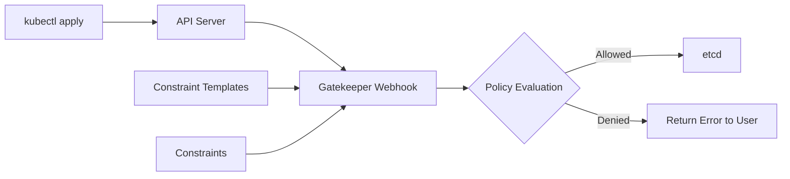

# How to Configure OPA Gatekeeper for Policy Enforcement

Author: [nawazdhandala](https://www.github.com/nawazdhandala)

Tags: Security, OPA, Gatekeeper, Kubernetes, Policy as Code, Admission Control, Compliance

Description: Learn how to implement OPA Gatekeeper to enforce security policies, compliance requirements, and operational standards in your Kubernetes clusters through admission control.

---

Kubernetes gives teams tremendous flexibility, which means tremendous opportunity for misconfiguration. OPA Gatekeeper provides guardrails by validating resources against policies before they enter the cluster. This guide covers installation, policy writing with Rego, constraint templates, and strategies for rolling out policies without breaking existing workloads.

## What Gatekeeper Enforces

Gatekeeper acts as a validating admission webhook. When kubectl apply runs, Gatekeeper evaluates the resource against your policies and either admits or rejects it. Common use cases include:

- Requiring resource limits on all containers
- Blocking privileged containers
- Enforcing image registries (only pull from approved sources)
- Mandating labels and annotations
- Preventing hostPath mounts
- Requiring network policies exist

Unlike static analysis, Gatekeeper enforces policies at admission time, making them impossible to bypass.

## Architecture Overview



## Installing Gatekeeper

Deploy Gatekeeper using kubectl or Helm:

```bash
# Option 1: Apply manifests directly
kubectl apply -f https://raw.githubusercontent.com/open-policy-agent/gatekeeper/v3.14.0/deploy/gatekeeper.yaml

# Option 2: Install with Helm
helm repo add gatekeeper https://open-policy-agent.github.io/gatekeeper/charts
helm repo update

helm install gatekeeper gatekeeper/gatekeeper \
  --namespace gatekeeper-system \
  --create-namespace \
  --set replicas=3 \
  --set audit.replicas=1
```

Verify the installation:

```bash
kubectl get pods -n gatekeeper-system
# NAME                                            READY   STATUS    RESTARTS   AGE
# gatekeeper-audit-xxxxxxxxx-xxxxx                1/1     Running   0          1m
# gatekeeper-controller-manager-xxxxxxx-xxxxx     1/1     Running   0          1m
```

## Understanding Constraint Templates and Constraints

Gatekeeper uses two custom resources:

1. **ConstraintTemplate**: Defines the policy logic using Rego
2. **Constraint**: Applies the template with specific parameters

Think of templates as policy blueprints and constraints as configured instances.

## Writing Your First Policy

Let's create a policy requiring all pods to have resource limits.

### Step 1: Create the Constraint Template

```yaml
# require-resource-limits-template.yaml
apiVersion: templates.gatekeeper.sh/v1
kind: ConstraintTemplate
metadata:
  name: k8srequiredresources
spec:
  crd:
    spec:
      names:
        kind: K8sRequiredResources
      validation:
        # Schema for constraint parameters
        openAPIV3Schema:
          type: object
          properties:
            limits:
              type: array
              items:
                type: string
  targets:
    - target: admission.k8s.gatekeeper.sh
      rego: |
        package k8srequiredresources

        # Violation if container lacks required resource limits
        violation[{"msg": msg}] {
          container := input.review.object.spec.containers[_]
          required := input.parameters.limits[_]
          not container.resources.limits[required]
          msg := sprintf("Container '%v' must have resource limit '%v'", [container.name, required])
        }

        # Also check init containers
        violation[{"msg": msg}] {
          container := input.review.object.spec.initContainers[_]
          required := input.parameters.limits[_]
          not container.resources.limits[required]
          msg := sprintf("Init container '%v' must have resource limit '%v'", [container.name, required])
        }
```

### Step 2: Create the Constraint

```yaml
# require-cpu-memory-limits.yaml
apiVersion: constraints.gatekeeper.sh/v1beta1
kind: K8sRequiredResources
metadata:
  name: require-cpu-memory-limits
spec:
  match:
    kinds:
      - apiGroups: [""]
        kinds: ["Pod"]
    # Exclude system namespaces
    excludedNamespaces:
      - kube-system
      - gatekeeper-system
  parameters:
    limits:
      - cpu
      - memory
```

Apply both resources:

```bash
kubectl apply -f require-resource-limits-template.yaml
kubectl apply -f require-cpu-memory-limits.yaml
```

Test the policy:

```bash
# This pod will be rejected
cat <<EOF | kubectl apply -f -
apiVersion: v1
kind: Pod
metadata:
  name: test-no-limits
spec:
  containers:
    - name: nginx
      image: nginx:1.25
EOF
# Error: admission webhook "validation.gatekeeper.sh" denied the request:
# Container 'nginx' must have resource limit 'cpu'
# Container 'nginx' must have resource limit 'memory'

# This pod will be admitted
cat <<EOF | kubectl apply -f -
apiVersion: v1
kind: Pod
metadata:
  name: test-with-limits
spec:
  containers:
    - name: nginx
      image: nginx:1.25
      resources:
        limits:
          cpu: "100m"
          memory: "128Mi"
        requests:
          cpu: "50m"
          memory: "64Mi"
EOF
# pod/test-with-limits created
```

## Common Policy Examples

### Block Privileged Containers

```yaml
# privileged-container-template.yaml
apiVersion: templates.gatekeeper.sh/v1
kind: ConstraintTemplate
metadata:
  name: k8sblockprivileged
spec:
  crd:
    spec:
      names:
        kind: K8sBlockPrivileged
  targets:
    - target: admission.k8s.gatekeeper.sh
      rego: |
        package k8sblockprivileged

        violation[{"msg": msg}] {
          container := input.review.object.spec.containers[_]
          container.securityContext.privileged == true
          msg := sprintf("Privileged container not allowed: %v", [container.name])
        }
---
apiVersion: constraints.gatekeeper.sh/v1beta1
kind: K8sBlockPrivileged
metadata:
  name: block-privileged-containers
spec:
  match:
    kinds:
      - apiGroups: [""]
        kinds: ["Pod"]
    excludedNamespaces:
      - kube-system
```

### Require Approved Image Registries

```yaml
# allowed-repos-template.yaml
apiVersion: templates.gatekeeper.sh/v1
kind: ConstraintTemplate
metadata:
  name: k8sallowedrepos
spec:
  crd:
    spec:
      names:
        kind: K8sAllowedRepos
      validation:
        openAPIV3Schema:
          type: object
          properties:
            repos:
              type: array
              items:
                type: string
  targets:
    - target: admission.k8s.gatekeeper.sh
      rego: |
        package k8sallowedrepos

        violation[{"msg": msg}] {
          container := input.review.object.spec.containers[_]
          not strings.any_prefix_match(container.image, input.parameters.repos)
          msg := sprintf("Container image '%v' is not from an approved registry", [container.image])
        }

        # Helper: check if image starts with any allowed prefix
        strings.any_prefix_match(str, prefixes) {
          prefix := prefixes[_]
          startswith(str, prefix)
        }
---
apiVersion: constraints.gatekeeper.sh/v1beta1
kind: K8sAllowedRepos
metadata:
  name: require-approved-registries
spec:
  match:
    kinds:
      - apiGroups: [""]
        kinds: ["Pod"]
  parameters:
    repos:
      - "gcr.io/my-project/"
      - "docker.io/library/"
      - "ghcr.io/my-org/"
```

### Require Labels

```yaml
# required-labels-template.yaml
apiVersion: templates.gatekeeper.sh/v1
kind: ConstraintTemplate
metadata:
  name: k8srequiredlabels
spec:
  crd:
    spec:
      names:
        kind: K8sRequiredLabels
      validation:
        openAPIV3Schema:
          type: object
          properties:
            labels:
              type: array
              items:
                type: string
  targets:
    - target: admission.k8s.gatekeeper.sh
      rego: |
        package k8srequiredlabels

        violation[{"msg": msg}] {
          required := input.parameters.labels[_]
          not input.review.object.metadata.labels[required]
          msg := sprintf("Missing required label: %v", [required])
        }
---
apiVersion: constraints.gatekeeper.sh/v1beta1
kind: K8sRequiredLabels
metadata:
  name: require-team-label
spec:
  match:
    kinds:
      - apiGroups: ["apps"]
        kinds: ["Deployment", "StatefulSet"]
  parameters:
    labels:
      - team
      - environment
```

## Dry Run Mode for Safe Rollout

Enable dry run to see what would be blocked without actually blocking:

```yaml
apiVersion: constraints.gatekeeper.sh/v1beta1
kind: K8sRequiredResources
metadata:
  name: require-cpu-memory-limits
spec:
  enforcementAction: dryrun  # warn, deny, or dryrun
  match:
    kinds:
      - apiGroups: [""]
        kinds: ["Pod"]
  parameters:
    limits:
      - cpu
      - memory
```

Check violation audit results:

```bash
kubectl get k8srequiredresources require-cpu-memory-limits -o yaml
# status:
#   totalViolations: 5
#   violations:
#     - enforcementAction: dryrun
#       kind: Pod
#       name: legacy-app
#       namespace: default
```

## Audit Existing Resources

Gatekeeper audits existing resources against policies. View violations:

```bash
# Get all constraints with their violation counts
kubectl get constraints

# See detailed violations for a specific constraint
kubectl describe k8sallowedrepos require-approved-registries
```

## Policy Library

The Gatekeeper community maintains a library of ready-to-use policies:

```bash
# Clone the policy library
git clone https://github.com/open-policy-agent/gatekeeper-library.git

# Apply a policy from the library
kubectl apply -f gatekeeper-library/library/pod-security-policy/privileged-containers/
```

---

OPA Gatekeeper transforms Kubernetes from an anything-goes platform into one with enforced guardrails. Start with audit mode to understand your current state, fix violations, then switch to enforcement. Build policies incrementally: a few well-enforced policies beat dozens that are ignored.
