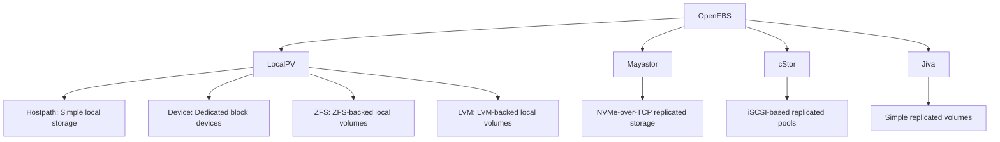

# How to Configure OpenEBS for Container Storage

Author: [nawazdhandala](https://www.github.com/nawazdhandala)

Tags: OpenEBS, Kubernetes, Storage, CSI, DevOps

Description: A practical guide to deploying OpenEBS for container-native storage in Kubernetes, covering Mayastor, cStor, and LocalPV engines, with installation steps and use case recommendations.

---

OpenEBS is a container-native storage solution that turns your Kubernetes nodes into a distributed storage system. Unlike traditional storage arrays, OpenEBS runs entirely in userspace as containers, providing different storage engines optimized for various workloads. Whether you need fast local volumes for single-node performance or replicated pools for high availability, OpenEBS has an engine for the job.

This guide covers the major OpenEBS engines, installation procedures, and practical configurations for common scenarios.

## Why OpenEBS?

OpenEBS solves storage challenges with flexibility:

1. **Multiple engines:** Choose between LocalPV, cStor, Jiva, and Mayastor based on your requirements.
2. **Container-native:** Runs as pods on your cluster, no kernel modules or dedicated storage servers required.
3. **Per-workload control:** Different applications can use different storage backends in the same cluster.
4. **CNCF project:** Active community with regular releases and enterprise support options.

The tradeoff is complexity. You become the integrator, selecting and tuning engines for each use case.

## Understanding OpenEBS Engines



**LocalPV:** Best for workloads that handle replication themselves (databases with native clustering). Provides raw disk performance.

**Mayastor:** The modern choice for replicated block storage. Uses NVMe-over-TCP for high performance. Requires NVMe-capable hardware.

**cStor:** Mature replicated storage with ZFS-like features (snapshots, clones, compression). Good for general-purpose HA storage.

**Jiva:** Simplest replicated engine. Good for development but not recommended for high-performance production workloads.

## Prerequisites

Before installing OpenEBS, ensure your cluster meets these requirements:

```bash
# Check Kubernetes version (1.21+ required)
kubectl version --short

# Verify iSCSI is installed (required for cStor/Jiva)
# Ubuntu/Debian
sudo apt install -y open-iscsi
sudo systemctl enable --now iscsid

# RHEL/CentOS
sudo dnf install -y iscsi-initiator-utils
sudo systemctl enable --now iscsid

# For Mayastor, verify hugepages support
grep HugePages /proc/meminfo
# If not configured:
echo 1024 | sudo tee /sys/kernel/mm/hugepages/hugepages-2048kB/nr_hugepages
```

## Installing OpenEBS

Install the OpenEBS operator using Helm:

```bash
# Add OpenEBS Helm repository
helm repo add openebs https://openebs.github.io/charts
helm repo update

# Install OpenEBS with LocalPV and cStor
helm install openebs openebs/openebs \
    --namespace openebs \
    --create-namespace \
    --set cstor.enabled=true \
    --set mayastor.enabled=false

# Wait for pods to be ready
kubectl -n openebs get pods -w

# Verify installation
kubectl get storageclass | grep openebs
```

For Mayastor (high-performance option):

```bash
helm install openebs openebs/openebs \
    --namespace openebs \
    --create-namespace \
    --set mayastor.enabled=true \
    --set cstor.enabled=false
```

## Configuring LocalPV

LocalPV is the simplest option for local storage. It creates directories or uses dedicated devices on nodes.

### LocalPV Hostpath

```yaml
# storageclass-localpv-hostpath.yaml
apiVersion: storage.k8s.io/v1
kind: StorageClass
metadata:
  name: openebs-hostpath
  annotations:
    openebs.io/cas-type: local
    cas.openebs.io/config: |
      - name: StorageType
        value: "hostpath"
      - name: BasePath
        value: "/var/openebs/local"
provisioner: openebs.io/local
volumeBindingMode: WaitForFirstConsumer
reclaimPolicy: Delete
```

### LocalPV Device

For dedicated block devices:

```yaml
# storageclass-localpv-device.yaml
apiVersion: storage.k8s.io/v1
kind: StorageClass
metadata:
  name: openebs-device
  annotations:
    openebs.io/cas-type: local
    cas.openebs.io/config: |
      - name: StorageType
        value: "device"
      - name: FSType
        value: "ext4"
provisioner: openebs.io/local
volumeBindingMode: WaitForFirstConsumer
reclaimPolicy: Delete
```

Use LocalPV in a deployment:

```yaml
# redis-with-localpv.yaml
apiVersion: v1
kind: PersistentVolumeClaim
metadata:
  name: redis-data
  namespace: cache
spec:
  storageClassName: openebs-hostpath
  accessModes:
    - ReadWriteOnce
  resources:
    requests:
      storage: 10Gi
---
apiVersion: apps/v1
kind: Deployment
metadata:
  name: redis
  namespace: cache
spec:
  replicas: 1
  selector:
    matchLabels:
      app: redis
  template:
    metadata:
      labels:
        app: redis
    spec:
      containers:
        - name: redis
          image: redis:7
          ports:
            - containerPort: 6379
          volumeMounts:
            - name: data
              mountPath: /data
      volumes:
        - name: data
          persistentVolumeClaim:
            claimName: redis-data
```

## Configuring cStor Pools

cStor provides replicated storage using a pool of block devices across nodes.

First, identify available block devices:

```bash
# List block devices on nodes
kubectl get blockdevices -n openebs

# Output shows device paths and states:
# NAME                                           NODENAME    SIZE          CLAIMSTATE   STATUS
# blockdevice-abc123...                          worker-01   107374182400  Unclaimed    Active
# blockdevice-def456...                          worker-02   107374182400  Unclaimed    Active
# blockdevice-ghi789...                          worker-03   107374182400  Unclaimed    Active
```

Create a cStor pool cluster:

```yaml
# cstor-pool-cluster.yaml
apiVersion: cstor.openebs.io/v1
kind: CStorPoolCluster
metadata:
  name: cstor-disk-pool
  namespace: openebs
spec:
  pools:
    - nodeSelector:
        kubernetes.io/hostname: "worker-01"
      dataRaidGroups:
        - blockDevices:
            - blockDeviceName: "blockdevice-abc123"
      poolConfig:
        dataRaidGroupType: "stripe"
    - nodeSelector:
        kubernetes.io/hostname: "worker-02"
      dataRaidGroups:
        - blockDevices:
            - blockDeviceName: "blockdevice-def456"
      poolConfig:
        dataRaidGroupType: "stripe"
    - nodeSelector:
        kubernetes.io/hostname: "worker-03"
      dataRaidGroups:
        - blockDevices:
            - blockDeviceName: "blockdevice-ghi789"
      poolConfig:
        dataRaidGroupType: "stripe"
```

Create a StorageClass for cStor:

```yaml
# cstor-storageclass.yaml
apiVersion: storage.k8s.io/v1
kind: StorageClass
metadata:
  name: cstor-replicated
provisioner: cstor.csi.openebs.io
allowVolumeExpansion: true
parameters:
  cas-type: cstor
  cstorPoolCluster: cstor-disk-pool
  replicaCount: "3"
```

## Configuring Mayastor

Mayastor uses NVMe-over-TCP for high-performance replicated storage.

Prepare nodes with hugepages:

```yaml
# mayastor-node-label.yaml
# Label nodes that will participate in Mayastor pools
kubectl label nodes worker-01 worker-02 worker-03 openebs.io/engine=mayastor
```

Create a Mayastor pool:

```yaml
# mayastor-pool.yaml
apiVersion: openebs.io/v1beta2
kind: DiskPool
metadata:
  name: pool-worker-01
  namespace: openebs
spec:
  node: worker-01
  disks:
    - /dev/nvme1n1
---
apiVersion: openebs.io/v1beta2
kind: DiskPool
metadata:
  name: pool-worker-02
  namespace: openebs
spec:
  node: worker-02
  disks:
    - /dev/nvme1n1
---
apiVersion: openebs.io/v1beta2
kind: DiskPool
metadata:
  name: pool-worker-03
  namespace: openebs
spec:
  node: worker-03
  disks:
    - /dev/nvme1n1
```

Create Mayastor StorageClass:

```yaml
# mayastor-storageclass.yaml
apiVersion: storage.k8s.io/v1
kind: StorageClass
metadata:
  name: mayastor-replicated
provisioner: io.openebs.csi-mayastor
parameters:
  ioTimeout: "60"
  protocol: nvmf
  repl: "3"
volumeBindingMode: Immediate
```

## Volume Snapshots with cStor

cStor supports CSI snapshots:

```yaml
# cstor-snapshotclass.yaml
apiVersion: snapshot.storage.k8s.io/v1
kind: VolumeSnapshotClass
metadata:
  name: cstor-snapshot-class
driver: cstor.csi.openebs.io
deletionPolicy: Delete
---
# Take a snapshot
apiVersion: snapshot.storage.k8s.io/v1
kind: VolumeSnapshot
metadata:
  name: postgres-snapshot
  namespace: production
spec:
  volumeSnapshotClassName: cstor-snapshot-class
  source:
    persistentVolumeClaimName: postgres-data
```

Restore from snapshot:

```yaml
# pvc-from-snapshot.yaml
apiVersion: v1
kind: PersistentVolumeClaim
metadata:
  name: postgres-restored
  namespace: production
spec:
  storageClassName: cstor-replicated
  dataSource:
    name: postgres-snapshot
    kind: VolumeSnapshot
    apiGroup: snapshot.storage.k8s.io
  accessModes:
    - ReadWriteOnce
  resources:
    requests:
      storage: 50Gi
```

## Monitoring OpenEBS

OpenEBS exposes metrics for Prometheus:

```yaml
# servicemonitor.yaml
apiVersion: monitoring.coreos.com/v1
kind: ServiceMonitor
metadata:
  name: openebs
  namespace: openebs
spec:
  selector:
    matchLabels:
      openebs.io/component: openebs-cstor-pool
  endpoints:
    - port: exporter
      interval: 30s
```

Key metrics to monitor:
- `openebs_pool_size`: Total pool capacity
- `openebs_pool_used`: Used pool capacity
- `openebs_volume_replica_status`: Replica health
- `openebs_read_latency` / `openebs_write_latency`: I/O latency

## Use Case Recommendations

| Workload | Recommended Engine | Reason |
|----------|-------------------|--------|
| Clustered databases (CockroachDB, Cassandra) | LocalPV | Database handles replication |
| Single-instance databases (PostgreSQL, MySQL) | cStor or Mayastor | Storage-level replication for HA |
| Development environments | LocalPV Hostpath | Simple, no hardware requirements |
| High-performance analytics | Mayastor | NVMe-over-TCP for low latency |
| General stateful apps | cStor | Mature, full-featured |

## Best Practices

1. **Match engine to workload:** Do not over-engineer. LocalPV is often sufficient for databases that replicate data themselves.

2. **Monitor pool health:** Set up alerts for degraded pools. A pool missing replicas is at risk of data loss.

3. **Test failover:** Periodically kill nodes and verify volumes reattach correctly. Measure recovery time.

4. **Size pools appropriately:** cStor pools cannot easily shrink. Plan for growth.

5. **Use dedicated devices:** For production, dedicate block devices to OpenEBS rather than sharing with the OS.

## Wrapping Up

OpenEBS gives you storage flexibility that traditional SANs cannot match. Start with LocalPV for simplicity, graduate to cStor or Mayastor when you need replication, and pick the engine that fits each workload. The key is understanding that not every application needs replicated storage at the infrastructure layer. Match the engine to the requirement and you will have storage that performs well without unnecessary complexity.
