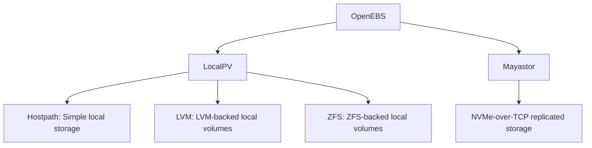

# How to Configure OpenEBS for Container Storage

Author: [nawazdhandala](https://www.github.com/nawazdhandala)

Tags: OpenEBS, Kubernetes, Storage, CSI, DevOps

Description: A practical guide to deploying OpenEBS for container-native storage in Kubernetes, covering Mayastor, cStor, and LocalPV engines, with installation steps and use case recommendations.

---

OpenEBS is a container-native storage solution that turns storage attached to your Kubernetes nodes into Local or Replicated Persistent Volumes. Unlike traditional storage arrays, OpenEBS data engines and control plane run as Kubernetes-managed services, providing different storage engines optimized for various workloads. Whether you need fast local volumes for single-node performance or replicated pools for high availability, OpenEBS has an engine for the job.

This guide covers the major OpenEBS engines, installation procedures, and practical configurations for common scenarios.

## Why OpenEBS?

OpenEBS solves storage challenges with flexibility:

1. **Multiple engines:** Choose between LocalPV Hostpath, LocalPV LVM, LocalPV ZFS, and Replicated PV Mayastor based on your requirements.
2. **Container-native:** Runs as pods on your cluster, with host prerequisites depending on the engine.
3. **Per-workload control:** Different applications can use different storage backends in the same cluster.
4. **CNCF project:** Active community with regular releases and enterprise support options.

The tradeoff is complexity. You become the integrator, selecting and tuning engines for each use case.

## Understanding OpenEBS Engines


```mermaid
flowchart TD
    A[OpenEBS] --> B[LocalPV]
    A --> C[Mayastor]

    B --> F[Hostpath: Simple local storage]
    B --> G[LVM: LVM-backed local volumes]
    B --> H[ZFS: ZFS-backed local volumes]

    C --> J[NVMe-over-TCP replicated storage]
```

**LocalPV:** Best for workloads that handle replication themselves (databases with native clustering). Provides raw disk performance.

**Mayastor:** The current replicated block storage engine. Uses NVMe-over-TCP for high performance and requires nodes with the `nvme-tcp` kernel module and huge pages configured.

**LocalPV LVM:** Local volumes backed by preconfigured LVM volume groups, useful when you want resizing and better disk abstraction.

**LocalPV ZFS:** Local volumes backed by ZFS pools, useful when you want ZFS features such as snapshots and compression.

## Prerequisites

Before installing OpenEBS, ensure your cluster meets these requirements:

```bash
# Check Kubernetes version (OpenEBS 4.x requires Kubernetes 1.23+)

kubectl version

# For LocalPV LVM, install LVM utilities and create a volume group on storage nodes
sudo apt install -y lvm2
sudo pvcreate /dev/sdb
sudo vgcreate lvmvg /dev/sdb

# For LocalPV ZFS, install ZFS utilities and create a zpool on storage nodes
sudo apt install -y zfsutils-linux
sudo zpool create zfspv-pool /dev/sdc

# For Mayastor, verify NVMe-TCP and hugepages support
sudo modprobe nvme-tcp
grep HugePages /proc/meminfo
# If not configured:
echo 1024 | sudo tee /sys/kernel/mm/hugepages/hugepages-2048kB/nr_hugepages
```

## Installing OpenEBS

Install the OpenEBS operator using Helm:

```bash
# Add OpenEBS Helm repository
helm repo add openebs https://openebs.github.io/openebs
helm repo update

# Install OpenEBS with LocalPV and Replicated PV Mayastor
helm install openebs openebs/openebs \
    --namespace openebs \
    --create-namespace

# Wait for pods to be ready
kubectl -n openebs get pods -w

# Verify installation
kubectl get storageclass
```

For local-only clusters without Replicated PV Mayastor:

```bash
helm install openebs openebs/openebs \
    --namespace openebs \
    --create-namespace \
    --set engines.replicated.mayastor.enabled=false
```

## Configuring LocalPV

LocalPV is the simplest option for local storage. It creates directories or uses host-managed LVM/ZFS storage on nodes.

### LocalPV Hostpath

```yaml
# storageclass-localpv-hostpath.yaml
apiVersion: storage.k8s.io/v1
kind: StorageClass
metadata:
  name: openebs-hostpath
  annotations:
    openebs.io/cas-type: local
    cas.openebs.io/config: |
      - name: StorageType
        value: "hostpath"
      - name: BasePath
        value: "/var/openebs/local"
provisioner: openebs.io/local
volumeBindingMode: WaitForFirstConsumer
reclaimPolicy: Delete
```

### LocalPV LVM

For LVM-backed local volumes:

```yaml
# storageclass-localpv-lvm.yaml
apiVersion: storage.k8s.io/v1
kind: StorageClass
metadata:
  name: openebs-lvmpv
parameters:
  storage: "lvm"
  volgroup: "lvmvg"
provisioner: local.csi.openebs.io
volumeBindingMode: WaitForFirstConsumer
reclaimPolicy: Delete
allowVolumeExpansion: true
```

Use LocalPV in a deployment:

```yaml
# redis-with-localpv.yaml
apiVersion: v1
kind: PersistentVolumeClaim
metadata:
  name: redis-data
  namespace: cache
spec:
  storageClassName: openebs-hostpath
  accessModes:
    - ReadWriteOnce
  resources:
    requests:
      storage: 10Gi
---
apiVersion: apps/v1
kind: Deployment
metadata:
  name: redis
  namespace: cache
spec:
  replicas: 1
  selector:
    matchLabels:
      app: redis
  template:
    metadata:
      labels:
        app: redis
    spec:
      containers:
        - name: redis
          image: redis:7
          ports:
            - containerPort: 6379
          volumeMounts:
            - name: data
              mountPath: /data
      volumes:
        - name: data
          persistentVolumeClaim:
            claimName: redis-data
```

## Configuring LocalPV ZFS

LocalPV ZFS provides local volumes from ZFS pools that already exist on the nodes.

First, create the ZFS pool on each node that should provide ZFS-backed volumes:

```bash
sudo zpool create zfspv-pool /dev/sdc
zpool status
```

Create a StorageClass for ZFS:

```yaml
# zfs-storageclass.yaml
apiVersion: storage.k8s.io/v1
kind: StorageClass
metadata:
  name: openebs-zfspv
allowVolumeExpansion: true
parameters:
  recordsize: "128k"
  compression: "off"
  dedup: "off"
  fstype: "zfs"
  poolname: "zfspv-pool"
provisioner: zfs.csi.openebs.io
volumeBindingMode: WaitForFirstConsumer
```

## Configuring Mayastor

Mayastor uses NVMe-over-TCP for high-performance replicated storage.

Prepare nodes with hugepages:

```bash
# mayastor-node-label.yaml
# Label nodes that will participate in Mayastor pools
kubectl label nodes worker-01 worker-02 worker-03 openebs.io/engine=mayastor
```

Create a Mayastor pool:

```yaml
# mayastor-pool.yaml
apiVersion: openebs.io/v1beta3
kind: DiskPool
metadata:
  name: pool-worker-01
  namespace: openebs
spec:
  node: worker-01
  disks: ["aio:///dev/disk/by-id/nvme-worker-01"]
  maxExpansion: "5x"
---
apiVersion: openebs.io/v1beta3
kind: DiskPool
metadata:
  name: pool-worker-02
  namespace: openebs
spec:
  node: worker-02
  disks: ["aio:///dev/disk/by-id/nvme-worker-02"]
  maxExpansion: "5x"
---
apiVersion: openebs.io/v1beta3
kind: DiskPool
metadata:
  name: pool-worker-03
  namespace: openebs
spec:
  node: worker-03
  disks: ["aio:///dev/disk/by-id/nvme-worker-03"]
  maxExpansion: "5x"
```

Create Mayastor StorageClass:

```yaml
# mayastor-storageclass.yaml
apiVersion: storage.k8s.io/v1
kind: StorageClass
metadata:
  name: mayastor-replicated
provisioner: io.openebs.csi-mayastor
parameters:
  protocol: nvmf
  repl: "3"
volumeBindingMode: Immediate
```

## Volume Snapshots with Mayastor

Replicated PV Mayastor supports CSI snapshots:

```yaml
# mayastor-snapshotclass.yaml
apiVersion: snapshot.storage.k8s.io/v1
kind: VolumeSnapshotClass
metadata:
  name: mayastor-snapshot-class
driver: io.openebs.csi-mayastor
deletionPolicy: Delete
---
# Take a snapshot
apiVersion: snapshot.storage.k8s.io/v1
kind: VolumeSnapshot
metadata:
  name: postgres-snapshot
  namespace: production
spec:
  volumeSnapshotClassName: mayastor-snapshot-class
  source:
    persistentVolumeClaimName: postgres-data
```

Restore from snapshot:

```yaml
# pvc-from-snapshot.yaml
apiVersion: v1
kind: PersistentVolumeClaim
metadata:
  name: postgres-restored
  namespace: production
spec:
  storageClassName: mayastor-replicated
  dataSource:
    name: postgres-snapshot
    kind: VolumeSnapshot
    apiGroup: snapshot.storage.k8s.io
  accessModes:
    - ReadWriteOnce
  resources:
    requests:
      storage: 50Gi
```

## Monitoring OpenEBS

OpenEBS exposes metrics for Prometheus:

```yaml
# servicemonitor.yaml
apiVersion: monitoring.coreos.com/v1
kind: ServiceMonitor
metadata:
  name: openebs
  namespace: openebs
spec:
  selector:
    matchLabels:
      app: mayastor
  endpoints:
    - port: metrics
      interval: 30s
```

Key metrics to monitor:
- `disk_pool_total_size_bytes`: Total pool capacity
- `disk_pool_used_size_bytes`: Used pool capacity
- `disk_pool_status`: Pool health
- `volume_read_latency_us` / `volume_write_latency_us`: I/O latency counters

## Use Case Recommendations

| Workload | Recommended Engine | Reason |
|----------|-------------------|--------|
| Clustered databases (CockroachDB, Cassandra) | LocalPV | Database handles replication |
| Single-instance databases (PostgreSQL, MySQL) | Mayastor | Storage-level replication for HA |
| Development environments | LocalPV Hostpath | Simple, no hardware requirements |
| High-performance analytics | Mayastor | NVMe-over-TCP for low latency |
| General stateful apps | LocalPV LVM or Mayastor | Use local volumes when the app handles HA; use Mayastor when storage-level replication is required |

## Best Practices

1. **Match engine to workload:** Do not over-engineer. LocalPV is often sufficient for databases that replicate data themselves.

2. **Monitor pool health:** Set up alerts for degraded pools. A pool missing replicas is at risk of data loss.

3. **Test failover:** Periodically kill nodes and verify volumes reattach correctly. Measure recovery time.

4. **Size pools appropriately:** Replicated PV Mayastor pool expansion is controlled by the `maxExpansion` value set when the DiskPool is created. Plan this limit before creating pools.

5. **Use dedicated devices:** For production, dedicate block devices to OpenEBS rather than sharing with the OS.

## Wrapping Up

OpenEBS gives you storage flexibility that traditional SANs cannot match. Start with LocalPV for simplicity, graduate to Mayastor when you need replication, and pick the engine that fits each workload. The key is understanding that not every application needs replicated storage at the infrastructure layer. Match the engine to the requirement and you will have storage that performs well without unnecessary complexity.
