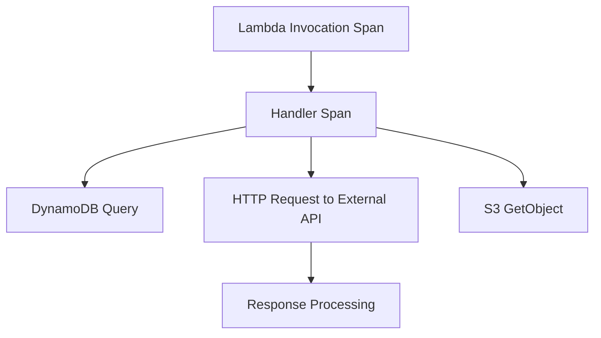

# How to Configure OpenTelemetry for AWS Lambda

Author: [nawazdhandala](https://www.github.com/nawazdhandala)

Tags: OpenTelemetry, AWS Lambda, Serverless, Observability, Tracing, Python, Node.js, Cold Start

Description: A practical guide to instrumenting AWS Lambda functions with OpenTelemetry for tracing, metrics, and logs while managing cold start overhead.

---

AWS Lambda functions present unique challenges for observability. They start cold, run briefly, and terminate unpredictably. Traditional tracing approaches that buffer and batch telemetry do not work well when your function might terminate before export completes. This guide covers practical approaches to running OpenTelemetry in Lambda with minimal overhead.

## Understanding Lambda Constraints

Lambda functions face several constraints that affect telemetry collection:

1. **Cold starts**: The function environment initializes from scratch, including your tracing setup
2. **Short execution**: Functions may complete in milliseconds, leaving no time for batching
3. **Unpredictable termination**: The runtime may freeze or terminate after response
4. **Limited memory**: More memory means higher costs
5. **No persistent connections**: Each invocation may create new connections

The key principle is to export telemetry synchronously before the handler returns.

## AWS Lambda Layer Approach

AWS provides an OpenTelemetry Lambda layer that handles most complexity. This is the recommended approach for most use cases.

### Adding the Layer

In your SAM template:

```yaml
# template.yaml
AWSTemplateFormatVersion: '2010-09-09'
Transform: AWS::Serverless-2016-10-31

Resources:
  MyFunction:
    Type: AWS::Serverless::Function
    Properties:
      Handler: index.handler
      Runtime: nodejs18.x
      MemorySize: 512
      Timeout: 30
      Layers:
        # AWS managed OpenTelemetry layer
        - arn:aws:lambda:us-east-1:901920570463:layer:aws-otel-nodejs-amd64-ver-1-18-1:1
      Environment:
        Variables:
          AWS_LAMBDA_EXEC_WRAPPER: /opt/otel-handler
          OTEL_SERVICE_NAME: my-lambda-function
          OTEL_EXPORTER_OTLP_ENDPOINT: https://your-backend.example.com
          OTEL_EXPORTER_OTLP_HEADERS: "Authorization=Bearer your-token"
```

Or with the AWS CLI:

```bash
aws lambda update-function-configuration \
  --function-name my-function \
  --layers arn:aws:lambda:us-east-1:901920570463:layer:aws-otel-nodejs-amd64-ver-1-18-1:1 \
  --environment "Variables={AWS_LAMBDA_EXEC_WRAPPER=/opt/otel-handler,OTEL_SERVICE_NAME=my-function}"
```

### Environment Variables

Configure the layer with environment variables:

```bash
# Required
OTEL_SERVICE_NAME=my-lambda-function

# Exporter endpoint (defaults to localhost:4317)
OTEL_EXPORTER_OTLP_ENDPOINT=https://your-backend.example.com

# Authentication
OTEL_EXPORTER_OTLP_HEADERS="Authorization=Bearer your-token"

# Use HTTP instead of gRPC (often more reliable in Lambda)
OTEL_EXPORTER_OTLP_PROTOCOL=http/protobuf

# Disable metrics/logs if you only need traces
OTEL_METRICS_EXPORTER=none
OTEL_LOGS_EXPORTER=none
```

## Manual Instrumentation with Node.js

For more control, manually configure OpenTelemetry in your Lambda function.

### Project Setup

```bash
npm install @opentelemetry/api \
  @opentelemetry/sdk-node \
  @opentelemetry/sdk-trace-node \
  @opentelemetry/exporter-trace-otlp-http \
  @opentelemetry/resources \
  @opentelemetry/semantic-conventions \
  @opentelemetry/instrumentation-aws-lambda \
  @opentelemetry/instrumentation-aws-sdk \
  @opentelemetry/instrumentation-http
```

### Tracing Setup

```javascript
// tracing.js
const { NodeTracerProvider } = require('@opentelemetry/sdk-trace-node');
const { SimpleSpanProcessor } = require('@opentelemetry/sdk-trace-base');
const { OTLPTraceExporter } = require('@opentelemetry/exporter-trace-otlp-http');
const { Resource } = require('@opentelemetry/resources');
const { SemanticResourceAttributes } = require('@opentelemetry/semantic-conventions');
const { AwsLambdaInstrumentation } = require('@opentelemetry/instrumentation-aws-lambda');
const { AwsInstrumentation } = require('@opentelemetry/instrumentation-aws-sdk');
const { HttpInstrumentation } = require('@opentelemetry/instrumentation-http');
const { registerInstrumentations } = require('@opentelemetry/instrumentation');

// Create exporter - use HTTP for Lambda reliability
const exporter = new OTLPTraceExporter({
  url: process.env.OTEL_EXPORTER_OTLP_ENDPOINT || 'http://localhost:4318/v1/traces',
  headers: {
    'Authorization': `Bearer ${process.env.OTEL_API_TOKEN}`,
  },
});

// Create provider with Lambda-specific resource
const provider = new NodeTracerProvider({
  resource: new Resource({
    [SemanticResourceAttributes.SERVICE_NAME]: process.env.OTEL_SERVICE_NAME || 'my-lambda',
    [SemanticResourceAttributes.FAAS_NAME]: process.env.AWS_LAMBDA_FUNCTION_NAME,
    [SemanticResourceAttributes.FAAS_VERSION]: process.env.AWS_LAMBDA_FUNCTION_VERSION,
    [SemanticResourceAttributes.CLOUD_PROVIDER]: 'aws',
    [SemanticResourceAttributes.CLOUD_REGION]: process.env.AWS_REGION,
  }),
});

// Use SimpleSpanProcessor for immediate export (no batching)
// This is critical for Lambda - batching may lose spans
provider.addSpanProcessor(new SimpleSpanProcessor(exporter));
provider.register();

// Register instrumentations
registerInstrumentations({
  instrumentations: [
    new AwsLambdaInstrumentation({
      // Flush traces before handler returns
      disableAwsContextPropagation: false,
    }),
    new AwsInstrumentation({
      // Trace AWS SDK calls (DynamoDB, S3, etc.)
      suppressInternalInstrumentation: true,
    }),
    new HttpInstrumentation(),
  ],
});

module.exports = { provider };
```

### Lambda Handler

```javascript
// index.js
require('./tracing');  // Initialize tracing first
const { trace, context } = require('@opentelemetry/api');

const tracer = trace.getTracer('my-lambda');

exports.handler = async (event, lambdaContext) => {
  // The Lambda instrumentation auto-creates a root span
  // Add custom attributes to it
  const span = trace.getActiveSpan();
  if (span) {
    span.setAttribute('request.path', event.path);
    span.setAttribute('request.method', event.httpMethod);
  }

  try {
    // Your business logic here
    const result = await processRequest(event);

    return {
      statusCode: 200,
      body: JSON.stringify(result),
    };
  } catch (error) {
    // Record the error
    if (span) {
      span.recordException(error);
      span.setStatus({ code: 2, message: error.message });
    }

    return {
      statusCode: 500,
      body: JSON.stringify({ error: 'Internal server error' }),
    };
  }
};

async function processRequest(event) {
  // Create child spans for detailed tracing
  return tracer.startActiveSpan('process-request', async (span) => {
    try {
      span.setAttribute('event.type', event.requestContext?.eventType);

      // Simulate some work
      const data = await fetchData(event.queryStringParameters?.id);

      span.setAttribute('result.count', data.length);
      return data;
    } finally {
      span.end();
    }
  });
}

async function fetchData(id) {
  return tracer.startActiveSpan('fetch-data', async (span) => {
    span.setAttribute('data.id', id);
    // Your actual data fetching logic
    await new Promise(resolve => setTimeout(resolve, 50));
    return [{ id, value: 'example' }];
  });
}
```

## Manual Instrumentation with Python

### Project Setup

```bash
pip install opentelemetry-api \
  opentelemetry-sdk \
  opentelemetry-exporter-otlp-proto-http \
  opentelemetry-instrumentation-aws-lambda \
  opentelemetry-instrumentation-botocore \
  opentelemetry-instrumentation-requests
```

### Tracing Setup

```python
# tracing.py
import os
from opentelemetry import trace
from opentelemetry.sdk.trace import TracerProvider
from opentelemetry.sdk.trace.export import SimpleSpanProcessor
from opentelemetry.exporter.otlp.proto.http.trace_exporter import OTLPSpanExporter
from opentelemetry.sdk.resources import Resource
from opentelemetry.semconv.resource import ResourceAttributes
from opentelemetry.instrumentation.aws_lambda import AwsLambdaInstrumentor
from opentelemetry.instrumentation.botocore import BotocoreInstrumentor
from opentelemetry.instrumentation.requests import RequestsInstrumentor

def init_tracing():
    # Create resource with Lambda metadata
    resource = Resource.create({
        ResourceAttributes.SERVICE_NAME: os.environ.get('OTEL_SERVICE_NAME', 'my-lambda'),
        ResourceAttributes.FAAS_NAME: os.environ.get('AWS_LAMBDA_FUNCTION_NAME'),
        ResourceAttributes.FAAS_VERSION: os.environ.get('AWS_LAMBDA_FUNCTION_VERSION'),
        ResourceAttributes.CLOUD_PROVIDER: 'aws',
        ResourceAttributes.CLOUD_REGION: os.environ.get('AWS_REGION'),
    })

    # Create exporter
    exporter = OTLPSpanExporter(
        endpoint=os.environ.get('OTEL_EXPORTER_OTLP_ENDPOINT', 'http://localhost:4318/v1/traces'),
        headers={
            'Authorization': f"Bearer {os.environ.get('OTEL_API_TOKEN', '')}",
        },
    )

    # Create provider with SimpleSpanProcessor for immediate export
    provider = TracerProvider(resource=resource)
    provider.add_span_processor(SimpleSpanProcessor(exporter))
    trace.set_tracer_provider(provider)

    # Instrument libraries
    AwsLambdaInstrumentor().instrument()
    BotocoreInstrumentor().instrument()
    RequestsInstrumentor().instrument()

# Initialize at module load (cold start)
init_tracing()
```

### Lambda Handler

```python
# handler.py
import json
from opentelemetry import trace
from tracing import init_tracing  # Ensures tracing is initialized

tracer = trace.get_tracer(__name__)

def handler(event, context):
    # Get the auto-created span from Lambda instrumentation
    span = trace.get_current_span()
    if span:
        span.set_attribute('request.path', event.get('path', ''))
        span.set_attribute('request.method', event.get('httpMethod', ''))

    try:
        result = process_request(event)
        return {
            'statusCode': 200,
            'body': json.dumps(result)
        }
    except Exception as e:
        if span:
            span.record_exception(e)
            span.set_status(trace.StatusCode.ERROR, str(e))
        return {
            'statusCode': 500,
            'body': json.dumps({'error': 'Internal server error'})
        }

def process_request(event):
    with tracer.start_as_current_span('process-request') as span:
        span.set_attribute('event.type', event.get('requestContext', {}).get('eventType', 'unknown'))

        # Your business logic
        data = fetch_data(event.get('queryStringParameters', {}).get('id'))

        span.set_attribute('result.count', len(data))
        return data

def fetch_data(data_id):
    with tracer.start_as_current_span('fetch-data') as span:
        span.set_attribute('data.id', data_id)
        # Your actual data fetching logic
        import time
        time.sleep(0.05)
        return [{'id': data_id, 'value': 'example'}]
```

## Using a Collector Sidecar

For production workloads, consider using the Lambda extension to run a collector alongside your function.

```yaml
# template.yaml
Resources:
  MyFunction:
    Type: AWS::Serverless::Function
    Properties:
      Handler: index.handler
      Runtime: nodejs18.x
      MemorySize: 512
      Layers:
        # OpenTelemetry Collector Lambda extension
        - arn:aws:lambda:us-east-1:901920570463:layer:aws-otel-collector-amd64-ver-0-90-1:1
      Environment:
        Variables:
          # Point SDK to local collector
          OTEL_EXPORTER_OTLP_ENDPOINT: http://localhost:4317
          # Collector config location
          OPENTELEMETRY_COLLECTOR_CONFIG_FILE: /var/task/collector-config.yaml
```

Collector configuration file:

```yaml
# collector-config.yaml
receivers:
  otlp:
    protocols:
      grpc:
        endpoint: localhost:4317
      http:
        endpoint: localhost:4318

processors:
  batch:
    send_batch_size: 50
    timeout: 1s

exporters:
  otlphttp:
    endpoint: "https://your-backend.example.com"
    headers:
      Authorization: "Bearer ${OTEL_API_TOKEN}"

service:
  pipelines:
    traces:
      receivers: [otlp]
      processors: [batch]
      exporters: [otlphttp]
```

## Cold Start Optimization

Cold starts add latency to both function execution and tracing initialization. Minimize impact with these strategies:

### Lazy Initialization

```javascript
// Only initialize tracing when first span is created
let tracerInitialized = false;
let tracer = null;

function getTracer() {
  if (!tracerInitialized) {
    require('./tracing');
    tracer = trace.getTracer('my-lambda');
    tracerInitialized = true;
  }
  return tracer;
}

exports.handler = async (event, context) => {
  // Tracing initializes on first invocation
  const t = getTracer();
  // ... rest of handler
};
```

### Warm-Up Functions

Keep functions warm to avoid cold starts:

```javascript
// Scheduled warmup event
exports.handler = async (event, context) => {
  // Check for warmup event
  if (event.source === 'serverless-plugin-warmup') {
    console.log('Warmup - keeping function hot');
    return { statusCode: 200, body: 'Warm' };
  }

  // Normal execution
  // ...
};
```

## Capturing Lambda-Specific Attributes

Add Lambda-specific context to your traces:

```javascript
const span = trace.getActiveSpan();
if (span) {
  // Lambda context
  span.setAttribute('faas.execution', context.awsRequestId);
  span.setAttribute('faas.coldstart', !global.isWarm);
  span.setAttribute('faas.memory', context.memoryLimitInMB);

  // Mark as warm after first invocation
  global.isWarm = true;

  // Remaining time
  span.setAttribute('faas.time_remaining_ms', context.getRemainingTimeInMillis());
}
```

## Viewing Lambda Traces

Lambda traces typically show this structure:



The Lambda instrumentation creates the root span automatically, with child spans for AWS SDK calls and HTTP requests.

## Conclusion

Instrumenting Lambda functions with OpenTelemetry requires attention to the unique constraints of serverless execution. Use `SimpleSpanProcessor` instead of batching, export before the handler returns, and leverage the AWS-provided layers when possible. The overhead is manageable with proper configuration, and the visibility into serverless execution is invaluable for debugging and optimization.
