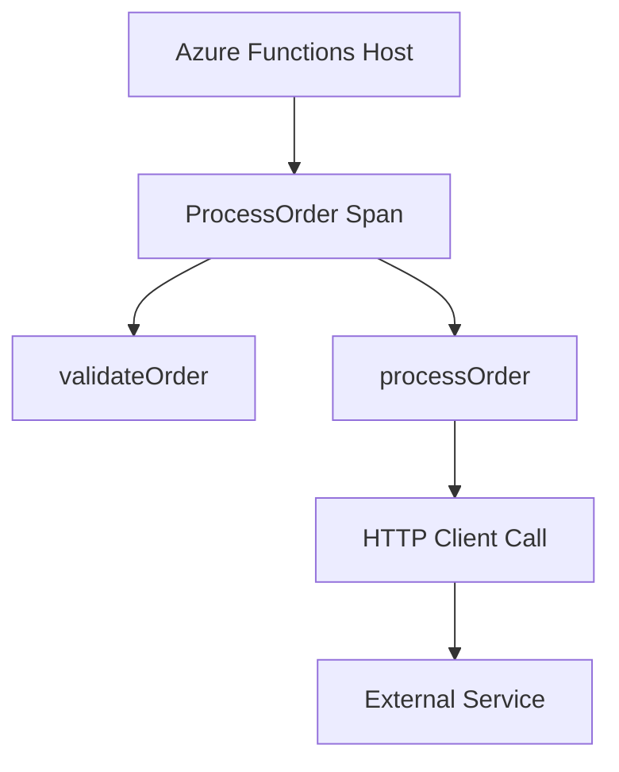

# How to Configure OpenTelemetry for Azure Functions

Author: [nawazdhandala](https://www.github.com/nawazdhandala)

Tags: OpenTelemetry, Azure Functions, Serverless, Observability, Tracing, .NET, Node.js, Python

Description: A practical guide to instrumenting Azure Functions with OpenTelemetry for distributed tracing across serverless workloads, with examples in .NET, Node.js, and Python.

---

Azure Functions present unique observability challenges. The serverless execution model, with cold starts, short lifespans, and automatic scaling, requires careful instrumentation. This guide covers setting up OpenTelemetry in Azure Functions across multiple runtimes while managing the constraints of serverless execution.

## Azure Functions and OpenTelemetry

Azure Functions have built-in integration with Application Insights, but OpenTelemetry provides vendor-neutral observability and greater control. You can use OpenTelemetry to send telemetry to any backend that supports OTLP, including Application Insights through its OTLP endpoint.

Key considerations for Azure Functions:
- Cold starts add initialization overhead
- Short execution times require fast export
- Consumption plan may freeze execution after response
- Different runtimes (.NET, Node.js, Python) have different SDK capabilities

## .NET Azure Functions with OpenTelemetry

The .NET SDK provides the best Azure Functions integration through the Azure Functions OpenTelemetry extension.

### Project Setup

Add the required packages to your project:

```xml
<!-- Function project .csproj -->
<ItemGroup>
  <PackageReference Include="Microsoft.Azure.Functions.Worker" Version="1.21.0" />
  <PackageReference Include="Microsoft.Azure.Functions.Worker.Sdk" Version="1.17.0" />
  <PackageReference Include="Microsoft.Azure.Functions.Worker.Extensions.Http" Version="3.1.0" />
  <PackageReference Include="Azure.Monitor.OpenTelemetry.Exporter" Version="1.2.0" />
  <PackageReference Include="OpenTelemetry" Version="1.7.0" />
  <PackageReference Include="OpenTelemetry.Extensions.Hosting" Version="1.7.0" />
  <PackageReference Include="OpenTelemetry.Instrumentation.Http" Version="1.7.0" />
  <PackageReference Include="OpenTelemetry.Exporter.OpenTelemetryProtocol" Version="1.7.0" />
</ItemGroup>
```

### Program.cs Configuration

```csharp
using Microsoft.Extensions.Hosting;
using Microsoft.Extensions.DependencyInjection;
using OpenTelemetry;
using OpenTelemetry.Resources;
using OpenTelemetry.Trace;
using OpenTelemetry.Metrics;
using Azure.Monitor.OpenTelemetry.Exporter;

var host = new HostBuilder()
    .ConfigureFunctionsWorkerDefaults()
    .ConfigureServices(services =>
    {
        // Configure OpenTelemetry
        services.AddOpenTelemetry()
            .ConfigureResource(resource =>
            {
                resource.AddService(
                    serviceName: Environment.GetEnvironmentVariable("OTEL_SERVICE_NAME")
                        ?? "my-azure-function",
                    serviceVersion: "1.0.0"
                );
                resource.AddAttributes(new Dictionary<string, object>
                {
                    ["faas.name"] = Environment.GetEnvironmentVariable("WEBSITE_SITE_NAME") ?? "unknown",
                    ["cloud.provider"] = "azure",
                    ["cloud.region"] = Environment.GetEnvironmentVariable("REGION_NAME") ?? "unknown",
                });
            })
            .WithTracing(tracing =>
            {
                tracing
                    // Auto-instrument HTTP client calls
                    .AddHttpClientInstrumentation()
                    // Add custom activity source
                    .AddSource("MyFunction.ActivitySource")
                    // Export to OTLP endpoint
                    .AddOtlpExporter(options =>
                    {
                        options.Endpoint = new Uri(
                            Environment.GetEnvironmentVariable("OTEL_EXPORTER_OTLP_ENDPOINT")
                            ?? "http://localhost:4317"
                        );
                    });

                // Optionally also export to Application Insights
                var appInsightsConnString = Environment.GetEnvironmentVariable("APPLICATIONINSIGHTS_CONNECTION_STRING");
                if (!string.IsNullOrEmpty(appInsightsConnString))
                {
                    tracing.AddAzureMonitorTraceExporter(options =>
                    {
                        options.ConnectionString = appInsightsConnString;
                    });
                }
            })
            .WithMetrics(metrics =>
            {
                metrics
                    .AddHttpClientInstrumentation()
                    .AddOtlpExporter();
            });
    })
    .Build();

host.Run();
```

### Function with Tracing

```csharp
using System.Diagnostics;
using Microsoft.Azure.Functions.Worker;
using Microsoft.Azure.Functions.Worker.Http;
using Microsoft.Extensions.Logging;

public class OrderFunction
{
    // Create an ActivitySource for custom spans
    private static readonly ActivitySource ActivitySource = new("MyFunction.ActivitySource");
    private readonly ILogger<OrderFunction> _logger;
    private readonly HttpClient _httpClient;

    public OrderFunction(ILogger<OrderFunction> logger, IHttpClientFactory httpClientFactory)
    {
        _logger = logger;
        _httpClient = httpClientFactory.CreateClient();
    }

    [Function("ProcessOrder")]
    public async Task<HttpResponseData> ProcessOrder(
        [HttpTrigger(AuthorizationLevel.Function, "post", Route = "orders")] HttpRequestData req,
        FunctionContext context)
    {
        // Start a custom span for the business logic
        using var activity = ActivitySource.StartActivity("ProcessOrder");

        // Add attributes from the request
        activity?.SetTag("order.source", "http");
        activity?.SetTag("faas.invocation_id", context.InvocationId);
        activity?.SetTag("faas.coldstart", IsColdStart());

        try
        {
            var order = await req.ReadFromJsonAsync<OrderRequest>();
            activity?.SetTag("order.id", order?.Id);
            activity?.SetTag("order.total", order?.Total);

            // Add an event for validation
            activity?.AddEvent(new ActivityEvent("order.validation.started"));

            var isValid = await ValidateOrder(order);

            activity?.AddEvent(new ActivityEvent("order.validation.completed",
                tags: new ActivityTagsCollection
                {
                    { "validation.result", isValid ? "passed" : "failed" }
                }));

            if (!isValid)
            {
                activity?.SetStatus(ActivityStatusCode.Error, "Validation failed");
                var badResponse = req.CreateResponse(System.Net.HttpStatusCode.BadRequest);
                await badResponse.WriteAsJsonAsync(new { error = "Invalid order" });
                return badResponse;
            }

            // Process the order (creates child span via HTTP instrumentation)
            var result = await ProcessOrderInternal(order);

            activity?.SetTag("order.status", "completed");

            var response = req.CreateResponse(System.Net.HttpStatusCode.OK);
            await response.WriteAsJsonAsync(result);
            return response;
        }
        catch (Exception ex)
        {
            activity?.SetStatus(ActivityStatusCode.Error, ex.Message);
            activity?.RecordException(ex);
            _logger.LogError(ex, "Error processing order");
            throw;
        }
    }

    private async Task<OrderResult> ProcessOrderInternal(OrderRequest order)
    {
        using var activity = ActivitySource.StartActivity("ProcessOrderInternal");

        // Call external service (auto-instrumented)
        var response = await _httpClient.PostAsJsonAsync(
            "https://payment-service.example.com/process",
            new { orderId = order.Id, amount = order.Total }
        );

        activity?.SetTag("payment.status_code", (int)response.StatusCode);

        return new OrderResult { OrderId = order.Id, Status = "completed" };
    }

    private static bool _isFirstInvocation = true;
    private static bool IsColdStart()
    {
        if (_isFirstInvocation)
        {
            _isFirstInvocation = false;
            return true;
        }
        return false;
    }
}
```

## Node.js Azure Functions with OpenTelemetry

For Node.js Azure Functions, manually initialize OpenTelemetry before the function handler.

### Project Setup

```bash
npm install @opentelemetry/api \
  @opentelemetry/sdk-node \
  @opentelemetry/sdk-trace-node \
  @opentelemetry/exporter-trace-otlp-http \
  @opentelemetry/resources \
  @opentelemetry/semantic-conventions \
  @opentelemetry/instrumentation-http
```

### Tracing Initialization

```javascript
// tracing.js
const { NodeTracerProvider } = require('@opentelemetry/sdk-trace-node');
const { SimpleSpanProcessor } = require('@opentelemetry/sdk-trace-base');
const { OTLPTraceExporter } = require('@opentelemetry/exporter-trace-otlp-http');
const { Resource } = require('@opentelemetry/resources');
const { SemanticResourceAttributes } = require('@opentelemetry/semantic-conventions');
const { HttpInstrumentation } = require('@opentelemetry/instrumentation-http');
const { registerInstrumentations } = require('@opentelemetry/instrumentation');

// Initialize on module load (cold start)
const exporter = new OTLPTraceExporter({
  url: process.env.OTEL_EXPORTER_OTLP_ENDPOINT || 'http://localhost:4318/v1/traces',
  headers: {
    'Authorization': `Bearer ${process.env.OTEL_API_TOKEN}`,
  },
});

const provider = new NodeTracerProvider({
  resource: new Resource({
    [SemanticResourceAttributes.SERVICE_NAME]:
      process.env.OTEL_SERVICE_NAME || 'my-azure-function',
    [SemanticResourceAttributes.FAAS_NAME]:
      process.env.WEBSITE_SITE_NAME || 'unknown',
    [SemanticResourceAttributes.CLOUD_PROVIDER]: 'azure',
    [SemanticResourceAttributes.CLOUD_REGION]:
      process.env.REGION_NAME || 'unknown',
  }),
});

// Use SimpleSpanProcessor for immediate export (important for serverless)
provider.addSpanProcessor(new SimpleSpanProcessor(exporter));
provider.register();

registerInstrumentations({
  instrumentations: [new HttpInstrumentation()],
});

module.exports = { provider };
```

### Function with Tracing

```javascript
// ProcessOrder/index.js
require('../tracing');  // Initialize tracing first
const { trace, SpanStatusCode } = require('@opentelemetry/api');

const tracer = trace.getTracer('my-azure-function');

// Track cold starts
let isFirstInvocation = true;

module.exports = async function (context, req) {
  return tracer.startActiveSpan('ProcessOrder', async (span) => {
    // Set function context attributes
    span.setAttribute('faas.invocation_id', context.invocationId);
    span.setAttribute('faas.coldstart', isFirstInvocation);
    span.setAttribute('faas.trigger', 'http');

    if (isFirstInvocation) {
      isFirstInvocation = false;
    }

    try {
      const order = req.body;
      span.setAttribute('order.id', order?.id);
      span.setAttribute('order.total', order?.total);

      // Add validation event
      span.addEvent('order.validation.started');

      const isValid = await validateOrder(order);

      span.addEvent('order.validation.completed', {
        'validation.result': isValid ? 'passed' : 'failed',
      });

      if (!isValid) {
        span.setStatus({ code: SpanStatusCode.ERROR, message: 'Validation failed' });
        context.res = {
          status: 400,
          body: { error: 'Invalid order' },
        };
        return;
      }

      // Process the order
      const result = await processOrder(order);

      span.setAttribute('order.status', 'completed');

      context.res = {
        status: 200,
        body: result,
      };
    } catch (error) {
      span.recordException(error);
      span.setStatus({ code: SpanStatusCode.ERROR, message: error.message });
      context.log.error('Error processing order:', error);

      context.res = {
        status: 500,
        body: { error: 'Internal server error' },
      };
    } finally {
      span.end();
    }
  });
};

async function validateOrder(order) {
  return tracer.startActiveSpan('validateOrder', async (span) => {
    span.setAttribute('order.items_count', order?.items?.length || 0);
    // Validation logic
    const isValid = order && order.id && order.total > 0;
    span.end();
    return isValid;
  });
}

async function processOrder(order) {
  return tracer.startActiveSpan('processOrder', async (span) => {
    // Simulated processing
    await new Promise(resolve => setTimeout(resolve, 100));
    span.setAttribute('processing.duration_ms', 100);
    span.end();
    return { orderId: order.id, status: 'completed' };
  });
}
```

## Python Azure Functions with OpenTelemetry

Python Azure Functions can use the standard OpenTelemetry Python SDK.

### Requirements

```txt
# requirements.txt
azure-functions
opentelemetry-api
opentelemetry-sdk
opentelemetry-exporter-otlp-proto-http
opentelemetry-instrumentation-requests
```

### Tracing Initialization

```python
# tracing.py
import os
from opentelemetry import trace
from opentelemetry.sdk.trace import TracerProvider
from opentelemetry.sdk.trace.export import SimpleSpanProcessor
from opentelemetry.exporter.otlp.proto.http.trace_exporter import OTLPSpanExporter
from opentelemetry.sdk.resources import Resource
from opentelemetry.semconv.resource import ResourceAttributes
from opentelemetry.instrumentation.requests import RequestsInstrumentor

def init_tracing():
    resource = Resource.create({
        ResourceAttributes.SERVICE_NAME: os.environ.get('OTEL_SERVICE_NAME', 'my-azure-function'),
        ResourceAttributes.FAAS_NAME: os.environ.get('WEBSITE_SITE_NAME', 'unknown'),
        ResourceAttributes.CLOUD_PROVIDER: 'azure',
        ResourceAttributes.CLOUD_REGION: os.environ.get('REGION_NAME', 'unknown'),
    })

    exporter = OTLPSpanExporter(
        endpoint=os.environ.get('OTEL_EXPORTER_OTLP_ENDPOINT', 'http://localhost:4318/v1/traces'),
        headers={
            'Authorization': f"Bearer {os.environ.get('OTEL_API_TOKEN', '')}",
        },
    )

    provider = TracerProvider(resource=resource)
    # Use SimpleSpanProcessor for immediate export
    provider.add_span_processor(SimpleSpanProcessor(exporter))
    trace.set_tracer_provider(provider)

    # Instrument requests library
    RequestsInstrumentor().instrument()

# Initialize on module load
init_tracing()
```

### Function with Tracing

```python
# ProcessOrder/__init__.py
import azure.functions as func
import json
import logging
from opentelemetry import trace
from opentelemetry.trace import StatusCode
import tracing  # Initialize tracing

tracer = trace.get_tracer(__name__)

# Track cold starts
_is_first_invocation = True

def main(req: func.HttpRequest, context: func.Context) -> func.HttpResponse:
    global _is_first_invocation

    with tracer.start_as_current_span('ProcessOrder') as span:
        # Set function context attributes
        span.set_attribute('faas.invocation_id', context.invocation_id)
        span.set_attribute('faas.coldstart', _is_first_invocation)
        span.set_attribute('faas.trigger', 'http')

        if _is_first_invocation:
            _is_first_invocation = False

        try:
            order = req.get_json()
            span.set_attribute('order.id', order.get('id'))
            span.set_attribute('order.total', order.get('total'))

            # Add validation event
            span.add_event('order.validation.started')

            is_valid = validate_order(order)

            span.add_event('order.validation.completed', {
                'validation.result': 'passed' if is_valid else 'failed'
            })

            if not is_valid:
                span.set_status(StatusCode.ERROR, 'Validation failed')
                return func.HttpResponse(
                    json.dumps({'error': 'Invalid order'}),
                    status_code=400,
                    mimetype='application/json'
                )

            # Process the order
            result = process_order(order)

            span.set_attribute('order.status', 'completed')

            return func.HttpResponse(
                json.dumps(result),
                status_code=200,
                mimetype='application/json'
            )

        except Exception as e:
            span.record_exception(e)
            span.set_status(StatusCode.ERROR, str(e))
            logging.error(f'Error processing order: {e}')

            return func.HttpResponse(
                json.dumps({'error': 'Internal server error'}),
                status_code=500,
                mimetype='application/json'
            )

def validate_order(order):
    with tracer.start_as_current_span('validateOrder') as span:
        span.set_attribute('order.items_count', len(order.get('items', [])))
        is_valid = order and order.get('id') and order.get('total', 0) > 0
        return is_valid

def process_order(order):
    with tracer.start_as_current_span('processOrder') as span:
        import time
        time.sleep(0.1)  # Simulated processing
        span.set_attribute('processing.duration_ms', 100)
        return {'orderId': order['id'], 'status': 'completed'}
```

## Configuration via Application Settings

Set these application settings in your Azure Function App:

```json
{
  "OTEL_SERVICE_NAME": "my-azure-function",
  "OTEL_EXPORTER_OTLP_ENDPOINT": "https://your-backend.example.com/v1/traces",
  "OTEL_API_TOKEN": "your-api-token",
  "APPLICATIONINSIGHTS_CONNECTION_STRING": "InstrumentationKey=xxx"
}
```

Or configure via Azure CLI:

```bash
az functionapp config appsettings set \
  --name my-function-app \
  --resource-group my-resource-group \
  --settings \
    OTEL_SERVICE_NAME="my-azure-function" \
    OTEL_EXPORTER_OTLP_ENDPOINT="https://your-backend.example.com"
```

## Trace Structure

Azure Functions traces typically show this structure:



The function invocation creates the root span, with child spans for business logic and auto-instrumented HTTP calls.

## Best Practices for Azure Functions

1. **Use SimpleSpanProcessor**: Batch processing may not complete before the function freezes
2. **Initialize on module load**: Avoid initialization overhead on each invocation
3. **Track cold starts**: Add an attribute to identify cold start invocations
4. **Capture invocation ID**: Link function invocations to traces
5. **Handle timeouts gracefully**: Export before the function timeout
6. **Use connection strings**: Store endpoints and tokens in application settings

## Conclusion

OpenTelemetry provides powerful observability for Azure Functions without vendor lock-in. The key is using immediate export (SimpleSpanProcessor), initializing tracing at module load, and tracking serverless-specific attributes like cold starts and invocation IDs. Whether you are using .NET, Node.js, or Python, the patterns are similar: initialize early, export quickly, and capture the context that matters for debugging serverless workloads.
