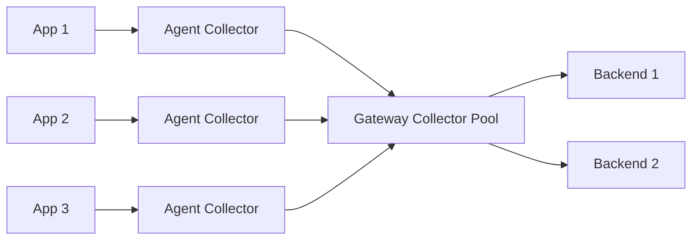

# How to Set Up OpenTelemetry Collector for Production

Author: [nawazdhandala](https://www.github.com/nawazdhandala)

Tags: OpenTelemetry, Observability, Production, DevOps, Monitoring, Collector, Telemetry

Description: A comprehensive guide to deploying the OpenTelemetry Collector in production environments with best practices for high availability, security, and performance tuning.

---

Running the OpenTelemetry Collector in development is straightforward. Running it in production, where reliability and performance actually matter, requires careful planning. This guide walks through the essential configurations, deployment patterns, and operational considerations for a production-grade collector setup.

## Why the Collector Matters in Production

The OpenTelemetry Collector sits between your applications and your observability backend. It receives telemetry data (traces, metrics, logs), processes it, and exports it to one or more destinations. In production, this component becomes critical infrastructure. If it fails or becomes a bottleneck, you lose visibility into your entire system.

A well-configured collector provides several benefits:
- Decouples your applications from specific backends
- Reduces per-application configuration complexity
- Enables central processing, filtering, and sampling
- Provides buffering during backend outages

## Architecture Decisions

Before diving into configuration, you need to decide on your deployment topology. There are two common patterns:

### Agent Mode

Deploy a collector instance alongside each application (as a sidecar or DaemonSet). Applications send telemetry to localhost, minimizing network latency and providing isolation.

### Gateway Mode

Deploy a pool of collector instances that receive telemetry from multiple applications. This centralizes processing and reduces resource overhead at the cost of network hops.

Most production deployments use both: agents for local collection and gateways for centralized processing.



## Base Configuration

Here is a production-ready collector configuration that covers common requirements:

```yaml
# otel-collector-config.yaml
receivers:
  otlp:
    protocols:
      grpc:
        endpoint: 0.0.0.0:4317
        # Set maximum receive message size to 16MB
        max_recv_msg_size_mib: 16
      http:
        endpoint: 0.0.0.0:4318
        cors:
          allowed_origins:
            - "https://your-domain.com"

processors:
  # Memory limiter should be first in the pipeline
  memory_limiter:
    check_interval: 5s
    limit_mib: 1800
    spike_limit_mib: 500

  # Batch telemetry before export
  batch:
    send_batch_size: 1024
    send_batch_max_size: 2048
    timeout: 5s

  # Add resource attributes for identification
  resource:
    attributes:
      - key: deployment.environment
        value: production
        action: upsert
      - key: collector.version
        value: "1.0.0"
        action: insert

exporters:
  otlphttp:
    endpoint: "https://your-backend.example.com"
    headers:
      Authorization: "Bearer ${BACKEND_API_KEY}"
    retry_on_failure:
      enabled: true
      initial_interval: 5s
      max_interval: 30s
      max_elapsed_time: 300s
    sending_queue:
      enabled: true
      num_consumers: 10
      queue_size: 5000

  # Debug exporter for troubleshooting
  debug:
    verbosity: basic
    sampling_initial: 5
    sampling_thereafter: 200

extensions:
  health_check:
    endpoint: 0.0.0.0:13133
    path: "/health"

  zpages:
    endpoint: 0.0.0.0:55679

  pprof:
    endpoint: 0.0.0.0:1777

service:
  extensions: [health_check, zpages, pprof]

  pipelines:
    traces:
      receivers: [otlp]
      processors: [memory_limiter, batch, resource]
      exporters: [otlphttp]

    metrics:
      receivers: [otlp]
      processors: [memory_limiter, batch, resource]
      exporters: [otlphttp]

    logs:
      receivers: [otlp]
      processors: [memory_limiter, batch, resource]
      exporters: [otlphttp]

  telemetry:
    logs:
      level: info
      initial_fields:
        service: otel-collector
    metrics:
      level: detailed
      address: 0.0.0.0:8888
```

## Kubernetes Deployment

For Kubernetes environments, deploy the collector using a StatefulSet or Deployment with proper resource limits:

```yaml
# otel-collector-deployment.yaml
apiVersion: apps/v1
kind: Deployment
metadata:
  name: otel-collector
  namespace: observability
spec:
  replicas: 3
  selector:
    matchLabels:
      app: otel-collector
  template:
    metadata:
      labels:
        app: otel-collector
    spec:
      containers:
        - name: collector
          image: otel/opentelemetry-collector-contrib:0.96.0
          args:
            - "--config=/etc/otel/config.yaml"
          ports:
            - containerPort: 4317
              name: otlp-grpc
            - containerPort: 4318
              name: otlp-http
            - containerPort: 8888
              name: metrics
            - containerPort: 13133
              name: health
          resources:
            requests:
              cpu: 500m
              memory: 1Gi
            limits:
              cpu: 2000m
              memory: 2Gi
          livenessProbe:
            httpGet:
              path: /health
              port: 13133
            initialDelaySeconds: 15
            periodSeconds: 10
          readinessProbe:
            httpGet:
              path: /health
              port: 13133
            initialDelaySeconds: 5
            periodSeconds: 5
          volumeMounts:
            - name: config
              mountPath: /etc/otel
          env:
            - name: BACKEND_API_KEY
              valueFrom:
                secretKeyRef:
                  name: otel-secrets
                  key: backend-api-key
      volumes:
        - name: config
          configMap:
            name: otel-collector-config
---
apiVersion: v1
kind: Service
metadata:
  name: otel-collector
  namespace: observability
spec:
  selector:
    app: otel-collector
  ports:
    - name: otlp-grpc
      port: 4317
      targetPort: 4317
    - name: otlp-http
      port: 4318
      targetPort: 4318
```

## High Availability Considerations

For production workloads, running a single collector instance creates a single point of failure. Here are strategies to achieve high availability:

### Load Balancing

Place a load balancer in front of multiple collector instances. For gRPC traffic, use a load balancer that supports HTTP/2 (like Envoy or a cloud provider's native gRPC load balancer).

### Horizontal Pod Autoscaler

Scale collector replicas based on CPU or memory usage:

```yaml
apiVersion: autoscaling/v2
kind: HorizontalPodAutoscaler
metadata:
  name: otel-collector-hpa
  namespace: observability
spec:
  scaleTargetRef:
    apiVersion: apps/v1
    kind: Deployment
    name: otel-collector
  minReplicas: 3
  maxReplicas: 10
  metrics:
    - type: Resource
      resource:
        name: cpu
        target:
          type: Utilization
          averageUtilization: 70
    - type: Resource
      resource:
        name: memory
        target:
          type: Utilization
          averageUtilization: 80
```

### Persistent Queue

For critical telemetry, configure a persistent queue that survives collector restarts:

```yaml
exporters:
  otlphttp:
    endpoint: "https://your-backend.example.com"
    sending_queue:
      enabled: true
      storage: file_storage

extensions:
  file_storage:
    directory: /var/lib/otel/queue
    timeout: 10s
```

## Security Best Practices

Production collectors handle sensitive telemetry data. Apply these security measures:

### TLS Configuration

Enable TLS for all incoming connections:

```yaml
receivers:
  otlp:
    protocols:
      grpc:
        endpoint: 0.0.0.0:4317
        tls:
          cert_file: /certs/server.crt
          key_file: /certs/server.key
          client_ca_file: /certs/ca.crt  # For mTLS
```

### Authentication

Use the bearertokenauth extension to validate incoming requests:

```yaml
extensions:
  bearertokenauth:
    token: ${COLLECTOR_AUTH_TOKEN}

receivers:
  otlp:
    protocols:
      grpc:
        auth:
          authenticator: bearertokenauth
```

### Network Policies

Restrict which pods can communicate with the collector:

```yaml
apiVersion: networking.k8s.io/v1
kind: NetworkPolicy
metadata:
  name: otel-collector-policy
  namespace: observability
spec:
  podSelector:
    matchLabels:
      app: otel-collector
  policyTypes:
    - Ingress
  ingress:
    - from:
        - namespaceSelector:
            matchLabels:
              otel-enabled: "true"
      ports:
        - port: 4317
        - port: 4318
```

## Monitoring the Collector

The collector exposes metrics about its own operation. Monitor these key metrics:

- `otelcol_receiver_accepted_spans` - Spans successfully received
- `otelcol_receiver_refused_spans` - Spans rejected (authentication, rate limiting)
- `otelcol_processor_dropped_spans` - Spans dropped during processing
- `otelcol_exporter_sent_spans` - Spans successfully exported
- `otelcol_exporter_send_failed_spans` - Export failures
- `otelcol_exporter_queue_size` - Current queue depth

Create alerts for queue buildup, high drop rates, or export failures.

## Performance Tuning

Under high load, tune these parameters:

1. **Batch Size**: Larger batches reduce overhead but increase latency. Start with 1024 and adjust based on your throughput.

2. **Queue Size**: Size the queue to handle backend outages. Calculate: expected_throughput * acceptable_outage_minutes * 60.

3. **Consumer Count**: More consumers drain the queue faster but use more connections. Match this to your backend's connection limits.

4. **Memory Limits**: Set the memory limiter below your container limit to allow headroom for GC spikes.

## Conclusion

A production OpenTelemetry Collector requires attention to reliability, security, and performance. Start with the configurations in this guide, monitor the collector's behavior under load, and iterate based on your specific requirements. The collector is infrastructure that enables observability, so treat it with the same care you would give any critical production system.

The flexibility of the collector architecture means you can start simple and add complexity as your needs grow. Begin with a basic gateway deployment, add features like tail sampling or metric aggregation as you identify specific needs, and scale horizontally as traffic increases.
