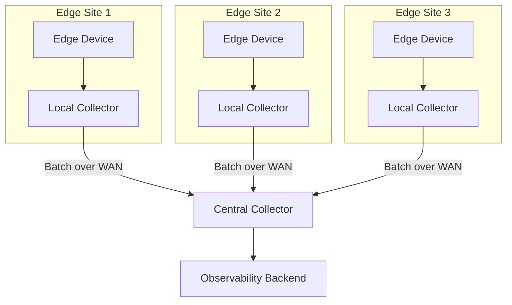

# How to Configure OpenTelemetry for Edge Computing

Author: [nawazdhandala](https://www.github.com/nawazdhandala)

Tags: OpenTelemetry, Edge Computing, IoT, Distributed Systems, Telemetry, Observability, Low Bandwidth

Description: Learn how to configure OpenTelemetry for edge computing environments with limited bandwidth and resources. This guide covers lightweight collection, batching strategies, and offline-capable telemetry pipelines.

---

Edge computing brings compute closer to data sources, but it also brings observability challenges. Edge devices often have limited CPU, memory, and network bandwidth. They may operate in environments with intermittent connectivity. Standard telemetry configurations designed for cloud environments can overwhelm edge infrastructure.

This guide covers how to configure OpenTelemetry for edge computing scenarios while maintaining meaningful observability.

## Edge Computing Challenges

Edge environments differ from traditional cloud deployments in several ways:

| Challenge | Cloud | Edge |
|-----------|-------|------|
| Network | Reliable, high bandwidth | Intermittent, limited bandwidth |
| Resources | Abundant CPU/memory | Constrained CPU/memory |
| Connectivity | Always connected | May be offline for extended periods |
| Scale | Centralized | Distributed across many locations |



## Architecture for Edge Telemetry

The recommended architecture uses a two-tier collector setup:

1. **Local Collector**: Runs at the edge site, handles buffering and local aggregation
2. **Central Collector**: Receives data from edge collectors, forwards to backend

### Local Edge Collector Configuration

```yaml
# edge-collector-config.yaml
receivers:
  otlp:
    protocols:
      grpc:
        endpoint: 0.0.0.0:4317
      http:
        endpoint: 0.0.0.0:4318

processors:
  # Aggressive memory limiting for resource-constrained devices
  memory_limiter:
    check_interval: 1s
    limit_mib: 128       # Limit to 128MB
    spike_limit_mib: 32  # Allow 32MB spike

  # Batch aggressively to reduce export frequency
  batch:
    send_batch_size: 500
    send_batch_max_size: 1000
    timeout: 30s  # Longer timeout to accumulate more data

  # Sample traces to reduce volume
  probabilistic_sampler:
    sampling_percentage: 10  # Keep only 10% of traces

  # Filter out high-volume, low-value telemetry
  filter:
    traces:
      span:
        - 'attributes["http.target"] == "/health"'
        - 'attributes["http.target"] == "/metrics"'
    metrics:
      metric:
        - 'name == "runtime.uptime"'  # Drop noisy metrics

  # Aggregate metrics to reduce cardinality
  metricstransform:
    transforms:
      - include: http_request_duration_seconds
        action: update
        operations:
          - action: aggregate_labels
            label_set: [method, status_code]  # Drop path label
            aggregation_type: sum

exporters:
  otlphttp:
    endpoint: "https://central-collector.example.com:4318"
    compression: gzip  # Compress to save bandwidth
    retry_on_failure:
      enabled: true
      initial_interval: 30s   # Longer initial wait
      max_interval: 300s      # Up to 5 minutes between retries
      max_elapsed_time: 3600s # Keep trying for 1 hour
    sending_queue:
      enabled: true
      num_consumers: 2        # Fewer consumers to save CPU
      queue_size: 10000       # Large queue for offline operation
      storage: file_storage   # Persist queue to disk

extensions:
  file_storage:
    directory: /var/lib/otelcol/queue
    timeout: 10s
    compaction:
      on_start: true
      on_rebound: true

service:
  extensions: [file_storage]
  pipelines:
    traces:
      receivers: [otlp]
      processors: [memory_limiter, probabilistic_sampler, filter, batch]
      exporters: [otlphttp]
    metrics:
      receivers: [otlp]
      processors: [memory_limiter, filter, metricstransform, batch]
      exporters: [otlphttp]
```

## Lightweight SDK Configuration

For applications running on edge devices, configure the SDK to minimize resource usage.

### Node.js Edge Configuration

```javascript
// edge-tracing.js
const { NodeSDK } = require('@opentelemetry/sdk-node');
const { OTLPTraceExporter } = require('@opentelemetry/exporter-trace-otlp-http');
const { BatchSpanProcessor } = require('@opentelemetry/sdk-trace-base');
const { Resource } = require('@opentelemetry/resources');
const { ParentBasedSampler, TraceIdRatioBasedSampler } = require('@opentelemetry/sdk-trace-base');

// Minimal resource to reduce payload size
const resource = new Resource({
  'service.name': process.env.OTEL_SERVICE_NAME,
  'edge.site': process.env.EDGE_SITE_ID,
  'edge.device': process.env.HOSTNAME
});

// Configure exporter with compression
const exporter = new OTLPTraceExporter({
  url: 'http://localhost:4318/v1/traces',  // Local collector
  compression: 'gzip',
  timeoutMillis: 10000
});

// Configure batch processor for edge
const spanProcessor = new BatchSpanProcessor(exporter, {
  maxQueueSize: 1000,          // Smaller queue to save memory
  scheduledDelayMillis: 10000, // Export every 10 seconds
  maxExportBatchSize: 100,     // Smaller batches
  exportTimeoutMillis: 10000
});

// Low sampling rate for edge
const sampler = new ParentBasedSampler({
  root: new TraceIdRatioBasedSampler(0.05)  // Sample 5% of traces
});

const sdk = new NodeSDK({
  resource,
  spanProcessor,
  sampler,
  // Minimal auto-instrumentation - only what you need
  instrumentations: []  // Add only essential instrumentations
});

sdk.start();
```

### Python Edge Configuration

```python
# edge_tracing.py
import os
from opentelemetry import trace
from opentelemetry.sdk.trace import TracerProvider
from opentelemetry.sdk.trace.export import BatchSpanProcessor
from opentelemetry.sdk.trace.sampling import TraceIdRatioBased, ParentBased
from opentelemetry.exporter.otlp.proto.http.trace_exporter import OTLPSpanExporter
from opentelemetry.sdk.resources import Resource

def configure_edge_telemetry():
    """
    Configure OpenTelemetry for resource-constrained edge devices.
    Uses aggressive sampling and batching to minimize resource usage.
    """

    # Minimal resource attributes
    resource = Resource.create({
        "service.name": os.getenv("OTEL_SERVICE_NAME", "edge-app"),
        "edge.site": os.getenv("EDGE_SITE_ID", "unknown"),
        "edge.device": os.getenv("HOSTNAME", "unknown")
    })

    # Low sampling rate for edge environments
    sampler = ParentBased(root=TraceIdRatioBased(0.05))

    provider = TracerProvider(
        resource=resource,
        sampler=sampler
    )

    # Configure exporter for local collector
    exporter = OTLPSpanExporter(
        endpoint="http://localhost:4318/v1/traces",
        timeout=10
    )

    # Batch processor with edge-optimized settings
    processor = BatchSpanProcessor(
        exporter,
        max_queue_size=500,           # Smaller queue
        schedule_delay_millis=10000,  # Export every 10s
        max_export_batch_size=50,     # Smaller batches
        export_timeout_millis=10000
    )

    provider.add_span_processor(processor)
    trace.set_tracer_provider(provider)
```

## Handling Offline Operation

Edge devices may lose connectivity. Configure persistent queuing to avoid data loss.

### File-Based Queue Storage

```yaml
# edge-collector-offline.yaml
extensions:
  file_storage/queue:
    directory: /var/lib/otelcol/queue
    timeout: 10s
    compaction:
      on_start: true
      directory: /var/lib/otelcol/queue/compaction

exporters:
  otlphttp:
    endpoint: "https://central-collector.example.com"
    sending_queue:
      enabled: true
      storage: file_storage/queue
      queue_size: 50000  # Store up to 50k items on disk

service:
  extensions: [file_storage/queue]
```

### Connectivity-Aware Export

Use a script to check connectivity before starting the collector:

```bash
#!/bin/bash
# check-and-export.sh

CENTRAL_COLLECTOR="central-collector.example.com"
PING_COUNT=3

# Check if central collector is reachable
if ping -c $PING_COUNT $CENTRAL_COLLECTOR > /dev/null 2>&1; then
    echo "Central collector reachable, starting normal export"
    export OTEL_EXPORT_MODE="online"
else
    echo "Central collector unreachable, enabling offline mode"
    export OTEL_EXPORT_MODE="offline"
fi

# Start collector with appropriate config
otelcol --config /etc/otelcol/${OTEL_EXPORT_MODE}-config.yaml
```

## Bandwidth Optimization

### Metric Aggregation at the Edge

Aggregate metrics locally before sending to reduce bandwidth:

```yaml
processors:
  metricstransform:
    transforms:
      # Convert histograms to summaries to reduce data
      - include: ".*_duration_seconds"
        match_type: regexp
        action: update
        operations:
          - action: aggregate_labels
            label_set: [service, operation]
            aggregation_type: sum

      # Drop high-cardinality labels
      - include: http_requests_total
        action: update
        operations:
          - action: delete_label_value
            label: path
```

### Delta Metric Export

Send only changes instead of cumulative values:

```yaml
exporters:
  otlphttp:
    endpoint: "https://central-collector.example.com"
    metrics_encoding: delta  # Send delta instead of cumulative
```

## Central Collector Configuration

The central collector receives data from all edge sites:

```yaml
# central-collector-config.yaml
receivers:
  otlp:
    protocols:
      http:
        endpoint: 0.0.0.0:4318
        cors:
          allowed_origins: ["*"]

processors:
  batch:
    send_batch_size: 5000
    timeout: 5s

  # Add site metadata
  resource:
    attributes:
      - key: collector.type
        value: central
        action: upsert

  # Deduplicate data from retry storms
  # (when edge sites reconnect and flush queues)
  groupbyattrs:
    keys: [trace_id, span_id]

exporters:
  otlphttp:
    endpoint: "https://oneuptime.com/otlp"
    headers:
      "x-oneuptime-token": "${ONEUPTIME_TOKEN}"

service:
  pipelines:
    traces:
      receivers: [otlp]
      processors: [batch, resource]
      exporters: [otlphttp]
    metrics:
      receivers: [otlp]
      processors: [batch, resource]
      exporters: [otlphttp]
```

## Resource Limits for Edge Devices

Set appropriate resource limits based on device capabilities:

| Device Class | CPU Limit | Memory Limit | Queue Size |
|--------------|-----------|--------------|------------|
| Raspberry Pi | 0.5 core  | 128 MB       | 5,000      |
| Industrial PC | 1 core   | 256 MB       | 20,000     |
| Edge Server  | 2 cores   | 512 MB       | 100,000    |

### Kubernetes Resource Limits

```yaml
# edge-collector-deployment.yaml
apiVersion: apps/v1
kind: Deployment
metadata:
  name: otel-collector
spec:
  template:
    spec:
      containers:
        - name: collector
          image: otel/opentelemetry-collector:latest
          resources:
            limits:
              cpu: "500m"
              memory: "128Mi"
            requests:
              cpu: "100m"
              memory: "64Mi"
```

## Summary

Configuring OpenTelemetry for edge computing requires balancing observability needs with resource constraints. Key strategies include:

1. **Two-tier collection**: Local collectors at edge sites buffer and aggregate before sending to central collectors
2. **Aggressive sampling**: Sample 5-10% of traces at the edge to reduce volume
3. **Metric aggregation**: Reduce cardinality and aggregate locally before export
4. **Persistent queuing**: Use file-based storage to handle offline periods
5. **Compression**: Always enable gzip compression for WAN transfers
6. **Longer batching intervals**: Batch for 10-30 seconds instead of 5 seconds

With these configurations, you can maintain visibility into edge operations without overwhelming limited resources or saturating narrow network links.
