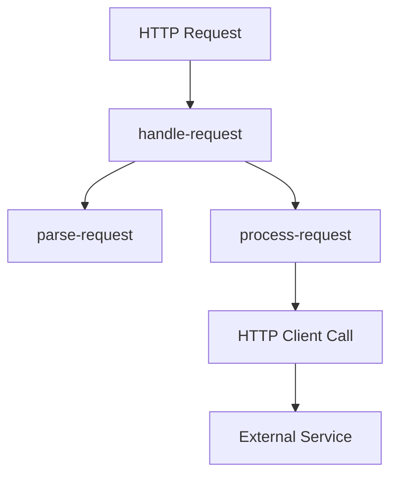

# How to Configure OpenTelemetry for GCP Functions

Author: [nawazdhandala](https://www.github.com/nawazdhandala)

Tags: OpenTelemetry, GCP, Cloud Functions, Serverless, Observability, Tracing, Node.js, Python, Go

Description: A practical guide to instrumenting Google Cloud Functions with OpenTelemetry for distributed tracing, with examples in Node.js, Python, and Go.

---

Google Cloud Functions provide a serverless execution environment that scales automatically. Like other serverless platforms, they present unique observability challenges: cold starts, short execution times, and stateless execution. This guide covers instrumenting Cloud Functions with OpenTelemetry to gain visibility into your serverless workloads.

## GCP Functions and Tracing

Google Cloud Functions integrate with Cloud Trace natively, but OpenTelemetry provides vendor-neutral instrumentation and greater flexibility. You can send telemetry to any OTLP-compatible backend while still optionally exporting to Cloud Trace.

Key considerations for Cloud Functions:
- First-generation functions freeze after response (use immediate export)
- Second-generation functions (Cloud Run based) have more flexibility
- Cold starts add initialization overhead
- Environment provides some context automatically

## Node.js Cloud Functions

### Project Setup

```bash
npm install @opentelemetry/api \
  @opentelemetry/sdk-node \
  @opentelemetry/sdk-trace-node \
  @opentelemetry/exporter-trace-otlp-http \
  @opentelemetry/resources \
  @opentelemetry/semantic-conventions \
  @opentelemetry/instrumentation-http \
  @google-cloud/opentelemetry-cloud-trace-exporter
```

### Tracing Initialization

```javascript
// tracing.js
const { NodeTracerProvider } = require('@opentelemetry/sdk-trace-node');
const { SimpleSpanProcessor } = require('@opentelemetry/sdk-trace-base');
const { OTLPTraceExporter } = require('@opentelemetry/exporter-trace-otlp-http');
const { TraceExporter } = require('@google-cloud/opentelemetry-cloud-trace-exporter');
const { Resource } = require('@opentelemetry/resources');
const { SemanticResourceAttributes } = require('@opentelemetry/semantic-conventions');
const { HttpInstrumentation } = require('@opentelemetry/instrumentation-http');
const { registerInstrumentations } = require('@opentelemetry/instrumentation');

function initTracing() {
  // Build resource with GCP context
  const resource = new Resource({
    [SemanticResourceAttributes.SERVICE_NAME]:
      process.env.OTEL_SERVICE_NAME || process.env.K_SERVICE || 'my-function',
    [SemanticResourceAttributes.FAAS_NAME]:
      process.env.FUNCTION_NAME || process.env.K_SERVICE || 'unknown',
    [SemanticResourceAttributes.FAAS_VERSION]:
      process.env.K_REVISION || 'unknown',
    [SemanticResourceAttributes.CLOUD_PROVIDER]: 'gcp',
    [SemanticResourceAttributes.CLOUD_REGION]:
      process.env.FUNCTION_REGION || process.env.GOOGLE_CLOUD_REGION || 'unknown',
    'gcp.project_id': process.env.GCP_PROJECT || process.env.GOOGLE_CLOUD_PROJECT,
  });

  const provider = new NodeTracerProvider({ resource });

  // Export to custom OTLP endpoint
  const otlpEndpoint = process.env.OTEL_EXPORTER_OTLP_ENDPOINT;
  if (otlpEndpoint) {
    const otlpExporter = new OTLPTraceExporter({
      url: otlpEndpoint,
      headers: {
        'Authorization': `Bearer ${process.env.OTEL_API_TOKEN}`,
      },
    });
    // Use SimpleSpanProcessor for immediate export (critical for serverless)
    provider.addSpanProcessor(new SimpleSpanProcessor(otlpExporter));
  }

  // Optionally also export to Cloud Trace
  if (process.env.ENABLE_CLOUD_TRACE === 'true') {
    const cloudTraceExporter = new TraceExporter({
      projectId: process.env.GCP_PROJECT || process.env.GOOGLE_CLOUD_PROJECT,
    });
    provider.addSpanProcessor(new SimpleSpanProcessor(cloudTraceExporter));
  }

  provider.register();

  // Instrument HTTP clients
  registerInstrumentations({
    instrumentations: [new HttpInstrumentation()],
  });

  return provider;
}

// Initialize on module load
const provider = initTracing();

module.exports = { provider };
```

### HTTP Function with Tracing

```javascript
// index.js
require('./tracing');  // Initialize tracing first
const { trace, SpanStatusCode, context, propagation } = require('@opentelemetry/api');

const tracer = trace.getTracer('my-cloud-function');

// Track cold starts
let isFirstInvocation = true;

/**
 * HTTP Cloud Function
 * @param {Object} req - Express request object
 * @param {Object} res - Express response object
 */
exports.httpFunction = async (req, res) => {
  // Extract trace context from incoming request headers
  const parentContext = propagation.extract(context.active(), req.headers);

  return context.with(parentContext, async () => {
    return tracer.startActiveSpan('handle-request', {
      attributes: {
        'faas.trigger': 'http',
        'faas.coldstart': isFirstInvocation,
        'http.method': req.method,
        'http.url': req.url,
        'http.route': req.path,
      },
    }, async (span) => {
      if (isFirstInvocation) {
        isFirstInvocation = false;
        span.addEvent('cold_start');
      }

      try {
        // Parse and validate request
        const data = await parseRequest(req);
        span.setAttribute('request.data_size', JSON.stringify(data).length);

        // Process the request
        const result = await processRequest(data);

        span.setAttribute('response.status', 200);
        res.status(200).json(result);
      } catch (error) {
        span.recordException(error);
        span.setStatus({ code: SpanStatusCode.ERROR, message: error.message });
        span.setAttribute('response.status', 500);

        res.status(500).json({ error: 'Internal server error' });
      } finally {
        span.end();
      }
    });
  });
};

async function parseRequest(req) {
  return tracer.startActiveSpan('parse-request', async (span) => {
    const data = req.body || {};
    span.setAttribute('request.has_body', !!req.body);
    span.end();
    return data;
  });
}

async function processRequest(data) {
  return tracer.startActiveSpan('process-request', async (span) => {
    // Your business logic here
    span.setAttribute('processing.type', 'sync');

    // Simulate some work
    await new Promise(resolve => setTimeout(resolve, 50));

    span.end();
    return { status: 'processed', timestamp: new Date().toISOString() };
  });
}
```

### Pub/Sub Triggered Function

```javascript
// pubsub-function.js
require('./tracing');
const { trace, SpanStatusCode, context, propagation } = require('@opentelemetry/api');

const tracer = trace.getTracer('pubsub-function');

let isFirstInvocation = true;

/**
 * Pub/Sub triggered Cloud Function
 * @param {Object} message - Pub/Sub message
 * @param {Object} context - Event context
 */
exports.pubsubFunction = async (message, eventContext) => {
  // Try to extract trace context from message attributes
  const attributes = message.attributes || {};
  const parentContext = propagation.extract(context.active(), attributes);

  return context.with(parentContext, async () => {
    return tracer.startActiveSpan('process-pubsub-message', {
      attributes: {
        'faas.trigger': 'pubsub',
        'faas.coldstart': isFirstInvocation,
        'messaging.system': 'pubsub',
        'messaging.destination': eventContext.resource?.name,
        'messaging.message_id': eventContext.eventId,
      },
    }, async (span) => {
      if (isFirstInvocation) {
        isFirstInvocation = false;
        span.addEvent('cold_start');
      }

      try {
        // Decode message
        const data = message.data
          ? JSON.parse(Buffer.from(message.data, 'base64').toString())
          : {};

        span.setAttribute('message.size_bytes', message.data?.length || 0);
        span.addEvent('message.decoded', { 'message.keys': Object.keys(data).join(',') });

        // Process the message
        await processMessage(data);

        span.addEvent('message.processed');
      } catch (error) {
        span.recordException(error);
        span.setStatus({ code: SpanStatusCode.ERROR, message: error.message });
        throw error;  // Re-throw to trigger retry
      } finally {
        span.end();
      }
    });
  });
};

async function processMessage(data) {
  return tracer.startActiveSpan('process-message-content', async (span) => {
    span.setAttribute('data.type', typeof data);
    // Processing logic
    await new Promise(resolve => setTimeout(resolve, 100));
    span.end();
  });
}
```

## Python Cloud Functions

### Requirements

```txt
# requirements.txt
functions-framework
opentelemetry-api
opentelemetry-sdk
opentelemetry-exporter-otlp-proto-http
opentelemetry-instrumentation-requests
opentelemetry-exporter-gcp-trace
```

### Tracing Initialization

```python
# tracing.py
import os
from opentelemetry import trace
from opentelemetry.sdk.trace import TracerProvider
from opentelemetry.sdk.trace.export import SimpleSpanProcessor
from opentelemetry.exporter.otlp.proto.http.trace_exporter import OTLPSpanExporter
from opentelemetry.sdk.resources import Resource
from opentelemetry.semconv.resource import ResourceAttributes
from opentelemetry.instrumentation.requests import RequestsInstrumentor

def init_tracing():
    resource = Resource.create({
        ResourceAttributes.SERVICE_NAME: os.environ.get('OTEL_SERVICE_NAME')
            or os.environ.get('K_SERVICE', 'my-function'),
        ResourceAttributes.FAAS_NAME: os.environ.get('FUNCTION_NAME')
            or os.environ.get('K_SERVICE', 'unknown'),
        ResourceAttributes.FAAS_VERSION: os.environ.get('K_REVISION', 'unknown'),
        ResourceAttributes.CLOUD_PROVIDER: 'gcp',
        ResourceAttributes.CLOUD_REGION: os.environ.get('FUNCTION_REGION')
            or os.environ.get('GOOGLE_CLOUD_REGION', 'unknown'),
        'gcp.project_id': os.environ.get('GCP_PROJECT')
            or os.environ.get('GOOGLE_CLOUD_PROJECT'),
    })

    provider = TracerProvider(resource=resource)

    # Export to custom OTLP endpoint
    otlp_endpoint = os.environ.get('OTEL_EXPORTER_OTLP_ENDPOINT')
    if otlp_endpoint:
        otlp_exporter = OTLPSpanExporter(
            endpoint=otlp_endpoint,
            headers={
                'Authorization': f"Bearer {os.environ.get('OTEL_API_TOKEN', '')}",
            },
        )
        provider.add_span_processor(SimpleSpanProcessor(otlp_exporter))

    # Optionally export to Cloud Trace
    if os.environ.get('ENABLE_CLOUD_TRACE') == 'true':
        from opentelemetry.exporter.cloud_trace import CloudTraceSpanExporter
        cloud_trace_exporter = CloudTraceSpanExporter(
            project_id=os.environ.get('GCP_PROJECT')
                or os.environ.get('GOOGLE_CLOUD_PROJECT'),
        )
        provider.add_span_processor(SimpleSpanProcessor(cloud_trace_exporter))

    trace.set_tracer_provider(provider)

    # Instrument requests library
    RequestsInstrumentor().instrument()

# Initialize on module load
init_tracing()
```

### HTTP Function with Tracing

```python
# main.py
import functions_framework
from flask import jsonify
from opentelemetry import trace, context, propagation
from opentelemetry.trace import StatusCode
import tracing  # Initialize tracing

tracer = trace.get_tracer(__name__)

# Track cold starts
_is_first_invocation = True

@functions_framework.http
def http_function(request):
    global _is_first_invocation

    # Extract trace context from request headers
    parent_context = propagation.extract(request.headers)

    with context.with_(parent_context):
        with tracer.start_as_current_span('handle-request') as span:
            span.set_attribute('faas.trigger', 'http')
            span.set_attribute('faas.coldstart', _is_first_invocation)
            span.set_attribute('http.method', request.method)
            span.set_attribute('http.url', request.url)
            span.set_attribute('http.route', request.path)

            if _is_first_invocation:
                _is_first_invocation = False
                span.add_event('cold_start')

            try:
                # Parse request
                data = parse_request(request)
                span.set_attribute('request.data_size', len(str(data)))

                # Process request
                result = process_request(data)

                span.set_attribute('response.status', 200)
                return jsonify(result), 200

            except Exception as e:
                span.record_exception(e)
                span.set_status(StatusCode.ERROR, str(e))
                span.set_attribute('response.status', 500)
                return jsonify({'error': 'Internal server error'}), 500

def parse_request(request):
    with tracer.start_as_current_span('parse-request') as span:
        data = request.get_json(silent=True) or {}
        span.set_attribute('request.has_body', bool(request.data))
        return data

def process_request(data):
    with tracer.start_as_current_span('process-request') as span:
        span.set_attribute('processing.type', 'sync')
        import time
        time.sleep(0.05)
        return {'status': 'processed', 'timestamp': str(time.time())}
```

## Go Cloud Functions

### Dependencies

```go
// go.mod
module my-function

go 1.21

require (
    github.com/GoogleCloudPlatform/functions-framework-go v1.8.0
    go.opentelemetry.io/otel v1.24.0
    go.opentelemetry.io/otel/exporters/otlp/otlptrace/otlptracehttp v1.24.0
    go.opentelemetry.io/otel/sdk v1.24.0
    go.opentelemetry.io/contrib/instrumentation/net/http/otelhttp v0.49.0
)
```

### Function with Tracing

```go
// function.go
package myfunction

import (
    "context"
    "encoding/json"
    "fmt"
    "net/http"
    "os"
    "sync"
    "time"

    "go.opentelemetry.io/otel"
    "go.opentelemetry.io/otel/attribute"
    "go.opentelemetry.io/otel/codes"
    "go.opentelemetry.io/otel/exporters/otlp/otlptrace/otlptracehttp"
    "go.opentelemetry.io/otel/propagation"
    "go.opentelemetry.io/otel/sdk/resource"
    "go.opentelemetry.io/otel/sdk/trace"
    semconv "go.opentelemetry.io/otel/semconv/v1.24.0"
    oteltrace "go.opentelemetry.io/otel/trace"
)

var (
    tracer            oteltrace.Tracer
    isFirstInvocation = true
    initOnce          sync.Once
)

func init() {
    initOnce.Do(func() {
        initTracing()
    })
}

func initTracing() {
    ctx := context.Background()

    // Create resource
    res, err := resource.New(ctx,
        resource.WithAttributes(
            semconv.ServiceName(getEnv("OTEL_SERVICE_NAME", getEnv("K_SERVICE", "my-function"))),
            semconv.FaaSName(getEnv("FUNCTION_NAME", getEnv("K_SERVICE", "unknown"))),
            semconv.FaaSVersion(getEnv("K_REVISION", "unknown")),
            semconv.CloudProviderGCP,
            semconv.CloudRegion(getEnv("FUNCTION_REGION", getEnv("GOOGLE_CLOUD_REGION", "unknown"))),
            attribute.String("gcp.project_id", getEnv("GCP_PROJECT", getEnv("GOOGLE_CLOUD_PROJECT", "unknown"))),
        ),
    )
    if err != nil {
        fmt.Printf("Failed to create resource: %v\n", err)
        return
    }

    // Create OTLP exporter
    endpoint := os.Getenv("OTEL_EXPORTER_OTLP_ENDPOINT")
    if endpoint == "" {
        endpoint = "localhost:4318"
    }

    exporter, err := otlptracehttp.New(ctx,
        otlptracehttp.WithEndpoint(endpoint),
        otlptracehttp.WithInsecure(),
        otlptracehttp.WithHeaders(map[string]string{
            "Authorization": "Bearer " + os.Getenv("OTEL_API_TOKEN"),
        }),
    )
    if err != nil {
        fmt.Printf("Failed to create exporter: %v\n", err)
        return
    }

    // Create tracer provider with SimpleSpanProcessor for immediate export
    tp := trace.NewTracerProvider(
        trace.WithResource(res),
        trace.WithSyncer(exporter), // Syncer for immediate export
    )

    otel.SetTracerProvider(tp)
    otel.SetTextMapPropagator(propagation.NewCompositeTextMapPropagator(
        propagation.TraceContext{},
        propagation.Baggage{},
    ))

    tracer = tp.Tracer("my-function")
}

// HttpFunction is the Cloud Function entry point
func HttpFunction(w http.ResponseWriter, r *http.Request) {
    // Extract trace context from headers
    ctx := otel.GetTextMapPropagator().Extract(r.Context(), propagation.HeaderCarrier(r.Header))

    ctx, span := tracer.Start(ctx, "handle-request",
        oteltrace.WithAttributes(
            attribute.String("faas.trigger", "http"),
            attribute.Bool("faas.coldstart", isFirstInvocation),
            attribute.String("http.method", r.Method),
            attribute.String("http.url", r.URL.String()),
            attribute.String("http.route", r.URL.Path),
        ),
    )
    defer span.End()

    if isFirstInvocation {
        isFirstInvocation = false
        span.AddEvent("cold_start")
    }

    // Process request
    result, err := processRequest(ctx, r)
    if err != nil {
        span.RecordError(err)
        span.SetStatus(codes.Error, err.Error())
        span.SetAttributes(attribute.Int("response.status", 500))
        http.Error(w, `{"error":"Internal server error"}`, http.StatusInternalServerError)
        return
    }

    span.SetAttributes(attribute.Int("response.status", 200))
    w.Header().Set("Content-Type", "application/json")
    json.NewEncoder(w).Encode(result)
}

func processRequest(ctx context.Context, r *http.Request) (map[string]interface{}, error) {
    ctx, span := tracer.Start(ctx, "process-request")
    defer span.End()

    span.SetAttributes(attribute.String("processing.type", "sync"))

    // Simulate work
    time.Sleep(50 * time.Millisecond)

    return map[string]interface{}{
        "status":    "processed",
        "timestamp": time.Now().Format(time.RFC3339),
    }, nil
}

func getEnv(key, fallback string) string {
    if value := os.Getenv(key); value != "" {
        return value
    }
    return fallback
}
```

## Environment Configuration

Set these environment variables in your Cloud Function:

```bash
# Using gcloud
gcloud functions deploy my-function \
  --runtime nodejs18 \
  --trigger-http \
  --set-env-vars \
    OTEL_SERVICE_NAME=my-function,\
    OTEL_EXPORTER_OTLP_ENDPOINT=https://your-backend.example.com/v1/traces,\
    OTEL_API_TOKEN=your-token,\
    ENABLE_CLOUD_TRACE=false
```

Or in your `cloudfunctions.yaml`:

```yaml
runtime: nodejs18
entryPoint: httpFunction
environmentVariables:
  OTEL_SERVICE_NAME: my-function
  OTEL_EXPORTER_OTLP_ENDPOINT: https://your-backend.example.com/v1/traces
```

## Trace Structure

GCP Functions traces typically show:



The root span captures the function invocation, with child spans for parsing, processing, and any outgoing HTTP calls.

## Best Practices

1. **Use SimpleSpanProcessor**: Batch processing may not complete before function freezes

2. **Initialize at module level**: Avoid initialization overhead on each invocation

3. **Track cold starts**: Add an attribute to identify cold start invocations

4. **Extract incoming context**: Propagate trace context from HTTP headers or Pub/Sub attributes

5. **Handle Gen1 vs Gen2**: Second-generation functions (Cloud Run based) allow async export; first-generation requires synchronous

6. **Consider Cloud Trace**: Native integration provides additional GCP-specific features

## Conclusion

OpenTelemetry provides flexible observability for Google Cloud Functions. The key is using synchronous export (SimpleSpanProcessor), initializing at module load, and tracking serverless-specific context like cold starts. Whether you export to Cloud Trace, a custom backend, or both, OpenTelemetry gives you vendor-neutral instrumentation that works across your serverless and traditional workloads.
