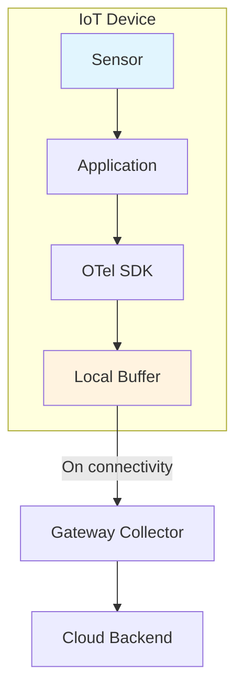

# How to Configure OpenTelemetry for IoT Devices

Author: [nawazdhandala](https://www.github.com/nawazdhandala)

Tags: OpenTelemetry, IoT, Embedded Systems, Telemetry, Observability, Resource Constraints, Edge Devices

Description: Learn how to configure OpenTelemetry for IoT devices with limited resources. This guide covers lightweight instrumentation, efficient batching, and offline-capable telemetry for embedded and constrained devices.

---

IoT devices present unique challenges for observability. They often run on limited hardware, operate in environments with unreliable connectivity, and need to conserve battery power. Standard OpenTelemetry configurations designed for cloud servers will not work.

This guide covers configuring OpenTelemetry for IoT scenarios where resources are precious and every byte counts.

## IoT Device Constraints

Typical IoT devices face multiple constraints:

| Constraint | Typical Limit | Impact on Telemetry |
|------------|---------------|---------------------|
| RAM | 256KB - 64MB | Small queues, minimal buffering |
| CPU | Single core, < 1GHz | Lightweight processing |
| Storage | 4MB - 4GB | Limited persistent queue |
| Network | Intermittent, metered | Batch aggressively, compress |
| Power | Battery operated | Minimize wake cycles |



## Lightweight SDK Configuration

### Python for Raspberry Pi and Similar Devices

```python
# iot_telemetry.py
import os
import time
import threading
from queue import Queue, Full
from opentelemetry import trace, metrics
from opentelemetry.sdk.trace import TracerProvider
from opentelemetry.sdk.trace.export import SimpleSpanProcessor
from opentelemetry.sdk.metrics import MeterProvider
from opentelemetry.sdk.resources import Resource

class LightweightSpanExporter:
    """
    Custom exporter that buffers spans and exports on schedule
    to minimize network usage and handle connectivity loss.
    """

    def __init__(self, endpoint, max_queue_size=100, export_interval=60):
        self.endpoint = endpoint
        self.queue = Queue(maxsize=max_queue_size)
        self.export_interval = export_interval
        self._running = True
        self._export_thread = threading.Thread(target=self._export_loop, daemon=True)
        self._export_thread.start()

    def export(self, spans):
        """
        Queue spans for later export. Drop oldest if queue is full.
        """
        for span in spans:
            try:
                # Convert span to minimal dict representation
                span_data = self._span_to_dict(span)
                self.queue.put_nowait(span_data)
            except Full:
                # Drop oldest span to make room
                try:
                    self.queue.get_nowait()
                    self.queue.put_nowait(span_data)
                except:
                    pass

    def _span_to_dict(self, span):
        """
        Convert span to minimal dictionary for efficient storage.
        """
        return {
            'n': span.name[:50],  # Truncate name
            't': span.context.trace_id,
            's': span.context.span_id,
            'st': span.start_time,
            'et': span.end_time,
            'a': {k: str(v)[:100] for k, v in list(span.attributes.items())[:10]}
        }

    def _export_loop(self):
        """
        Periodically export queued spans.
        """
        while self._running:
            time.sleep(self.export_interval)
            self._flush()

    def _flush(self):
        """
        Export all queued spans.
        """
        spans = []
        while not self.queue.empty() and len(spans) < 50:
            try:
                spans.append(self.queue.get_nowait())
            except:
                break

        if spans:
            self._send_spans(spans)

    def _send_spans(self, spans):
        """
        Send spans to the collector endpoint.
        """
        import json
        import urllib.request

        try:
            data = json.dumps({'spans': spans}).encode('utf-8')
            req = urllib.request.Request(
                self.endpoint,
                data=data,
                headers={'Content-Type': 'application/json'}
            )
            urllib.request.urlopen(req, timeout=10)
        except Exception as e:
            # Re-queue spans on failure
            for span in spans:
                try:
                    self.queue.put_nowait(span)
                except Full:
                    break  # Queue full, drop remaining


def configure_iot_telemetry():
    """
    Configure OpenTelemetry for resource-constrained IoT devices.
    """
    # Minimal resource attributes
    resource = Resource.create({
        "service.name": os.getenv("DEVICE_TYPE", "iot-sensor"),
        "device.id": os.getenv("DEVICE_ID", "unknown"),
        "device.location": os.getenv("DEVICE_LOCATION", "unknown")
    })

    # Configure tracing with lightweight exporter
    exporter = LightweightSpanExporter(
        endpoint=os.getenv("COLLECTOR_ENDPOINT", "http://gateway:4318/v1/traces"),
        max_queue_size=50,      # Small queue to save memory
        export_interval=300     # Export every 5 minutes
    )

    provider = TracerProvider(resource=resource)
    provider.add_span_processor(SimpleSpanProcessor(exporter))
    trace.set_tracer_provider(provider)

    return trace.get_tracer("iot-device")
```

### MicroPython for Embedded Devices

For extremely constrained devices running MicroPython:

```python
# micropython_telemetry.py
import ujson
import urequests
import machine
import time

class MicroTelemetry:
    """
    Minimal telemetry for MicroPython devices.
    No dependencies on OpenTelemetry SDK.
    """

    def __init__(self, device_id, collector_url, max_buffer=20):
        self.device_id = device_id
        self.collector_url = collector_url
        self.buffer = []
        self.max_buffer = max_buffer

    def record_metric(self, name, value, attributes=None):
        """
        Record a metric data point.
        """
        point = {
            'n': name,
            'v': value,
            't': time.time(),
            'd': self.device_id
        }
        if attributes:
            point['a'] = attributes

        if len(self.buffer) >= self.max_buffer:
            self.buffer.pop(0)  # Drop oldest
        self.buffer.append(point)

    def record_event(self, name, attributes=None):
        """
        Record an event (span-like).
        """
        event = {
            'e': name,
            't': time.time(),
            'd': self.device_id
        }
        if attributes:
            event['a'] = attributes

        if len(self.buffer) >= self.max_buffer:
            self.buffer.pop(0)
        self.buffer.append(event)

    def flush(self):
        """
        Send buffered data to collector.
        Call this periodically or when connectivity is available.
        """
        if not self.buffer:
            return True

        try:
            payload = ujson.dumps({'data': self.buffer})
            response = urequests.post(
                self.collector_url,
                data=payload,
                headers={'Content-Type': 'application/json'}
            )
            response.close()

            if response.status_code == 200:
                self.buffer = []
                return True
            return False
        except Exception as e:
            print(f"Flush failed: {e}")
            return False


# Example usage
telemetry = MicroTelemetry(
    device_id=machine.unique_id().hex(),
    collector_url="http://192.168.1.100:8080/telemetry"
)

# Record sensor reading
telemetry.record_metric("temperature", 23.5, {"unit": "celsius"})
telemetry.record_metric("humidity", 65.2, {"unit": "percent"})

# Record event
telemetry.record_event("sensor_read_complete", {"sensor": "dht22"})

# Flush when network is available
if wifi_connected():
    telemetry.flush()
```

## Gateway Collector for IoT

Deploy a gateway collector that receives data from IoT devices and forwards to your backend.

```yaml
# iot-gateway-collector.yaml
receivers:
  # Custom HTTP receiver for lightweight IoT payloads
  otlp:
    protocols:
      http:
        endpoint: 0.0.0.0:4318

  # Simple HTTP endpoint for MicroPython devices
  # that cannot use full OTLP protocol
  httpreceiver:
    endpoint: 0.0.0.0:8080
    path: /telemetry

processors:
  # Memory limiter for gateway
  memory_limiter:
    check_interval: 5s
    limit_mib: 256

  # Batch data from many devices
  batch:
    send_batch_size: 1000
    timeout: 30s

  # Add gateway metadata
  resource:
    attributes:
      - key: collector.type
        value: iot-gateway
        action: upsert
      - key: gateway.location
        value: ${GATEWAY_LOCATION}
        action: upsert

  # Transform minimal format to OTLP
  transform:
    metric_statements:
      - context: datapoint
        statements:
          - set(attributes["device.type"], "iot")

exporters:
  otlphttp:
    endpoint: "https://oneuptime.com/otlp"
    headers:
      "x-oneuptime-token": "${ONEUPTIME_TOKEN}"
    compression: gzip
    retry_on_failure:
      enabled: true
      initial_interval: 30s
      max_interval: 300s

  # Local file for debugging
  file:
    path: /var/log/iot-telemetry.json

service:
  pipelines:
    metrics:
      receivers: [otlp]
      processors: [memory_limiter, batch, resource]
      exporters: [otlphttp]
    traces:
      receivers: [otlp]
      processors: [memory_limiter, batch, resource]
      exporters: [otlphttp]
```

## Power-Efficient Telemetry

For battery-powered devices, minimize wake cycles and network usage.

```python
# power_efficient_telemetry.py
import machine
import time

class PowerEfficientTelemetry:
    """
    Telemetry optimized for battery-powered devices.
    Aggregates data locally and sends in batches during scheduled wake periods.
    """

    def __init__(self, config):
        self.config = config
        self.data_file = config.get('data_file', '/data/telemetry.dat')
        self.batch_size = config.get('batch_size', 100)

    def record(self, metric_name, value):
        """
        Record a metric to local storage.
        This is fast and does not use network.
        """
        with open(self.data_file, 'a') as f:
            f.write(f"{time.time()},{metric_name},{value}\n")

    def should_transmit(self):
        """
        Determine if it is time to transmit based on:
        - Number of accumulated records
        - Time since last transmission
        - Battery level
        """
        record_count = self._count_records()
        battery_level = self._get_battery_level()

        # Always transmit if battery is being charged
        if self._is_charging():
            return record_count > 0

        # Skip transmission if battery is critically low
        if battery_level < 10:
            return False

        # Transmit if we have enough records
        if record_count >= self.batch_size:
            return True

        return False

    def transmit(self):
        """
        Transmit accumulated data and clear local storage.
        """
        records = self._read_records()
        if not records:
            return

        # Aggregate similar metrics to reduce payload
        aggregated = self._aggregate_records(records)

        # Connect to network (expensive operation)
        if self._connect_network():
            try:
                self._send_data(aggregated)
                self._clear_records()
            finally:
                self._disconnect_network()

    def _aggregate_records(self, records):
        """
        Aggregate records to minimize payload size.
        Calculate min, max, avg, count for each metric.
        """
        metrics = {}
        for timestamp, name, value in records:
            if name not in metrics:
                metrics[name] = {
                    'values': [],
                    'first_ts': timestamp,
                    'last_ts': timestamp
                }
            metrics[name]['values'].append(value)
            metrics[name]['last_ts'] = timestamp

        # Calculate aggregates
        result = []
        for name, data in metrics.items():
            values = data['values']
            result.append({
                'name': name,
                'min': min(values),
                'max': max(values),
                'avg': sum(values) / len(values),
                'count': len(values),
                'start': data['first_ts'],
                'end': data['last_ts']
            })
        return result

    def _count_records(self):
        try:
            with open(self.data_file, 'r') as f:
                return sum(1 for _ in f)
        except:
            return 0

    def _get_battery_level(self):
        # Read from ADC connected to battery voltage divider
        adc = machine.ADC(0)
        return int(adc.read() / 4095 * 100)

    def _is_charging(self):
        # Check charging status pin
        return machine.Pin(4, machine.Pin.IN).value() == 1
```

## Network Protocol Optimization

For constrained networks, use efficient protocols:

### MQTT Bridge

```yaml
# mqtt-bridge-collector.yaml
receivers:
  # Receive telemetry from IoT devices via MQTT
  mqtt:
    broker: "mqtt://broker:1883"
    topic: "devices/+/telemetry"
    qos: 1

processors:
  batch:
    send_batch_size: 500
    timeout: 60s

exporters:
  otlphttp:
    endpoint: "https://oneuptime.com/otlp"
    compression: gzip

service:
  pipelines:
    metrics:
      receivers: [mqtt]
      processors: [batch]
      exporters: [otlphttp]
```

### CoAP for Constrained Devices

```python
# coap_telemetry.py
import aiocoap
import asyncio

class CoapTelemetry:
    """
    Telemetry using CoAP protocol for constrained networks.
    CoAP uses UDP and has much lower overhead than HTTP.
    """

    def __init__(self, server_uri):
        self.server_uri = server_uri
        self.context = None

    async def init(self):
        self.context = await aiocoap.Context.create_client_context()

    async def send_metric(self, name, value, attributes=None):
        """
        Send a metric using CoAP POST.
        """
        import cbor2  # Compact binary encoding

        payload = cbor2.dumps({
            'n': name,
            'v': value,
            't': time.time(),
            'a': attributes or {}
        })

        request = aiocoap.Message(
            code=aiocoap.POST,
            uri=f"{self.server_uri}/telemetry",
            payload=payload
        )

        try:
            response = await self.context.request(request).response
            return response.code.is_successful()
        except Exception as e:
            print(f"CoAP request failed: {e}")
            return False
```

## Device Fleet Monitoring

Track device health across your fleet:

```python
# device_health_metrics.py
from iot_telemetry import configure_iot_telemetry

tracer = configure_iot_telemetry()

def report_device_health():
    """
    Report device health metrics periodically.
    """
    with tracer.start_as_current_span("device.health_check") as span:
        # System metrics
        span.set_attribute("device.cpu_percent", get_cpu_usage())
        span.set_attribute("device.memory_percent", get_memory_usage())
        span.set_attribute("device.disk_percent", get_disk_usage())
        span.set_attribute("device.temperature_celsius", get_cpu_temperature())

        # Network metrics
        span.set_attribute("device.wifi_rssi", get_wifi_rssi())
        span.set_attribute("device.network_bytes_sent", get_bytes_sent())

        # Battery metrics (if applicable)
        span.set_attribute("device.battery_percent", get_battery_level())
        span.set_attribute("device.battery_charging", is_charging())

        # Firmware version
        span.set_attribute("device.firmware_version", get_firmware_version())
```

## Summary

Configuring OpenTelemetry for IoT requires careful attention to resource constraints. Key strategies include:

1. **Lightweight SDK implementations**: Use custom exporters or simplified telemetry libraries for constrained devices
2. **Local buffering**: Store telemetry locally and export in batches when connectivity is available
3. **Aggressive aggregation**: Aggregate metrics locally to reduce payload sizes
4. **Power-aware transmission**: Consider battery levels and charging status when scheduling exports
5. **Efficient protocols**: Use MQTT or CoAP instead of HTTP for constrained networks
6. **Gateway collectors**: Deploy edge gateways that handle protocol translation and buffering

With these techniques, you can maintain observability across your IoT fleet without overwhelming device resources or network capacity.
